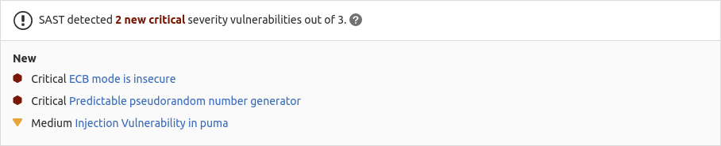

# Static Application Security Testing (SAST)

> [Introduced](https://gitlab.com/gitlab-org/gitlab/-/issues/3775) in [GitLab Ultimate](https://about.gitlab.com/pricing/) 10.3.

NOTE: **Note:**
The whitepaper ["A Seismic Shift in Application Security"](https://about.gitlab.com/resources/whitepaper-seismic-shift-application-security/)
explains how 4 of the top 6 attacks were application based. Download it to learn how to protect your
organization.

If you're using [GitLab CI/CD](../../../ci/README.md), you can analyze your source code for known
vulnerabilities using Static Application Security Testing (SAST). GitLab checks the SAST report and
compares the found vulnerabilities between the source and target branches.

Details of the vulnerabilities found are included in the merge request. **(ULTIMATE)**



The results are sorted by the priority of the vulnerability:

1. Critical
1. High
1. Medium
1. Low
1. Unknown
1. Everything else

A pipeline consists of multiple jobs, including SAST and DAST scanning. If any job fails to finish
for any reason, the security dashboard does not show SAST scanner output. For example, if the SAST
job finishes but the DAST job fails, the security dashboard does not show SAST results. On failure,
the analyzer outputs an [exit code](../../../development/integrations/secure.md#exit-code).

## Use cases

- Your code has a potentially dangerous attribute in a class, or unsafe code
  that can lead to unintended code execution.
- Your application is vulnerable to cross-site scripting (XSS) attacks that can
  be leveraged to unauthorized access to session data.

## Requirements

To run SAST jobs, by default, you need GitLab Runner with the
[`docker`](https://docs.gitlab.com/runner/executors/docker.html) or
[`kubernetes`](https://docs.gitlab.com/runner/install/kubernetes.html) executor.
If you're using the shared runners on GitLab.com, this is enabled by default.

CAUTION: **Caution:**
Our SAST jobs require a Linux container type. Windows containers are not yet supported.

CAUTION: **Caution:**
If you use your own runners, make sure the Docker version installed
is **not** `19.03.0`. See [troubleshooting information](#error-response-from-daemon-error-processing-tar-file-docker-tar-relocation-error) for details.

## Supported languages and frameworks

GitLab SAST supports a variety of languages, package managers, and frameworks. Our SAST security scanners also feature automatic language detection which works even for mixed-language projects. If any supported language is detected in project source code we automatically run the appropriate SAST analyzers.

You can also [view our language roadmap](https://about.gitlab.com/direction/secure/static-analysis/sast/#language-support) and [request other language support by opening an issue](https://gitlab.com/groups/gitlab-org/-/epics/297).

| Language (package managers) / framework                                                                                                          | Scan tool                                                                                                     | Introduced in GitLab Version                                                                                                                                          |
|--------------------------------------------------------------------------------------------------------------------------------------------------|---------------------------------------------------------------------------------------------------------------|-----------------------------------------------------------------------------------------------------------------------------------------------------------------------|
| .NET Core                                                                                                                                        | [Security Code Scan](https://security-code-scan.github.io)                                                    | 11.0                                          |
| .NET Framework                                                                                                                                   | [Security Code Scan](https://security-code-scan.github.io)                                                    | 13.0                                          |
| Apex (Salesforce)                                                                                                                                | [PMD](https://pmd.github.io/pmd/index.html)                                                                   | 12.1                                          |
| C/C++                                                                                                                                            | [Flawfinder](https://github.com/david-a-wheeler/flawfinder)                                                   | 10.7                                          |
| Elixir (Phoenix)                                                                                                                                 | [Sobelow](https://github.com/nccgroup/sobelow)                                                                | 11.1                                         |
| Go                                                                                                                                               | [Gosec](https://github.com/securego/gosec)                                                                    | 10.7                                          |
| Groovy ([Ant](https://ant.apache.org/), [Gradle](https://gradle.org/), [Maven](https://maven.apache.org/), and [SBT](https://www.scala-sbt.org/)) | [SpotBugs](https://spotbugs.github.io/) with the     [find-sec-bugs](https://find-sec-bugs.github.io/) plugin | 11.3 (Gradle) & 11.9 (Ant, Maven, SBT)        |
| Helm Charts                                                                                                                                      | [Kubesec](https://github.com/controlplaneio/kubesec)                                                          | 13.1                                          |
| Java ([Ant](https://ant.apache.org/), [Gradle](https://gradle.org/), [Maven](https://maven.apache.org/), and [SBT](https://www.scala-sbt.org/))   | [SpotBugs](https://spotbugs.github.io/) with the [find-sec-bugs](https://find-sec-bugs.github.io/) plugin     | 10.6 (Maven), 10.8 (Gradle) & 11.9 (Ant, SBT) |
| Java (Android)                                                                                                                                   | [MobSF (beta)](https://github.com/MobSF/Mobile-Security-Framework-MobSF)                                      | 13.5                                          |
| JavaScript                                                                                                                                       | [ESLint security plugin](https://github.com/nodesecurity/eslint-plugin-security)                              | 11.8                                          |
| Kotlin (Android)                                                                                                                                 | [MobSF (beta)](https://github.com/MobSF/Mobile-Security-Framework-MobSF)                                      | 13.5                                          |
| Kubernetes manifests                                                                                                                             | [Kubesec](https://github.com/controlplaneio/kubesec)                                                          | 12.6                                          |
| Node.js                                                                                                                                          | [NodeJsScan](https://github.com/ajinabraham/NodeJsScan)                                                       | 11.1                                          |
| Objective-C (iOS)                                                                                                                                | [MobSF (beta)](https://github.com/MobSF/Mobile-Security-Framework-MobSF)                                      | 13.5                                          |
| PHP                                                                                                                                              | [phpcs-security-audit](https://github.com/FloeDesignTechnologies/phpcs-security-audit)                        | 10.8                                          |
| Python ([pip](https://pip.pypa.io/en/stable/))                                                                                                   | [bandit](https://github.com/PyCQA/bandit)                                                                     | 10.3                                          |
| React                                                                                                                                            | [ESLint react plugin](https://github.com/yannickcr/eslint-plugin-react)                                       | 12.5                                          |
| Ruby on Rails                                                                                                                                    | [brakeman](https://brakemanscanner.org)                                                                       | 10.3                                          |
| Scala ([Ant](https://ant.apache.org/), [Gradle](https://gradle.org/), [Maven](https://maven.apache.org/), and [SBT](https://www.scala-sbt.org/))  | [SpotBugs](https://spotbugs.github.io/) with the [find-sec-bugs](https://find-sec-bugs.github.io/) plugin     | 11.0 (SBT) & 11.9 (Ant, Gradle, Maven)        |
| Swift (iOS)                                                                                                                                      | [MobSF (beta)](https://github.com/MobSF/Mobile-Security-Framework-MobSF)                                      | 13.5                                          |
| TypeScript                                                                                                                                       | [ESLint security plugin](https://github.com/nodesecurity/eslint-plugin-security)                              | 11.9, [merged](https://gitlab.com/gitlab-org/gitlab/-/issues/36059) with ESLint in 13.2                                                                               |

Note that the Java analyzers can also be used for variants like the
[Gradle wrapper](https://docs.gradle.org/current/userguide/gradle_wrapper.html),
[Grails](https://grails.org/),
and the [Maven wrapper](https://github.com/takari/maven-wrapper).

### Making SAST analyzers available to all GitLab tiers

All open source (OSS) analyzers have been moved to the GitLab Core tier as of GitLab 13.3.

#### Summary of features per tier

Different features are available in different [GitLab tiers](https://about.gitlab.com/pricing/),
as shown in the following table:

| Capability                                                                         | In Core             | In Ultimate        |
|:-----------------------------------------------------------------------------------|:--------------------|:-------------------|
| [Configure SAST Scanners](#configuration)                                          | **{check-circle}**  | **{check-circle}** |
| [Customize SAST Settings](#customizing-the-sast-settings)                          | **{check-circle}**  | **{check-circle}** |
| View [JSON Report](#reports-json-format)                                           | **{check-circle}**  | **{check-circle}** |
| Presentation of JSON Report in Merge Request                          | **{dotted-circle}** | **{check-circle}** |
| [Interaction with Vulnerabilities](#interacting-with-the-vulnerabilities) | **{dotted-circle}** | **{check-circle}** |
| [Access to Security Dashboard](#security-dashboard)                       | **{dotted-circle}** | **{check-circle}** |
| [Configure SAST in the UI](#configure-sast-in-the-ui)                     | **{dotted-circle}** | **{check-circle}** |
| [Customize SAST Rulesets](#customize-rulesets)                            | **{dotted-circle}** | **{check-circle}** |

## Contribute your scanner

The [Security Scanner Integration](../../../development/integrations/secure.md) documentation explains how to integrate other security scanners into GitLab.

## Configuration

To configure SAST for a project you can:

- Use [Auto SAST](../../../topics/autodevops/stages.md#auto-sast) provided by
  [Auto DevOps](../../../topics/autodevops/index.md).
- [Configure SAST manually](#configure-sast-manually).
- [Configure SAST using the UI](#configure-sast-in-the-ui) (introduced in GitLab 13.3).

### Configure SAST manually

For GitLab 11.9 and later, to enable SAST you must [include](../../../ci/yaml/README.md#includetemplate)
the [`SAST.gitlab-ci.yml` template](https://gitlab.com/gitlab-org/gitlab/blob/master/lib/gitlab/ci/templates/Security/SAST.gitlab-ci.yml)
provided as a part of your GitLab installation. For GitLab versions earlier than 11.9, you
can copy and use the job as defined that template.

Add the following to your `.gitlab-ci.yml` file:

```yaml
include:
  - template: Security/SAST.gitlab-ci.yml
```

The included template creates SAST jobs in your CI/CD pipeline and scans
your project's source code for possible vulnerabilities.

The results are saved as a
[SAST report artifact](../../../ci/pipelines/job_artifacts.md#artifactsreportssast)
that you can later download and analyze. Due to implementation limitations, we
always take the latest SAST artifact available.

### Configure SAST in the UI **(ULTIMATE)**

> - [Introduced](https://gitlab.com/groups/gitlab-org/-/epics/3659) in GitLab Ultimate 13.3.
> - [Improved](https://gitlab.com/gitlab-org/gitlab/-/issues/232862) in GitLab Ultimate 13.4.
> - [Improved](https://gitlab.com/groups/gitlab-org/-/epics/3635) in GitLab Ultimate 13.5.

You can enable and configure SAST with a basic configuration using the **SAST Configuration**
page:

1. From the project's home page, go to **Security & Compliance** > **Configuration** in the
   left sidebar.
1. If the project does not have a `.gitlab-ci.yml` file, click **Enable** in the Static Application Security Testing (SAST) row, otherwise click **Configure**.
1. Enter the custom SAST values.

    Custom values are stored in the `.gitlab-ci.yml` file. For variables not in the SAST Configuration page, their values are left unchanged. Default values are inherited from the GitLab SAST template.
1. Optionally, expand the **SAST analyzers** section, select individual [SAST analyzers](analyzers.md) and enter custom analyzer values.
1. Click **Create Merge Request**.
1. Review and merge the merge request.

### Customizing the SAST settings

The SAST settings can be changed through [environment variables](#available-variables)
by using the
[`variables`](../../../ci/yaml/README.md#variables) parameter in `.gitlab-ci.yml`.
In the following example, we include the SAST template and at the same time we
set the `SAST_GOSEC_LEVEL` variable to `2`:

```yaml
include:
  - template: Security/SAST.gitlab-ci.yml

variables:
  SAST_GOSEC_LEVEL: 2
```

Because the template is [evaluated before](../../../ci/yaml/README.md#include)
the pipeline configuration, the last mention of the variable takes precedence.

### Overriding SAST jobs

CAUTION: **Deprecation:**
Beginning in GitLab 13.0, the use of [`only` and `except`](../../../ci/yaml/README.md#onlyexcept-basic)
is no longer supported. When overriding the template, you must use [`rules`](../../../ci/yaml/README.md#rules) instead.

To override a job definition, (for example, change properties like `variables` or `dependencies`),
declare a job with the same name as the SAST job to override. Place this new job after the template
inclusion and specify any additional keys under it. For example, this enables `FAIL_NEVER` for the
`spotbugs` analyzer:

```yaml
include:
  - template: Security/SAST.gitlab-ci.yml

spotbugs-sast:
  variables:
    FAIL_NEVER: 1
```

### Customize rulesets **(ULTIMATE)**

> [Introduced](https://gitlab.com/gitlab-org/gitlab/-/issues/235382) in GitLab 13.5.

You can customize the default scanning rules provided by our SAST analyzers.

Ruleset customization supports two capabilities:

1. Disabling predefined rules
1. Modifying the default behavior of a given analyzer

These capabilities can be used simultaneously.

To customize the default scanning rules, create a file containing custom rules. These rules
are passed through to the analyzer's underlying scanner tools.

To create a custom ruleset:

1. Create a `.gitlab` directory at the root of your project, if one doesn't already exist.
1. Create a custom ruleset file named `sast-ruleset.toml` in the `.gitlab` directory.
1. In the `sast-ruleset.toml` file, do one of the following:

   - Disable predefined rules belonging to SAST analyzers. In this example, the disabled rules
     belong to `eslint` and `sobelow` and have the corresponding identifiers `type` and `value`:

     ```toml
     [eslint]
       [[eslint.ruleset]]
         disable = true
         [eslint.ruleset.identifier]
           type = "eslint_rule_id"
           value = "security/detect-object-injection"

     [sobelow]
       [[sobelow.ruleset]]
         disable = true
         [sobelow.ruleset.identifier]
           type = "sobelow_rule_id"
           value = "sql_injection"
     ```

   - Define a custom analyzer configuration. In this example, customized rules are defined for the
     `nodejs-scan` scanner:

     ```toml
     [nodejs-scan]
       description = 'custom ruleset for nodejs-scan'

       [[nodejs-scan.passthrough]]
         type  = "raw"
         value = '''
     - nodejs-extensions:
       - .js

       template-extensions:
       - .new
       - .hbs
       - ''

       ignore-filenames:
     - skip.js

       ignore-paths:
       - __MACOSX
       - skip_dir
       - node_modules

       ignore-extensions:
       - .hbs

       ignore-rules:
       - regex_injection_dos
       - pug_jade_template
       - express_xss

     '''
     ```

   - Provide the name of the file containing a custom analyzer configuration. In this example,
     customized rules for the `gosec` scanner are contained in the file `gosec-config.json`:

     ```toml
     [gosec]
       description = 'custom ruleset for gosec'

       [[gosec.passthrough]]
         type  = "file"
         value = "gosec-config.json"
     ```

### Using environment variables to pass credentials for private repositories

Some analyzers require downloading the project's dependencies in order to
perform the analysis. In turn, such dependencies may live in private Git
repositories and thus require credentials like username and password to download them.
Depending on the analyzer, such credentials can be provided to
it via [custom environment variables](#custom-environment-variables).

#### Using a variable to pass username and password to a private Maven repository

If your private Maven repository requires login credentials,
you can use the `MAVEN_CLI_OPTS` environment variable.

Read more on [how to use private Maven repositories](../index.md#using-private-maven-repos).

### Enabling Kubesec analyzer

> [Introduced](https://gitlab.com/gitlab-org/gitlab/-/issues/12752) in GitLab Ultimate 12.6.

You need to set `SCAN_KUBERNETES_MANIFESTS` to `"true"` to enable the
Kubesec analyzer. In `.gitlab-ci.yml`, define:

```yaml
include:
  - template: Security/SAST.gitlab-ci.yml

variables:
  SCAN_KUBERNETES_MANIFESTS: "true"
```

### Pre-compilation

If your project requires custom build configurations, it can be preferable to avoid
compilation during your SAST execution and instead pass all job artifacts from an
earlier stage within the pipeline. This is the current strategy when requiring
a `before_script` execution to prepare your scan job.

To pass your project's dependencies as artifacts, the dependencies must be included
in the project's working directory and specified using the `artifacts:path` configuration.
If all dependencies are present, the `COMPILE=false` variable can be provided to the
analyzer and compilation is skipped:

```yaml
image: maven:3.6-jdk-8-alpine

stages:
  - build
  - test

include:
  - template: Security/SAST.gitlab-ci.yml

build:
  stage: build
  script:
    - mvn package -Dmaven.repo.local=./.m2/repository
  artifacts:
    paths:
      - .m2/
      - target/

spotbugs-sast:
  dependencies:
    - build
  variables:
    MAVEN_REPO_PATH: ./.m2/repository
    COMPILE: "false"
  artifacts:
    reports:
      sast: gl-sast-report.json
```

To allow the analyzer to recognize the compiled artifacts, you must explicitly specify the path to
the vendored directory. This configuration can vary per analyzer but in the case of Java above, you
can use `MAVEN_REPO_PATH`. See
[Analyzer settings](#analyzer-settings) for the complete list of available options.

### Available variables

SAST can be [configured](#customizing-the-sast-settings) using environment variables.

#### Logging level

To control the verbosity of logs set the `SECURE_LOG_LEVEL` environment variable. Messages of this logging level or higher are output. [Introduced](https://gitlab.com/gitlab-org/gitlab/-/issues/10880) in GitLab 13.1.

From highest to lowest severity, the logging levels are:

- `fatal`
- `error`
- `warn`
- `info` (default)
- `debug`

#### Custom Certificate Authority

To trust a custom Certificate Authority, set the `ADDITIONAL_CA_CERT_BUNDLE` variable to the bundle
of CA certs that you want to trust within the SAST environment.

#### Docker images

The following are Docker image-related variables.

| Environment variable      | Description                                                                                                                           |
|---------------------------|---------------------------------------------------------------------------------------------------------------------------------------|
| `SECURE_ANALYZERS_PREFIX` | Override the name of the Docker registry providing the default images (proxy). Read more about [customizing analyzers](analyzers.md). |
| `SAST_ANALYZER_IMAGE_TAG` | **DEPRECATED:** Override the Docker tag of the default images. Read more about [customizing analyzers](analyzers.md).                 |
| `SAST_DEFAULT_ANALYZERS`  | Override the names of default images. Read more about [customizing analyzers](analyzers.md).                                          |

#### Vulnerability filters

Some analyzers make it possible to filter out vulnerabilities under a given threshold.

| Environment variable          | Default value            | Description                                                                                                                                                                                                                 |
|-------------------------------|--------------------------|-----------------------------------------------------------------------------------------------------------------------------------------------------------------------------------------------------------------------------|
| `SAST_EXCLUDED_PATHS`         | `spec, test, tests, tmp` | Exclude vulnerabilities from output based on the paths. This is a comma-separated list of patterns. Patterns can be globs, or file or folder paths (for example, `doc,spec` ). Parent directories also match patterns. |
| `SEARCH_MAX_DEPTH`            | 4                        | Maximum number of directories traversed when searching for source code files. |
| `SAST_BANDIT_EXCLUDED_PATHS`  |                          | Comma-separated list of paths to exclude from scan. Uses Python's [`fnmatch` syntax](https://docs.python.org/2/library/fnmatch.html); For example: `'*/tests/*, */venv/*'`                                                  |
| `SAST_BRAKEMAN_LEVEL`         | 1                        | Ignore Brakeman vulnerabilities under given confidence level. Integer, 1=Low 3=High.                                                                                                                                        |
| `SAST_FLAWFINDER_LEVEL`       | 1                        | Ignore Flawfinder vulnerabilities under given risk level. Integer, 0=No risk, 5=High risk.                                                                                                                                  |
| `SAST_GOSEC_LEVEL`            | 0                        | Ignore Gosec vulnerabilities under given confidence level. Integer, 0=Undefined, 1=Low, 2=Medium, 3=High.                                                                                                                   |

#### Analyzer settings

Some analyzers can be customized with environment variables.

| Environment variable                  | Analyzer             | Description                                                                                                                                                                                                                                |
|---------------------------------------|----------------------|--------------------------------------------------------------------------------------------------------------------------------------------------------------------------------------------------------------------------------------------|
| `SCAN_KUBERNETES_MANIFESTS`           | Kubesec              | Set to `"true"` to scan Kubernetes manifests.                                                                                                                                                                                              |
| `KUBESEC_HELM_CHARTS_PATH`            | Kubesec              | Optional path to Helm charts that `helm` uses to generate a Kubernetes manifest that `kubesec` scans. If dependencies are defined, `helm dependency build` should be ran in a `before_script` to fetch the necessary dependencies. |
| `KUBESEC_HELM_OPTIONS`                | Kubesec              | Additional arguments for the `helm` executable.                                                                                                                                                                                            |
| `COMPILE`                             | SpotBugs             | Set to `false` to disable project compilation and dependency fetching. [Introduced](https://gitlab.com/gitlab-org/gitlab/-/issues/195252) in GitLab 13.1.                                                                                  |
| `ANT_HOME`                            | SpotBugs             | The `ANT_HOME` environment variable.                                                                                                                                                                                                       |
| `ANT_PATH`                            | SpotBugs             | Path to the `ant` executable.                                                                                                                                                                                                              |
| `GRADLE_PATH`                         | SpotBugs             | Path to the `gradle` executable.                                                                                                                                                                                                           |
| `JAVA_OPTS`                           | SpotBugs             | Additional arguments for the `java` executable.                                                                                                                                                                                            |
| `JAVA_PATH`                           | SpotBugs             | Path to the `java` executable.                                                                                                                                                                                                             |
| `SAST_JAVA_VERSION`                   | SpotBugs             | Which Java version to use. Supported versions are `8` and `11`. Defaults to `8`.                                                                                                                                                           |
| `MAVEN_CLI_OPTS`                      | SpotBugs             | Additional arguments for the `mvn` or `mvnw` executable.                                                                                                                                                                                   |
| `MAVEN_PATH`                          | SpotBugs             | Path to the `mvn` executable.                                                                                                                                                                                                              |
| `MAVEN_REPO_PATH`                     | SpotBugs             | Path to the Maven local repository (shortcut for the `maven.repo.local` property).                                                                                                                                                         |
| `SBT_PATH`                            | SpotBugs             | Path to the `sbt` executable.                                                                                                                                                                                                              |
| `FAIL_NEVER`                          | SpotBugs             | Set to `1` to ignore compilation failure.                                                                                                                                                                                                  |
| `SAST_GOSEC_CONFIG`                   | Gosec                | Path to configuration for Gosec (optional).                                                                                                                                                                                                |
| `PHPCS_SECURITY_AUDIT_PHP_EXTENSIONS` | phpcs-security-audit | Comma separated list of additional PHP Extensions.                                                                                                                                                                                         |
| `SAST_DISABLE_BABEL`          | NodeJsScan                  | Disable Babel processing for the NodeJsScan scanner. Set to `true` to disable Babel processing. [Introduced](https://gitlab.com/gitlab-org/gitlab/-/issues/33065) in GitLab 13.2.                                           |

#### Custom environment variables

> [Introduced](https://gitlab.com/gitlab-org/gitlab/-/merge_requests/18193) in GitLab Ultimate 12.5.

In addition to the aforementioned SAST configuration variables,
all [custom environment variables](../../../ci/variables/README.md#custom-environment-variables) are propagated
to the underlying SAST analyzer images if
[the SAST vendored template](#configuration) is used.

CAUTION: **Caution:**
Variables having names starting with these prefixes are **not** propagated to the SAST Docker container and/or
analyzer containers: `DOCKER_`, `CI`, `GITLAB_`, `FF_`, `HOME`, `PWD`, `OLDPWD`, `PATH`, `SHLVL`, `HOSTNAME`.

### Experimental features

Receive early access to experimental features.

Currently, this enables scanning of iOS and Android apps via the [MobSF analyzer](https://gitlab.com/gitlab-org/security-products/analyzers/mobsf/).

To enable experimental features, add the following to your `.gitlab-ci.yml` file:

```yaml
include:
  - template: Security/SAST.gitlab-ci.yml

variables:
  SAST_EXPERIMENTAL_FEATURES: "true"
```

## Reports JSON format

The SAST tool emits a JSON report file. For more information, see the
[schema for this report](https://gitlab.com/gitlab-org/security-products/security-report-schemas/-/blob/master/dist/sast-report-format.json).

The JSON report file can be downloaded from the CI pipelines page, or the
pipelines tab on merge requests. For more information see [Downloading artifacts](../../../ci/pipelines/job_artifacts.md).

Here's an example SAST report:

```json-doc
{
  "version": "2.0",
  "vulnerabilities": [
    {
      "id": "9e96e0ab-23da-4d7d-a09e-0acbaa5e83ca",
      "category": "sast",
      "name": "Predictable pseudorandom number generator",
      "message": "Predictable pseudorandom number generator",
      "description": "The use of java.util.Random is predictable",
      "severity": "Medium",
      "confidence": "Medium",
      "scanner": {
        "id": "find_sec_bugs",
        "name": "Find Security Bugs"
      },
      "location": {
        "file": "groovy/src/main/groovy/com/gitlab/security_products/tests/App.groovy",
        "start_line": 47,
        "end_line": 47,
        "class": "com.gitlab.security_products.tests.App",
        "method": "generateSecretToken2",
        "dependency": {
          "package": {}
        }
      },
      "identifiers": [
        {
          "type": "find_sec_bugs_type",
          "name": "Find Security Bugs-PREDICTABLE_RANDOM",
          "value": "PREDICTABLE_RANDOM",
          "url": "https://find-sec-bugs.github.io/bugs.htm#PREDICTABLE_RANDOM"
        },
        {
          "type": "cwe",
          "name": "CWE-330",
          "value": "330",
          "url": "https://cwe.mitre.org/data/definitions/330.html"
        }
      ]
    },
    {
      "id": "e6dbf91f-4c07-46f7-a365-0169489c27d1",
      "category": "sast",
      "message": "Probable insecure usage of temp file/directory.",
      "severity": "Medium",
      "confidence": "Medium",
      "scanner": {
        "id": "bandit",
        "name": "Bandit"
      },
      "location": {
        "file": "python/hardcoded/hardcoded-tmp.py",
        "start_line": 10,
        "end_line": 10,
        "dependency": {
          "package": {}
        }
      },
      "identifiers": [
        {
          "type": "bandit_test_id",
          "name": "Bandit Test ID B108",
          "value": "B108",
          "url": "https://docs.openstack.org/bandit/latest/plugins/b108_hardcoded_tmp_directory.html"
        }
      ]
    },
  ],
  "remediations": []
}
```

## Secret detection

Learn more about [Secret Detection](../secret_detection).

## Security Dashboard **(ULTIMATE)**

The Security Dashboard is a good place to get an overview of all the security
vulnerabilities in your groups, projects and pipelines. Read more about the
[Security Dashboard](../security_dashboard/index.md).

## Interacting with the vulnerabilities **(ULTIMATE)**

Once a vulnerability is found, you can interact with it. Read more on how to
[interact with the vulnerabilities](../index.md#interacting-with-the-vulnerabilities).

## Vulnerabilities database

Vulnerabilities contained within the vulnerability database can be searched
and viewed at the [GitLab vulnerability advisory database](https://advisories.gitlab.com).

### Vulnerabilities database update

For more information about the vulnerabilities database update, check the
[maintenance table](../index.md#maintenance-and-update-of-the-vulnerabilities-database).

## Running SAST in an offline environment

For self-managed GitLab instances in an environment with limited, restricted, or intermittent access
to external resources through the internet, some adjustments are required for the SAST job to
run successfully. For more information, see [Offline environments](../offline_deployments/index.md).

### Requirements for offline SAST

To use SAST in an offline environment, you need:

- GitLab Runner with the [`docker` or `kubernetes` executor](#requirements).
- A Docker Container Registry with locally available copies of SAST [analyzer](https://gitlab.com/gitlab-org/security-products/analyzers) images.
- Configure certificate checking of packages (optional).

GitLab Runner has a [default `pull policy` of `always`](https://docs.gitlab.com/runner/executors/docker.html#using-the-always-pull-policy),
meaning the runner tries to pull Docker images from the GitLab container registry even if a local
copy is available. The GitLab Runner [`pull_policy` can be set to `if-not-present`](https://docs.gitlab.com/runner/executors/docker.html#using-the-if-not-present-pull-policy)
in an offline environment if you prefer using only locally available Docker images. However, we
recommend keeping the pull policy setting to `always` if not in an offline environment, as this
enables the use of updated scanners in your CI/CD pipelines.

### Make GitLab SAST analyzer images available inside your Docker registry

For SAST with all [supported languages and frameworks](#supported-languages-and-frameworks),
import the following default SAST analyzer images from `registry.gitlab.com` into your
[local Docker container registry](../../packages/container_registry/index.md):

```plaintext
registry.gitlab.com/gitlab-org/security-products/analyzers/bandit:2
registry.gitlab.com/gitlab-org/security-products/analyzers/brakeman:2
registry.gitlab.com/gitlab-org/security-products/analyzers/eslint:2
registry.gitlab.com/gitlab-org/security-products/analyzers/flawfinder:2
registry.gitlab.com/gitlab-org/security-products/analyzers/gosec:2
registry.gitlab.com/gitlab-org/security-products/analyzers/kubesec:2
registry.gitlab.com/gitlab-org/security-products/analyzers/nodejs-scan:2
registry.gitlab.com/gitlab-org/security-products/analyzers/phpcs-security-audit:2
registry.gitlab.com/gitlab-org/security-products/analyzers/pmd-apex:2
registry.gitlab.com/gitlab-org/security-products/analyzers/security-code-scan:2
registry.gitlab.com/gitlab-org/security-products/analyzers/sobelow:2
registry.gitlab.com/gitlab-org/security-products/analyzers/spotbugs:2
```

The process for importing Docker images into a local offline Docker registry depends on
**your network security policy**. Please consult your IT staff to find an accepted and approved
process by which external resources can be imported or temporarily accessed. Note that these scanners are [updated periodically](../index.md#maintenance-and-update-of-the-vulnerabilities-database)
with new definitions, so consider if you're able to make periodic updates yourself.

For details on saving and transporting Docker images as a file, see Docker's documentation on
[`docker save`](https://docs.docker.com/engine/reference/commandline/save/), [`docker load`](https://docs.docker.com/engine/reference/commandline/load/),
[`docker export`](https://docs.docker.com/engine/reference/commandline/export/), and [`docker import`](https://docs.docker.com/engine/reference/commandline/import/).

#### If support for Custom Certificate Authorities are needed

Support for custom certificate authorities was introduced in the following versions.

| Analyzer | Version |
| -------- | ------- |
| `bandit` | [v2.3.0](https://gitlab.com/gitlab-org/security-products/analyzers/bandit/-/releases/v2.3.0) |
| `brakeman` | [v2.1.0](https://gitlab.com/gitlab-org/security-products/analyzers/brakeman/-/releases/v2.1.0) |
| `eslint` | [v2.9.2](https://gitlab.com/gitlab-org/security-products/analyzers/eslint/-/releases/v2.9.2) |
| `flawfinder` | [v2.3.0](https://gitlab.com/gitlab-org/security-products/analyzers/flawfinder/-/releases/v2.3.0) |
| `gosec` | [v2.5.0](https://gitlab.com/gitlab-org/security-products/analyzers/gosec/-/releases/v2.5.0) |
| `kubesec` | [v2.1.0](https://gitlab.com/gitlab-org/security-products/analyzers/kubesec/-/releases/v2.1.0) |
| `nodejs-scan` | [v2.9.5](https://gitlab.com/gitlab-org/security-products/analyzers/nodejs-scan/-/releases/v2.9.5) |
| `phpcs-security-audit` | [v2.8.2](https://gitlab.com/gitlab-org/security-products/analyzers/phpcs-security-audit/-/releases/v2.8.2) |
| `pmd-apex` | [v2.1.0](https://gitlab.com/gitlab-org/security-products/analyzers/pmd-apex/-/releases/v2.1.0) |
| `security-code-scan` | [v2.7.3](https://gitlab.com/gitlab-org/security-products/analyzers/security-code-scan/-/releases/v2.7.3) |
| `sobelow` | [v2.2.0](https://gitlab.com/gitlab-org/security-products/analyzers/sobelow/-/releases/v2.2.0) |
| `spotbugs` | [v2.7.1](https://gitlab.com/gitlab-org/security-products/analyzers/spotbugs/-/releases/v2.7.1) |

### Set SAST CI job variables to use local SAST analyzers

Add the following configuration to your `.gitlab-ci.yml` file. You must replace
`SECURE_ANALYZERS_PREFIX` to refer to your local Docker container registry:

```yaml
include:
  - template: Security/SAST.gitlab-ci.yml

variables:
  SECURE_ANALYZERS_PREFIX: "localhost:5000/analyzers"
```

The SAST job should now use local copies of the SAST analyzers to scan your code and generate
security reports without requiring internet access.

### Configure certificate checking of packages

If a SAST job invokes a package manager, you must configure its certificate verification. In an
offline environment, certificate verification with an external source is not possible. Either use a
self-signed certificate or disable certificate verification. Refer to the package manager's
documentation for instructions.

## Troubleshooting

### `Error response from daemon: error processing tar file: docker-tar: relocation error`

This error occurs when the Docker version that runs the SAST job is `19.03.0`.
Consider updating to Docker `19.03.1` or greater. Older versions are not
affected. Read more in
[this issue](https://gitlab.com/gitlab-org/gitlab/-/issues/13830#note_211354992 "Current SAST container fails").

### Getting warning message `gl-sast-report.json: no matching files`

For information on this, see the [general Application Security troubleshooting section](../../../ci/pipelines/job_artifacts.md#error-message-no-files-to-upload).

### Limitation when using rules:exists

The [SAST CI template](https://gitlab.com/gitlab-org/gitlab/-/blob/master/lib/gitlab/ci/templates/Security/SAST.gitlab-ci.yml)
uses the `rules:exists` parameter. For performance reasons, a maximum number of matches are made
against the given glob pattern. If the number of matches exceeds the maximum, the `rules:exists`
parameter returns `true`. Depending on the number of files in your repository, a SAST job might be
triggered even if the scanner doesn't support your project. For more details about this issue, see
the [`rules:exists` documentation](../../../ci/yaml/README.md#rulesexists).
