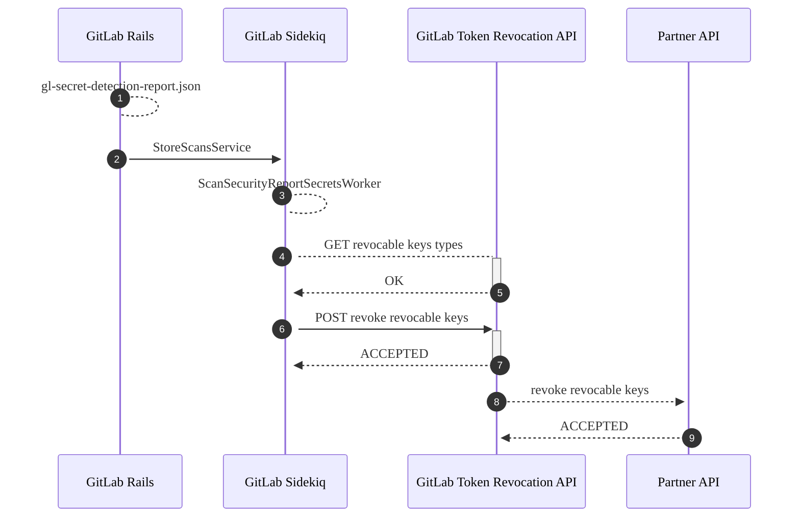
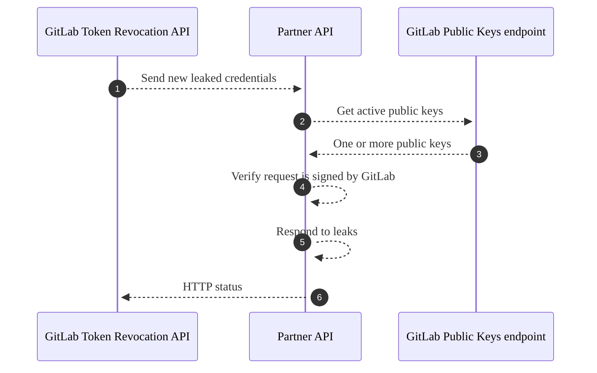

DETAILS:
**Tier:** Ultimate
**Offering:** GitLab.com, GitLab Self-Managed, GitLab Dedicated

GitLab Secret Detection automatically responds when it finds certain types of leaked secrets.
Automatic responses can:

- Automatically revoke the secret.
- Notify the partner that issued the secret. The partner can then revoke the secret, notify its owner, or otherwise protect against abuse.

## Supported secret types and actions

GitLab supports automatic response for the following types of secrets:

| Secret type | Action taken | Supported on GitLab.com | Supported in self-managed |
| ----- | --- | --- | --- |
| GitLab [personal access tokens](../../profile/personal_access_tokens.md) | Immediately revoke token, send email to owner | ✅ | ✅ [15.9 and later](https://gitlab.com/gitlab-org/gitlab/-/issues/371658) |
| Amazon Web Services (AWS) [IAM access keys](https://docs.aws.amazon.com/IAM/latest/UserGuide/id_credentials_access-keys.html) | Notify AWS | ✅ | ⚙ |
| Google Cloud [service account keys](https://cloud.google.com/iam/docs/best-practices-for-managing-service-account-keys), [API keys](https://cloud.google.com/docs/authentication/api-keys), and [OAuth client secrets](https://support.google.com/cloud/answer/6158849#rotate-client-secret) | Notify Google Cloud | ✅ | ⚙ |
| Postman [API keys](https://learning.postman.com/docs/developer/postman-api/authentication/) | Notify Postman; Postman [notifies the key owner](https://learning.postman.com/docs/administration/managing-your-team/secret-scanner/#protect-postman-api-keys-in-gitlab) | ✅ | ⚙ |

**Component legend**

- ✅ - Available by default
- ⚙ - Requires manual integration using a [Token Revocation API](../../../development/sec/token_revocation_api.md)

## Feature availability

> - [Enabled for non-default branches](https://gitlab.com/gitlab-org/gitlab/-/issues/299212) in GitLab 15.11.

Credentials are only post-processed when Secret Detection finds them:

- In public projects, because publicly exposed credentials pose an increased threat. Expansion to private projects is considered in [issue 391379](https://gitlab.com/gitlab-org/gitlab/-/issues/391379).
- In projects with GitLab Ultimate, for technical reasons. Expansion to all tiers is tracked in [issue 391763](https://gitlab.com/gitlab-org/gitlab/-/issues/391763).

## High-level architecture

This diagram describes how a post-processing hook revokes a secret in the GitLab application:



1. A pipeline with a Secret Detection job completes, producing a scan report (**1**).
1. The report is processed (**2**) by a service class, which schedules an asynchronous worker if token revocation is possible.
1. The asynchronous worker (**3**) communicates with an externally deployed HTTP service
   (**4** and **5**) to determine which kinds of secrets can be automatically revoked.
1. The worker sends (**6** and **7**) the list of detected secrets which the GitLab Token Revocation API is able to
   revoke.
1. The GitLab Token Revocation API sends (**8** and **9**) each revocable token to their respective vendor's [Partner API](#implement-a-partner-api). See the [GitLab Token Revocation API](../../../development/sec/token_revocation_api.md)
   documentation for more information.

## Partner program for leaked-credential notifications

GitLab notifies partners when credentials they issue are leaked in public repositories on GitLab.com.
If you operate a cloud or SaaS product and you're interested in receiving these notifications, learn more in [epic 4944](https://gitlab.com/groups/gitlab-org/-/epics/4944).
Partners must [implement a Partner API](#implement-a-partner-api), which is called by the GitLab Token Revocation API.

### Implement a Partner API

A Partner API integrates with the GitLab Token Revocation API to receive and respond to leaked token revocation
requests. The service should be a publicly accessible HTTP API that is idempotent and rate-limited.

Requests to your service can include one or more leaked tokens, and a header with the signature of the request
body. We strongly recommend that you verify incoming requests using this signature, to prove it's a genuine
request from GitLab. The diagram below details the necessary steps to receive, verify, and revoke leaked tokens:



1. The GitLab Token Revocation API sends (**1**) a [revocation request](#revocation-request) to the Partner API. The request
   includes headers containing a public key identifier and signature of the request body.
1. The Partner API requests (**2**) a list of [public keys](#public-keys-endpoint) from GitLab. The response (**3**)
   may include multiple public keys in the event of key rotation and should be filtered with the identifier in the request header.
1. The Partner API [verifies the signature](#verifying-the-request) against the actual request body, using the public key (**4**).
1. The Partner API processes the leaked tokens, which may involve automatic revocation (**5**).
1. The Partner API responds to the GitLab Token Revocation API (**6**) with the appropriate HTTP status code:
   - A successful response code (HTTP 200 through 299) acknowledges that the partner has received and processed the request.
   - An error code (HTTP 400 or higher) causes the GitLab Token Revocation API to retry the request.

#### Revocation request

This JSON schema document describes the body of the revocation request:

```json
{
    "type": "array",
    "items": {
        "description": "A leaked token",
        "type": "object",
        "properties": {
            "type": {
                "description": "The type of token. This is vendor-specific and can be customised to suit your revocation service",
                "type": "string",
                "examples": [
                    "my_api_token"
                ]
            },
            "token": {
                "description": "The substring that was matched by the Secret Detection analyser. In most cases, this is the entire token itself",
                "type": "string",
                "examples": [
                    "XXXXXXXXXXXXXXXX"
                ]
            },
            "url": {
                "description": "The URL to the raw source file hosted on GitLab where the leaked token was detected",
                "type": "string",
                "examples": [
                    "https://gitlab.example.com/some-repo/-/raw/abcdefghijklmnop/compromisedfile1.java"
                ]
            }
        }
    }
}
```

Example:

```json
[{"type": "my_api_token", "token": "XXXXXXXXXXXXXXXX", "url": "https://example.com/some-repo/-/raw/abcdefghijklmnop/compromisedfile1.java"}]
```

In this example, Secret Detection has determined that an instance of `my_api_token` has been leaked. The
value of the token is provided to you, in addition to a publicly accessible URL to the raw content of the
file containing the leaked token.

The request includes two special headers:

| Header | Type | Description |
|--------|------|-------------|
| `Gitlab-Public-Key-Identifier` | string | A unique identifier for the key pair used to sign this request. Primarily used to aid in key rotation. |
| `Gitlab-Public-Key-Signature` | string | A base64-encoded signature of the request body. |

You can use these headers along with the GitLab Public Keys endpoint to verify that the revocation request was genuine.

#### Public Keys endpoint

GitLab maintains a publicly-accessible endpoint for retrieving public keys used to verify revocation
requests. The endpoint can be provided on request.

This JSON schema document describes the response body of the public keys endpoint:

```json
{
    "type": "object",
    "properties": {
        "public_keys": {
            "description": "An array of public keys managed by GitLab used to sign token revocation requests.",
            "type": "array",
            "items": {
                "type": "object",
                "properties": {
                    "key_identifier": {
                        "description": "A unique identifier for the keypair. Match this against the value of the Gitlab-Public-Key-Identifier header",
                        "type": "string"
                    },
                    "key": {
                        "description": "The value of the public key",
                        "type": "string"
                    },
                    "is_current": {
                        "description": "Whether the key is currently active and signing new requests",
                        "type": "boolean"
                    }
                }
            }
        }
    }
}
```

Example:

```json
{
    "public_keys": [
        {
            "key_identifier": "6917d7584f0fa65c8c33df5ab20f54dfb9a6e6ae",
            "key": "-----BEGIN PUBLIC KEY-----\nMFkwEwYHKoZIzj0CAQYIKoZIzj0DAQcDQgAEN05/VjsBwWTUGYMpijqC5pDtoLEf\nuWz2CVZAZd5zfa/NAlSFgWRDdNRpazTARndB2+dHDtcHIVfzyVPNr2aznw==\n-----END PUBLIC KEY-----\n",
            "is_current": true
        }
    ]
}
```

#### Verifying the request

You can check whether a revocation request is genuine by verifying the `Gitlab-Public-Key-Signature` header
against the request body, using the corresponding public key taken from the API response above. We use
[ECDSA](https://en.wikipedia.org/wiki/Elliptic_Curve_Digital_Signature_Algorithm) with SHA256 hashing to
produce the signature, which is then base64-encoded into the header value.

The Python script below demonstrates how the signature can be verified. It uses the popular
[pyca/cryptography](https://cryptography.io/en/latest/) module for cryptographic operations:

```python
import hashlib
import base64
from cryptography.hazmat.primitives import hashes
from cryptography.hazmat.primitives.serialization import load_pem_public_key
from cryptography.hazmat.primitives.asymmetric import ec

public_key = str.encode("")      # obtained from the public keys endpoint
signature_header = ""            # obtained from the `Gitlab-Public-Key-Signature` header
request_body = str.encode(r'')   # obtained from the revocation request body

pk = load_pem_public_key(public_key)
decoded_signature = base64.b64decode(signature_header)

pk.verify(decoded_signature, request_body, ec.ECDSA(hashes.SHA256()))  # throws if unsuccessful

print("Signature verified!")
```

The main steps are:

1. Loading the public key into a format appropriate for the crypto library you're using.
1. Base64-decoding the `Gitlab-Public-Key-Signature` header value.
1. Verifying the body against the decoded signature, specifying ECDSA with SHA256 hashing.
