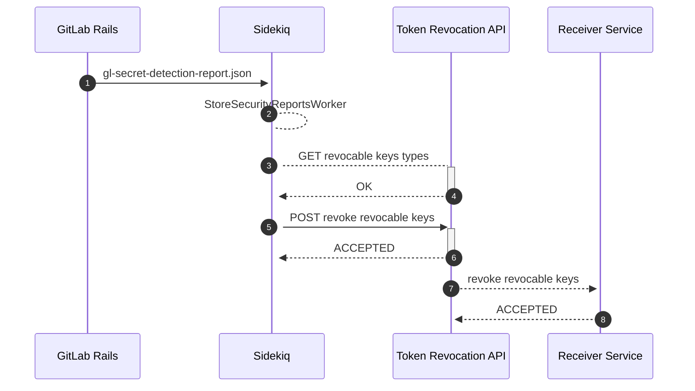

# Secret Detection post-processing and revocation **(FREE SAAS)**

> - [Introduced](https://gitlab.com/groups/gitlab-org/-/epics/4639) in GitLab 13.6.
> - [Disabled by default for GitLab personal access tokens](https://gitlab.com/gitlab-org/gitlab/-/issues/371658) in GitLab 15.6 [with a flag](../../../administration/feature_flags.md) named `gitlab_pat_auto_revocation`. Available to GitLab.com only.
> - [Enabled by default for GitLab personal access tokens](https://gitlab.com/gitlab-org/gitlab/-/issues/371658) in GitLab 15.9

GitLab.com and self-managed supports running post-processing hooks after detecting a secret. These
hooks can perform actions, like notifying the vendor that issued the secret.
The vendor can then confirm the credentials and take remediation actions, like:

- Revoking a secret.
- Reissuing a secret.
- Notifying the creator of the secret.

GitLab supports post-processing for the following vendors and secrets:

| Vendor | Secret | GitLab.com | Self-managed |
| ----- | --- | --- | --- |
| GitLab | [Personal access tokens](../../profile/personal_access_tokens.md) | ✅ | ✅ 15.9 and later |
| Amazon Web Services (AWS) | [IAM access keys](https://docs.aws.amazon.com/IAM/latest/UserGuide/id_credentials_access-keys.html) | ✅ | ⚙ |

**Component legend**

- ✅ - Available by default
- ⚙ - Requires manual integration using a [Token Revocation API](../../../development/sec/token_revocation_api.md)

NOTE:
Post-processing is limited to a project's default branch.

## High-level architecture

This diagram describes how a post-processing hook revokes a secret within the GitLab application:



1. A pipeline with a Secret Detection job completes on the project's default branch, producing a scan
   report (**1**).
1. The report is processed (**2**) by an asynchronous worker, which communicates with an externally
   deployed HTTP service (**3** and **4**) to determine which kinds of secrets can be automatically
   revoked.
1. The worker sends (**5** and **6**) the list of detected secrets which the Token Revocation API is able to
   revoke.
1. The Token Revocation API sends (**7** and **8**) each revocable token to their respective vendor's [receiver service](#integrate-your-cloud-provider-service-with-gitlabcom).

See the [Token Revocation API](../../../development/sec/token_revocation_api.md) documentation for more
information.

## Integrate your cloud provider service with GitLab.com

Third-party cloud and SaaS vendors interested in automated token revocation can
[express integration interest by filling out this form](https://forms.gle/wWpvrtLRK21Q2WJL9).
Vendors must [implement a revocation receiver service](#implement-a-revocation-receiver-service)
which will be called by the Token Revocation API.

### Implement a revocation receiver service

A revocation receiver service integrates with a GitLab instance's Token Revocation API to receive and respond
to leaked token revocation requests. The service should be a publicly accessible HTTP API that is
idempotent and rate-limited. Requests to your service from the Token Revocation API will follow the example
below:

```plaintext
POST / HTTP/2
Accept: */*
Content-Type: application/json
X-Gitlab-Token: MYSECRETTOKEN

[
  {"type": "my_api_token", "token":"XXXXXXXXXXXXXXXX","url": "https://example.com/some-repo/~/raw/abcdefghijklmnop/compromisedfile1.java"}
]
```

In this example, Secret Detection has determined that an instance of `my_api_token` has been leaked. The
value of the token is provided to you, in addition to a publicly accessible URL to the raw content of the
file containing the leaked token.
