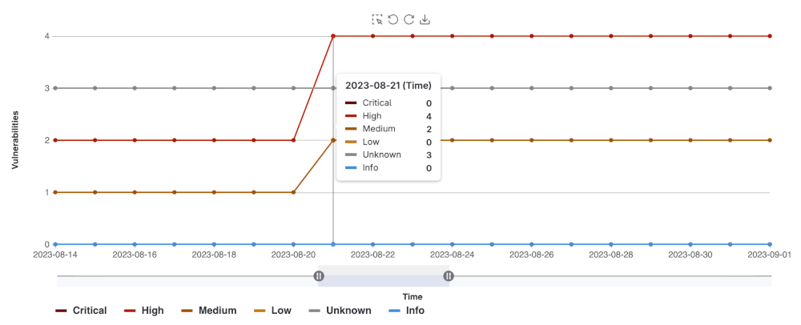
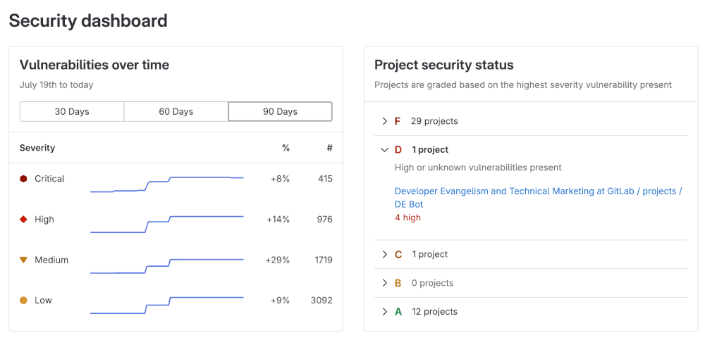

DETAILS:
**Tier:** Ultimate
**Offering:** GitLab.com, GitLab Self-Managed, GitLab Dedicated

## Security Dashboards

Security Dashboards are used to assess the security posture of your applications. GitLab provides
you with a collection of metrics, ratings, and charts for the vulnerabilities detected by the [security scanners](../detect/_index.md) run on your project. The security dashboard provides data such as:

- Vulnerability trends over a 30, 60, or 90-day time-frame for all projects in a group
- A letter grade rating for each project based on vulnerability severity
- The total number of vulnerabilities detected within the last 365 days including their severity

The data provided by the Security Dashboards can be used supply to insight on what decisions can be made to improve your security posture. For example, using the 365 day trend view, you can see on which days a significant number of vulnerabilities were introduced. Then you can examine the code changes performed on those particular days in order perform a root-cause analysis to create better policies for preventing the introduction of vulnerabilities in the future.

<i class="fa fa-youtube-play youtube" aria-hidden="true"></i>
For an overview, see [Security Dashboard](https://www.youtube.com/watch?v=Uo-pDns1OpQ).

## Vulnerability metrics in the Value Streams Dashboard

> - [Introduced](https://gitlab.com/gitlab-org/gitlab/-/issues/383697) in GitLab 16.0.

You can view vulnerability metrics also in the [Value Streams Dashboard](../../analytics/value_streams_dashboard.md) comparison panel, which helps you understand security exposure in the context of your organization's software delivery workflows.

## Prerequisites

To view the Security Dashboards, the following is required:

- You must have the Developer role for the group or project.
- At least one [security scanner](../detect/_index.md) configured in your project.
- A successful security scan performed on the [default branch](../../project/repository/branches/default.md) of your project.
- At least 1 detected vulnerability in the project.

**Note**:
The Security Dashboards show results of scans from the most recent completed pipeline on the
[default branch](../../project/repository/branches/default.md). Dashboards are updated with the result of completed pipelines run on the default branch; they do not include vulnerabilities discovered in pipelines from other un-merged branches.

## Viewing the Security Dashboard

The Security Dashboard can be seen at the project, group, and the Security Center levels.
Each dashboard provides a unique viewpoint of your security posture.

### Project Security Dashboard

The Project Security Dashboard shows the total number of vulnerabilities detected over time,
with up to 365 days of historical data for a given project. The dashboard is an historical view of open vulnerabilities in the default branch. Open vulnerabilities are those of only `Needs triage` or `Confirmed` status (`Dismissed` or `Resolved` vulnerabilities are excluded).

To view a project's security dashboard:

1. On the left sidebar, select **Search or go to** and find your project.
1. Select **Secure > Security dashboard**.
1. Filter and search for what you need.
   - To filter the chart by severity, select the legend name.
   - To view a specific time frame, use the time range handles (**{scroll-handle}**).
   - To view a specific area of the chart, select the left-most icon (**{marquee-selection}**) and drag
     across the chart.
   - To reset to the original range, select **Remove Selection** (**{redo}**).

#### Downloading the vulnerability chart

You can download an image of the vulnerability chart from the Project Security Dashboard
to use in documentation, presentations, and so on. To download the image of the vulnerability
chart:

1. On the left sidebar, select **Search or go to** and find your project.
1. Select **Secure > Security dashboard**.
1. Select **Save chart as an image** (**{download}**).

You will then be prompted to download the image in SVG format.

### Group Security Dashboard

The group Security Dashboard provides an overview of vulnerabilities found in the default
branches of all projects in a group and its subgroups. The Group Security Dashboard
supplies the following:

- Vulnerability trends over a 30, 60, or 90-day time frame
- A letter grade for each project in the group according to its highest-severity open vulnerability. The letter grades are assigned using the following criteria:

| Grade | Description |
| ----- | ----------- |
| **F** | One or more `critical` vulnerabilities |
| **D** | One or more `high` or `unknown` vulnerabilities |
| **C** | One or more `medium` vulnerabilities |
| **B** | One or more `low` vulnerabilities |
| **A** | Zero vulnerabilities |

To view group security dashboard:

1. On the left sidebar, select **Search or go to** and find your group.
1. Select **Security > Security dashboard**.
1. Hover over the **Vulnerabilities over time** chart to get more details about vulnerabilities.
   - You can display the vulnerability trends over a 30, 60, or 90-day time frame (the default is 90 days).
   - To view aggregated data beyond a 90-day time frame, use the [VulnerabilitiesCountByDay GraphQL API](../../../api/graphql/reference/_index.md#vulnerabilitiescountbyday). GitLab retains the data for 365 days.

1. Select the arrows under the **Project security status** section to see the what projects fall under a particular letter-grade rating:
   - You can see how many vulnerabilities of a particular severity are found in a project
   - You can select a project's name to directly access its project security dashboard

## Security Center

The Security Center is a configurable personal space where you can view vulnerabilities across all the
projects you belong to. You can add up to 1,000 projects to the Security Center, however the **Project** listing in
the **Security Center** settings page displays a maximum of 100 projects. You can use the search filter to find projects not
shown in the first 100 projects.

The Security Center includes:

- The group Security Dashboard
- A [vulnerability report](../vulnerability_report/_index.md)
- A settings area to configure which projects to display

### Viewing the Security Center

To view the Security Center:

1. On the left sidebar, select **Search or go to**.
1. Select **Your work**.
1. Select **Security > Security dashboard**.

The Security Center is blank by default. You must add a project which have been configured with at least one security scanner.

### Adding projects to the Security Center

To add projects:

1. On the left sidebar, select **Search or go to**.
1. Select **Your work**.
1. Expand **Security**.
1. Select **Settings**.
1. Use the **Search your projects** text box to search for and select projects.
1. Select **Add projects**.

After you add projects, the security dashboard and vulnerability report show the vulnerabilities found in those projects' default branches.

### Removing projects from the Security Center

The Security Center displays a maximum of 100 projects, so you may need to use the search function to remove a project. To remove projects:

1. On the left sidebar, select **Search or go to**.
1. Select **Your work**.
1. Expand **Security**.
1. Select **Settings**.
1. Use the **Search your projects** text box to search for the project.
1. Select **Remove project from dashboard** (**{remove}**).

After you remove projects, the security dashboard and vulnerability report no longer show the vulnerabilities found in those projects' default branches.

## Related topics

- [Vulnerability reports](../vulnerability_report/_index.md)
- [Vulnerability Page](../vulnerabilities/_index.md)
