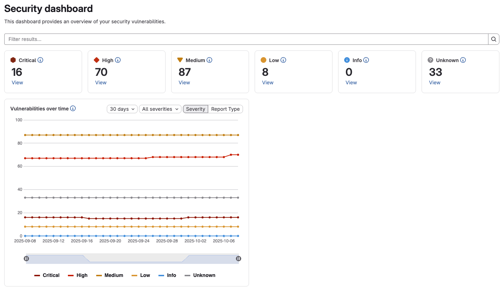
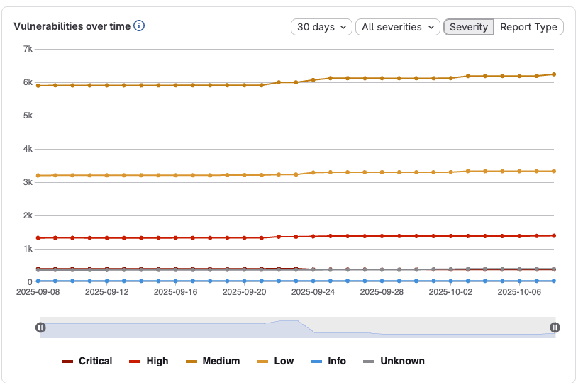
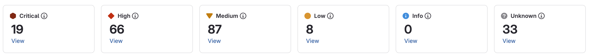



- Tier: Ultimate
- Offering: GitLab.com, GitLab Self-Managed, GitLab Dedicated





- New dashboard with Elasticsearch integration [introduced](https://gitlab.com/gitlab-org/gitlab/-/issues/570504) in GitLab 18.6 [with flags](../../../administration/feature_flags/_index.md) named `project_security_dashboard_new` and `group_security_dashboard_new`. The flags are disabled by default.





The availability of this feature is controlled by a feature flag. For more information, see the history.



GitLab 18.6 introduced an improved version of the security dashboards that use [advanced vulnerability management](../vulnerability_report/_index.md#advanced-vulnerability-management). For details, see [new security dashboards](#new-security-dashboards).

## Vulnerability metrics in the Value Streams Dashboard



- [Introduced](https://gitlab.com/gitlab-org/gitlab/-/issues/383697) in GitLab 16.0.



You can view vulnerability metrics also in the [Value Streams Dashboard](../../analytics/value_streams_dashboard.md) comparison panel, which helps you understand security exposure in the context of your organization's software delivery workflows.

## Security dashboards

Security dashboards are used to assess the security posture of your applications. GitLab provides
you with a collection of metrics, ratings, and charts for the vulnerabilities detected by the [security scanners](../detect/_index.md) run on your project. The security dashboard provides data such as:

- Vulnerability trends over a 30, 60, or 90-day time-frame for all projects in a group
- A letter grade rating for each project based on vulnerability severity
- The total number of vulnerabilities detected within the last 365 days including their severity

The data provided by the security dashboards can be used to supply insight on what decisions can be made to improve your security posture. For example, using the 365 day trend view, you can see on which days a significant number of vulnerabilities were introduced. Then you can examine the code changes performed on those particular days in order perform a root-cause analysis to create better policies for preventing the introduction of vulnerabilities in the future.

<i class="fa fa-youtube-play youtube" aria-hidden="true"></i>
For an overview, see [Security Dashboard - Advanced Security Testing](https://www.youtube.com/watch?v=Uo-pDns1OpQ).

## Prerequisites

To view the Security Dashboards, the following is required:

- You must have the Developer role for the group or project.
- At least one [security scanner](../detect/_index.md) configured in your project.
- A successful security scan performed on the [default branch](../../project/repository/branches/default.md) of your project.
- At least 1 detected vulnerability in the project.



The Security Dashboards show results of scans from the most recent completed pipeline on the
[default branch](../../project/repository/branches/default.md). Dashboards are updated with the result of completed pipelines run on the default branch; they do not include vulnerabilities discovered in pipelines from other un-merged branches.



## Viewing the Security Dashboard

The Security Dashboard can be seen at the project, group, and the Security Center levels.
Each dashboard provides a unique viewpoint of your security posture.

### Project Security Dashboard

The Project Security Dashboard shows the total number of vulnerabilities detected over time,
with up to 365 days of historical data for a given project. The dashboard is a historical view of open vulnerabilities in the default branch. Open vulnerabilities are those of only `Needs triage` or `Confirmed` status (`Dismissed` or `Resolved` vulnerabilities are excluded).

To view a project's security dashboard:

1. On the top bar, select **Search or go to** and find your project.
1. Select **Secure** > **Security dashboard**.
1. Filter and search for what you need.
   - To filter the chart by severity, select the legend name.
   - To view a specific time frame, use the time range handles ().
   - To view a specific area of the chart, select the left-most icon () and drag
     across the chart.
   - To reset to the original range, select **Remove Selection** ().

#### Downloading the vulnerability chart

You can download an image of the vulnerability chart from the Project Security Dashboard
to use in documentation, presentations, and so on. To download the image of the vulnerability
chart:

1. On the top bar, select **Search or go to** and find your project.
1. Select **Secure** > **Security dashboard**.
1. Select **Save chart as an image** ().

You are prompted to download the image in SVG format.

### Group Security Dashboard

The group Security Dashboard provides an overview of vulnerabilities found in the default
branches of all projects in a group and its subgroups. The Group Security Dashboard
supplies the following:

- Vulnerability trends over a 30, 60, or 90-day time frame
- A letter grade for each project in the group according to its highest-severity open vulnerability. The letter grades are assigned using the following criteria:

| Grade | Description |
| ----- | ----------- |
| **F** | One or more `critical` vulnerabilities |
| **D** | One or more `high` or `unknown` vulnerabilities |
| **C** | One or more `medium` vulnerabilities |
| **B** | One or more `low` vulnerabilities |
| **A** | Zero vulnerabilities |

To view group security dashboard:

1. On the top bar, select **Search or go to** and find your group.
1. Select **Security** > **Security dashboard**.
1. Hover over the **Vulnerabilities over time** chart to get more details about vulnerabilities.
   - You can display the vulnerability trends over a 30, 60, or 90-day time frame (the default is 90 days).
   - To view aggregated data beyond a 90-day time frame, use the [`VulnerabilitiesCountByDay` GraphQL API](../../../api/graphql/reference/_index.md#vulnerabilitiescountbyday). GitLab retains the data for 365 days.

1. Select the arrows under the **Project security status** section to see the what projects fall under a particular letter-grade rating:
   - You can see how many vulnerabilities of a particular severity are found in a project
   - You can select a project's name to directly access its project security dashboard

## New security dashboards



- Tier: Ultimate
- Offering: GitLab.com
- Status: Beta





- New dashboard that uses [advanced vulnerability management](../vulnerability_report/_index.md#advanced-vulnerability-management) [introduced](https://gitlab.com/gitlab-org/gitlab/-/issues/570504) in GitLab 18.6 [with flags](../../../administration/feature_flags/_index.md) named `project_security_dashboard_new` and `group_security_dashboard_new`. The flags are disabled by default.
- [Enabled on GitLab.com](https://gitlab.com/gitlab-org/gitlab/-/issues/571978) in GitLab 18.6.





The availability of this feature is controlled by a feature flag.
For more information, see the history.



Use security dashboards to assess the security posture of your applications. GitLab provides
you with a collection of metrics, ratings, and charts for the vulnerabilities detected by the [security scanners](../detect/_index.md) run on your project. The security dashboard provides data such as:

- Vulnerability trends over a 30, 60, or 90-day time frame for all projects in a group.
- The total number of open vulnerabilities by severity.

### Prerequisites to view the dashboard

To view the security dashboard for a project or a group you must have:

- The Developer role or higher for the group or project.
- At least one [security scanner](../detect/_index.md) configured in your project.
- A successful security scan performed on the [default branch](../../project/repository/branches/default.md) of your project.
- At least one detected vulnerability in the project.
- [Advanced vulnerability management](../vulnerability_report/_index.md#advanced-vulnerability-management) with [Advanced search](../../search/advanced_search.md) enabled.



The security dashboards show results of scans from the most recently completed pipeline on the
[default branch](../../project/repository/branches/default.md). Dashboards are updated with the results of completed pipelines run on the default branch. They do not include vulnerabilities discovered in pipelines from other un-merged branches.



### Viewing the security dashboard

The security dashboard shows filterable charts and panels built with data from vulnerabilities detected in the default branch. Charts include vulnerabilities over time and severity counts. The data in many charts is grouped into two categories:

- Open: Includes vulnerabilities with the Needs triage or Confirmed statuses
- Closed: Includes vulnerabilities with the Dismissed and Resolved statuses

Charts and panels include only open vulnerabilities unless otherwise noted.

You can view a security dashboard for a project or a group. Each dashboard provides a unique viewpoint into your security posture.

Both dashboards include:

- [Charts](#charts)
  - [Vulnerabilities over time](#vulnerabilities-over-time)
  - [Vulnerability severity panels](#vulnerability-severity-panel)
- [Filter the entire dashboard](#filter-the-entire-dashboard)

To view a security dashboard:

1. On the left sidebar, select **Search or go to** and find your project.
1. Select **Secure** > **Security dashboard**.

### Project security dashboard

The project security dashboard shows vulnerabilities detected in the project's default branch. It includes:

- The [**Vulnerabilities over time**](#vulnerabilities-over-time) chart, which includes up to 90 days of history.
- The [**Severity panels**](#vulnerability-severity-panel), which show open vulnerabilities by severity.

Open vulnerabilities are those with Needs triage or Confirmed status. Closed vulnerabilities with Dismissed or Resolved status are not included in these charts.

### Group security dashboard

The group security dashboard provides an overview of vulnerabilities found in the default
branches of all projects in a group and its subgroups. The group security dashboard
supplies the following:

- The [**Vulnerabilities over time**](#vulnerabilities-over-time) chart, which includes up to 90 days of history.
- The [**Severity panels**](#vulnerability-severity-panel), which show open vulnerabilities by severity.

### Charts

Security dashboards include several charts that help you understand and act on vulnerabilities in your projects and groups.

#### Vulnerabilities over time

The **Vulnerabilities over time** chart is available on both project and group dashboards. It shows the open vulnerabilities trends over 30, 60, or 90-day periods. The default range is 30 days. GitLab retains vulnerability data for 365 days.

Use the chart to identify when vulnerabilities were introduced and how they change over time.

To view details:

1. Hover over a data point to see the vulnerability count for that day.
1. Use the **time frame selector** to switch between 30, 60, or 90 days.
1. Drag the range handles () to zoom in on a specific period.
1. Use the dropdowns to filter the chart by:
   - **Severity** (for example: Critical, High, Medium)
   - **Report type** (SAST, DAST, Dependency Scanning, and others)
1. To explore data beyond 90 days, but within the last 365 days, use the [`SecurityMetrics.vulnerabilitiesOverTime` GraphQL API](../../../api/graphql/reference/_index.md#securitymetricsvulnerabilitiesovertime)
1. Vulnerabilities that are no longer detected are not automatically counted as closed. Use [vulnerability management policies](../policies/_index.md) to automatically close them if needed.

#### Vulnerability severity panel

The vulnerability severity panel shows the total number of open vulnerabilities by [severity](../vulnerabilities/severities.md).

To view details:

1. In the severity panel, locate the severity you want to investigate.
1. Select **View**.
   - The vulnerability report opens and includes only vulnerabilities of that severity.
   - Any page-level filters you have set are also applied.

### Filter the entire dashboard

You can filter results at two levels:

- **Dashboard filters**: Apply to the entire dashboard. All charts update when you use these filters.
- **Chart and panel filters**: Apply only to the chart or panel you are viewing.

Available dashboard filters include:

- **Report type:** Filter by scanner, including SAST, DAST, Dependency Scanning, and others.
- **Project:** Limit results to specific projects. Available only for group security dashboards.

Dashboard filter behavior:

- Filters apply immediately across all dashboard charts and panels.
- Filters that you apply continue to apply throughout your session unless you remove them.
- When you open a vulnerability report from the dashboard, active filters are automatically applied to the vulnerability report.

To apply a filter to the whole dashboard:

1. In the filter bar at the top of the dashboard, select **Filter results...**.
1. From the dropdown list, choose the filter type.
1. Select one or more filter values.

## Related topics

- [Security center](../security_center/_index.md)
- [Vulnerability reports](../vulnerability_report/_index.md)
- [Vulnerability Page](../vulnerabilities/_index.md)
