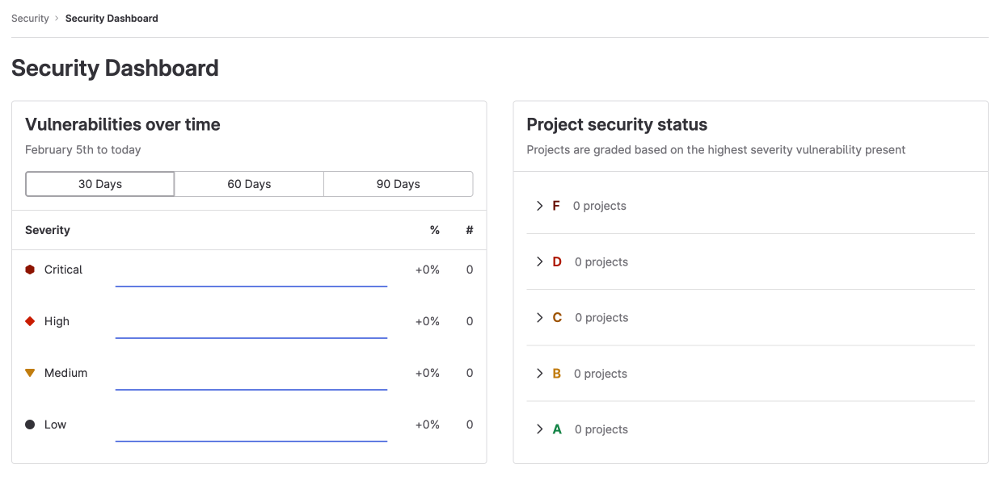

# GitLab Security Dashboards and Security Center **(ULTIMATE)**

You can use Security Dashboards to view trends about vulnerabilities
detected by [security scanners](../index.md#application-coverage).
These trends are shown in projects, groups, and the Security Center.

To use the Security Dashboards, you must:

- Configure at least one [security scanner](../index.md#application-coverage) in a project.
- Configure jobs to use the [`reports` syntax](../../../ci/yaml/index.md#artifactsreports).
- Use [GitLab Runner](https://docs.gitlab.com/runner/) 11.5 or later. If you use the
  shared runners on GitLab.com, you are using the correct version.
- Have the [correct role](../../permissions.md) for the project or group.

<i class="fa fa-youtube-play youtube" aria-hidden="true"></i>
For an overview, see [Security Dashboard](https://www.youtube.com/watch?v=QHQHN4luNpc).

## When Security Dashboards are updated

The Security Dashboards show results of scans from the most recent completed pipeline on the
[default branch](../../project/repository/branches/default.md).
Dashboards are updated with the result of completed pipelines run on the default branch; they do not include vulnerabilities discovered in pipelines from other un-merged branches.

If you use manual jobs, for example gate deployments, in the default branch's pipeline,
the results of any scans are only updated when the job has been successfully run.
If manual jobs are skipped regularly, you should to define the job as optional,
using the [`allow_failure`](../../../ci/jobs/job_control.md#types-of-manual-jobs) attribute.

To ensure regular security scans (even on infrequently developed projects),
you should use [scan execution policies](../../../user/application_security/policies/scan-execution-policies.md).
Alternatively, you can
[configure a scheduled pipeline](../../../ci/pipelines/schedules.md).

## Reduce false negatives in dependency scans

WARNING:
False negatives occur when you resolve dependency versions during a scan, which differ from those
resolved when your project built and released in a previous pipeline.

To reduce false negatives in [dependency scans](../../../user/application_security/dependency_scanning/index.md) in scheduled pipelines, ensure you:

- Include a lock file in your project. A lock file lists all transient dependencies and tracks their versions.
  - Java projects can't have lock files.
  - Python projects can have lock files, but GitLab Secure tools don't support them.
- Configure your project for [Continuous Delivery](../../../ci/introduction/index.md).

## View vulnerabilities over time for a project

> - [Introduced](https://gitlab.com/gitlab-org/gitlab/-/issues/235558) in GitLab 13.6.
> - [Introduced](https://gitlab.com/gitlab-org/gitlab/-/issues/285476) in GitLab 13.10, options to zoom in on a date range, and download the vulnerabilities chart.
> - [Introduced](https://gitlab.com/gitlab-org/gitlab/-/issues/285477) in GitLab 13.11, date range slider to visualize data between given dates.

The project Security Dashboard shows the total number of vulnerabilities
over time, with up to 365 days of historical data. Data refresh begins daily at 01:15 UTC via a scheduled job.
Each refresh captures a snapshot of open vulnerabilities. Data is not backported to prior days
so vulnerabilities opened after the job has already run for the day cannot be reflected in the
counts until the following day's refresh job.
Project Security Dashboards show statistics for all vulnerabilities with a current status of `Needs triage` or `Confirmed` .

To view total number of vulnerabilities over time:

1. On the top bar, select **Main menu > Projects** and find your project.
1. On the left sidebar, select **Security and Compliance > Security Dashboard**.
1. Filter and search for what you need.
   - To filter the chart by severity, select the legend name.
   - To view a specific time frame, use the time range handles (**{scroll-handle}**).
   - To view a specific area of the chart, select the left-most icon (**{marquee-selection}**) and drag
     across the chart.
   - To reset to the original range, select **Remove Selection** (**{redo}**).

### Download the vulnerabilities chart

To download an SVG image of the vulnerabilities chart:

1. On the top bar, select **Main menu > Projects** and find your project.
1. On the left sidebar, select **Security and Compliance > Security dashboard**.
1. Select **Save chart as an image** (**{download}**).

## View vulnerabilities over time for a group

The group Security Dashboard gives an overview of vulnerabilities found in the default
branches of projects in a group and its subgroups.

To view vulnerabilities over time for a group:

1. On the top bar, select **Main menu > Groups** and select a group.
1. Select **Security > Security Dashboard**.
1. Hover over the chart to get more details about vulnerabilities.
   - You can display the vulnerability trends over a 30, 60, or 90-day time frame (the default is 90 days).
   - To view aggregated data beyond a 90-day time frame, use the
     [VulnerabilitiesCountByDay GraphQL API](../../../api/graphql/reference/index.md#vulnerabilitiescountbyday).
     GitLab retains the data for 365 days.

## View project security status for a group

Use the group Security Dashboard to view the security status of projects.

To view project security status for a group:

1. On the top bar, select **Main menu > Groups** and select a group.
1. Select **Security > Security Dashboard**.

Each project is assigned a letter [grade](#project-vulnerability-grades) according to the highest-severity open vulnerability.
Dismissed or resolved vulnerabilities are excluded. Each project can receive only one letter grade and appears only once
in the Project security status report.

To view vulnerabilities, go to the group's [vulnerability report](../vulnerability_report/index.md).

### Project vulnerability grades

| Grade | Description |
| --- | --- |
| **F** | One or more `critical` vulnerabilities |
| **D** | One or more `high` or `unknown` vulnerabilities |
| **C** | One or more `medium` vulnerabilities |
| **B** | One or more `low` vulnerabilities |
| **A** | Zero vulnerabilities |

## Security Center

> [Introduced](https://gitlab.com/groups/gitlab-org/-/epics/3426) in GitLab 13.4.

The Security Center is a personal space where you view vulnerabilities across all your projects. It
shows the vulnerabilities present in the default branches of the projects.

The Security Center includes:

- The group Security Dashboard.
- A [vulnerability report](../vulnerability_report/index.md).
- A settings area to configure which projects to display.

### View the Security Center

To view the Security Center, on the top bar, select **Main menu > Security**.

### Add projects to the Security Center

To add projects to the Security Center:

1. On the top bar, select **Main menu > Security**.
1. On the left sidebar, select **Settings**, or select **Add projects**.
1. Use the **Search your projects** text box to search for and select projects.
1. Select **Add projects**.

After you add projects, the security dashboard and vulnerability report show the vulnerabilities
found in those projects' default branches.

You can add a maximum of 1,000 projects, however the **Project** filter in the **Vulnerability
Report** is limited to 100 projects.

<!-- ## Troubleshooting

Include any troubleshooting steps that you can foresee. If you know beforehand what issues
one might have when setting this up, or when something is changed, or on upgrading, it's
important to describe those, too. Think of things that may go wrong and include them here.
This is important to minimize requests for support, and to avoid doc comments with
questions that you know someone might ask.

Each scenario can be a third-level heading, for example `### Getting error message X`.
If you have none to add when creating a doc, leave this section in place
but commented out to help encourage others to add to it in the future. -->

## Related topics

- [Address the vulnerabilities](../vulnerabilities/index.md)
- [Vulnerability reports](../vulnerability_report/index.md)
- [Vulnerability Page](../vulnerabilities/index.md)
