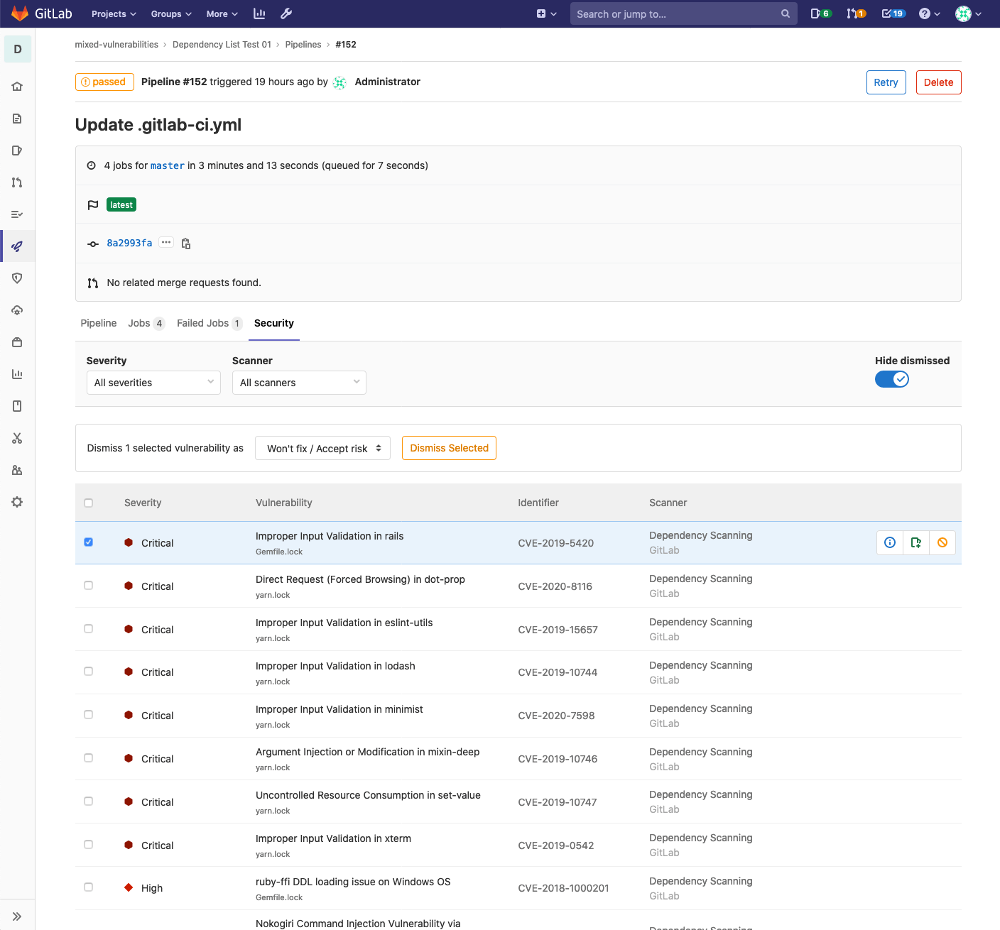
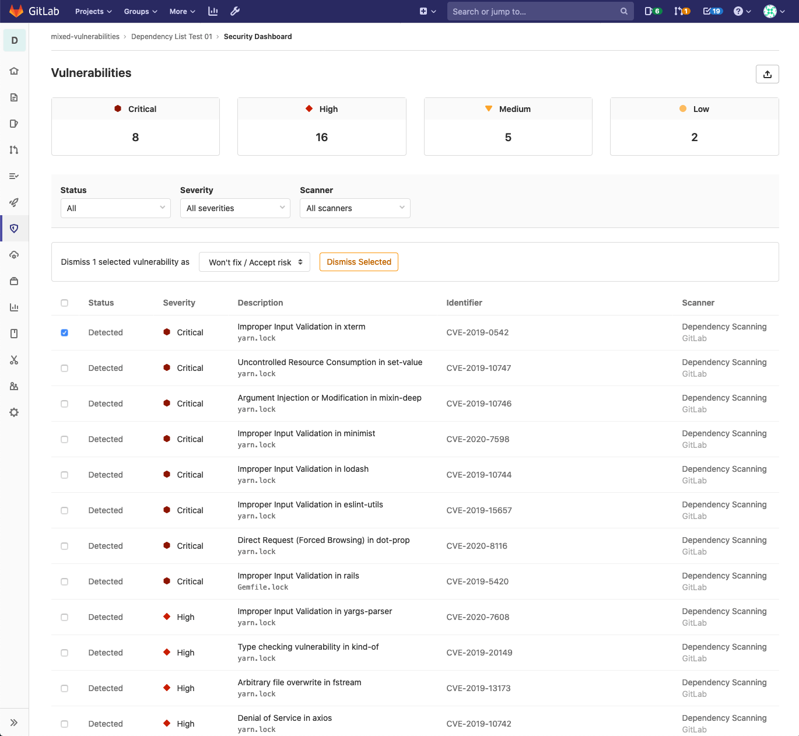
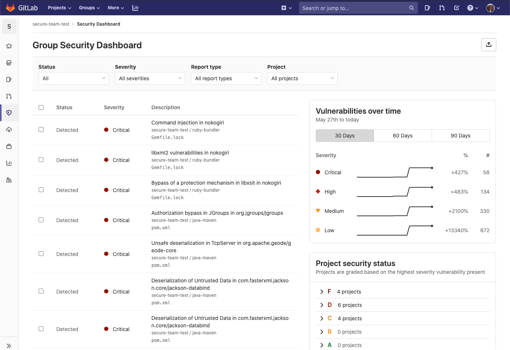
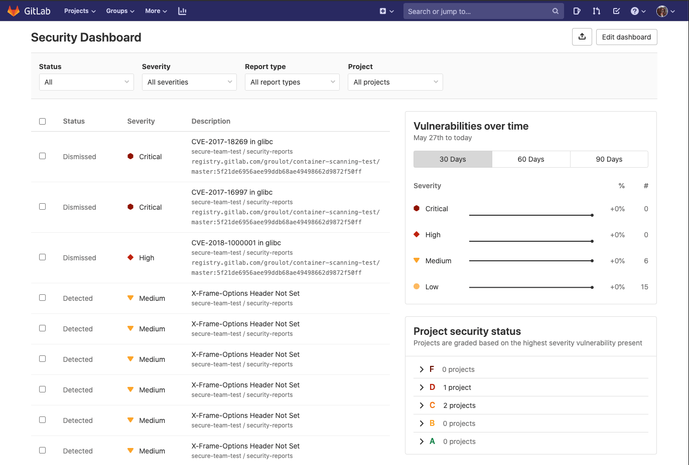
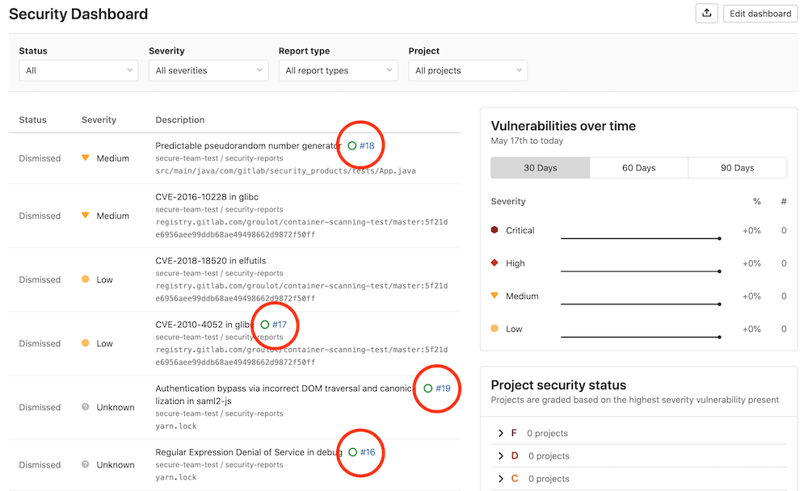

# GitLab Security Dashboard **(ULTIMATE)**

The Security Dashboard is a good place to get an overview of all the security
vulnerabilities in your groups, projects and pipelines.

You can also drill down into a vulnerability and get extra information, see which
project it comes from, the file it's in, and various metadata to help you analyze
the risk. You can also take actions on vulnerabilities by creating an issue for them,
or by dismissing them.

To benefit from the Security Dashboard you must first configure one of the
[security reports](../index.md).

## Supported reports

The Security Dashboard supports the following reports:

- [Container Scanning](../container_scanning/index.md)
- [Dynamic Application Security Testing](../dast/index.md)
- [Dependency Scanning](../dependency_scanning/index.md)
- [Static Application Security Testing](../sast/index.md)

## Requirements

To use the instance, group, project, or pipeline security dashboard:

1. At least one project inside a group must be configured with at least one of
   the [supported reports](#supported-reports).
1. The configured jobs must use the [new `reports` syntax](../../../ci/pipelines/job_artifacts.md#artifactsreports).
1. [GitLab Runner](https://docs.gitlab.com/runner/) 11.5 or newer must be used.
   If you're using the shared Runners on GitLab.com, this is already the case.

## Pipeline Security

> [Introduced](https://gitlab.com/gitlab-org/gitlab/-/issues/13496) in [GitLab Ultimate](https://about.gitlab.com/pricing/) 12.3.

At the pipeline level, the Security section displays the vulnerabilities present in the branch of the project the pipeline was run against.

Visit the page for any pipeline which has run any of the [supported reports](#supported-reports). Click the **Security** tab to view the Security findings.

NOTE: **Note:**
A pipeline consists of multiple jobs, including SAST and DAST scanning. If any job fails to finish for any reason, the security dashboard will not show SAST scanner output. For example, if the SAST job finishes but the DAST job fails, the security dashboard will not show SAST results. The analyzer will output an [exit code](../../../development/integrations/secure.md#exit-code) on failure.

## Project Security Dashboard

> [Introduced](https://gitlab.com/gitlab-org/gitlab/-/issues/6165) in [GitLab Ultimate](https://about.gitlab.com/pricing/) 11.1.

At the project level, the Security Dashboard displays the vulnerabilities merged into your project's
[default branch](../../project/repository/branches/index.md#default-branch). Access it by navigating
to **Security & Compliance > Security Dashboard**.

The Security Dashboard first displays the total number of vulnerabilities by severity (for example,
Critical, High, Medium, Low). Below this, a table displays each vulnerability's status, severity,
and description. Clicking a vulnerability takes you to its [Vulnerability Details](../vulnerabilities)
page to view more information about that vulnerability.

You can filter the vulnerabilities by:

- Status
- Severity
- Report type

You can also dismiss vulnerabilities in the table:

1. Select the checkbox for each vulnerability you want to dismiss.
1. In the menu that appears, select the reason for dismissal and click **Dismiss Selected**.

## Group Security Dashboard

> [Introduced](https://gitlab.com/gitlab-org/gitlab/-/issues/6709) in [GitLab Ultimate](https://about.gitlab.com/pricing/) 11.5.

The group Security Dashboard gives an overview of the vulnerabilities in the default branches of the
projects in a group and its subgroups. Access it by navigating to **Security > Security Dashboard**
for your group.

NOTE: **Note:**
The Security Dashboard only shows projects with [security reports](#supported-reports) enabled in a
group.

You can filter which vulnerabilities the Security Dashboard displays by:

- Status
- Severity
- Report type
- Project

A table lists the vulnerabilities, sorted by severity. The table shows each vulnerability's status,
severity, and description. Clicking a vulnerability takes you to its [Vulnerability Details](../vulnerabilities)
page to view more information about that vulnerability.

Next to the list is a timeline chart that shows how many open
vulnerabilities your projects had at various points in time. You can filter among 30, 60, and
90 days, with the default being 90. Hover over the chart to get more details about
the open vulnerabilities at a specific time.

Below the timeline chart is a list of projects, grouped and sorted by the severity of the vulnerability found:

- F: 1 or more "critical"
- D: 1 or more "high" or "unknown"
- C: 1 or more "medium"
- B: 1 or more "low"
- A: 0 vulnerabilities

Projects with no vulnerability tests configured will not appear in the list. Additionally, dismissed
vulnerabilities are not included either.

Read more on how to [interact with the vulnerabilities](../index.md#interacting-with-the-vulnerabilities).

## Instance Security Dashboard

> [Introduced](https://gitlab.com/gitlab-org/gitlab/-/issues/6953) in [GitLab Ultimate](https://about.gitlab.com/pricing/) 12.8.

At the instance level, the Security Dashboard displays the vulnerabilities present in the default
branches of all the projects you configure to display on the dashboard. It includes all the
[group Security Dashboard's](#group-security-dashboard)
features.

You can access the Instance Security Dashboard from the menu
bar at the top of the page. Under **More**, select **Security**.

### Adding projects to the dashboard

To add projects to the dashboard:

1. Click the **Edit dashboard** button on the Instance Security Dashboard page.
1. Search for and add one or more projects using the **Search your projects** field.
1. Click the **Add projects** button.

Once added, the Security Dashboard displays the vulnerabilities found in your chosen projects'
default branches.

## Export vulnerabilities

> [Introduced](https://gitlab.com/gitlab-org/gitlab/-/issues/213014) in [GitLab Ultimate](https://about.gitlab.com/pricing/) 12.10.

You can export all your vulnerabilities in CSV format by clicking the **{upload}** **Export**
button located at top right of the **Security Dashboard**. After the report
is built, the CSV report downloads to your local machine. The report contains all
vulnerabilities for the projects defined in the **Security Dashboard**,
as filters don't apply to the export function.

NOTE: **Note:**
It may take several minutes for the download to start if your project contains
thousands of vulnerabilities. Do not close the page until the download finishes.

## Keeping the dashboards up to date

The Security Dashboard displays information from the results of the most recent
security scan on the [default branch](../../project/repository/branches/index.md#default-branch),
which means that security scans are performed every time the branch is updated.

If the default branch is updated infrequently, scans are run infrequently and the
information on the Security Dashboard can become outdated as new vulnerabilities
are discovered.

To ensure the information on the Security Dashboard is regularly updated,
[configure a scheduled pipeline](../../../ci/pipelines/schedules.md) to run a
daily security scan. This will update the information displayed on the Security
Dashboard regardless of how often the default branch is updated.

That way, reports are created even if no code change happens.

CAUTION: **Warning:**
Running Dependency Scanning from a scheduled pipeline might result in false negatives if your
project doesn't have a lock file and isn't configured for Continuous Delivery. A lock file is a file
that lists all transient dependencies and keeps track of their exact versions. The false negative
can occur because the dependency version resolved during the scan might differ from the ones
resolved when your project was built and released, in a previous pipeline. Java projects can't have
lock files. Python projects can have lock files, but GitLab Secure tools don't support them.

## Security scans using Auto DevOps

When using [Auto DevOps](../../../topics/autodevops/index.md), use
[special environment variables](../../../topics/autodevops/customize.md#environment-variables)
to configure daily security scans.

## Vulnerability list

Each dashboard's vulnerability list contains vulnerabilities from the latest scans that were merged
into the default branch.
Click any vulnerability in the table to see more information on that vulnerability. To create an
issue associated with the vulnerability, click the **Create Issue** button.

Once you create the issue, the vulnerability list contains a link to the issue and an icon whose
color indicates the issue's status (green for open issues, blue for closed issues).

<!-- ## Troubleshooting

Include any troubleshooting steps that you can foresee. If you know beforehand what issues
one might have when setting this up, or when something is changed, or on upgrading, it's
important to describe those, too. Think of things that may go wrong and include them here.
This is important to minimize requests for support, and to avoid doc comments with
questions that you know someone might ask.

Each scenario can be a third-level heading, e.g. `### Getting error message X`.
If you have none to add when creating a doc, leave this section in place
but commented out to help encourage others to add to it in the future. -->
