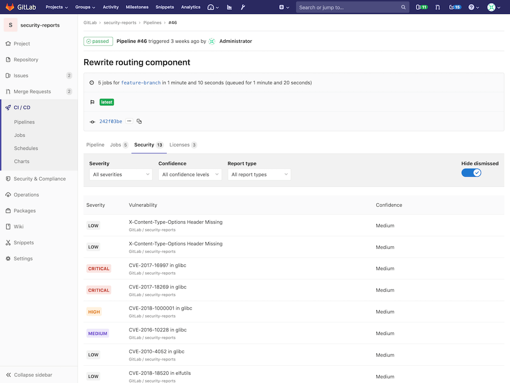
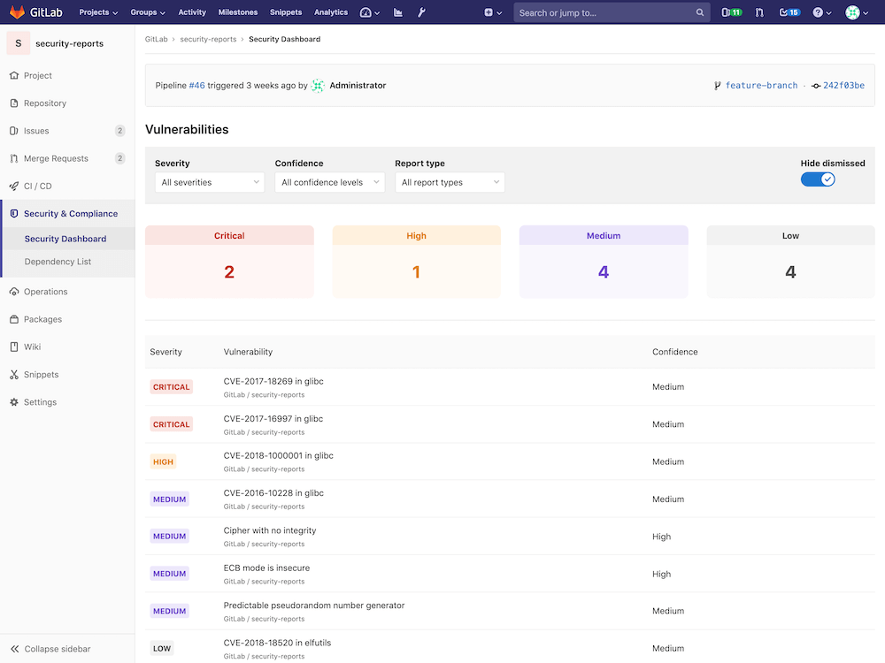
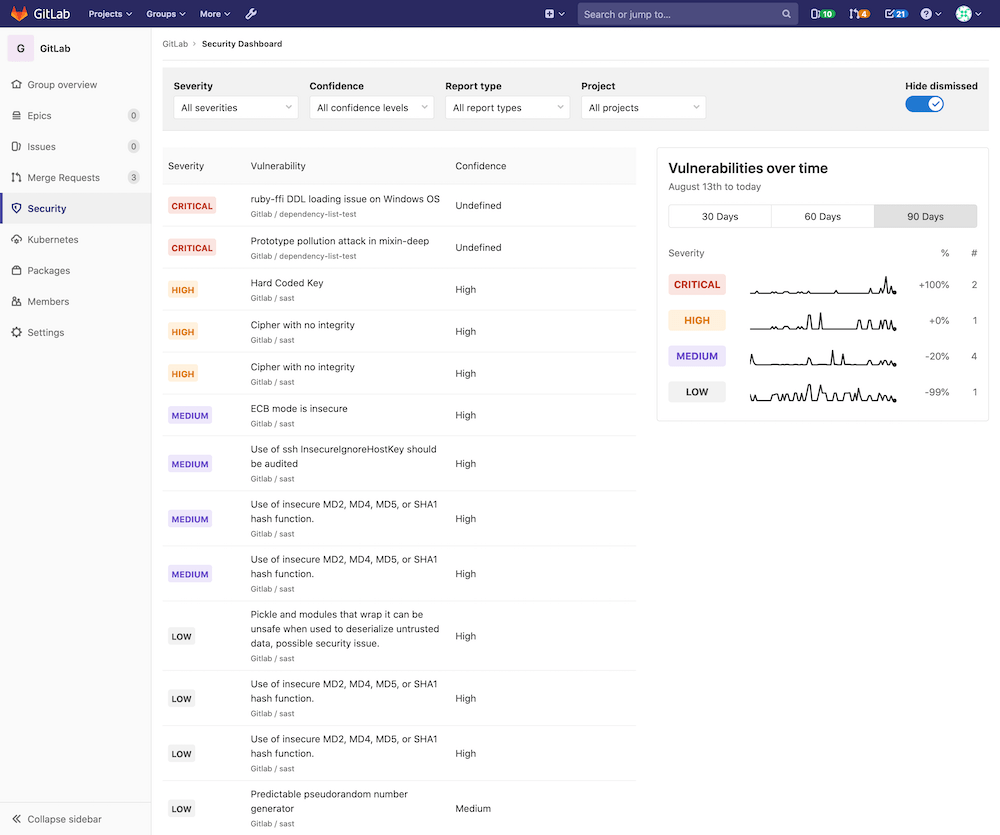

# GitLab Security Dashboard **(ULTIMATE)**

The Security Dashboard is a good place to get an overview of all the security
vulnerabilities in your groups, projects and pipelines.

You can also drill down into a vulnerability and get extra information, see which
project it comes from, the file it's in, and various metadata to help you analyze
the risk. You can also action these vulnerabilities by creating an issue for them,
or by dismissing them.

To benefit from the Security Dashboard you must first configure one of the
[security reports](../index.md).

## Supported reports

The Security Dashboard supports the following reports:

- [Container Scanning](../container_scanning/index.md)
- [Dynamic Application Security Testing](../dast/index.md)
- [Dependency Scanning](../dependency_scanning/index.md)
- [Static Application Security Testing](../sast/index.md)

## Requirements

To use the group, project or pipeline security dashboard:

1. At least one project inside a group must be configured with at least one of
   the [supported reports](#supported-reports).
1. The configured jobs must use the [new `reports` syntax](../../../ci/yaml/README.md#artifactsreports).
1. [GitLab Runner](https://docs.gitlab.com/runner/) 11.5 or newer must be used.
   If you're using the shared Runners on GitLab.com, this is already the case.

## Pipeline Security Dashboard

> [Introduced](https://gitlab.com/gitlab-org/gitlab/issues/13496) in [GitLab Ultimate](https://about.gitlab.com/pricing/) 12.3.

At the pipeline level, the Security Dashboard displays the vulnerabilities present in the branch of the project the pipeline was run against.

Visit the page for any pipeline which has run any of the [supported reports](#supported-reports). Click the **Security** tab to view the Security Dashboard.

## Project Security Dashboard

> [Introduced](https://gitlab.com/gitlab-org/gitlab/issues/6165) in [GitLab Ultimate](https://about.gitlab.com/pricing/) 11.1.

At the project level, the Security Dashboard displays the latest security reports
for your project. Use it to find and fix vulnerabilities affecting the
[default branch](../../project/repository/branches/index.md#default-branch).

## Group Security Dashboard

> [Introduced](https://gitlab.com/gitlab-org/gitlab/issues/6709) in [GitLab Ultimate](https://about.gitlab.com/pricing/) 11.5.

The group Security Dashboard gives an overview of the vulnerabilities of all the
projects in a group and its subgroups.

First, navigate to the Security Dashboard found under your group's
**Security** tab.

Once you're on the dashboard, at the top you should see a series of filters for:

- Severity
- Confidence
- Report type
- Project

To the right of the filters, you should see a **Hide dismissed** toggle button ([available for GitLab.com Gold, planned for GitLab Ultimate 12.6](https://gitlab.com/gitlab-org/gitlab/issues/9102)).

NOTE: **Note:**
The dashboard only shows projects with [security reports](#supported-reports) enabled in a group.

Selecting one or more filters will filter the results in this page. Disabling the **Hide dismissed**
toggle button will let you also see vulnerabilities that have been dismissed.

The main section is a list of all the vulnerabilities in the group, sorted by severity.
In that list, you can see the severity of the vulnerability, its name, its
confidence (likelihood of the vulnerability to be a positive one), and the project
it's from.

If you hover over a row, there will appear some actions you can take:

- "More info"
- "Create issue"
- "Dismiss vulnerability"

Next to the list is a timeline chart that shows how many open
vulnerabilities your projects had at various points in time. You can filter among 30, 60, and
90 days, with the default being 90. Hover over the chart to get more details about
the open vulnerabilities at a specific time.

Read more on how to [interact with the vulnerabilities](../index.md#interacting-with-the-vulnerabilities).

## Keeping the dashboards up to date

The Security Dashboard displays information from the results of the most recent
security scan on the [default branch](../../project/repository/branches/index.md#default-branch),
which means that security scans are performed every time the branch is updated.

If the default branch is updated infrequently, scans are run infrequently and the
information on the Security Dashboard can become outdated as new vulnerabilities
are discovered.

To ensure the information on the Security Dashboard is regularly updated,
[configure a scheduled pipeline](../../project/pipelines/schedules.md) to run a
daily security scan. This will update the information displayed on the Security
Dashboard regardless of how often the default branch is updated.

That way, reports are created even if no code change happens.

## Security scans using Auto DevOps

When using [Auto DevOps](../../../topics/autodevops/index.md), use
[special environment variables](../../../topics/autodevops/index.md#environment-variables)
to configure daily security scans.

<!-- ## Troubleshooting

Include any troubleshooting steps that you can foresee. If you know beforehand what issues
one might have when setting this up, or when something is changed, or on upgrading, it's
important to describe those, too. Think of things that may go wrong and include them here.
This is important to minimize requests for support, and to avoid doc comments with
questions that you know someone might ask.

Each scenario can be a third-level heading, e.g. `### Getting error message X`.
If you have none to add when creating a doc, leave this section in place
but commented out to help encourage others to add to it in the future. -->
