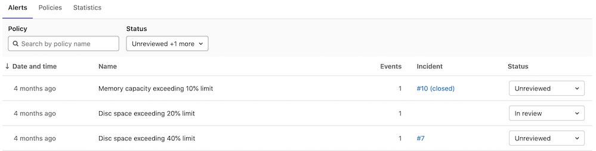

# Threat Monitoring **(ULTIMATE)**

> [Introduced](https://gitlab.com/gitlab-org/gitlab/-/issues/14707) in [GitLab Ultimate](https://about.gitlab.com/pricing/) 12.9.

The **Threat Monitoring** page provides metrics and policy management
for the GitLab application runtime security features. You can access
these by navigating to your project's **Security & Compliance > Threat
Monitoring** page.

GitLab supports statistics for the following security features:

- [Container Network Policies](../../../topics/autodevops/stages.md#network-policy)

## Container Network Policy

> [Introduced](https://gitlab.com/gitlab-org/gitlab/-/issues/32365) in [GitLab Ultimate](https://about.gitlab.com/pricing/) 12.9.

The **Container Network Policy** section provides packet flow metrics for
your application's Kubernetes namespace. This section has the following
prerequisites:

- Your project contains at least one [environment](../../../ci/environments/index.md)
- You've [installed Cilium](../../project/clusters/protect/container_network_security/quick_start_guide.md#use-the-cluster-management-template-to-install-cilium)
- You've configured the [Prometheus service](../../project/integrations/prometheus.md#enabling-prometheus-integration)

If you're using custom Helm values for Cilium, you must enable Hubble
with flow metrics for each namespace by adding the following lines to
your [Cilium values](../../project/clusters/protect/container_network_security/quick_start_guide.md#use-the-cluster-management-template-to-install-cilium):

```yaml
hubble:
  enabled: true
  metrics:
    enabled:
      - 'flow:sourceContext=namespace;destinationContext=namespace'
```

The **Container Network Policy** section displays the following information
about your packet flow:

- The total amount of the inbound and outbound packets
- The proportion of packets dropped according to the configured
  policies
- The per-second average rate of the forwarded and dropped packets
  accumulated over time window for the requested time interval

If a significant percentage of packets is dropped, you should
investigate it for potential threats by
examining the Cilium logs:

```shell
kubectl -n gitlab-managed-apps logs -l k8s-app=cilium -c cilium-monitor
```

## Container Network Policy management

> [Introduced](https://gitlab.com/groups/gitlab-org/-/epics/3328) in [GitLab Ultimate](https://about.gitlab.com/pricing/) 13.1.

The **Threat Monitoring** page's **Policy** tab displays deployed
network policies for all available environments. You can check a
network policy's `yaml` manifest, its enforcement
status, and create and edit deployed policies. This section has the
following prerequisites:

- Your project contains at least one [environment](../../../ci/environments/index.md)
- You've [installed Cilium](../../project/clusters/protect/container_network_security/quick_start_guide.md#use-the-cluster-management-template-to-install-cilium)

Network policies are fetched directly from the selected environment's
deployment platform. Changes performed outside of this tab are
reflected upon refresh.

By default, the network policy list contains predefined policies in a
disabled state. Once enabled, a predefined policy deploys to the
selected environment's deployment platform and you can manage it like
the regular policies.

Note that if you're using [Auto DevOps](../../../topics/autodevops/index.md)
and change a policy in this section, your `auto-deploy-values.yaml` file doesn't update. Auto DevOps
users must make changes by following the
[Container Network Policy documentation](../../../topics/autodevops/stages.md#network-policy).

### Changing enforcement status

To change a network policy's enforcement status:

- Click the network policy you want to update.
- Click the **Edit policy** button.
- Click the **Policy status** toggle to update the selected policy.
- Click the **Save changes** button to deploy network policy changes.

Disabled network policies have the `network-policy.gitlab.com/disabled_by: gitlab` selector inside
the `podSelector` block. This narrows the scope of such a policy and as a result it doesn't affect
any pods. The policy itself is still deployed to the corresponding deployment namespace.

### Container Network Policy editor

> [Introduced](https://gitlab.com/groups/gitlab-org/-/epics/3403) in [GitLab Ultimate](https://about.gitlab.com/pricing/) 13.4.

You can use the policy editor to create, edit, and delete policies.

- To create a new policy, click the **New policy** button located in the **Policy** tab's header.
- To edit an existing policy, click **Edit policy** in the selected policy drawer.

The policy editor only supports the [CiliumNetworkPolicy](https://docs.cilium.io/en/v1.8/policy/)
specification. Regular Kubernetes [NetworkPolicy](https://kubernetes.io/docs/reference/generated/kubernetes-api/v1.19/#networkpolicy-v1-networking-k8s-io)
resources aren't supported.

The policy editor has two modes:

- The visual _Rule_ mode allows you to construct and preview policy
  rules using rule blocks and related controls.
- YAML mode allows you to enter a policy definition in `.yaml` format
  and is aimed at expert users and cases that the Rule mode doesn't
  support.

You can use both modes interchangeably and switch between them at any
time. If a YAML resource is incorrect, Rule mode is automatically
disabled. You must use YAML mode to fix your policy before Rule mode
is available again.

Rule mode supports the following rule types:

- [Labels](https://docs.cilium.io/en/v1.8/policy/language/#labels-based).
- [Entities](https://docs.cilium.io/en/v1.8/policy/language/#entities-based).
- [IP/CIDR](https://docs.cilium.io/en/v1.8/policy/language/#ip-cidr-based). Only
  the `toCIDR` block without `except` is supported.
- [DNS](https://docs.cilium.io/en/v1.8/policy/language/#dns-based).
- [Level 4](https://docs.cilium.io/en/v1.8/policy/language/#layer-4-examples)
  can be added to all other rules.

Once your policy is complete, save it by pressing the **Save policy**
button at the bottom of the editor. Existing policies can also be
removed from the editor interface by clicking the **Delete policy**
button at the bottom of the editor.

### Configuring Network Policy Alerts

> - [Introduced](https://gitlab.com/groups/gitlab-org/-/epics/3438) and [enabled by default](https://gitlab.com/gitlab-org/gitlab/-/issues/287676) in [GitLab Ultimate](https://about.gitlab.com/pricing/) 13.9.
> - The feature flag was removed and the Threat Monitoring Alerts Project was [made generally available](https://gitlab.com/gitlab-org/gitlab/-/issues/287676) in GitLab 14.0.

You can use policy alerts to track your policy's impact. Alerts are only available if you've
[installed](../../clusters/agent/repository.md)
and [configured](../../clusters/agent/index.md#create-an-agent-record-in-gitlab)
a Kubernetes Agent for this project.

There are two ways to create policy alerts:

- In the [policy editor UI](#container-network-policy-editor),
  by clicking **Add alert**.
- In the policy editor's YAML mode, through the `metadata.annotations` property:

  ```yaml
  metadata:
    annotations:
      app.gitlab.com/alert: 'true'
  ```

Once added, the UI updates and displays a warning about the dangers of too many alerts.

### Container Network Policy Alert list

> [Introduced](https://gitlab.com/groups/gitlab-org/-/epics/3438) in [GitLab Ultimate](https://about.gitlab.com/pricing/) 13.9.

The policy alert list displays your policy's alert activity. You can sort the list by these columns:

- Date and time
- Events
- Status

You can filter the list with the **Policy Name** filter and the **Status** filter at the top. Use
the selector menu in the **Status** column to set the status for each alert:

- Unreviewed
- In review
- Resolved
- Dismissed

By default, the list doesn't display resolved or dismissed alerts.



Clicking an alert's row opens the alert drawer, which shows more information about the alert. A user
can also create an incident from the alert and update the alert status in the alert drawer.

Clicking an alert's name takes the user to the [alert details page](../../../operations/incident_management/alerts.md#alert-details-page).

For information on work in progress for the alerts dashboard, see [this epic](https://gitlab.com/groups/gitlab-org/-/epics/5041).
