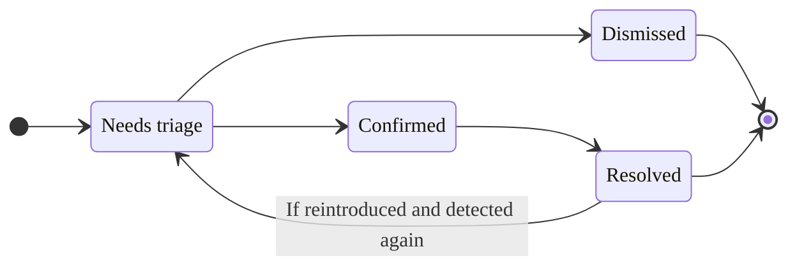
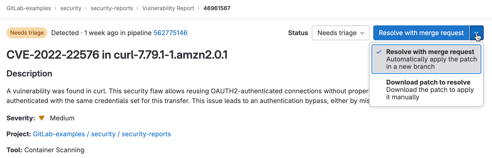

DETAILS:
**Tier:** Ultimate
**Offering:** GitLab.com, GitLab Self-Managed, GitLab Dedicated

Each vulnerability in a project has a vulnerability page containing details of the vulnerability,
including:

- Description
- When it was detected
- Current status
- Available actions
- Linked issues
- Actions log
- Filename and line number of the vulnerability (if available)
- Severity

For vulnerabilities in the [Common Vulnerabilities and Exposures (CVE)](https://www.cve.org/)
catalog you can also retrieve the following by using the GraphQL API:

- EPSS score
- KEV status

For details on how to retrieve this additional data, see [vulnerability risk assessment data](risk_assessment_data.md).

If the scanner determined the vulnerability to be a false positive, an alert message is included at
the top of the vulnerability's page.

## Explaining a vulnerability

DETAILS:
**Tier:** Ultimate with GitLab Duo Enterprise - [Start a trial](https://about.gitlab.com/solutions/gitlab-duo-pro/sales/?type=free-trial)
**Offering:** GitLab.com, GitLab Self-Managed, GitLab Dedicated
**LLM:** Anthropic [Claude 3 Haiku](https://docs.anthropic.com/en/docs/about-claude/models#claude-3-a-new-generation-of-ai)

> - [Introduced](https://gitlab.com/groups/gitlab-org/-/epics/10368) in GitLab 16.0 as an [experiment](../../../policy/development_stages_support.md#experiment) on GitLab.com.
> - Promoted to [beta](../../../policy/development_stages_support.md#beta) status in GitLab 16.2.
> - [Generally available](https://gitlab.com/groups/gitlab-org/-/epics/10642) in GitLab 17.2.
> - Changed to require GitLab Duo add-on in GitLab 17.6 and later.

GitLab can help you with a vulnerability by using a large language model to:

- Summarize the vulnerability.
- Help developers and security analysts to understand the vulnerability, how it could be exploited, and how to fix it.
- Provide a suggested mitigation.

### Vulnerability Explanation

Explain a vulnerability with GitLab Duo Vulnerability Explanation. Use the explanation to better
understand a vulnerability and its possible mitigation.

Prerequisites:

- You must have the GitLab Ultimate subscription tier.
- Have a paid GitLab Duo Enterprise seat.
- [GitLab Duo](../../ai_features_enable.md) must be enabled for the group or instance.
- You must be a member of the project.
- The vulnerability must be from a SAST scanner.

To explain the vulnerability:

1. On the left sidebar, select **Search or go to** and find your project.
1. Select **Secure > Vulnerability report**.
1. Optional. To remove the default filters, select **Clear** (**{clear}**).
1. Above the list of vulnerabilities, select the filter bar.
1. In the dropdown list that appears, select **Tool**, then select all the values in the **SAST** category.
1. Select outside the filter field. The vulnerability severity totals and list of matching vulnerabilities are updated.
1. Select the SAST vulnerability you want explained.
1. Do one of the following:

   - Select the text below the vulnerability description that reads _You can also use AI by asking GitLab Duo Chat to explain this vulnerability and a suggested fix._
   - In the upper right, from the **Resolve with merge request** dropdown list, select **Explain vulnerability**, then select **Explain vulnerability**.
   - Open GitLab Duo Chat and use the [explain a vulnerability](../../gitlab_duo_chat/examples.md#explain-a-vulnerability) command by typing `/vulnerability_explain`.

The response is shown on the right side of the page.

On GitLab.com this feature is available. By default, it is powered by the Anthropic [`claude-3-haiku`](https://docs.anthropic.com/en/docs/about-claude/models#claude-3-a-new-generation-of-ai)
model. We cannot guarantee that the large language model produces results that are correct. Use the
explanation with caution.

### Data shared with third-party AI APIs for Vulnerability Explanation

The following data is shared with third-party AI APIs:

- Vulnerability title (which might contain the filename, depending on which scanner is used).
- Vulnerability identifiers.
- Filename.

## Vulnerability Resolution

DETAILS:
**Tier:** Ultimate with GitLab Duo Enterprise - [Start a trial](https://about.gitlab.com/solutions/gitlab-duo-pro/sales/?type=free-trial)
**Offering:** GitLab.com, GitLab Self-Managed, GitLab Dedicated
**LLM:** Anthropic [Claude 3.5 Sonnet](https://console.cloud.google.com/vertex-ai/publishers/anthropic/model-garden/claude-3-5-sonnet)

> - [Introduced](https://gitlab.com/groups/gitlab-org/-/epics/10779) in GitLab 16.7 as an [experiment](../../../policy/development_stages_support.md#experiment) on GitLab.com.
> - Changed to beta in GitLab 17.3.
> - Changed to require GitLab Duo add-on in GitLab 17.6 and later.

Use GitLab Duo Vulnerability resolution to automatically create a merge request that
resolves the vulnerability. By default, it is powered by the Anthropic [`claude-3.5-sonnet`](https://console.cloud.google.com/vertex-ai/publishers/anthropic/model-garden/claude-3-5-sonnet) model.

We can't guarantee that the large language model produces correct results.
You should always review the proposed change before merging it. When reviewing, check that:

- Your application's existing functionality is preserved.
- The vulnerability is resolved in accordance with your organization's standards.

Prerequisites:

- You must have the GitLab Ultimate subscription tier and GitLab Duo Enterprise.
- You must be a member of the project.
- The vulnerability must be a SAST finding from a supported analyzer:
  - Any [GitLab-supported analyzer](../sast/analyzers.md).
  - A properly integrated [third-party SAST scanner](../../../development/integrations/secure.md) that reports the [vulnerability location](../../../development/integrations/secure.md#sast) and a [CWE Identifier](../../../development/integrations/secure.md#identifiers) for each vulnerability.
- The vulnerability must be of a [supported type](#supported-vulnerabilities-for-vulnerability-resolution).

Learn more about [how to enable all GitLab Duo features](../../ai_features_enable.md).

To resolve the vulnerability:

1. On the left sidebar, select **Search or go to** and find your project.
1. Select **Secure > Vulnerability report**.
1. Optional. To remove the default filters, select **Clear** (**{clear}**).
1. Above the list of vulnerabilities, select the filter bar.
1. In the dropdown list that appears, select **Activity**, then select **Vulnerability Resolution available** in the **GitLab Duo (AI)** category.
1. Select outside the filter field. The vulnerability severity totals and list of matching vulnerabilities are updated.
1. Select the SAST vulnerability you want resolved.
   - A blue icon is shown next to vulnerabilities that support Vulnerability Resolution.
1. In the upper-right corner, select **Resolve with AI**. If this project is a public project be aware that creating an MR will publicly expose the vulnerability and offered resolution. To create the MR privately, please [create a private fork](../../project/merge_requests/confidential.md), and repeat this process.
1. Add an additional commit to the MR. This forces a new pipeline to run.
1. After the pipeline is complete, on the [pipeline security tab](../vulnerability_report/pipeline.md#view-vulnerabilities-in-a-pipeline), confirm that the vulnerability no longer appears.
1. On the vulnerability report, [manually update the vulnerability](../vulnerability_report/_index.md#change-status-of-vulnerabilities).

A merge request containing the AI remediation suggestions is opened. Review the suggested changes,
then process the merge request according to your standard workflow.

Provide feedback on this feature in [issue 476553](https://gitlab.com/gitlab-org/gitlab/-/issues/476553).

### Supported vulnerabilities for Vulnerability Resolution

To ensure that suggested resolutions are high-quality, Vulnerability Resolution is available for a specific set of vulnerabilities.
The system decides whether to offer Vulnerability Resolution based on the vulnerability's Common Weakness Enumeration (CWE) identifier.

We selected the current set of vulnerabilities based on testing by automated systems and security experts.
We are actively working to expand coverage to more types of vulnerabilities.

<details><summary style="color:#5943b6; margin-top: 1em;"><a>View the complete list of supported CWEs for Vulnerability Resolution</a></summary>

<ul>
  <li>CWE-23: Relative Path Traversal</li>
  <li>CWE-73: External Control of File Name or Path</li>
  <li>CWE-80: Improper Neutralization of Script-Related HTML Tags in a Web Page (Basic XSS)</li>
  <li>CWE-116: Improper Encoding or Escaping of Output</li>
  <li>CWE-118: Incorrect Access of Indexable Resource ('Range Error')</li>
  <li>CWE-119: Improper Restriction of Operations within the Bounds of a Memory Buffer</li>
  <li>CWE-120: Buffer Copy without Checking Size of Input ('Classic Buffer Overflow')</li>
  <li>CWE-126: Buffer Over-read</li>
  <li>CWE-190: Integer Overflow or Wraparound</li>
  <li>CWE-200: Exposure of Sensitive Information to an Unauthorized Actor</li>
  <li>CWE-208: Observable Timing Discrepancy</li>
  <li>CWE-209: Generation of Error Message Containing Sensitive Information</li>
  <li>CWE-272: Least Privilege Violation</li>
  <li>CWE-287: Improper Authentication</li>
  <li>CWE-295: Improper Certificate Validation</li>
  <li>CWE-297: Improper Validation of Certificate with Host Mismatch</li>
  <li>CWE-305: Authentication Bypass by Primary Weakness</li>
  <li>CWE-310: Cryptographic Issues</li>
  <li>CWE-311: Missing Encryption of Sensitive Data</li>
  <li>CWE-323: Reusing a Nonce, Key Pair in Encryption</li>
  <li>CWE-327: Use of a Broken or Risky Cryptographic Algorithm</li>
  <li>CWE-328: Use of Weak Hash</li>
  <li>CWE-330: Use of Insufficiently Random Values</li>
  <li>CWE-338: Use of Cryptographically Weak Pseudo-Random Number Generator (PRNG)</li>
  <li>CWE-345: Insufficient Verification of Data Authenticity</li>
  <li>CWE-346: Origin Validation Error</li>
  <li>CWE-352: Cross-Site Request Forgery</li>
  <li>CWE-362: Concurrent Execution using Shared Resource with Improper Synchronization ('Race Condition')</li>
  <li>CWE-369: Divide By Zero</li>
  <li>CWE-377: Insecure Temporary File</li>
  <li>CWE-378: Creation of Temporary File With Insecure Permissions</li>
  <li>CWE-400: Uncontrolled Resource Consumption</li>
  <li>CWE-489: Active Debug Code</li>
  <li>CWE-521: Weak Password Requirements</li>
  <li>CWE-539: Use of Persistent Cookies Containing Sensitive Information</li>
  <li>CWE-599: Missing Validation of OpenSSL Certificate</li>
  <li>CWE-611: Improper Restriction of XML External Entity Reference</li>
  <li>CWE-676: Use of potentially dangerous function</li>
  <li>CWE-704: Incorrect Type Conversion or Cast</li>
  <li>CWE-754: Improper Check for Unusual or Exceptional Conditions</li>
  <li>CWE-770: Allocation of Resources Without Limits or Throttling</li>
  <li>CWE-1004: Sensitive Cookie Without 'HttpOnly' Flag</li>
  <li>CWE-1275: Sensitive Cookie with Improper SameSite Attribute</li>
</ul>
</details>

### Troubleshooting

Vulnerability Resolution sometimes cannot generate a suggested fix. Common causes include:

- **False positive detected:** Before proposing a fix, the AI model assesses whether the vulnerability is valid. It may judge that the vulnerability is not a true vulnerability, or isn't worth fixing.
  - This can happen if the vulnerability occurs in test code. Your organization might still choose to fix vulnerabilities even if they happen in test code, but models sometimes assess these to be false positives.
  - If you agree that the vulnerability is a false-positive or is not worth fixing, you should [dismiss the vulnerability](#vulnerability-status-values) and [select a matching reason](#vulnerability-dismissal-reasons).
    - To customize your SAST configuration or report a problem with a GitLab SAST rule, see [SAST rules](../sast/rules.md).
- **Temporary or unexpected error:** The error message may state that "an unexpected error has occurred", "the upstream AI provider request timed out", "something went wrong", or a similar cause.
  - These errors may be caused by temporary problems with the AI provider or with GitLab Duo.
  - A new request may succeed, so you can try to resolve the vulnerability again.
  - If you continue to see these errors, contact GitLab for assistance.

### Data shared with third-party AI APIs for Vulnerability Resolution

The following data is shared with third-party AI APIs:

- Vulnerability name
- Vulnerability description
- Identifiers (CWE, OWASP)
- Entire file that contains the vulnerable lines of code
- Vulnerable lines of code (line numbers)

## Vulnerability Resolution in a merge request

DETAILS:
**Tier:** Ultimate with GitLab Duo Enterprise - [Start a trial](https://about.gitlab.com/solutions/gitlab-duo-pro/sales/?type=free-trial)
**Offering:** GitLab.com, GitLab Self-Managed, GitLab Dedicated

> [Introduced](https://gitlab.com/groups/gitlab-org/-/epics/14862) in GitLab 17.6 with a flag named [`resolve_vulnerability_in_mr`](https://gitlab.com/gitlab-org/gitlab/-/issues/482753). Disabled by default.
> [Enabled by default](https://gitlab.com/gitlab-org/gitlab/-/merge_requests/175150) in GitLab 17.7.

Use GitLab Duo Vulnerability resolution to automatically create a merge request suggestion comment that
resolves the vulnerability finding. By default, it is powered by the Anthropic [`claude-3.5-sonnet`](https://console.cloud.google.com/vertex-ai/publishers/anthropic/model-garden/claude-3-5-sonnet) model.

To resolve the vulnerability finding:

1. On the left sidebar, select **Search or go to** and find your project.
1. Select **Merge requests**.
1. Select a merge request.
   - Vulnerability findings supported by Vulnerability Resolution are indicated by the tanuki AI icon (**{tanuki-ai}**).
1. Select the supported findings to open the security finding dialog.
1. In the lower-right corner, select **Resolve with AI**.

A comment containing the AI remediation suggestions is opened in the merge request. Review the suggested changes, then apply the merge request suggestion according to your standard workflow.

Provide feedback on this feature in [issue 476553](https://gitlab.com/gitlab-org/gitlab/-/issues/476553).

### Troubleshooting

Vulnerability Resolution in a merge request sometimes cannot generate a suggested fix. Common causes include:

- **False positive detected:** Before proposing a fix, the AI model assesses whether the vulnerability is valid. It may judge that the vulnerability is not a true vulnerability, or isn't worth fixing.
  - This can happen if the vulnerability occurs in test code. Your organization might still choose to fix vulnerabilities even if they happen in test code, but models sometimes assess these to be false positives.
  - If you agree that the vulnerability is a false-positive or is not worth fixing, you should [dismiss the vulnerability](#vulnerability-status-values) and [select a matching reason](#vulnerability-dismissal-reasons).
    - To customize your SAST configuration or report a problem with a GitLab SAST rule, see [SAST rules](../sast/rules.md).
- **Temporary or unexpected error:** The error message may state that "an unexpected error has occurred", "the upstream AI provider request timed out", "something went wrong", or a similar cause.
  - These errors may be caused by temporary problems with the AI provider or with GitLab Duo.
  - A new request may succeed, so you can try to resolve the vulnerability again.
  - If you continue to see these errors, contact GitLab for assistance.
- **Resolution target could not be found in the merge request, unable to create suggestion:**
  - This error may occur when the target branch has not run a full security scan pipeline. See the [merge request documentation](../detect/security_scan_results.md#merge-request).

## Vulnerability code flow

DETAILS:
**Tier:** Ultimate
**Offering:** GitLab.com, GitLab Self-Managed, GitLab Dedicated

For specific types of vulnerabilities, GitLab Advanced SAST provides [code flow](../sast/gitlab_advanced_sast.md#vulnerability-code-flow) information.
A vulnerability's code flow is the path the data takes from the user input (source) to the vulnerable line of code (sink), through all assignments, manipulation, and sanitization.

For details on how to view a vulnerability's code flow, see
[Vulnerability code flow](../sast/gitlab_advanced_sast.md#vulnerability-code-flow).


## Vulnerability status values

A vulnerability's status can be:

- **Needs triage**: The default state for a newly discovered vulnerability.
- **Confirmed**: A user has seen this vulnerability and confirmed it to be accurate.
- **Dismissed**: A user has evaluated this vulnerability and [dismissed it](#vulnerability-dismissal-reasons).
  Dismissed vulnerabilities are ignored if detected in subsequent scans.
- **Resolved**: The vulnerability has been fixed or is no longer present. If a resolved
  vulnerability is reintroduced and detected again, its record is reinstated and its status set to
  **Needs triage**.

A vulnerability typically goes through the following lifecycle:



## Vulnerability is no longer detected

> - A link to the commit that resolved the vulnerability was [introduced](https://gitlab.com/gitlab-org/gitlab/-/issues/372799) and made [generally available on GitLab Self-Managed and GitLab Dedicated](https://gitlab.com/gitlab-org/gitlab/-/merge_requests/178748) in GitLab 17.9. Feature flag `vulnerability_representation_information` removed.

A vulnerability may be no longer detected because of changes made deliberately to remediate it or
as a side effect of other changes. When a security scan runs and a vulnerability is no longer
detected in the default branch, the scanner adds **No longer detected** to the record's activity log
but the record's status does not change. Instead you should check and confirm the
vulnerability has been resolved and if so,
[manually change its status to **Resolved**](#change-the-status-of-a-vulnerability). You can also
use a [vulnerability management policy](../policies/vulnerability_management_policy.md) to
automatically change the status of vulnerabilities matching specific criteria to **Resolved**.

You can find a link to the commit that resolved the vulnerability at the top or bottom of the vulnerability page.

## Vulnerability dismissal reasons

> - [Introduced](https://gitlab.com/groups/gitlab-org/-/epics/4942) in GitLab 15.11 [with a flag](../../../administration/feature_flags.md) named `dismissal_reason`.
> - [Enabled on GitLab Self-Managed and GitLab Dedicated](https://gitlab.com/gitlab-org/gitlab/-/issues/393005) in GitLab 16.0.
> - [Generally available](https://gitlab.com/gitlab-org/gitlab/-/merge_requests/124397) in GitLab 16.2. Feature flag `dismissal_reason` removed.

When you dismiss a vulnerability you must choose one of the following reasons:

- **Acceptable risk**: The vulnerability is known, and has not been remediated or mitigated, but is
  considered to be an acceptable business risk.
- **False positive**: An error in reporting in which a test result incorrectly indicates the
  presence of a vulnerability in a system when the vulnerability is not present.
- **Mitigating control**: The vulnerability's risk is mitigated by a management, operational, or
  technical control (that is, safeguard or countermeasure) employed by an organization that provides
  equivalent or comparable protection for an information system.
- **Used in tests**: The finding is not a vulnerability because it is part of a test or is test
  data.
- **Not applicable**: The vulnerability is known, and has not been remediated or mitigated, but is
  considered to be in a part of the application that will not be updated.

## Change the status of a vulnerability

> - The permission allowing users with the `Developer` role to change the status of a vulnerability (`admin_vulnerability`) was [deprecated](https://gitlab.com/gitlab-org/gitlab/-/issues/424133) in GitLab 16.4 and [removed](https://gitlab.com/gitlab-org/gitlab/-/issues/412693) in GitLab 17.0.
> - The **Comment** text box was [added](https://gitlab.com/gitlab-org/gitlab/-/issues/451480) in GitLab 17.9.

Prerequisites:

- You must have at least the Maintainer role for the project, or a custom role with the
  `admin_vulnerability` permission.

To change a vulnerability's status from its Vulnerability Page:

1. On the left sidebar, select **Search or go to** and find your project.
1. Select **Secure > Vulnerability report**.
1. Select the vulnerability's description.
1. Select **Change status**.
1. From the **Status** dropdown list, select a status or a [dismissal reason](#vulnerability-dismissal-reasons)
   when you want to change the vulnerability's status to **Dismissed**.
1. In the **Comment** text box, provide a comment with more details about the reasons for dismissal. When you apply the **Dismissed** status, a comment is required.

Details of the status change, including who made the change and when, are recorded in the
vulnerability's action log.

## Create a GitLab issue for a vulnerability

You can create a GitLab issue to track any action taken to resolve or mitigate a vulnerability.
To create a GitLab issue for a vulnerability:

1. On the left sidebar, select **Search or go to** and find your project.
1. Select **Secure > Vulnerability report**.
1. Select the vulnerability's description.
1. Select **Create issue**.

The issue is created in the GitLab project with information from the vulnerability report.

To create a Jira issue, see [Create a Jira issue for a vulnerability](../../../integration/jira/configure.md#create-a-jira-issue-for-a-vulnerability).

## Linking a vulnerability to GitLab and Jira issues

You can link a vulnerability to one or more existing [GitLab](#create-a-gitlab-issue-for-a-vulnerability)
or [Jira](../../../integration/jira/configure.md#create-a-jira-issue-for-a-vulnerability) issues. Only one linking feature is available at the same time.
Adding a link helps track the issue that resolves or mitigates a vulnerability.

### Link a vulnerability to existing GitLab issues

Prerequisites:

- [Jira issues integration](../../../integration/jira/configure.md) must not be enabled.

To link a vulnerability to existing GitLab issues:

1. On the left sidebar, select **Search or go to** and find your project.
1. Select **Secure > Vulnerability report**.
1. Select the vulnerability's description.
1. In the **Linked issues** section, select the plus icon (**{plus}**).
1. For each issue to be linked, either:
   - Paste a link to the issue.
   - Enter the issue's ID (prefixed with a hash `#`).
1. Select **Add**.

The selected GitLab issues are added to the **Linked items** section, and the linked issues counter is
updated.

GitLab issues linked to a vulnerability are shown in the Vulnerability Report and the vulnerability's page.

Be aware of the following conditions between a vulnerability and a linked GitLab issue:

- The vulnerability page shows related issues, but the issue page doesn't show the vulnerability
  it's related to.
- An issue can only be related to one vulnerability at a time.
- Issues can be linked across groups and projects.

### Link a vulnerability to existing Jira issues

Prerequisites:

- Ensure the Jira issues integration is [configured](../../../integration/jira/configure.md#configure-the-integration)
  and the **Create Jira issues for vulnerabilities** checkbox is selected.

To link a vulnerability to existing Jira issues, add the following line to the Jira issue's description:

```plaintext
/-/security/vulnerabilities/<id>
```

`<id>` is any [vulnerability ID](../../../api/vulnerabilities.md#single-vulnerability).
You can add several lines with different IDs to one description.

Jira issues with appropriate description are added to the **Related Jira issues** section, and the linked issues counter is
updated.

Jira issues linked to a vulnerability are shown only on the vulnerability page.

Be aware of the following conditions between a vulnerability and a linked Jira issue:

- The vulnerability page and the issue page show the vulnerability they are related to.
- An issue can be related to one or more vulnerabilities at the same time.

## Resolve a vulnerability

For some vulnerabilities a solution is already known but needs to be implemented manually. The
**Solution** field in the Vulnerability page is provided by the security scanning tool that
reported the security finding, or entered during the [manual creation of a vulnerability](../vulnerability_report/_index.md#manually-add-a-vulnerability).
The GitLab tools utilize information from the [GitLab Advisory Database](../gitlab_advisory_database/_index.md).

Additionally, some tools may include a software patch to apply the suggested solution. In those instances,
a vulnerability's page includes a **Resolve with merge request** option.

The following scanners are supported by this feature:

- [Dependency Scanning](../dependency_scanning/_index.md).
  Automatic patch creation is only available for Node.js projects managed with
  `yarn`. Also, Automatic patch creation is only supported when [FIPS mode](../../../development/fips_gitlab.md#enable-fips-mode) is disabled.
- [Container Scanning](../container_scanning/_index.md).

To resolve a vulnerability, you can either:

- [Resolve a vulnerability with a merge request](#resolve-a-vulnerability-with-a-merge-request).
- [Resolve a vulnerability manually](#resolve-a-vulnerability-manually).



### Resolve a vulnerability with a merge request

To resolve the vulnerability with a merge request:

1. On the left sidebar, select **Search or go to** and find your project.
1. Select **Secure > Vulnerability report**.
1. Select the vulnerability's description.
1. From the **Resolve with merge request** dropdown list, select **Resolve with merge request**.

A merge request is created which applies the patch required to resolve the vulnerability.
Process the merge request according to your standard workflow.

### Resolve a vulnerability manually

To manually apply the patch that GitLab generated for a vulnerability:

1. On the left sidebar, select **Search or go to** and find your project.
1. Select **Secure > Vulnerability report**.
1. Select the vulnerability's description.
1. From the **Resolve with merge request** dropdown list, select **Download patch to resolve**.
1. Ensure your local project has the same commit checked out that was used to generate the patch.
1. Run `git apply remediation.patch`.
1. Verify and commit the changes to your branch.
1. Create a merge request to apply the changes to your main branch.
1. Process the merge request according to your standard workflow.

## Enable security training for vulnerabilities

NOTE:
Security training is not accessible in an environment that is offline, meaning computers that are isolated from the public internet as a security measure. Specifically, the GitLab server needs the ability to query the API endpoints for any training provider you choose to enable. Some third-party training vendors may require you to sign up for a _free_ account. Sign up for an account by going to
any of [Secure Code Warrior](https://www.securecodewarrior.com/), [Kontra](https://application.security/), or [SecureFlag](https://www.secureflag.com/index.html).
GitLab does not send any user information to these third-party vendors; we do send the CWE or OWASP identifier and the language name of the file extension.

Security training helps your developers learn how to fix vulnerabilities. Developers can view security training from selected educational providers, relevant to the detected vulnerability.

To enable security training for vulnerabilities in your project:

1. On the left sidebar, select **Search or go to** and find your project.
1. Select **Secure > Security configuration**.
1. On the tab bar, select **Vulnerability Management**.
1. To enable a security training provider, turn on the toggle.

Each integration submits the Vulnerability identifier, for example CWE or OWASP, and the language to the security training vendor. The resulting link to the vendor training is what appears in a GitLab Vulnerability.

## View security training for a vulnerability

The vulnerability page may include a training link relevant to the detected vulnerability if security training is enabled.
The availability of training depends on whether the enabled training vendor has content matching the particular vulnerability.
Training content is requested based on the [vulnerability identifiers](../../../development/integrations/secure.md#identifiers).
The identifier given to a vulnerability varies from one vulnerability to the next and the available training
content varies between vendors. Some vulnerabilities do not display training content.
Vulnerabilities with a CWE are most likely to return a training result.

To view the security training for a vulnerability:

1. On the left sidebar, select **Search or go to** and find your project.
1. Select **Secure > Vulnerability report**.
1. Select the vulnerability for which you want to view security training.
1. Select **View training**.
