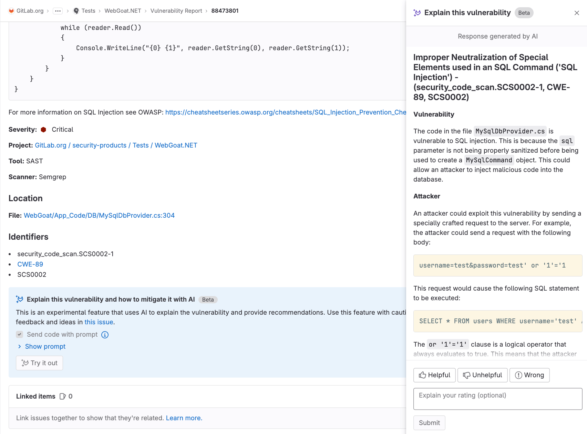

# Vulnerability Page

DETAILS:
**Tier:** Ultimate
**Offering:** GitLab.com, Self-managed, GitLab Dedicated

Each vulnerability in a project has a vulnerability page containing details of the vulnerability,
including:

- Description
- When it was detected
- Current status
- Available actions
- Linked issues
- Actions log

If the scanner determined the vulnerability to be a false positive, an alert message is included at
the top of the vulnerability's page.

When a vulnerability is no longer detected in a project's default branch, you should
change its status to **Resolved**. This ensures that if it is accidentally reintroduced in a future
merge, it is reported again as a new record. To change the status of multiple vulnerabilities, use
the Vulnerability Report's [Activity filter](../vulnerability_report/index.md#activity-filter).

## Explaining a vulnerability

DETAILS:
**Tier:** Ultimate
**Offering:** GitLab.com
**Status:** Beta

> - [Introduced](https://gitlab.com/groups/gitlab-org/-/epics/10368) in GitLab 16.0 as an [Experiment](../../../policy/experiment-beta-support.md#experiment) on GitLab.com.
> - Promoted to [Beta](../../../policy/experiment-beta-support.md#beta) status in GitLab 16.2.

GitLab can help you with a vulnerability by using a large language model to:

- Summarize the vulnerability.
- Help developers and security analysts to understand the vulnerability, how it could be exploited, and how to fix it.
- Provide a suggested mitigation.

### Vulnerability explanation

Explain a vulnerability with GitLab Duo Vulnerability explanation. Use the explanation to better
understand a vulnerability and its possible mitigation.

Prerequisites:

- You must have the GitLab Ultimate subscription tier.
- You must be a member of the project.
- The vulnerability must be a SAST finding.

Learn more about [how to enable all GitLab Duo features](../../ai_features.md#enabling-beta-and-experimental-ai-powered-features).

To explain the vulnerability:

1. On the left sidebar, select **Search or go to** and find your project.
1. Select **Security and Compliance > Vulnerability report**.
1. In the **Tool** dropdown list, select **SAST**.
1. Select the SAST vulnerability you want explained.
1. At the bottom of the vulnerability's page, select **Try it out**.

The response is shown on the right side of the page.



On GitLab.com this feature is available. By default, it is powered by Google's `text-bison-001`
model. In the event of degraded performance with that model, the feature instead uses Anthropic's
`claude` model.

We cannot guarantee that the large language model produces results that are correct. Use the
explanation with caution.

### Data shared with third-party AI APIs

The following data is shared with third-party AI APIs:

- Vulnerability title (which might contain the filename, depending on which scanner is used).
- Vulnerability identifiers.
- Code block, but only if the "Send code with prompt" checkbox is selected (single and multi-line as instructed by the vulnerability
  record).
- Filename.

## Vulnerability resolution

DETAILS:
**Tier:** Ultimate
**Offering:** GitLab.com
**Status:** Experiment

> - [Introduced](https://gitlab.com/groups/gitlab-org/-/epics/10779) in GitLab 16.7 as an [Experiment](../../../policy/experiment-beta-support.md#experiment) on GitLab.com.

Use GitLab Duo Vulnerability resolution to automatically create a merge request that
resolves the vulnerability.

On GitLab.com this feature is available. By default, it is powered by Google's `code-bison-001`
model.

We cannot guarantee that the large language model produces results that are correct. Use the
explanation with caution.

Prerequisites:

- You must have the GitLab Ultimate subscription tier.
- You must be a member of the project.
- The vulnerability must be a SAST finding.

Learn more about [how to enable all GitLab Duo features](../../ai_features.md#enabling-beta-and-experimental-ai-powered-features).

To resolve the vulnerability:

1. On the left sidebar, select **Search or go to** and find your project.
1. Select **Security and Compliance > Vulnerability report**.
1. In the **Tool** dropdown list, select **SAST**.
1. Select the SAST vulnerability you want resolved.
1. At the top of the vulnerability's page, from the **Resolve with merge request** dropdown list, select **Resolve with AI**.

A merge request containing the AI remediation suggestions is opened. Review the suggested changes,
then process the merge request according to your standard workflow.

### Data shared with third-party AI APIs

The following data is shared with third-party AI APIs:

- Vulnerability title (which might contain the filename, depending on which scanner is used).
- Vulnerability identifiers.
- Code block.
- File name.

## Vulnerability status values

A vulnerability's status can be:

- **Detected**: The default state for a newly discovered vulnerability. Appears as "Needs triage" in the UI.
- **Confirmed**: A user has seen this vulnerability and confirmed it to be accurate.
- **Dismissed**: A user has seen this vulnerability and dismissed it because it is not accurate or
  otherwise not to be resolved. Dismissed vulnerabilities are ignored if detected in subsequent
  scans.
- **Resolved**: The vulnerability has been fixed or is no longer present. If a resolved
  vulnerability is reintroduced and detected again, its record is reinstated and its status set to
  detected.

## Vulnerability dismissal reasons

> - [Introduced](https://gitlab.com/groups/gitlab-org/-/epics/4942) in GitLab 15.11 with a feature flag named `dismissal_reason`.
> - Enabled on GitLab.com in GitLab 15.11. For self-managed customers, [contact Support](https://about.gitlab.com/support/) if you would like to use this feature in GitLab 15.11.
> - Enabled by default in GitLab 16.0.

When dismissing a vulnerability, one of the following reasons must be chosen to clarify why it is being dismissed:

- **Acceptable risk**: The vulnerability is known, and has not been remediated or mitigated, but is considered to be an acceptable business risk.
- **False positive**: An error in reporting in which a test result incorrectly indicates the presence of a vulnerability in a system when the vulnerability is not present.
- **Mitigating control**: A management, operational, or technical control (that is, safeguard or countermeasure) employed by an organization that provides equivalent or comparable protection for an information system.
- **Used in tests**: The finding is not a vulnerability because it is part of a test or is test data.
- **Not applicable**: The vulnerability is known, and has not been remediated or mitigated, but is considered to be in a part of the application that will not be updated.

## Change the status of a vulnerability

> - In GitLab 16.4 the ability for `Developers` to change the status of a vulnerability (`admin_vulnerability`) was [deprecated](../../../update/deprecations.md#deprecate-change-vulnerability-status-from-the-developer-role). The `admin_vulnerability` permission will be removed, by default, from all `Developer` roles in GitLab 17.0.

Prerequisites:

- You must have at least the Developer role for the project.

To change a vulnerability's status from its Vulnerability Page:

1. On the left sidebar, select **Search or go to** and find your project.
1. Select **Secure > Vulnerability report**.
1. Select the vulnerability's description.
1. From the **Status** dropdown list select a status, then select **Change status**.

   In GitLab 15.11 and later, you must select a [dismissal reason](#vulnerability-dismissal-reasons) when you change a vulnerability's status to **Dismissed**.

1. Optionally, at the bottom of the page, add a comment to the log entry.

Details of the status change, including who made the change and when, are recorded in the
vulnerability's action log.

## Create a GitLab issue for a vulnerability

You can create a GitLab issue to track any action taken to resolve or mitigate a vulnerability.
To create a GitLab issue for a vulnerability:

1. On the left sidebar, select **Search or go to** and find your project.
1. Select **Secure > Vulnerability report**.
1. Select the vulnerability's description.
1. Select **Create issue**.

The issue is created in the GitLab project with information from the vulnerability report.

To create a Jira issue, see [Create a Jira issue for a vulnerability](../../../integration/jira/configure.md#create-a-jira-issue-for-a-vulnerability).

## Linking a vulnerability to GitLab and Jira issues

You can link a vulnerability to one or more existing [GitLab](#create-a-gitlab-issue-for-a-vulnerability)
or [Jira](../../../integration/jira/configure.md#create-a-jira-issue-for-a-vulnerability) issues. Only one linking feature is available at the same time.
Adding a link helps track the issue that resolves or mitigates a vulnerability.

### Link a vulnerability to existing GitLab issues

Prerequisites:

- [Jira issue integration](../../../integration/jira/configure.md) must not be enabled.

To link a vulnerability to existing GitLab issues:

1. On the left sidebar, select **Search or go to** and find your project.
1. Select **Secure > Vulnerability report**.
1. Select the vulnerability's description.
1. In the **Linked issues** section, select the plus icon (**{plus}**).
1. For each issue to be linked, either:
   - Paste a link to the issue.
   - Enter the issue's ID (prefixed with a hash `#`).
1. Select **Add**.

The selected GitLab issues are added to the **Linked items** section, and the linked issues counter is
updated.

GitLab issues linked to a vulnerability are shown in the Vulnerability Report and the vulnerability's page.

Be aware of the following conditions between a vulnerability and a linked GitLab issue:

- The vulnerability page shows related issues, but the issue page doesn't show the vulnerability
  it's related to.
- An issue can only be related to one vulnerability at a time.
- Issues can be linked across groups and projects.

### Link a vulnerability to existing Jira issues

Prerequisites:

- Ensure the Jira issue integration is [configured](../../../integration/jira/configure.md#configure-the-integration) and the
  **Enable Jira issues** and **Enable Jira issue creation from vulnerabilities** checkboxes are selected.

To link a vulnerability to existing Jira issues, add the following line to the Jira issue's description:

```plaintext
/-/security/vulnerabilities/<id>
```

`<id>` is any [vulnerability ID](../../../api/vulnerabilities.md#single-vulnerability).
You can add several lines with different IDs to one description.

Jira issues with appropriate description are added to the **Related Jira issues** section, and the linked issues counter is
updated.

Jira issues linked to a vulnerability are shown only on the vulnerability page.

Be aware of the following conditions between a vulnerability and a linked Jira issue:

- The vulnerability page and the issue page show the vulnerability they are related to.
- An issue can be related to one or more vulnerabilities at the same time.

## Resolve a vulnerability

For some vulnerabilities a solution is already known. In those instances, a vulnerability's page
includes a **Resolve with merge request** option.

The following scanners are supported by this feature:

- [Dependency Scanning](../dependency_scanning/index.md).
  Automatic patch creation is only available for Node.js projects managed with
  `yarn`. Also, Automatic patch creation is only supported when [FIPS mode](../../../development/fips_compliance.md#enable-fips-mode) is disabled.
- [Container Scanning](../container_scanning/index.md).

To resolve a vulnerability, you can either:

- [Resolve a vulnerability with a merge request](#resolve-a-vulnerability-with-a-merge-request).
- [Resolve a vulnerability manually](#resolve-a-vulnerability-manually).


### Resolve a vulnerability with a merge request

To resolve the vulnerability with a merge request:

1. On the left sidebar, select **Search or go to** and find your project.
1. Select **Secure > Vulnerability report**.
1. Select the vulnerability's description.
1. From the **Resolve with merge request** dropdown list, select **Resolve with merge request**.

A merge request is created which applies the patch required to resolve the vulnerability.
Process the merge request according to your standard workflow.

### Resolve a vulnerability manually

To manually apply the patch that GitLab generated for a vulnerability:

1. On the left sidebar, select **Search or go to** and find your project.
1. Select **Secure > Vulnerability report**.
1. Select the vulnerability's description.
1. From the **Resolve with merge request** dropdown list, select **Download patch to resolve**.
1. Ensure your local project has the same commit checked out that was used to generate the patch.
1. Run `git apply remediation.patch`.
1. Verify and commit the changes to your branch.
1. Create a merge request to apply the changes to your main branch.
1. Process the merge request according to your standard workflow.

## Enable security training for vulnerabilities

> - [Introduced](https://gitlab.com/groups/gitlab-org/-/epics/6176) in GitLab 14.9.

NOTE:
Security training is not accessible in an environment that is offline, meaning computers that are isolated from the public internet as a security measure. Specifically, the GitLab server needs the ability to query the API endpoints for any training provider you choose to enable. Some third-party training vendors may require you to sign up for a _free_ account. Sign up for an account by going to
any of [Secure Code Warrior](https://www.securecodewarrior.com/), [Kontra](https://application.security/), or [SecureFlag](https://www.secureflag.com/).
GitLab does not send any user information to these third-party vendors; we do send the CWE or OWASP identifier and the language name of the file extension.

Security training helps your developers learn how to fix vulnerabilities. Developers can view security training from selected educational providers, relevant to the detected vulnerability.

To enable security training for vulnerabilities in your project:

1. On the left sidebar, select **Search or go to** and find your project.
1. Select **Secure > Security configuration**.
1. On the tab bar, select **Vulnerability Management**.
1. To enable a security training provider, turn on the toggle.

Each integration submits the Vulnerability identifier, for example CWE or OWASP, and the language to the security training vendor. The resulting link to the vendor training is what appears in a GitLab Vulnerability.

## View security training for a vulnerability

> - [Introduced](https://gitlab.com/groups/gitlab-org/-/epics/6176) in GitLab 14.9.

The vulnerability page may include a training link relevant to the detected vulnerability if security training is enabled.
The availability of training depends on whether the enabled training vendor has content matching the particular vulnerability.
Training content is requested based on the [vulnerability identifiers](../../../development/integrations/secure.md#identifiers).
The identifier given to a vulnerability varies from one vulnerability to the next and the available training
content varies between vendors. Some vulnerabilities do not display training content.
Vulnerabilities with a CWE are most likely to return a training result.

To view the security training for a vulnerability:

1. On the left sidebar, select **Search or go to** and find your project.
1. Select **Secure > Vulnerability report**.
1. Select the vulnerability for which you want to view security training.
1. Select **View training**.
