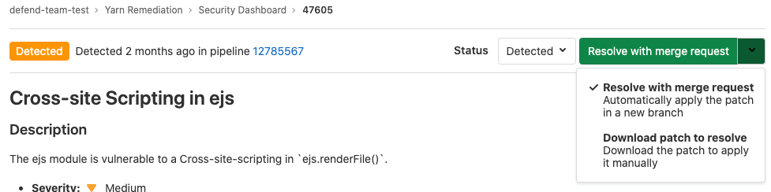

# Vulnerability Pages **(ULTIMATE)**

> [Introduced](https://gitlab.com/gitlab-org/gitlab/-/issues/13561) in [GitLab Ultimate](https://about.gitlab.com/pricing/) 13.0.

Each security vulnerability in a project's [Vulnerability Report](../vulnerability_report/index.md) has an individual page which includes:

- Details of the vulnerability.
- The status of the vulnerability in the project.
- Available actions for the vulnerability.
- Any issues related to the vulnerability.

On the vulnerability's page, you can:

- [Change the vulnerability's status](#change-vulnerability-status).
- [Create an issue](#create-an-issue-for-a-vulnerability).
- [Link issues to the vulnerability](#link-gitlab-issues-to-the-vulnerability).
- [Remediate a vulnerability automatically](#remediate-a-vulnerability-automatically), if an
  automatic solution is available.
- [Remediate a vulnerability manually](#remediate-a-vulnerability-manually), if a solution is
  available.

## Change vulnerability status

You can change the status of a vulnerability using the **Status** dropdown to one of
the following values:

| Status    | Description                                                                                                    |
|-----------|----------------------------------------------------------------------------------------------------------------|
| Detected  | The default state for a newly discovered vulnerability                                                         |
| Confirmed | A user has seen this vulnerability and confirmed it to be accurate                                             |
| Dismissed | A user has seen this vulnerability and dismissed it because it is not accurate or otherwise not to be resolved |
| Resolved  | The vulnerability has been fixed and is no longer valid                                                        |

A timeline shows you when the vulnerability status has changed
and allows you to comment on a change.

## Create an issue for a vulnerability

From a vulnerability's page you can create an issue to track all action taken to resolve or
mitigate it.

From a vulnerability you can create either:

- [A GitLab issue](#create-a-gitlab-issue-for-a-vulnerability) (default).
- [A Jira issue](#create-a-jira-issue-for-a-vulnerability).

Creating a Jira issue requires that
[Jira integration](../../../integration/jira/index.md) is enabled on the project. Note
that when Jira integration is enabled, the GitLab issue feature is not available.

### Create a GitLab issue for a vulnerability

To create a GitLab issue for a vulnerability:

1. In GitLab, go to the vulnerability's page.
1. Select **Create issue**.

An issue is created in the project, pre-populated with information from the vulnerability report.
The issue is then opened so you can take further action.

### Create a Jira issue for a vulnerability

> - [Introduced](https://gitlab.com/groups/gitlab-org/-/epics/4677) in GitLab 13.9.
> - It's [deployed behind a feature flag](../../../user/feature_flags.md), enabled by default.
> - It's enabled on GitLab.com.
> - It's recommended for production use.
> - For GitLab self-managed instances, GitLab administrators can opt to
>   [disable it](#enable-or-disable-jira-integration-for-vulnerabilities).

WARNING:
This feature might not be available to you. Check the **version history** note above for details.

Prerequisites:

- [Enable Jira integration](../../project/integrations/jira.md).
  The **Enable Jira issues creation from vulnerabilities** option must be selected as part of the configuration.
- Each user must have a personal Jira user account with permission to create issues in the target project.

To create a Jira issue for a vulnerability:

1. Go to the vulnerability's page.
1. Select **Create Jira issue**.
1. If you're not already logged in to Jira, log in.

The Jira issue is created and opened in a new browser tab. The **Summary** and **Description**
fields are pre-populated from the vulnerability's details.

### Enable or disable Jira integration for vulnerabilities **(ULTIMATE SELF)**

The option to create a Jira issue for a vulnerability is under development but ready for production
use. It is deployed behind a feature flag that is **enabled by default**.
[GitLab administrators with access to the GitLab Rails console](../../../administration/feature_flags.md)
can opt to disable it.

To enable it:

```ruby
Feature.enable(:jira_for_vulnerabilities)
```

To disable it:

```ruby
Feature.disable(:jira_for_vulnerabilities)
```

## Link GitLab issues to the vulnerability

NOTE:
If Jira issue support is enabled, GitLab issues are disabled so this feature is not available.

You can link one or more existing GitLab issues to the vulnerability. This allows you to
indicate that this vulnerability affects multiple issues. It also allows you to indicate
that the resolution of one issue would resolve multiple vulnerabilities.

Linked issues are shown in the Vulnerability Report and the vulnerability's page.

## Link to an existing issue

If you already have an open issue, you can link to it from the vulnerability.

- The vulnerability page shows related issues, but the issue page doesn't show the vulnerability it's related to.
- An issue can only be related to one vulnerability at a time.
- Issues can be linked across groups and projects.

To link to an existing issue:

1. Open the vulnerability.
1. [Add a linked issue](../../project/issues/related_issues.md).

## Remediate a vulnerability automatically

> [Introduced](https://gitlab.com/gitlab-org/gitlab/-/issues/5656) in [GitLab Ultimate](https://about.gitlab.com/pricing/) 11.7.

Some vulnerabilities can be fixed by applying the solution that GitLab automatically generates.
The following scanners are supported:

- [Dependency Scanning](../dependency_scanning/index.md).
  Automatic Patch creation is only available for Node.js projects managed with
  `yarn`.
- [Container Scanning](../container_scanning/index.md).

### Remediate a vulnerability manually

To manually apply the patch that GitLab generated for a vulnerability:

1. Select the **Resolve with merge request** dropdown, then select **Download patch to resolve**:

   

1. Ensure your local project has the same commit checked out that was used to generate the patch.
1. Run `git apply remediation.patch`.
1. Verify and commit the changes to your branch.

### Create a merge request with the suggested patch

> [Introduced](https://gitlab.com/gitlab-org/gitlab/-/issues/9224) in [GitLab Ultimate](https://about.gitlab.com/pricing/) 11.9.

In some cases, you can create a merge request that automatically remediates the
vulnerability. Any vulnerability that has a
[solution](#remediate-a-vulnerability-automatically) can have a merge
request created to automatically solve the issue.

If this action is available:

1. Select the **Resolve with merge request** dropdown, then select **Resolve with merge request**.

   

A merge request is created. It applies the solution to the source branch.

## Vulnerability scanner maintenance

The following vulnerability scanners and their databases are regularly updated:

| Secure scanning tool                                            | Vulnerabilities database updates |
|:----------------------------------------------------------------|----------------------------------|
| [Container Scanning](../container_scanning/index.md)            | Uses either `trivy` or `clair`. For the `trivy` scanner, a job runs on a daily basis to build a new image with the latest vulnerability database updates from the [upstream `trivy-db`](https://github.com/aquasecurity/trivy-db). For the `clair` scanner, the latest `clair-db` version is used; `clair-db` database [is updated daily according to the author](https://github.com/arminc/clair-local-scan#clair-server-or-local). |
| [Dependency Scanning](../dependency_scanning/index.md)          | Relies on `bundler-audit` (for Ruby gems), `retire.js` (for npm packages), and `gemnasium` (the GitLab tool for all libraries). Both `bundler-audit` and `retire.js` fetch their vulnerabilities data from GitHub repositories, so vulnerabilities added to `ruby-advisory-db` and `retire.js` are immediately available. The tools themselves are updated once per month if there's a new version. The [Gemnasium DB](https://gitlab.com/gitlab-org/security-products/gemnasium-db) is updated at least once a week. See our [current measurement of time from CVE being issued to our product being updated](https://about.gitlab.com/handbook/engineering/development/performance-indicators/#cve-issue-to-update). |
| [Dynamic Application Security Testing (DAST)](../dast/index.md) | The scanning engine is updated on a periodic basis. See the [version of the underlying tool `zaproxy`](https://gitlab.com/gitlab-org/security-products/dast/blob/master/Dockerfile#L1). The scanning rules are downloaded at scan runtime. |
| [Static Application Security Testing (SAST)](../sast/index.md)  | Relies exclusively on [the tools GitLab wraps](../sast/index.md#supported-languages-and-frameworks). The underlying analyzers are updated at least once per month if a relevant update is available. The vulnerabilities database is updated by the upstream tools. |

You do not have to update GitLab to benefit from the latest vulnerabilities definitions.
The security tools are released as Docker images. The vendored job definitions that enable them use
major release tags according to [semantic versioning](https://semver.org/). Each new release of the
tools overrides these tags.
The Docker images are updated to match the previous GitLab releases. Although
you automatically get the latest versions of the scanning tools,
there are some [known issues](https://gitlab.com/gitlab-org/gitlab/-/issues/9725)
with this approach.
