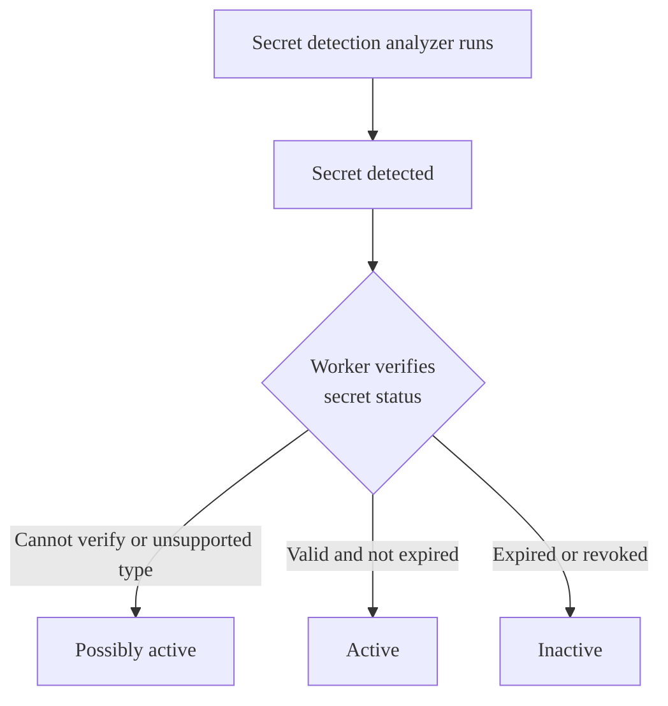



- Tier: Ultimate
- Offering: GitLab.com, GitLab Self-Managed
- Status: Beta





- [Introduced](https://gitlab.com/gitlab-org/gitlab/-/issues/520923) in GitLab 18.0 [with a flag](../../../api/feature_flags.md) named `validity_checks`. Disabled by default.
- Additional access [introduced](https://gitlab.com/gitlab-org/gitlab/-/issues/556765) in GitLab 18.2 with a flag named `validity_checks_security_finding_status`. Disabled by default.
- [Enabled on GitLab.com](https://gitlab.com/gitlab-org/gitlab/-/issues/531222) in GitLab 18.5.
- [Changed](https://gitlab.com/gitlab-org/gitlab/-/merge_requests/206929) from experiment to beta in GitLab 18.5.





The availability of this feature is controlled by a feature flag.
For more information, see the history.



GitLab validity checks determines whether a secret, like an access token, is active.
A secret is active when:

- It is not expired.
- It can be used for authentication.

Because active secrets can be used to impersonate a legitimate user, they pose a
greater security risk than inactive secrets. If several secrets are leaked at once,
knowing which secrets are active is an important part of triage and remediation.

This feature is in [beta](../../../policy/development_stages_support.md).

## Enable validity checks

Prerequisites:

- You must have a project with pipeline security scanning enabled.

To enable validity checks for a project:

1. On the left sidebar, select **Search or go to** and find your project.
1. Select **Secure** > **Security configuration**.
1. Under **Pipeline Secret Detection**, turn on the **Validity checks** toggle.

GitLab checks the status of detected secrets when the `secret_detection` CI/CD job is complete.
To view a secret's status, view the vulnerability details page. To update the status of a secret,
for example after revoking it, re-run the `secret_detection` CI/CD job.

### Coverage

Validity checks supports the following secret types:

- GitLab personal access tokens
- Routable GitLab personal access tokens
- GitLab deploy tokens
- GitLab Runner authentication tokens
- Routable GitLab Runner authentication tokens
- GitLab Kubernetes agent tokens
- GitLab SCIM OAuth tokens
- GitLab CI/CD job tokens
- GitLab incoming email tokens
- GitLab feed tokens (v2)
- GitLab pipeline trigger tokens

## Validity check workflow

When the secret detection analyzer detects a potential secret, GitLab verifies the status of
the secret with its vendor, and assigns the detection one of the following statuses:

- Possibly active: GitLab couldn't verify the secret status, or the secret type is not supported by validity checks.
- Active: The secret is not expired and can be used for authentication.
- Inactive: The secret is expired or revoked and cannot be used for authentication.

You should rotate active and possibly active secrets as soon as possible.

## Refresh secret status



- [Introduced](https://gitlab.com/gitlab-org/gitlab/-/issues/537133) in GitLab 18.2 [with a flag](../../../api/feature_flags.md) named `secret_detection_validity_checks_refresh_token`. Disabled by default.





The availability of this feature is controlled by a feature flag.
For more information, see the history.



After validity checks runs, the status of a token is not automatically updated, even if the token is revoked or expires.
To update a token, you can manually refresh the status:

1. On the vulnerability report, select the vulnerability you want to refresh.
1. Next to the token status, select **Retry** ().

Validity checks is re-run, and the token status is updated.

## Troubleshooting

When working with validity checks, you might encounter the following issues.

### Unexpected token status

A token has the possibly active status when GitLab can't verify its validity.
This might be because:

- The secret validation job hasn't run.
- The secret type is not supported by validity checks.
- There was a problem connecting to the token provider.

To resolve this issue, re-run the `secret_detection` job. If the status persists after a few attempts,
you might need to validate the secret manually.

Unless you're certain the token isn't active, you should revoke and replace possibly active secrets as soon as possible.
