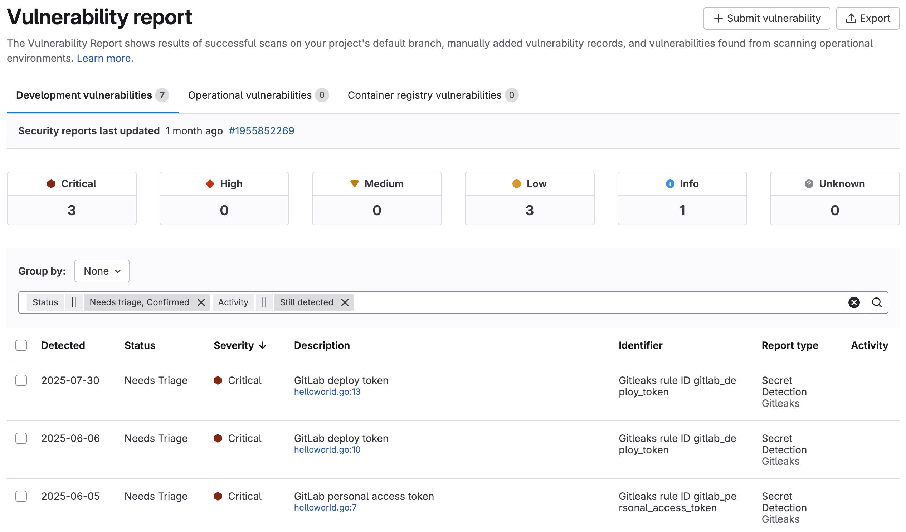
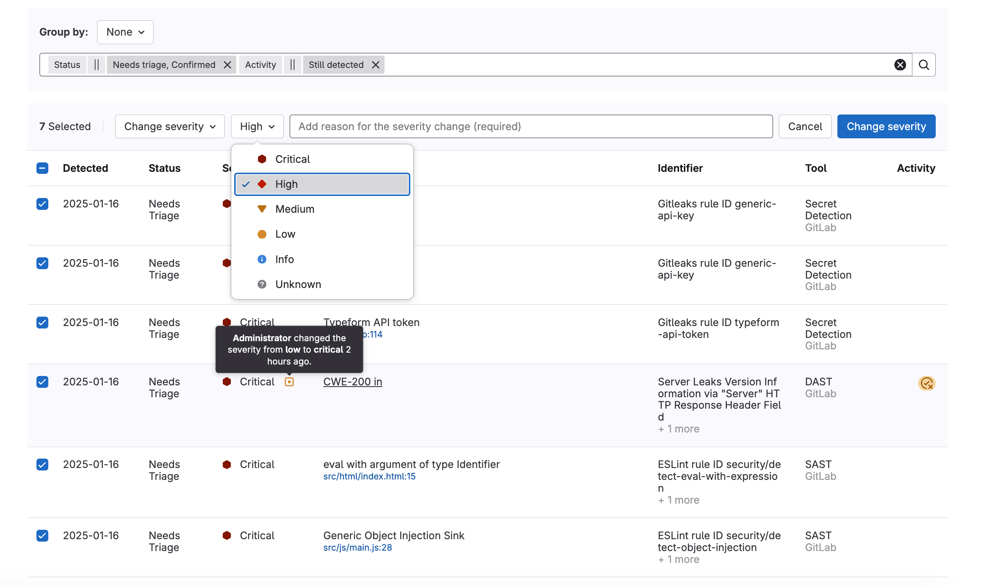
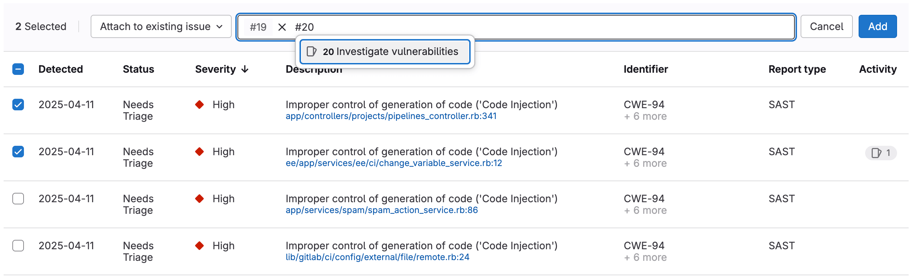
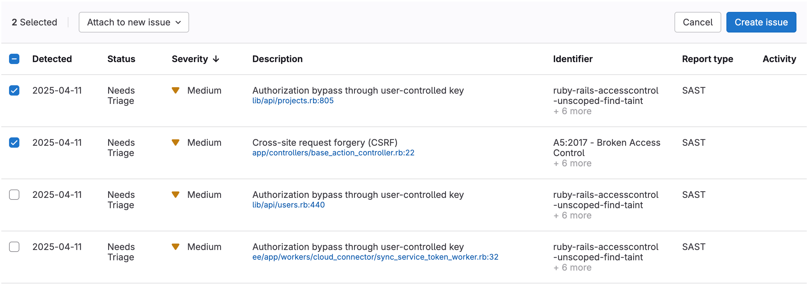



- Tier: Ultimate
- Offering: GitLab.com, GitLab Self-Managed, GitLab Dedicated





- Vulnerability Resolution activity icon [introduced](https://gitlab.com/groups/gitlab-org/-/epics/15036) in GitLab 17.5 with a flag named [`vulnerability_report_vr_badge`](https://gitlab.com/gitlab-org/gitlab/-/issues/486549). Disabled by default.
- [Enabled by default](https://gitlab.com/gitlab-org/gitlab/-/merge_requests/171718) in GitLab 17.6.
- [Generally available](https://gitlab.com/gitlab-org/gitlab/-/issues/503568) in GitLab 18.0. Feature flag `vulnerability_report_vr_badge` removed.





The availability of Vulnerability Resolution activity icon is controlled by a feature flag.
For more information, see the history.



The vulnerability report provides a consolidated view of security vulnerabilities found in your
codebase. Sort vulnerabilities by severity, report type, scanner (for projects only), and other
attributes to determine which issues need attention first. Track vulnerabilities through their
lifecycle with status indicators and activity icons that show remediation progress.

Access detailed information for each vulnerability, including Common Vulnerability Scoring System
(CVSS) scores and file locations when available. Filter and group similar vulnerabilities to address
them systematically.

For performance reasons, if the total number of vulnerabilities exceeds 1000, the vulnerability
report displays the count as **1000+** instead of the exact number. This limitation affects only
the counts displayed at the top of the page. You can still find all of the vulnerabilities in the
table.

An improvement to show the exact count is proposed in issue
[547510](https://gitlab.com/gitlab-org/gitlab/-/issues/547510). To find the exact count, use one
of the workarounds in [issue 480378](https://gitlab.com/gitlab-org/gitlab/-/issues/480378#workarounds).



On GitLab.com, vulnerabilities are [archived](../vulnerability_archival/_index.md) one year after
they were last updated.



<i class="fa fa-youtube-play youtube" aria-hidden="true"></i>
For an overview, see [Vulnerability Management - Advanced Security Testing](https://www.youtube.com/watch?v=alMRIq5UPbw).

## Contents of the vulnerability report

The report contains data from the default branch, showing cumulative results from all successful security scan jobs.
Scan results appear after job completion or when a pipeline is blocked by manual jobs.

For projects and groups, the vulnerability report contains:

- Totals of vulnerabilities per severity level.
- Filters for common vulnerability attributes.
- Details of each vulnerability, presented in a table.

For some vulnerabilities, the details include a link to the relevant file and line number in the
default branch. For CVE vulnerabilities, you can also view the KEV status, CVSS and EPSS scores,
and reachability information in the vulnerability report.

For projects, the vulnerability report also contains:

- A time stamp shows when the default branch was last updated, including a link to the latest pipeline. Pipelines that run against non-default branches do not update the time stamp.
- The number of failures that occurred in the most recent pipeline. Select the failure
  notification to view the **Failed jobs** tab of the pipeline's page.

The **Activity** column contains icons to indicate the activity, if any, taken on the vulnerability
in that row:

- Issues : Links to issues created for the vulnerability.
- Merge requests : Links to merge requests created for the vulnerability.
- Checked circle : The vulnerability has been remediated.
- False positive : The scanner determined this vulnerability to be a false
  positive.
- Solution : Indicates that the vulnerability has a solution available.
- Vulnerability Resolution : Indicates that the vulnerability has an available AI resolution.

To open an issue created for a vulnerability, hover over the **Activity** entry, then select the link.
The issue icon () indicates the issue's status. If [Jira issue support](../../../integration/jira/configure.md) is enabled, the
issue link found in the **Activity** entry links out to the issue in Jira. Unlike GitLab issues, the
status of a Jira issue is not shown in the GitLab UI.

When vulnerabilities originate from a multi-project pipeline setup,
this page displays the vulnerabilities that originate from the selected project.

## View the vulnerability report

View the vulnerability report to list all vulnerabilities in the project or group.

Prerequisites:

- You must have at least the Developer role for the project or group.

To view the vulnerability report:

1. On the left sidebar, select **Search or go to** and find your project or group. If you've [turned on the new navigation](../../interface_redesign.md#turn-new-navigation-on-or-off), this field is on the top bar.
1. Select **Secure** > **Vulnerability report**.

## Filtering vulnerabilities



- [Introduced](https://gitlab.com/gitlab-org/gitlab/-/issues/452492) the **Identifier** filter in GitLab 17.7 [with a flag](../../../administration/feature_flags/_index.md) named `vulnerability_filtering_by_identifier`. Enabled by default.
- [Generally available](https://gitlab.com/gitlab-org/gitlab/-/issues/502930) in GitLab 17.9. Feature flag `vulnerability_filtering_by_identifier` removed.



You can filter vulnerabilities in the vulnerability report to more efficiently triage them.

You can filter by:

<!-- vale gitlab_base.SubstitutionWarning = NO -->

- **Status**: The current [status of the vulnerability](../vulnerabilities/_index.md#vulnerability-status-values): needs triage, confirmed, dismissed, or resolved.
  Dismissed vulnerabilities can be filtered together or individually by the reason they were
  dismissed.
- **Severity**: The severity value of the vulnerability: critical, high, medium, low, info, unknown.
- **Report type**: The type of report that detected the vulnerability, such as SAST or Container fuzzing.
- **Scanner**: The specific scanner that identified the vulnerability.
- **Activity**: Additional properties of to the vulnerability, such as whether or not the vulnerability has an issue, merge request, or solution available.
- **Identifier**: The vulnerability's identifier (requires [advanced vulnerability management](#advanced-vulnerability-management). Without advanced vulnerability management, availability is restricted to projects and groups with a maximum of 20,000 vulnerabilities).
- **Project**: Filter vulnerabilities in specific projects (available only for groups).
- **Reachability**: Filter based on whether the vulnerability is reachable: yes, not found, not available.
- **Validity check**: Filter vulnerabilities by their validity status: active, inactive, possibly active.

<!-- vale gitlab_base.SubstitutionWarning = YES -->

### Filter vulnerabilities



- Improved filtering [introduced](https://gitlab.com/groups/gitlab-org/-/epics/13339) in GitLab 16.9 [with a flag](../../../administration/feature_flags/_index.md) named `vulnerability_report_advanced_filtering`. Disabled by default.
- [Enabled on GitLab.com, GitLab Self-Managed, and GitLab Dedicated](https://gitlab.com/gitlab-org/gitlab/-/issues/437128) in GitLab 17.1.
- [Generally available in 17.2](https://gitlab.com/gitlab-org/gitlab/-/merge_requests/157172). Feature flag `vulnerability_report_advanced_filtering` removed.



Filter the vulnerability report to focus on a subset of vulnerabilities.

To filter the list of vulnerabilities:

1. On the left sidebar, select **Search or go to** and find your project. If you've [turned on the new navigation](../../interface_redesign.md#turn-new-navigation-on-or-off), this field is on the top bar.
1. Select **Secure** > **Vulnerability report**.
1. Optional. To remove the default filters, select **Clear** ().
1. Above the list of vulnerabilities, select the filter bar.
1. In the dropdown list that appears, select an attribute you want to filter by, then select the
   values from the dropdown list.
1. Select outside the filter field. The vulnerability severity totals and list of matching
   vulnerabilities are updated.
1. To filter by multiple attributes, repeat the three previous steps. Multiple attributes are joined
   by a logical AND.

### Report type filter

You can filter vulnerabilities based on the type of report that detected them. By default, the vulnerability report
lists vulnerabilities from all report types.

Use the **Manually added** attribute to filter vulnerabilities that were added manually.

### Scanner filter

For projects, you can filter vulnerabilities based on the scanner that detected them. By default, the vulnerability report
lists vulnerabilities from all [scanners](../detect/_index.md).

### Project filter

The content of the Project filter varies:

- **Security Center**: Only projects you've [added to your personal Security Center](../security_dashboard/_index.md#adding-projects-to-the-security-center).
- **Group**: All projects in the group.
- **Project**: Not applicable.

### Activity filter



- Introduced in GitLab 16.7 [with a flag](../../../administration/feature_flags/_index.md) named `activity_filter_has_remediations`. Disabled by default.
- [Generally available](https://gitlab.com/gitlab-org/gitlab/-/issues/429262) in GitLab 16.9. Feature flag `activity_filter_has_remediations` removed.
- Activity filter option **GitLab Duo (AI)** [introduced](https://gitlab.com/groups/gitlab-org/-/epics/15036) in GitLab 17.5 with a flag named [`vulnerability_report_vr_filter`](https://gitlab.com/gitlab-org/gitlab/-/issues/486534). Disabled by default.
- Activity filter option **GitLab Duo (AI)** [enabled by default](https://gitlab.com/gitlab-org/gitlab/-/merge_requests/171718) in GitLab 17.6.
- Activity filter option **GitLab Duo (AI)** [generally available](https://gitlab.com/gitlab-org/gitlab/-/merge_requests/172372) in GitLab 18.0. The `vulnerability_report_vr_filter` flag removed.



The activity filter behaves differently from the other filters. You can select only one value in
each category. To remove a filter, from the activity filter dropdown list select the filter you want to remove.

Selection behavior when using the activity filter:

- **Activity**
  - **All activity**: Vulnerabilities with any activity status (same as ignoring this filter). Selecting this deselects all other activity filter options.
- **Detection**
  - **Still detected** (default): Vulnerabilities that are still detected in the latest pipeline scan of the `default` branch.
  - **No longer detected**: Vulnerabilities that are no longer detected in the latest pipeline scan of the `default` branch.
- **Issue**
  - **Has issues**: Vulnerabilities with one or more associated issues.
  - **Does not have issue**: Vulnerabilities without an associated issue.
- **Merge request**
  - **Has merge request**: Vulnerabilities with one or more associated merge requests.
  - **Does not have merge request**: Vulnerabilities without an associated merge request.
- **Solution available**
  - **Has a solution**: Vulnerabilities that can be [resolved with an automated merge request](../vulnerabilities/_index.md#resolve-a-vulnerability-with-a-merge-request).
  - **Does not have a solution**: Vulnerabilities that don't have an automated merge request resolution available.
- **GitLab Duo (AI)**:
  - **Vulnerability Resolution available**: Vulnerabilities with an available AI resolution.
  - **Vulnerability Resolution unavailable**: Vulnerabilities without an available AI resolution.

The **GitLab Duo (AI)** filter is available when:

- Security Center vulnerability report: Any project in the [Security Center](../security_dashboard/_index.md#adding-projects-to-the-security-center) has its **GitLab Duo** toggle turned on.
- Group vulnerability report: For the group, **GitLab Duo features** is set to **On by default**.
- Project vulnerability report: For the project, the **GitLab Duo** toggle is turned on.

### Reachability filter



- [Introduced](https://gitlab.com/groups/gitlab-org/-/epics/17251) in GitLab 18.3.



For groups and projects, you can filter vulnerabilities based on the [reachability value](../dependency_scanning/static_reachability.md#understanding-the-results). By default, the vulnerability report lists vulnerabilities with any reachability value.

This filter requires [advanced vulnerability management](#advanced-vulnerability-management).

### Validity check filter



- [Introduced](https://gitlab.com/groups/gitlab-org/-/epics/17407) in GitLab 18.5 with a flag named [`validity_check_es_filter`](https://gitlab.com/gitlab-org/gitlab/-/issues/560433). Disabled by default.





The availability of this feature is controlled by a feature flag.
For more information, see the history.
This feature is available for testing, but not ready for production use.



For groups and projects, you can filter vulnerabilities based on the [validity check value](../vulnerabilities/validity_check.md). By default, the vulnerability report lists vulnerabilities with the possibly active status.

This filter requires [advanced vulnerability management](#advanced-vulnerability-management).

## Grouping vulnerabilities



- Grouping of vulnerabilities per project [introduced](https://gitlab.com/groups/gitlab-org/-/epics/10164) in GitLab 16.4 [with a flag](../../../administration/feature_flags/_index.md) named `vulnerability_report_grouping`. Disabled by default.
- Grouping of vulnerabilities per project [enabled on GitLab Self-Managed and GitLab Dedicated](https://gitlab.com/gitlab-org/gitlab/-/merge_requests/134073) in GitLab 16.5.
- Grouping of vulnerabilities per project [generally available](https://gitlab.com/gitlab-org/gitlab/-/issues/422509) in GitLab 16.6. Feature flag `vulnerability_report_grouping` removed.
- Grouping of vulnerabilities per group [introduced](https://gitlab.com/gitlab-org/gitlab/-/merge_requests/137778) in GitLab 16.7 with a flag named [`group_level_vulnerability_report_grouping`](https://gitlab.com/gitlab-org/gitlab/-/issues/432778). Disabled by default.
- Grouping of vulnerabilities per group [enabled on GitLab Self-Managed and GitLab Dedicated](https://gitlab.com/gitlab-org/gitlab/-/merge_requests/157949) in GitLab 17.2.
- Grouping of vulnerabilities per group [generally available](https://gitlab.com/gitlab-org/gitlab/-/issues/472669) in GitLab 17.3. Feature flag `group_level_vulnerability_report_grouping` removed.
- OWASP top 10 grouping of vulnerabilities per group [introduced](https://gitlab.com/gitlab-org/gitlab/-/issues/432618) in GitLab 16.8 [with a flag](../../../administration/feature_flags/_index.md) named `vulnerability_owasp_top_10_group`. Disabled by default.
- OWASP top 10 grouping of vulnerabilities per group [enabled on GitLab Self-Managed and GitLab Dedicated](https://gitlab.com/gitlab-org/gitlab/-/issues/437253) in GitLab 17.4.
- OWASP top 10 grouping of vulnerabilities per group [generally available](https://gitlab.com/gitlab-org/gitlab/-/issues/437253) in GitLab 17.4. Feature flag `vulnerability_owasp_top_10_group` removed.
- Non-OWASP category in OWASP top 10 grouping [introduced](https://gitlab.com/gitlab-org/gitlab/-/issues/442526) in GitLab 17.1 [with a flag](../../../administration/feature_flags/_index.md) named `owasp_top_10_null_filtering`. Disabled by default.
- Non-OWASP category in OWASP top 10 grouping [enabled on GitLab Self-Managed, and GitLab Dedicated](https://gitlab.com/gitlab-org/gitlab/-/issues/463783) in GitLab 17.5.
- Non-OWASP category in OWASP top 10 grouping [generally available](https://gitlab.com/gitlab-org/gitlab/-/issues/463783) in GitLab 17.6. Feature flag `owasp_top_10_null_filtering` removed.
- OWASP 2021 top 10 grouping [added](https://gitlab.com/gitlab-org/gitlab/-/issues/466034) on GitLab.com and GitLab Dedicated in GitLab 18.1.



You can group vulnerabilities on the vulnerability report page to more efficiently triage them.

You can group by:

- Status
- Severity
- Report Type
- Scanner
- OWASP top 10 2017
- OWASP top 10 2021 (requires [advanced vulnerability management](#advanced-vulnerability-management))

### Group vulnerabilities

To group vulnerabilities:

1. On the left sidebar, select **Search or go to** and find your project or group. If you've [turned on the new navigation](../../interface_redesign.md#turn-new-navigation-on-or-off), this field is on the top bar.
1. Select **Secure** > **Vulnerability report**.
1. From the **Group By** dropdown list, select a group.

Vulnerabilities are grouped according to the group you selected. Each group is collapsed, with
the total number of vulnerabilities per group displayed beside their name. To see the
vulnerabilities in each group, select the group's name.

## View details of a vulnerability

To view more details of a vulnerability, select the vulnerability's **Description**. The
[vulnerability's details](../vulnerabilities/_index.md) page is opened.

## Change status of vulnerabilities



- Providing a comment and dismissal reason [introduced](https://gitlab.com/gitlab-org/gitlab/-/issues/408366) in GitLab 16.0.



As you triage vulnerabilities you can change their status, including dismissing vulnerabilities.

When a vulnerability is dismissed, the audit log includes a note of who dismissed it, when it was
dismissed, and the reason it was dismissed. You cannot delete vulnerability records, so a permanent
record always remains.

Prerequisites:

- You must have at least the Maintainer role for the project. The `admin_vulnerability` permission was [removed](https://gitlab.com/gitlab-org/gitlab/-/issues/412693) from the Developer role in GitLab 17.0.

To change the status of vulnerabilities:

1. On the left sidebar, select **Search or go to** and find your project. If you've [turned on the new navigation](../../interface_redesign.md#turn-new-navigation-on-or-off), this field is on the top bar.
1. Select **Secure** > **Vulnerability report**.
1. To select:
   - One or more vulnerabilities, select the checkbox beside each vulnerability.
   - All vulnerabilities on the page, select the checkbox in the table header.
1. In the **Set status** dropdown list, select the desired status.
1. If the **Dismiss** status is chosen, select the desired reason in the **Set dismissal reason** dropdown list.
1. In the **Add a comment** input, you can provide a comment. For the **Dismiss** status, a comment is required.
1. Select **Change status**.

The status of the selected vulnerabilities is updated and the content of the vulnerability report is
refreshed.

## Change or override vulnerability severity



- [Introduced](https://gitlab.com/groups/gitlab-org/-/epics/16157) in GitLab 17.9 [with a flag](../../../administration/feature_flags/_index.md) named `vulnerability_severity_override`. Disabled by default.
- [Enabled on GitLab.com, GitLab Self-Managed, and GitLab Dedicated](https://gitlab.com/groups/gitlab-org/-/epics/16157) in GitLab 17.10.
- [Generally available](https://gitlab.com/gitlab-org/gitlab/-/issues/ISSUE_ID) in GitLab 18.1. Feature flag `vulnerability_severity_override` removed.
- [Added](https://gitlab.com/gitlab-org/gitlab/-/issues/537229) a feature flag that administrators can enable to prevent users from changing or overriding the severity level in GitLab 18.1 [with a flag](../../../administration/feature_flags/_index.md) named `hide_vulnerability_severity_override`. Disabled by default.





The availability of this feature is controlled by a feature flag.
For more information, see the history.



In certain cases, you may need to adjust the severity of a detected vulnerability to better reflect your organization's priorities. For instance, a scanner might report a lower severity, but you might consider it more critical based on your environment or setup. This feature allows you to override the default severity assigned by the scanner.

Prerequisites:

- You must have at least the Maintainer role for the project or the `admin_vulnerability` permission.

To manually override a vulnerability's severity:

1. On the left sidebar, select **Search or go to** and find your project. If you've [turned on the new navigation](../../interface_redesign.md#turn-new-navigation-on-or-off), this field is on the top bar.
1. Go to **Secure** > **Vulnerability report**.
1. Select vulnerabilities:
   - To select individual vulnerabilities, select the checkbox beside each vulnerability.
   - To select all vulnerabilities on the page, select the checkbox in the table header.
1. In the **Select action** dropdown list, select **Change severity**.
1. In the **Select severity** dropdown list, select the desired severity level.
1. In the **Add reason for the severity change (required)** text box, add a brief explanation of why you're changing the severity.
1. Select **Change severity**.

For each selected vulnerability:

- Its severity is updated in both the **Vulnerability details page** and the **Vulnerability report**.
- A badge is added to its severity, indicating that the severity has been overridden.
- Manual severity adjustments are recorded in the vulnerability's **history**.

## Prevent users from overriding vulnerability severities



- [Introduced](https://gitlab.com/gitlab-org/gitlab/-/issues/537229) in GitLab 18.1 [with a flag](../../../administration/feature_flags/_index.md) named `hide_vulnerability_severity_override`. Disabled by default.





The availability of this feature is controlled by a feature flag.
For more information, see the history.



In some environments, you might need to prevent users from overriding the severity of vulnerabilities. The `hide_vulnerability_severity_override` feature flag allows administrators to hide the severity override functionality in the vulnerability report. This feature helps organizations maintain standardized vulnerability severity ratings across projects.
When enabled, this feature:

- Hides the **Change severity** option from the action dropdown list in the vulnerability report.
- Prevents users from manually changing severity levels through the UI, ensuring consistent vulnerability scoring based on scanner results.
- Disables all API endpoints related to the modification of vulnerability severities, maintaining consistency across all access methods.

To enable the `hide_vulnerability_severity_override` flag, see [enable and disable GitLab features deployed behind feature flags](../../../administration/feature_flags/_index.md).

## Add vulnerabilities to an existing issue



- [Introduced](https://gitlab.com/groups/gitlab-org/-/epics/13216) in GitLab 17.9 [with a flag](../../../administration/feature_flags/_index.md) named `enhanced_vulnerability_bulk_actions`. Disabled by default.
- [Enabled on GitLab.com, GitLab Self-Managed, and GitLab Dedicated](https://gitlab.com/gitlab-org/gitlab/-/merge_requests/190213) in GitLab 18.0.
- [Generally available](https://gitlab.com/gitlab-org/gitlab/-/issues/515204) in GitLab 18.1. Feature flag `enhanced_vulnerability_bulk_actions` removed.



You can link one or more vulnerabilities to existing issues in the vulnerability report.

Prerequisites:

- You must have at least the Maintainer role for the project or the `admin_vulnerability` permission in a custom role. The `admin_vulnerability` permission was [removed](https://gitlab.com/gitlab-org/gitlab/-/issues/412693) from the Developer role in GitLab 17.0.

To attach vulnerabilities to an existing issue:

1. On the left sidebar, select **Search or go to** and find your project or group. If you've [turned on the new navigation](../../interface_redesign.md#turn-new-navigation-on-or-off), this field is on the top bar.
1. Go to **Secure** > **Vulnerability report**.
1. Select vulnerabilities:
   - To select individual vulnerabilities, select the checkbox beside each vulnerability.
   - To select all vulnerabilities on the page, select the checkbox in the table header.
1. In the **Select action** dropdown list, select **Attach to existing issue**.
1. In the **Enter issue URL or <#issue ID>** text box, enter the ID of an issue to autocomplete, or add the URL of the issue. You can enter multiple issues to add the vulnerabilities to.
1. Select **Add**.

Each selected vulnerability will be linked to all of the specified issues.

## Add vulnerabilities to a new issue



- [Introduced](https://gitlab.com/groups/gitlab-org/-/epics/13216) in GitLab 17.9 [with a flag](../../../administration/feature_flags/_index.md) named `new_issue_attachment_from_vulnerability_bulk_action`. Disabled by default.
- [Enabled on GitLab.com, GitLab Self-Managed, and GitLab Dedicated](https://gitlab.com/gitlab-org/gitlab/-/merge_requests/190213) in GitLab 18.0.
- [Generally available](https://gitlab.com/gitlab-org/gitlab/-/issues/516939) in GitLab 18.1. Feature flag `new_issue_attachment_from_vulnerability_bulk_action` removed.



You can link one or more vulnerabilities to a new issue.

Prerequisites:

- You must have at least the Maintainer role for the project or the `admin_vulnerability` permission in a custom role. The `admin_vulnerability` permission was [removed](https://gitlab.com/gitlab-org/gitlab/-/issues/412693) from the Developer role in GitLab 17.0.

To attach vulnerabilities to a new issue:

1. On the left sidebar, select **Search or go to** and find your project or group. If you've [turned on the new navigation](../../interface_redesign.md#turn-new-navigation-on-or-off), this field is on the top bar.
1. Go to **Secure** > **Vulnerability report**.
1. Select vulnerabilities:
   - To select individual vulnerabilities, select the checkbox beside each vulnerability.
   - To select all vulnerabilities on the page, select the checkbox in the table header.
1. In the **Select action** dropdown list, select **Attach to new issue**.
1. Select **Create issue**.

You will be redirected to a new issue. Each selected vulnerability is already linked to it.

## Sort vulnerabilities by date detected

By default, vulnerabilities are sorted by severity level, with the highest-severity vulnerabilities listed at the top.

To sort vulnerabilities by the date each vulnerability was detected, select the "Detected" column header.

## Exporting



- Added "Dismissal Reason" as a column in the CSV export [introduced](https://gitlab.com/gitlab-org/gitlab/-/issues/434076) in GitLab 16.8.



You can export details of the vulnerabilities listed in the vulnerability report. The export format
is CSV (comma separated values). All vulnerabilities are included because filters do not
apply to the export.

Fields included are:

- Status (See the following table for details of how the status value is exported.)
- Group name
- Project name
- Report type
- Scanner name
- Vulnerability
- Basic details
- Additional information
- Severity
- [CVE](https://cve.mitre.org/) (Common Vulnerabilities and Exposures)
- [CWE](https://cwe.mitre.org/) (Common Weakness Enumeration)
- Other identifiers
- Detected At
- Location
- Activity: Returns `true` if the vulnerability is resolved on the default branch, and `false` if not.
- Comments
- Full Path
- CVSS Vectors
- [Dismissal Reason](../vulnerabilities/_index.md#vulnerability-dismissal-reasons)
- Vulnerability ID



Full details are available through our
[Job Artifacts API](../../../api/job_artifacts.md#download-a-single-artifact-file-by-reference-name).
Use one of the `gl-*-report.json` report filenames in place of `*artifact_path`
to obtain, for example, the path of files in which vulnerabilities were detected.



The Status field's values shown in the vulnerability report are different to those contained
in the vulnerability export. Use the following reference table to match them.

| Vulnerability report | Vulnerability export |
|:---------------------|:---------------------|
| Needs triage         | detected             |
| Dismissed            | dismissed            |
| Resolved             | resolved             |
| Confirmed            | confirmed            |

### Export details

To export details of all vulnerabilities listed in the vulnerability report, select **Export**.

When the exported details are available, you'll receive an email. To download the exported details, select the link in the email.



Some CSV readers have limitations on the number of rows or size of columns which
may make them incompatible with larger exports. The vulnerability export does not
account for the limitations of individual programs.



## Manually add a vulnerability



- [Feature flag `new_vulnerability_form`](https://gitlab.com/gitlab-org/gitlab/-/issues/359049) removed in GitLab 15.0.



Add a vulnerability manually when it is not available in the GitLab vulnerabilities database. You
can add a vulnerability only in a project's vulnerability report.

To add a vulnerability manually:

1. On the left sidebar, select **Search or go to** and find your project. If you've [turned on the new navigation](../../interface_redesign.md#turn-new-navigation-on-or-off), this field is on the top bar.
1. Select **Secure** > **Vulnerability report**.
1. Select **Submit vulnerability**.
1. Complete the fields and submit the form.

The newly-created vulnerability's detail page is opened.

## Advanced vulnerability management



- Ingestion of vulnerability data into advanced search [introduced](https://gitlab.com/gitlab-org/gitlab/-/issues/536299) in GitLab 18.1 [with a flag](../../../administration/feature_flags/_index.md) named `vulnerability_es_ingestion`. Available in GitLab.com and GitLab Dedicated. Disabled by default.
- Filters for OWASP 2021 grouping and identifiers in advanced search [introduced](https://gitlab.com/gitlab-org/gitlab/-/issues/537673) in GitLab 18.1 with the feature flag `advanced_vulnerability_management`. Available in GitLab.com and GitLab Dedicated. Disabled by default.
- Ingestion of vulnerability data into advanced search is [generally available](https://gitlab.com/gitlab-org/gitlab/-/issues/536299) on GitLab.com and GitLab Dedicated in GitLab 18.2. Feature flag `vulnerability_es_ingestion` removed.
- Filters for OWASP 2021 grouping and identifiers in advanced search [introduced](https://gitlab.com/gitlab-org/gitlab/-/issues/537673) in GitLab 18.2 with the feature flag `advanced_vulnerability_management`. Available in GitLab.com and GitLab Dedicated. Enabled by default.





Advanced vulnerability management is controlled by feature flags.
For more information, see the history.



GitLab primarily uses PostgreSQL for filtering in the vulnerability report. Due to database indexing limitations and performance challenges when applying multiple filters, GitLab uses [advanced search](../../search/advanced_search.md) for specific vulnerability management features.

Advanced search powers the following features:

1. Grouping data by OWASP 2021 categories in the vulnerability report for a project or group.
1. Filtering based on a vulnerability's identifier in the vulnerability report for a project or group.
1. Filtering based on the reachability value in the vulnerability report for a project or group.
1. Filtering based on validity check value in the vulnerability report for a project or group.

Advanced search is used only for these specific features, including when they are combined with other [filters](#filter-vulnerabilities). Other filters, when used independently, continue to use the standard PostgreSQL filtering.

### Requirements

To use the filters in advanced vulnerability management:

- You must have [advanced search enabled](../../search/advanced_search.md#use-advanced-search).
- You must be in the vulnerability report for a project or group. This feature is not supported in the security dashboard, but support is proposed in [issue 537807](https://gitlab.com/gitlab-org/gitlab/-/issues/537807).

## Operational vulnerabilities

The **Operational vulnerabilities** tab lists vulnerabilities found by [Operational container scanning](../../clusters/agent/vulnerabilities.md).
This tab appears on the project, group, and Security Center vulnerability reports.
