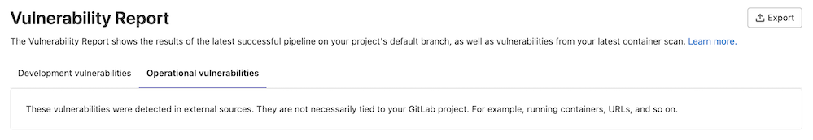

# Vulnerability Report

DETAILS:
**Tier:** Ultimate
**Offering:** GitLab.com, Self-managed, GitLab Dedicated

The Vulnerability Report provides information about vulnerabilities from scans of the default branch. It contains
cumulative results of all successful jobs, regardless of whether the pipeline was successful. The scan results from a
pipeline are ingested either after the job in the pipeline is complete or when the pipeline is [blocked by manual jobs](../vulnerability_report/pipeline.md#security-reports-from-pipelines-in-a-blocked-or-incomplete-state).

<i class="fa fa-youtube-play youtube" aria-hidden="true"></i>
For an overview, see [Vulnerability Management](https://www.youtube.com/watch?v=alMRIq5UPbw).

At all levels, the Vulnerability Report contains:

- Totals of vulnerabilities per severity level.
- Filters for common vulnerability attributes.
- Details of each vulnerability, presented in tabular layout. For some vulnerabilities, the details
  include a link to the relevant file and line number, in the default branch.

At the project level, the Vulnerability Report also contains:

- A time stamp showing when it was updated, including a link to the latest pipeline.
- The number of failures that occurred in the most recent pipeline. Select the failure
  notification to view the **Failed jobs** tab of the pipeline's page.

The **Activity** column contains icons to indicate the activity, if any, taken on the vulnerability
in that row:

- Issues **{issues}**: Links to issues created for the vulnerability. For more information, see
  [Create a GitLab issue for a vulnerability](../vulnerabilities/index.md#create-a-gitlab-issue-for-a-vulnerability).
- Merge requests **{merge-request}**: Links to merge requests created for the vulnerability. For more information, see
  [Resolve a vulnerability with a merge request](../vulnerabilities/index.md#resolve-a-vulnerability-with-a-merge-request).
- Checked circle **{check-circle-dashed}**: The vulnerability has been remediated.
- False positive **{false-positive}**: The scanner determined this vulnerability to be a false
  positive.
- Solution **{bulb}**: Indicates that the vulnerability has a solution available.

To open an issue created for a vulnerability, hover over the **Activity** entry, then select the link.
The issue icon (**{issues}**) indicates the issue's status. If [Jira issue support](../../../integration/jira/configure.md) is enabled, the
issue link found in the **Activity** entry links out to the issue in Jira. Unlike GitLab issues, the
status of a Jira issue is not shown in the GitLab UI.

When vulnerabilities originate from a multi-project pipeline setup,
this page displays the vulnerabilities that originate from the selected project.

## View the vulnerability report

View the vulnerability report to list all vulnerabilities in the project or group.

Prerequisites:

- You must have at least the Developer role for the project or group.

To view the vulnerability report:

1. On the left sidebar, select **Search or go to** and find your project or group.
1. Select **Secure > Vulnerability report**.

## Filtering vulnerabilities

You can filter vulnerabilities in the vulnerability report to more efficiently triage them.

You can filter by:

<!-- vale gitlab_base.SubstitutionWarning = NO -->

- **Status**: Detected, confirmed, dismissed, resolved. For details on what each status means, see
  [vulnerability status values](../vulnerabilities/index.md#vulnerability-status-values).
- **Severity**: Critical, high, medium, low, info, unknown.
- **Tool**: For more details, see [Tool filter](#tool-filter).
- **Activity**: For more details, see [Activity filter](#activity-filter).
- **Project**: Filter vulnerabilities in specific projects (available only for groups).

<!-- vale gitlab_base.SubstitutionWarning = YES -->

### Filter vulnerabilities

> - Improved filtering [introduced](https://gitlab.com/groups/gitlab-org/-/epics/13339) in GitLab 16.9 [with a flag](../../../administration/feature_flags.md) named `vulnerability_report_advanced_filtering`. Disabled by default.
> - [Enabled on GitLab.com, self-managed, and GitLab Dedicated](https://gitlab.com/gitlab-org/gitlab/-/issues/437128) in GitLab 17.1.

Filter the vulnerability report to focus on a subset of vulnerabilities.

To filter the list of vulnerabilities:

1. On the left sidebar, select **Search or go to** and find your project.
1. Select **Secure > Vulnerability report**.
1. Optional. To remove the default filters, select **Clear** (**{clear}**).
1. Above the list of vulnerabilities, select the filter bar.
1. In the dropdown list that appears, select an attribute you want to filter by, then select the
   values from the dropdown list.
1. Select outside the filter field. The vulnerability severity totals and list of matching
   vulnerabilities are updated.
1. To filter by multiple attributes, repeat the three previous steps. Multiple attributes are joined
   by a logical AND.

### Tool filter

> - [Introduced](https://gitlab.com/groups/gitlab-org/-/epics/11237) for projects in GitLab 16.6.

You can filter vulnerabilities by the tool that detected them. By default, the vulnerability report
lists vulnerabilities from all tools. For details of each of the available tools, see
[Security scanning tools](../index.md#application-coverage).

Use the **Manually added** attribute to filter vulnerabilities that were added manually.

In GitLab 17.1 and later, the tool filter's content is different between groups and projects:

- For groups, the tool filter lists the individual tools.
- For projects, the tool filter groups the tools by scanning category.

In GitLab 16.6 to 17.0, the tool filter's content is different between groups and projects:

- For groups, the tool filter lists the individual tools.
- For projects, the tool filter lists the individual tools if there are no third-party tools. If
  there are third-party tools, the tool filter groups the tools by scanning category.

In GitLab 16.5 and earlier, the tool filter groups the tools by vendor.
If only GitLab analyzers are enabled, only those analyzers are listed.

### Project filter

The content of the Project filter depends on the current level:

- **Security Center**: Only projects you've [added to your personal Security Center](../security_dashboard/index.md#adding-projects-to-the-security-center).
- **Group level**: All projects in the group.
- **Project level**: Not applicable.

### Activity filter

> - Introduced in GitLab 16.7 [with a flag](../../../administration/feature_flags.md) named `activity_filter_has_remediations`. Disabled by default.
> - [Generally available](https://gitlab.com/gitlab-org/gitlab/-/issues/429262) in GitLab 16.9. Feature flag `activity_filter_has_remediations` removed.

The activity filter behaves differently from the other filters. You can select only one value in
each category. To remove a filter, from the activity filter dropdown list select the filter you want to remove.

Selection behavior when using the activity filter:

- **Activity**
  - **All activity**: Vulnerabilities with any activity status (same as ignoring this filter). Selecting this deselects all other activity filter options.
- **Detection**
  - **Still detected** (default): Vulnerabilities that are still detected in the latest pipeline scan of the `default` branch.
  - **No longer detected**: Vulnerabilities that are no longer detected in the latest pipeline scan of the `default` branch.
- **Issue**
  - **Has issues**: Vulnerabilities with one or more associated issues.
  - **Does not have issue**: Vulnerabilities without an associated issue.
- **Merge request**
  - **Has merge request**: Vulnerabilities with one or more associated merge requests.
  - **Does not have merge request**: Vulnerabilities without an associated merge request.
- **Solution available**
  - **Has a solution**: Vulnerabilities with an available solution.
  - **Does not have a solution**: Vulnerabilities without an available solution.

## Grouping vulnerabilities

> - Project-level grouping of vulnerabilities [introduced](https://gitlab.com/groups/gitlab-org/-/epics/10164) in GitLab 16.4 [with a flag](../../../administration/feature_flags.md) named `vulnerability_report_grouping`. Disabled by default.
> - Project-level grouping of vulnerabilities [enabled on self-managed and GitLab Dedicated](https://gitlab.com/gitlab-org/gitlab/-/merge_requests/134073) in GitLab 16.5.
> - Project-level grouping of vulnerabilities [generally available](https://gitlab.com/gitlab-org/gitlab/-/issues/422509) in GitLab 16.6. Feature flag `vulnerability_report_grouping` removed.
> - Group-level grouping of vulnerabilities [introduced](https://gitlab.com/gitlab-org/gitlab/-/merge_requests/137778) in GitLab 16.7 with a flag named [`group_level_vulnerability_report_grouping`](https://gitlab.com/gitlab-org/gitlab/-/issues/432778). Disabled by default.
> - Group-level grouping of vulnerabilities [enabled on GitLab.com, self-managed, and GitLab Dedicated](https://gitlab.com/gitlab-org/gitlab/-/merge_requests/157949) in GitLab 17.2.
> - Group-level grouping of vulnerabilities [generally available](https://gitlab.com/gitlab-org/gitlab/-/issues/472669) in GitLab 17.3. Feature flag `group_level_vulnerability_report_grouping` removed.

You can group vulnerabilities on the vulnerability report page to more efficiently triage them.

You can group by:

- Status
- Severity
- Tool
- OWASP top 10 2017

WARNING:
Support for grouping by OWASP top 10 2017 was
[deprecated](https://gitlab.com/gitlab-org/gitlab/-/issues/458835) in GitLab 17.0 and is planned for
removal in 17.4. Support for grouping by OWASP top 10 2021 is proposed in [issue 440182](https://gitlab.com/gitlab-org/gitlab/-/issues/440182) for GitLab 17.4.

### Group vulnerabilities

Group vulnerabilities on the vulnerability report page to more efficiently triage them.

To group vulnerabilities:

1. On the left sidebar, select **Search or go to** and find your project or group.
1. Select **Secure > Vulnerability report**.
1. From the **Group By** dropdown list, select a group.

Vulnerabilities are grouped according to the group you selected. Each group is collapsed, with
the total number of vulnerabilities per group displayed beside their name. To see the
vulnerabilities in each group, select the group's name.

## View details of a vulnerability

To view more details of a vulnerability, select the vulnerability's **Description**. The
[vulnerability's details](../vulnerabilities/index.md) page is opened.

## Change status of vulnerabilities

> - Providing a comment and dismissal reason [introduced](https://gitlab.com/gitlab-org/gitlab/-/issues/408366) in GitLab 16.0.

As you triage vulnerabilities you can change their status, including dismissing vulnerabilities.

When a vulnerability is dismissed, the audit log includes a note of who dismissed it, when it was
dismissed, and the reason it was dismissed. You cannot delete vulnerability records, so a permanent
record always remains.

Prerequisites:

- You must have at least the Maintainer role for the project. The `admin_vulnerability` permission was [removed](https://gitlab.com/gitlab-org/gitlab/-/issues/412693) from the Developer role in GitLab 17.0.

To change the status of vulnerabilities:

1. On the left sidebar, select **Search or go to** and find your project.
1. Select **Secure > Vulnerability report**.
1. To select:
   - One or more vulnerabilities, select the checkbox beside each vulnerability.
   - All vulnerabilities on the page, select the checkbox in the table header.
1. In the **Set status** dropdown list, select the desired status.
1. If the **Dismiss** status is chosen, select the desired reason in the **Set dismissal reason** dropdown list.
1. In the **Add a comment** input, you can provide a comment. For the **Dismiss** status, a comment is required.
1. Select **Change status**.

The status of the selected vulnerabilities is updated and the content of the vulnerability report is
refreshed.

## Sort vulnerabilities by date detected

By default, vulnerabilities are sorted by severity level, with the highest-severity vulnerabilities listed at the top.

To sort vulnerabilities by the date each vulnerability was detected, select the "Detected" column header.

## Export vulnerability details

> - Added "Dismissal Reason" as a column in the CSV export [introduced](https://gitlab.com/gitlab-org/gitlab/-/issues/434076) in GitLab 16.8.

You can export details of the vulnerabilities listed in the Vulnerability Report. The export format
is CSV (comma separated values). All vulnerabilities are included because filters do not
apply to the export.

Fields included are:

- Status (See the following table for details of how the status value is exported.)
- Group name
- Project name
- Tool
- Scanner name
- Vulnerability
- Basic details
- Additional information
- Severity
- [CVE](https://cve.mitre.org/) (Common Vulnerabilities and Exposures)
- [CWE](https://cwe.mitre.org/) (Common Weakness Enumeration)
- Other identifiers
- Detected At
- Location
- Activity: Returns `true` if the vulnerability is resolved on the default branch, and `false` if not.
- Comments
- Full Path
- CVSS Vectors
- [Dismissal Reason](../vulnerabilities/index.md#vulnerability-dismissal-reasons)

NOTE:
Full details are available through our
[Job Artifacts API](../../../api/job_artifacts.md#download-a-single-artifact-file-from-specific-tag-or-branch).
Use one of the `gl-*-report.json` report filenames in place of `*artifact_path`
to obtain, for example, the path of files in which vulnerabilities were detected.

The Status field's values shown in the vulnerability report are different to those contained
in the vulnerability export. Use the following reference table to match them.

| Vulnerability report | Vulnerability export |
|:---------------------|:---------------------|
| Needs triage         | detected             |
| Dismissed            | dismissed            |
| Resolved             | resolved             |
| Confirmed            | confirmed            |

### Export details in CSV format

To export details of all vulnerabilities listed in the Vulnerability Report, select **Export**.

The details are retrieved from the database, then the CSV file is downloaded to your local
computer.

NOTE:
It may take several minutes for the download to start if your project contains
thousands of vulnerabilities. Do not close the page until the download finishes.
Some CSV readers have limitations on the number of rows or size of columns which
may make them incompatible with larger exports. The vulnerability export does not
account for the limitations of individual programs.

## Manually add a vulnerability

> - [Feature flag `new_vulnerability_form`](https://gitlab.com/gitlab-org/gitlab/-/issues/359049) removed in GitLab 15.0.

Add a vulnerability manually when it is not available in the GitLab vulnerabilities database. You
can add a vulnerability only in a project's vulnerability report.

To add a vulnerability manually:

1. On the left sidebar, select **Search or go to** and find your project.
1. Select **Secure > Vulnerability report**.
1. Select **Submit vulnerability**.
1. Complete the fields and submit the form.

The newly-created vulnerability's detail page is opened.

## Operational vulnerabilities

The **Operational vulnerabilities** tab lists vulnerabilities found by [Operational container scanning](../../clusters/agent/vulnerabilities.md).
This tab appears on the project, group, and Security Center vulnerability reports.

