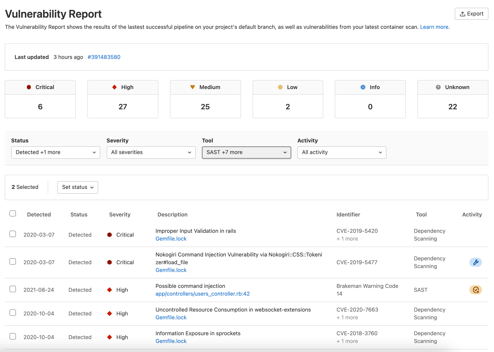

# Vulnerability Report **(ULTIMATE)**

The Vulnerability Report provides information about vulnerabilities from scans of the default branch. It contains cumulative results of all successful jobs, regardless of whether the pipeline was successful.

The scan results from a pipeline are only ingested after all the jobs in the pipeline complete. Partial results for a pipeline with jobs in progress can be seen in the pipeline security tab.

The report is available for users with the [correct role](../../permissions.md) on projects, groups, and the Security Center.

At all levels, the Vulnerability Report contains:

- Totals of vulnerabilities per severity level.
- Filters for common vulnerability attributes.
- Details of each vulnerability, presented in tabular layout.

<i class="fa fa-youtube-play youtube" aria-hidden="true"></i>
For an overview, see [Vulnerability Management](https://www.youtube.com/watch?v=8SJHz6BCgXM).

The **Activity** column contains icons to indicate the activity, if any, taken on the vulnerability
in that row:

- Issues **{issues}**: Links to issues created for the vulnerability. For more details, read
  [Create an issue for a vulnerability](../vulnerabilities/index.md#creating-an-issue-for-a-vulnerability).
- Wrench **{admin}**: The vulnerability has been remediated.
- False positive **{false-positive}**: The scanner determined this vulnerability to be a false
  positive.

## Project-level Vulnerability Report

> [Introduced](https://gitlab.com/gitlab-org/gitlab/-/issues/6165) in GitLab 11.1.

At the project level, the Vulnerability Report also contains:

- A time stamp showing when it was updated, including a link to the latest pipeline.
- The number of failures that occurred in the most recent pipeline. Select the failure
  notification to view the **Failed jobs** tab of the pipeline's page.

### View the project-level vulnerability report

To view the project-level vulnerability report:

1. On the top bar, select **Main menu > Projects** and find your project.
1. On the left sidebar, select **Security and Compliance > Vulnerability report**.

## Vulnerability Report actions

From the Vulnerability Report you can:

- [Filter the list of vulnerabilities](#filter-the-list-of-vulnerabilities).
- [View more details about a vulnerability](#view-details-of-a-vulnerability).
- [View vulnerable source location](#view-vulnerable-source-location) (if available).
- [View an issue raised for a vulnerability](#view-issues-raised-for-a-vulnerability).
- [Change the status of vulnerabilities](#change-status-of-vulnerabilities).
- [Export details of vulnerabilities](#export-vulnerability-details).
- [Sort vulnerabilities by date](#sort-vulnerabilities-by-date-detected).
- [Manually add a vulnerability finding](#manually-add-a-vulnerability-finding).

## Vulnerability Report filters

You can filter the Vulnerability Report to narrow focus on only vulnerabilities matching specific
criteria.

The available filters are:

<!-- vale gitlab.SubstitutionWarning = NO -->

- **Status**: Detected, Confirmed, Dismissed, Resolved.
- **Severity**: Critical, High, Medium, Low, Info, Unknown.
- **Tool**: For more details, see [Tool filter](#tool-filter).
- **Project**: For more details, see [Project filter](#project-filter).
- **Activity**: For more details, see [Activity filter](#activity-filter).

The filters' criteria are combined to show only vulnerabilities matching all criteria.
An exception to this behavior is the Activity filter. For more details about how it works, see
[Activity filter](#activity-filter).

<!-- vale gitlab.SubstitutionWarning = YES -->

### Filter the list of vulnerabilities

To filter the list of vulnerabilities:

1. Select a filter.
1. Select values from the dropdown list.
1. Repeat the above steps for each desired filter.

After each filter is selected:

- The list of matching vulnerabilities is updated.
- The vulnerability severity totals are updated.

### Tool filter

> The third-party tool filter was [introduced](https://gitlab.com/gitlab-org/gitlab/-/issues/229661) in GitLab 13.12.

The tool filter allows you to focus on vulnerabilities detected by selected tools.

When using the tool filter, you can choose:

- **All tools** (default).
- Individual GitLab-provided tools.
- Any integrated third-party tool.

For details of each of the available tools, see [Security scanning tools](../index.md#application-coverage).

### Project filter

The content of the Project filter depends on the current level:

- **Security Center**: Only projects you've [added to your personal Security Center](../security_dashboard/index.md#add-projects-to-the-security-center).
- **Group level**: All projects in the group.
- **Project level**: Not applicable.

### Activity filter

> [Introduced](https://gitlab.com/gitlab-org/gitlab/-/issues/259255) in GitLab 13.9

The Activity filter behaves differently from the other filters. The selected values form mutually
exclusive sets to allow for precisely locating the desired vulnerability records. Additionally, not
all options can be selected in combination.

Selection behavior when using the Activity filter:

- **All**: Vulnerabilities with any Activity status (same as ignoring this filter). Selecting this deselects any other Activity filter options.
- **No activity**: Only vulnerabilities without either an associated issue or that are no longer detected. Selecting this deselects any other Activity filter options.
- **With issues**: Only vulnerabilities with one or more associated issues. Does not include vulnerabilities that also are no longer detected.
- **No longer detected**: Only vulnerabilities that are no longer detected in the latest pipeline scan of the `default` branch. Does not include vulnerabilities with one or more associated issues.
- **With issues** and **No longer detected**: Only vulnerabilities that have one or more associated issues and also are no longer detected in the latest pipeline scan of the `default` branch.

## View details of a vulnerability

To view more details of a vulnerability, select the vulnerability's **Description**. The
[vulnerability's details](../vulnerabilities) page is opened.

## View vulnerable source location

> [Introduced](https://gitlab.com/gitlab-org/gitlab/-/issues/267509) in GitLab 13.10.

Some security scanners output the filename and line number of a potential vulnerability. When
that information is available, the vulnerability's details include a link to the relevant file,
in the default branch.

To view the relevant file, select the filename in the vulnerability's details.

## View issues raised for a vulnerability

The **Activity** column indicates the number of issues that have been created for the vulnerability.
Hover over an **Activity** entry and select a link go to that issue. The status of whether the issue is open or closed also displays in the hover menu.

If Jira issue support is enabled, the issue link found in the Activity entry links out to the issue in Jira. Unlike GitLab issues, the status of whether a Jira issue is Open or Closed does not display in the GitLab UI.

## Change status of vulnerabilities

> - [Introduced](https://gitlab.com/gitlab-org/gitlab/-/issues/292636) in GitLab 13.10, all statuses became selectable.
> - Providing a comment and dismissal reason [introduced](https://gitlab.com/gitlab-org/gitlab/-/issues/408366) in GitLab 16.0.

From the Vulnerability Report you can change the status of one or more vulnerabilities.

To change the status of vulnerabilities in the table:

1. Select the checkbox beside each vulnerability you want to update the status of. To select all,
   select the checkbox in the table header.
1. In the **Set status** dropdown list, select the desired status.
1. If the **Dismissed** status is chosen, select the desired reason in the **Set dismissal reason** dropdown list.
1. In the **Add a comment** input, you can provide a comment. For the **Dismissed** status, a comment is required.
1. Select **Change status**.

## Sort vulnerabilities by date detected

By default, vulnerabilities are sorted by severity level, with the highest-severity vulnerabilities listed at the top.

To sort vulnerabilities by the date each vulnerability was detected, select the "Detected" column header.

## Export vulnerability details

> - [Introduced](https://gitlab.com/gitlab-org/gitlab/-/issues/213014) in the Security Center (previously known as the Instance Security Dashboard) and project-level Vulnerability Report (previously known as the Project Security Dashboard) in GitLab 13.0.
> - [Added](https://gitlab.com/gitlab-org/gitlab/-/issues/213013) to the group-level Vulnerability Report in GitLab 13.1.

You can export details of the vulnerabilities listed in the Vulnerability Report. The export format
is CSV (comma separated values). All vulnerabilities are included because filters do not
apply to the export.

Fields included are:

- Group name
- Project name
- Scanner type
- Scanner name
- Status
- Vulnerability
- Basic details
- Additional information
- Severity
- [CVE](https://cve.mitre.org/) (Common Vulnerabilities and Exposures)
- [CWE](https://cwe.mitre.org/) (Common Weakness Enumeration)
- Other identifiers
- Detected At
- Location
- Activity: Returns `true` if the vulnerability is resolved on the default branch, and `false` if not.
- Comments

NOTE:
Full details are available through our
[Job Artifacts API](../../../api/job_artifacts.md#download-a-single-artifact-file-from-specific-tag-or-branch).
Use one of the `gl-*-report.json` report filenames in place of `*artifact_path`
to obtain, for example, the path of files in which vulnerabilities were detected.

### Export details in CSV format

To export details of all vulnerabilities listed in the Vulnerability Report, select **Export**.

The details are retrieved from the database, then the CSV file is downloaded to your local
computer.

NOTE:
It may take several minutes for the download to start if your project contains
thousands of vulnerabilities. Do not close the page until the download finishes.

## Dismiss a vulnerability

> The option of adding a dismissal reason was introduced in GitLab 12.0.

When you evaluate a vulnerability and decide it requires no more action,
you can mark it as **Dismissed**.
Dismissed vulnerabilities do not appear in the merge request security widget
when detected in future scans.

When a vulnerability is dismissed in a project or group, a record is made of:

- Who dismissed it.
- Date and time when it was dismissed.
- Optionally, a reason why it was dismissed.

Vulnerability records cannot be deleted, so a permanent record always remains.

You can dismiss a vulnerability in projects and groups:

1. Select the vulnerability in the Security Dashboard.
1. In the upper-right corner, from the **Status** dropdown list, select **Dismissed**.
1. Optional. Add a reason for the dismissal and select **Save comment**.

To undo this action, select a different status from the same menu.

## Manually add a vulnerability finding

> - [Introduced](https://gitlab.com/gitlab-org/gitlab/-/issues/301003) in GitLab 14.9. Disabled by default.
> - [Enabled on GitLab.com](https://gitlab.com/gitlab-org/gitlab/-/issues/353796) in GitLab 14.10.
> - [Feature flag `new_vulnerability_form`](https://gitlab.com/gitlab-org/gitlab/-/issues/359049) removed in GitLab 15.0.

To add a new vulnerability finding from your project level Vulnerability Report page:

1. On the top bar, select **Main menu > Projects** and find your project.
1. On the left sidebar, select **Security and Compliance > Vulnerability Report**.
1. Select **Submit vulnerability**.
1. Complete the fields and submit the form.

You are brought to the newly created vulnerability's detail page. Manually created records appear in the
Group, Project, and Security Center Vulnerability Reports. To filter them, use the Generic Tool filter.

## Operational vulnerabilities

> [Introduced](https://gitlab.com/groups/gitlab-org/-/epics/6345) in GitLab 14.6.

The **Operational vulnerabilities** tab lists vulnerabilities found by [Operational container scanning](../../clusters/agent/vulnerabilities.md).
This tab appears on the project, group, and Security Center vulnerability reports.

