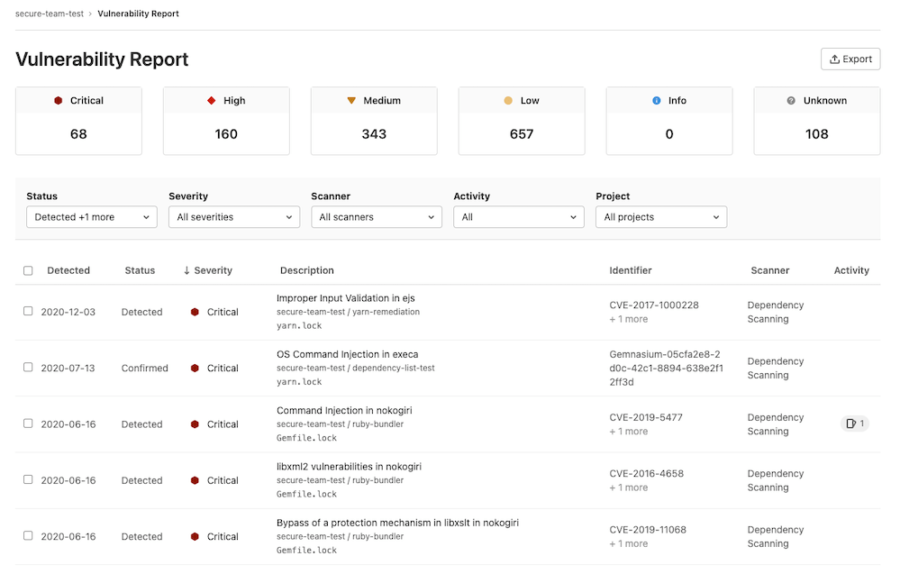
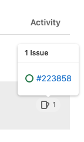
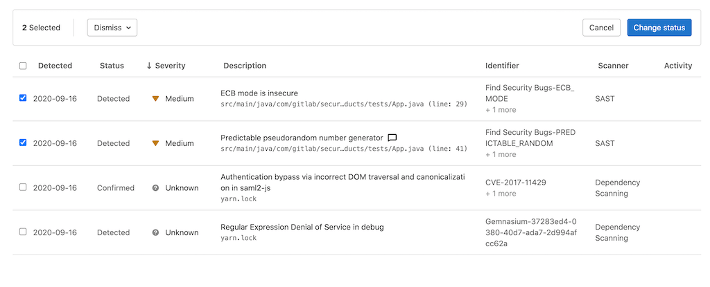

# Vulnerability Report **(ULTIMATE)**

The Vulnerability Report provides information about vulnerabilities from scans of the branch most
recently merged into the default branch. It is available for groups, projects, and the Security Center.

At all levels, the Vulnerability Report contains:

- Totals of vulnerabilities per severity level.
- Filters for common vulnerability attributes.
- Details of each vulnerability, presented in tabular layout.

## Project-level Vulnerability Report

> [Introduced](https://gitlab.com/gitlab-org/gitlab/-/issues/6165) in GitLab 11.1.

The project-level Vulnerability Report also contains:

- A time stamp showing when it was updated, including a link to the latest pipeline.
- The number of failures that occurred in the most recent pipeline. Select the failure
  notification to view the **Failed jobs** tab of the pipeline's page.

To access the report, navigate to **Security & Compliance > Vulnerability Report**.

## Vulnerability Report actions

From the Vulnerability Report you can:

- [Filter the list of vulnerabilities](#filter-the-list-of-vulnerabilities).
- [View more details about a vulnerability](#view-details-of-a-vulnerability).
- [View vulnerable source location](#view-vulnerable-source-location) (if available).
- [View an issue raised for a vulnerability](#view-issues-raised-for-a-vulnerability).
- [Change the status of vulnerabilities](#change-status-of-vulnerabilities).
- [Export details of vulnerabilities](#export-vulnerability-details).

## Vulnerability Report filters

You can filter the vulnerabilities table by:

| Filter   | Available options |
|:---------|:------------------|
| Status   | Detected, Confirmed, Dismissed, Resolved. |
| Severity | Critical, High, Medium, Low, Info, Unknown. |
| Scanner  | For more details, see [Scanner filter](#scanner-filter). |
| Project  | For more details, see [Project filter](#project-filter). |
| Activity | For more details, see [Activity filter](#activity-filter). |

### Filter the list of vulnerabilities

To filter the list of vulnerabilities:

1. Select a filter.
1. Select values from the dropdown.
1. Repeat the above steps for each desired filter.

After each filter is selected:

- The list of matching vulnerabilities is updated.
- The vulnerability severity totals are updated.

The filters' criteria are combined to show only vulnerabilities matching all criteria.
An exception to this behavior is the Activity filter. For more details about how it works, see
[Activity filter](#activity-filter).

## Scanner filter

The scanner filter allows you to focus on vulnerabilities detected by selected scanners.

When using the scanner filter, you can choose:

- **All scanners** (default).
- Individual GitLab-provided scanners.
- Any integrated 3rd-party scanner. [Introduced](https://gitlab.com/gitlab-org/gitlab/-/issues/229661) in GitLab 13.12.

For details of each of the available scanners, see [Security scanning tools](../index.md#security-scanning-tools).

### Project filter

The content of the Project filter depends on the current level:

| Level          | Content of the Project filter |
|:---------------|:------------------------------|
| Security Center | Only projects you've [added to your personal Security Center](../security_dashboard/index.md#adding-projects-to-the-security-center). |
| Group level    | All projects in the group. |
| Project level  | Not applicable. |

### Activity filter

> [Introduced](https://gitlab.com/gitlab-org/gitlab/-/issues/259255) in GitLab 13.9

The Activity filter behaves differently from the other filters. The selected values form mutually
exclusive sets to allow for precisely locating the desired vulnerability records. Additionally, not
all options can be selected in combination.

Selection behavior when using the Activity filter:

| Activity selection                  | Results displayed |
|:------------------------------------|:------------------|
|  All                                | Vulnerabilities with any Activity status (same as ignoring this filter). Selecting this deselects any other Activity filter options. |
|  No activity                        | Only vulnerabilities without either an associated Issue or that are no longer detected. Selecting this deselects any other Activity filter options. |
|  With issues                        | Only vulnerabilities with one or more associated issues. Does not include vulnerabilities that also are no longer detected. |
|  No longer detected                 | Only vulnerabilities that are no longer detected in the latest pipeline scan of the `default` branch. Does not include vulnerabilities with one or more associated issues. |
|  With issues and No longer detected | Only vulnerabilities that have one or more associated issues and also are no longer detected in the latest pipeline scan of the `default` branch. |

## View details of a vulnerability

To view more details of a vulnerability, select the vulnerability's **Description**. The
[vulnerability's details](../vulnerabilities) page is opened.

## View vulnerable source location

> [Introduced](https://gitlab.com/gitlab-org/gitlab/-/issues/267509) in GitLab 13.10.

Some security scanners output the filename and line number of a potential vulnerability. When
that information is available, the vulnerability's details include a link to the relevant file,
in the default branch.

To view the relevant file, select the filename in the vulnerability's details.

## View issues raised for a vulnerability

The **Activity** column indicates the number of issues that have been created for the vulnerability.
Hover over an **Activity** entry and select a link go to that issue. The status of whether the issue is open or closed also displays in the hover menu.

If Jira issue support is enabled, the issue link found in the Activity entry links out to the issue in Jira. Unlike GitLab issues, the status of whether a Jira issue is Open or Closed does not display in the GitLab UI.

## Change status of vulnerabilities

> [Introduced](https://gitlab.com/gitlab-org/gitlab/-/issues/292636) in GitLab 13.10, all statuses became selectable.

To change the status of vulnerabilities in the table:

1. Select the checkbox for each vulnerability you want to update the status of.
1. In the dropdown that appears select the desired status, then select **Change status**.

## Export vulnerability details

> - [Introduced](https://gitlab.com/gitlab-org/gitlab/-/issues/213014) in the Security Center (previously known as the Instance Security Dashboard) and project-level Vulnerability Report (previously known as the Project Security Dashboard) in [GitLab Ultimate](https://about.gitlab.com/pricing/) 13.0.
> - [Added](https://gitlab.com/gitlab-org/gitlab/-/issues/213013) to the group-level Vulnerability Report in [GitLab Ultimate](https://about.gitlab.com/pricing/) 13.1.

You can export details of the vulnerabilities listed in the Vulnerability Report. The export format
is CSV (comma separated values). Note that all vulnerabilities are included because filters don't
apply to the export.

Fields included are:

- Group name
- Project name
- Scanner type
- Scanner name
- Status
- Vulnerability
- Details
- Additional information
- Severity
- [CVE](https://cve.mitre.org/) (Common Vulnerabilities and Exposures)
- [CWE](https://cwe.mitre.org/) (Common Weakness Enumeration)
- Other identifiers

### Export details in CSV format

To export details of all vulnerabilities listed in the Vulnerability Report, select **Export**.

The details are retrieved from the database, then the CSV file is downloaded to your local
computer.

NOTE:
It may take several minutes for the download to start if your project contains
thousands of vulnerabilities. Don't close the page until the download finishes.

## Dismiss a vulnerability

> The option of adding a dismissal reason was introduced in [GitLab Ultimate](https://about.gitlab.com/pricing/) 12.0.

You can dismiss a vulnerability for the entire project:

1. Select the vulnerability in the Security Dashboard.
1. In the top-right, from the **Status** selector menu, select **Dismissed**.
1. Optional. Add a reason for the dismissal and select **Save comment**.

To undo this action, select a different status from the same menu.

### Dismiss multiple vulnerabilities

> [Introduced](https://gitlab.com/gitlab-org/gitlab/-/issues/35816) in [GitLab Ultimate](https://about.gitlab.com/pricing/) 12.9.

You can dismiss multiple vulnerabilities at once:

1. In the list of vulnerabilities, select the checkbox for each vulnerability you want to dismiss.
   To select all, select the checkbox in the table header.
1. Above the table, select a dismissal reason.
1. Select **Dismiss Selected**.
