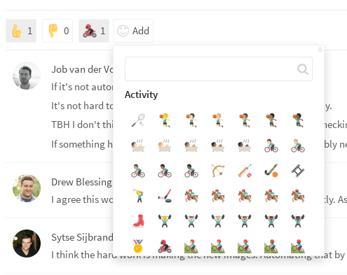
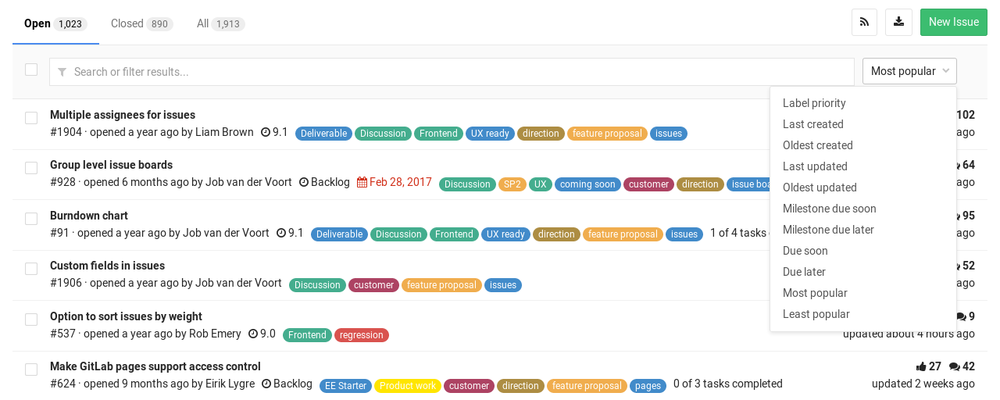
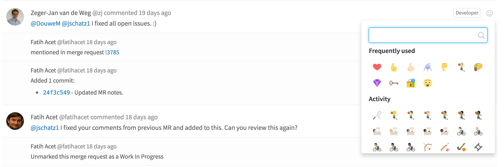
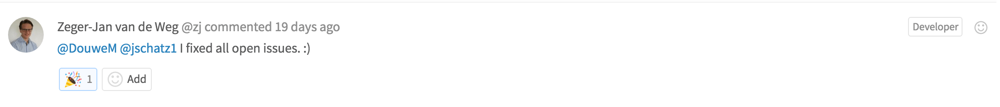

# Award emoji

> **Notes:**
> - First [introduced][1825] in GitLab 8.2.
> - GitLab 9.0 [introduced][ce-9570] the usage of native emojis if the platform
>  supports them and falls back to images or CSS sprites. This change greatly
>  improved the award emoji performance overall.

When you're collaborating online, you get fewer opportunities for high-fives
and thumbs-ups. Emoji can be awarded to issues, merge requests, snippets, and
virtually everywhere where you can have a discussion.

Award emoji make it much easier to give and receive feedback without a long
comment thread. Comments that are only emoji will automatically become
award emoji.

## Sort issues and merge requests on vote count

> [Introduced][2871] in GitLab 8.5.

You can quickly sort issues and merge requests by the number of votes they
have received. The sort options can be found in the dropdown menu as "Most
popular" and "Least popular".

The total number of votes is not summed up. An issue with 18 upvotes and 5
downvotes is considered more popular than an issue with 17 upvotes and no
downvotes.

## Award emoji for comments

> [Introduced][4291] in GitLab 8.9.

Award emoji can also be applied to individual comments when you want to
celebrate an accomplishment or agree with an opinion.

To add an award emoji, click the smile in the top right of the comment and pick
an emoji from the dropdown. If you want to remove an award emoji, just click
the emoji again and the vote will be removed.

[2871]: https://gitlab.com/gitlab-org/gitlab-ce/merge_requests/2781
[1825]: https://gitlab.com/gitlab-org/gitlab-ce/merge_requests/1825
[4291]: https://gitlab.com/gitlab-org/gitlab-ce/merge_requests/4291
[ce-9570]: https://gitlab.com/gitlab-org/gitlab-ce/merge_requests/9570
