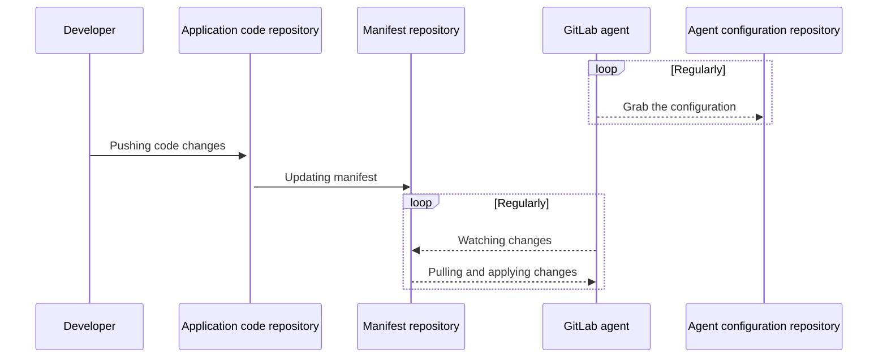

# Using a GitOps workflow for Kubernetes **(PREMIUM)**

> [Introduced](https://gitlab.com/gitlab-org/gitlab/-/issues/259669) in GitLab 13.7.

With GitOps, you can manage containerized clusters and applications from a Git repository that:

- Is the single source of truth of your system.
- Is the single place where you operate your system.

By combining GitLab, Kubernetes, and GitOps, you can have:

- GitLab as the GitOps operator.
- Kubernetes as the automation and convergence system.
- GitLab CI/CD for Continuous Integration and the agent for Continuous Deployment.

This diagram shows the repositories and main actors in a GitOps deployment:



For details, view the [architecture documentation](https://gitlab.com/gitlab-org/cluster-integration/gitlab-agent/-/blob/master/doc/architecture.md#high-level-architecture).

## GitOps workflow steps

To update a Kubernetes cluster by using GitOps, complete the following steps.

1. Ensure you have a working Kubernetes cluster, and that the manifests are in a GitLab project.
1. In the same project, [register and install the GitLab agent](install/index.md).
1. Configure the agent configuration file so that the agent monitors the project for changes to the Kubernetes manifests.
   Use the [GitOps configuration reference](#gitops-configuration-reference) for guidance.

Any time you commit updates to your Kubernetes manifests, the agent updates the cluster.

### GitOps configuration reference

The following snippet shows the possible keys and values for the GitOps section of an agent configuration file.

```yaml
gitops:
  # The agent watches projects where your manifests are stored.
  # When a project changes, the agent deploys the changes to the cluster.
  manifest_projects:
    # No authentication mechanisms are currently supported.
    # The `id` is a path to a Git repository that has
    # Kubernetes manifests in YAML or JSON format.
  - id: gitlab-org/cluster-integration/gitlab-agent
    # Namespace to use if not set explicitly in object manifest.
    # Also used for inventory ConfigMap objects.
    default_namespace: my-ns
    # Paths in the repository you want to scan for manifest files.
    # Directories with names that start with a dot are ignored.
    paths:
      # Read all .yaml files from team1/app1 directory.
      # See https://github.com/bmatcuk/doublestar#about and
      # https://pkg.go.dev/github.com/bmatcuk/doublestar/v2#Match for globbing rules.
    - glob: '/team1/app1/*.yaml'
      # Read all .yaml files from team2/apps and all subdirectories.
    - glob: '/team2/apps/**/*.yaml'
      # If 'paths' is not specified or is an empty list, the configuration below is used.
    - glob: '/**/*.{yaml,yml,json}'
    # Reconcile timeout defines whether the applier should wait
    # until all applied resources have been reconciled, and if so,
    # how long to wait.
    reconcile_timeout: 3600s # 1 hour by default
    # Dry run strategy defines whether changes should actually be performed,
    # or if it is just talk and no action.
    # https://github.com/kubernetes-sigs/cli-utils/blob/d6968048dcd80b1c7b55d9e4f31fc25f71c9b490/pkg/common/common.go#L68-L89
    # Can be: none, client, server
    dry_run_strategy: none # 'none' by default
    # Prune defines whether pruning of previously applied
    # objects should happen after apply.
    prune: true # enabled by default
    # Prune timeout defines whether we should wait for all resources
    # to be fully deleted after pruning, and if so, how long we should
    # wait.
    prune_timeout: 3600s # 1 hour by default
    # Prune propagation policy defines the deletion propagation policy
    # that should be used for pruning.
    # https://github.com/kubernetes/apimachinery/blob/44113beed5d39f1b261a12ec398a356e02358307/pkg/apis/meta/v1/types.go#L456-L470
    # Can be: orphan, background, foreground
    prune_propagation_policy: foreground # 'foreground' by default
    # Inventory policy defines if an inventory object can take over
    # objects that belong to another inventory object or don't
    # belong to any inventory object.
    # This is done by determining if the apply/prune operation
    # can go through for a resource based on comparison of
    # the inventory-id value in the package and the owning-inventory
    # annotation (config.k8s.io/owning-inventory) in the live object.
    # https://github.com/kubernetes-sigs/cli-utils/blob/d6968048dcd80b1c7b55d9e4f31fc25f71c9b490/pkg/inventory/policy.go#L12-L66
    # Can be: must_match, adopt_if_no_inventory, adopt_all
    inventory_policy: must_match # 'must_match' by default
```

## Troubleshooting

### Avoiding conflicts when you have multiple projects

The agent watches each glob pattern set under a project's `paths` section independently, and makes updates to the cluster concurrently.
If changes are found at multiple paths, when the agent attempts to update the cluster,
a conflict can occur.

To prevent this from happening, consider storing a logical group of manifests in a single place and reference them only once to avoid overlapping globs.

For example, both of these globs match `*.yaml` files in the root directory
and could cause conflicts:

```yaml
gitops:
  manifest_projects:
  - id: project1
    paths:
    - glob: '/**/*.yaml'
    - glob: '/*.yaml'
```

Instead, specify a single glob that matches all `*.yaml` files recursively:

```yaml
gitops:
  manifest_projects:
  - id: project1
    paths:
    - glob: '/**/*.yaml'
```

### Use multiple agents or projects

If you store your Kubernetes manifests in separate GitLab projects,
update your agent configuration file with the location of these projects.

WARNING:
The project with the agent's
configuration file can be private or public. Other projects with Kubernetes manifests must be public. Support for private manifest projects is tracked
in [this issue](https://gitlab.com/gitlab-org/gitlab/-/issues/283885).
