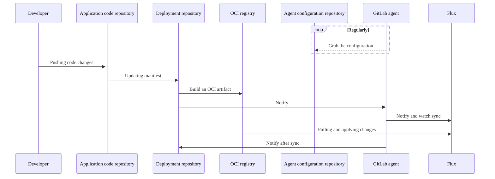

DETAILS:
**Tier:** Free, Premium, Ultimate
**Offering:** GitLab.com, GitLab Self-Managed, GitLab Dedicated

> - [Moved](https://gitlab.com/gitlab-org/gitlab/-/issues/346567) from GitLab Premium to GitLab Free in 15.3.
> - [Changed](https://gitlab.com/gitlab-org/gitlab/-/issues/346585) to make the `id` attribute optional in GitLab 15.7.
> - Specifying a branch, tag, or commit reference to fetch the Kubernetes manifest files [introduced](https://gitlab.com/groups/gitlab-org/-/epics/4516) in GitLab 15.7.
> - [Changed](https://gitlab.com/gitlab-org/gitlab/-/issues/395364) in GitLab 16.1 to prioritize Flux for GitOps.

GitLab integrates [Flux](https://fluxcd.io/flux/) for GitOps.
To get started with Flux, see the [Flux for GitOps tutorial](gitops/flux_tutorial.md).

With GitOps, you can manage containerized clusters and applications from a Git repository that:

- Is the single source of truth of your system.
- Is the single place where you operate your system.

By combining GitLab, Kubernetes, and GitOps, you can have:

- GitLab as the GitOps operator.
- Kubernetes as the automation and convergence system.
- GitLab CI/CD for Continuous Integration.
- The agent for Continuous Deployment and cluster observability.
- Built-in automatic drift remediation.
- Resource management with [server-side applies](https://kubernetes.io/docs/reference/using-api/server-side-apply/) for transparent multi-actor field management.

## Deployment sequence

This diagram shows the repositories and main actors in a GitOps deployment:



You should use both Flux and `agentk` for GitOps deployments. Flux keeps the cluster state synchronized with the source, while `agentk` simplifies the Flux setup, provides cluster-to-GitLab access management, and visualizes the cluster state in the GitLab UI.

### OCI for source control

You should use OCI images as a source controller for Flux, instead of a Git repository. The [GitLab container registry](../../packages/container_registry/_index.md) supports OCI images.

| OCI registry | Git repository |
| ---          | ---              |
| Designed to serve container images at scale. | Designed to version and store source code. |
| Immutable, supports security scans. | Mutable. |
| The default Git branch can store cluster state without triggering a sync. | The default Git branch triggers a sync when used to store cluster state. |

## Repository structure

To simplify configuration, use one delivery repository per team.
You can package the delivery repository into multiple OCI images per application.

For additional repository structure recommendations, see the [Flux documentation](https://fluxcd.io/flux/guides/repository-structure/).

## Immediate Git repository reconciliation

> - [Introduced](https://gitlab.com/gitlab-org/gitlab/-/issues/392852) in GitLab 16.1 with a [flag](../../../administration/feature_flags.md) named `notify_kas_on_git_push`. Disabled by default.
> - [Enabled on GitLab.com and GitLab Self-Managed](https://gitlab.com/gitlab-org/gitlab/-/merge_requests/126527) in GitLab 16.2.
> - [Feature flag removed](https://gitlab.com/gitlab-org/gitlab/-/issues/410429) in GitLab 16.3.

Usually, the Flux source controller reconciles Git repositories at configured intervals.
This can cause delays between a `git push` and the reconciliation of the cluster state, and results in
unnecessary pulls from GitLab.

The agent for Kubernetes automatically detects Flux `GitRepository` objects that
reference GitLab projects in the instance the agent is connected to,
and configures a [`Receiver`](https://fluxcd.io/flux/components/notification/receivers/) for the instance.
When the agent for Kubernetes detects a `git push` to a repository it has access to, the `Receiver` is triggered
and Flux reconciles the cluster with any changes to the repository.

To use immediate Git repository reconciliation, you must have a Kubernetes cluster that runs:

- The agent for Kubernetes.
- Flux `source-controller` and `notification-controller`.

Immediate Git repository reconciliation can reduce the time between a push and reconciliation,
but it doesn't guarantee that every `git push` event is received. You should still set
[`GitRepository.spec.interval`](https://fluxcd.io/flux/components/source/gitrepositories/#interval)
to an acceptable duration.

NOTE:
The agent only has access to the agent configuration project and all public projects.
The agent is not able to immediately reconcile any private projects, except the agent configuration project.
Allowing the agent to access private projects is proposed in [issue 389393](https://gitlab.com/gitlab-org/gitlab/-/issues/389393).

### Custom webhook endpoints

When the agent for Kubernetes calls the `Receiver` webhook,
the agent defaults to `http://webhook-receiver.flux-system.svc.cluster.local`,
which is also the default URL set by a Flux bootstrap installation. To configure a custom
endpoint, set `flux.webhook_receiver_url` to a URL that the agent can resolve. For example:

```yaml
flux:
  webhook_receiver_url: http://webhook-receiver.another-flux-namespace.svc.cluster.local
```

There is special handing for
[service proxy URLs](https://kubernetes.io/docs/tasks/access-application-cluster/access-cluster-services/) configured
in this format: `/api/v1/namespaces/[^/]+/services/[^/]+/proxy`. For example:

```yaml
flux:
  webhook_receiver_url: /api/v1/namespaces/flux-system/services/http:webhook-receiver:80/proxy
```

In these cases, the agent for Kubernetes uses the available Kubernetes configuration
and context to connect to the API endpoint.
You can use this if you run an agent outside a cluster
and you haven't [configured an `Ingress`](https://fluxcd.io/flux/guides/webhook-receivers/#expose-the-webhook-receiver)
for the Flux notification controller.

WARNING:
You should configure only trusted service proxy URLs.
When you provide a service proxy URL,
the agent for Kubernetes sends typical Kubernetes API requests which include
the credentials necessary to authenticate with the API service.

## Token management

To use certain Flux features, you might need multiple access tokens. Additionally, you can use multiple token types to achieve the same result.

This section provides guidelines for the tokens you might need, and provides token type recommendations where possible.

### GitLab access by Flux

To access the GitLab the container registry or Git repositories, Flux can use:

- A project or group deploy token.
- A project or group deploy key.
- A project or group access token.
- A personal access token.

The token does not need write access.

You should use project deploy tokens if `http` access is possible.
If you require `git+ssh` access, you should use deploy keys.
To compare deploy keys and deploy tokens, see [Deploy keys](../../project/deploy_keys/_index.md).

Support for automating deploy token creation, rotation, and reporting is proposed in [issue 389393](https://gitlab.com/gitlab-org/gitlab/-/issues/389393).

### Flux to GitLab notification

If you configure Flux to synchronize from a Git source, [Flux can register an external job status](https://fluxcd.io/flux/components/notification/providers/#git-commit-status-updates) in GitLab pipelines.

To get external job statuses from Flux, you can use:

- A project or group deploy token.
- A project or group access token.
- A personal access token.

The token requires `api` scope. To minimize the attack surface of a leaked token, you should use
a project access token.

Integrating Flux into GitLab pipelines as a job is proposed in [issue 405007](https://gitlab.com/gitlab-org/gitlab/-/issues/405007).

## Related topics

- [GitOps working examples for training and demos](https://gitlab.com/groups/guided-explorations/gl-k8s-agent/gitops/-/wikis/home)
- [Self-paced classroom workshop](https://gitlab-for-eks.awsworkshop.io) (Uses AWS EKS, but you can use for other Kubernetes clusters)
- Managing Kubernetes secrets in a GitOps workflow
  - [with SOPS built-in to Flux](https://fluxcd.io/flux/guides/mozilla-sops/)
  - [with Sealed Secrets](https://fluxcd.io/flux/guides/sealed-secrets/)
