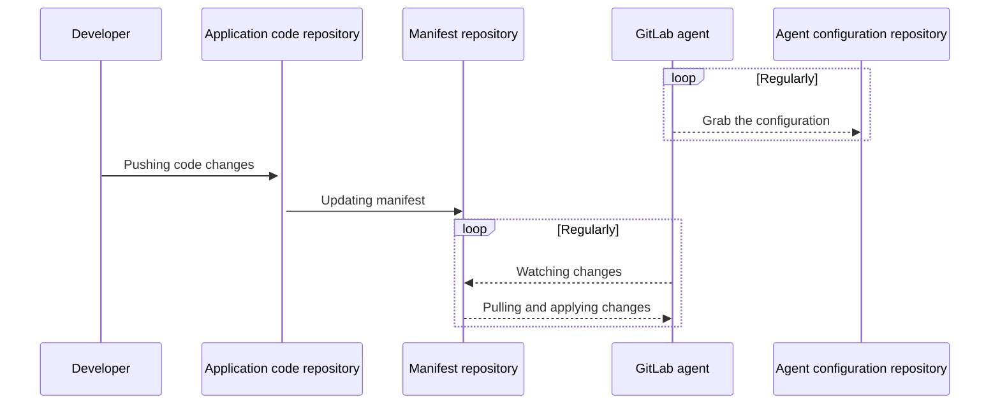

# Using GitOps with the agent for Kubernetes (deprecated)

DETAILS:
**Tier:** Free, Premium, Ultimate
**Offering:** GitLab.com, Self-managed, GitLab Dedicated

> - [Introduced](https://gitlab.com/gitlab-org/gitlab/-/issues/259669) in GitLab 13.7.
> - [Introduced](https://gitlab.com/gitlab-org/gitlab/-/issues/332227) in GitLab 14.0, the `resource_inclusions` and `resource_exclusions` attributes were removed and `reconcile_timeout`, `dry_run_strategy`, `prune`, `prune_timeout`, `prune_propagation_policy`, and `inventory_policy` attributes were added.
> - [Moved](https://gitlab.com/gitlab-org/gitlab/-/issues/346567) from GitLab Premium to GitLab Free in 15.3.
> - [Changed](https://gitlab.com/gitlab-org/gitlab/-/issues/346585) to make the `id` attribute optional in GitLab 15.7.
> - Specifying a branch, tag, or commit reference to fetch the Kubernetes manifest files [introduced](https://gitlab.com/groups/gitlab-org/-/epics/4516) in GitLab 15.7.

WARNING:
This feature was [deprecated](https://gitlab.com/gitlab-org/gitlab/-/issues/406545) in GitLab 16.2. You should use the [Flux integration](../gitops.md) for GitOps.
See [Migrate from legacy GitOps to Flux](migrate_to_flux.md).

This diagram shows the repositories and main actors in a GitOps deployment:



For details, view the [architecture documentation](https://gitlab.com/gitlab-org/cluster-integration/gitlab-agent/-/blob/master/doc/architecture.md#high-level-architecture).

## GitOps workflow steps

To update a Kubernetes cluster by using GitOps, complete the following steps.

1. Ensure you have a working Kubernetes cluster, and that the manifests are in a GitLab project.
1. In the same project, [register and install the GitLab agent](../install/index.md).
1. Configure the agent configuration file so that the agent monitors the project for changes to the Kubernetes manifests.
   Use the [GitOps configuration reference](#gitops-configuration-reference) for guidance.

Any time you commit updates to your Kubernetes manifests, the agent updates the cluster.

## GitOps configuration reference

The following snippet shows an example of the possible keys and values for the GitOps section of an [agent configuration file](../install/index.md#create-an-agent-configuration-file) (`config.yaml`).

```yaml
gitops:
  manifest_projects:
  - id: gitlab-org/cluster-integration/gitlab-agent
    ref: # either `branch`, `tag` or `commit` can be specified
      branch: production
      # commit: <mysha>
      # tag: v1.0
    default_namespace: my-ns
    paths:
      # Read all YAML files from this directory.
    - glob: '/team1/app1/*.yaml'
      # Read all .yaml files from team2/apps and all subdirectories.
    - glob: '/team2/apps/**/*.yaml'
      # If 'paths' is not specified or is an empty list, the configuration below is used.
    - glob: '/**/*.{yaml,yml,json}'
    reconcile_timeout: 3600s
    dry_run_strategy: none
    prune: true
    prune_timeout: 3600s
    prune_propagation_policy: foreground
    inventory_policy: must_match
```

| Keyword | Description |
|--|--|
| `manifest_projects` | Projects where your Kubernetes manifests are stored. The agent monitors the files in the repositories in these projects. When manifest files change, the agent deploys the changes to the cluster. |
| `id` | Path to a Git repository that has Kubernetes manifests in YAML or JSON format. No authentication mechanisms are supported. Default is the agent configuration repository. |
| `ref` | Optional. Git reference in the configured Git repository to fetch the Kubernetes manifest files from. If not specified or empty, the default branch is used. If specified, it must contain either `branch`, `tag`, or `commit`. |
| `ref.branch` | Branch name in the configured Git repository to fetch the Kubernetes manifest files from. |
| `ref.tag` | Tag name in the configured Git repository to fetch the Kubernetes manifest files from. |
| `ref.commit` | Commit SHA in the configured Git repository to fetch the Kubernetes manifest files from. |
| `default_namespace` | Namespace to use if not set explicitly in object manifest. Also used for inventory `ConfigMap` objects. |
| `paths` | Repository paths to scan for manifest files. Directories with names that start with a dot `(.)` are ignored. |
| `paths[].glob` | Required. See [doublestar](https://github.com/bmatcuk/doublestar#about) and [the match function](https://pkg.go.dev/github.com/bmatcuk/doublestar/v2#Match) for globbing rules. |
| `reconcile_timeout` | Determines whether the applier should wait until all applied resources have been reconciled, and if so, how long to wait. Default is 3600 seconds (1 hour). |
| `dry_run_strategy` | Determines whether changes [should be performed](https://github.com/kubernetes-sigs/cli-utils/blob/d6968048dcd80b1c7b55d9e4f31fc25f71c9b490/pkg/common/common.go#L68-L89). Can be: `none`, `client`, or `server`. Default is `none`.|
| `prune` | Determines whether pruning of previously applied objects should happen after apply. Default is `true`. |
| `prune_timeout` | Determines whether to wait for all resources to be fully deleted after pruning, and if so, how long to wait. Default is 3600 seconds (1 hour). |
| `prune_propagation_policy` | The deletion propagation policy that [should be used for pruning](https://github.com/kubernetes/apimachinery/blob/44113beed5d39f1b261a12ec398a356e02358307/pkg/apis/meta/v1/types.go#L456-L470). Can be: `orphan`, `background`, or `foreground`. Default is `foreground`. |
| `inventory_policy` | Determines whether an inventory object can take over objects that belong to another inventory object or don't belong to any inventory object. This is done by determining if the apply/prune operation can go through for a resource based on comparison of the `inventory-id` value in the package and the `owning-inventory` annotation (`config.k8s.io/owning-inventory`) [in the live object](https://github.com/kubernetes-sigs/cli-utils/blob/d6968048dcd80b1c7b55d9e4f31fc25f71c9b490/pkg/inventory/policy.go#L12-L66). Can be: `must_match`, `adopt_if_no_inventory`, or `adopt_all`. Default is `must_match`. |

## GitOps annotations

The GitLab agent for Kubernetes has annotations you can use to:

- **Sort resources**: Apply or delete resources in a specific order.
- **Use apply-time mutation**: Dynamically substitute fields from one resource configuration to another.

The agent has [default sorting](https://github.com/kubernetes-sigs/cli-utils/blob/d7d63f4b62897f584ca9e02b6faf4d2f327a9b09/pkg/ordering/sort.go#L74),
but with annotations, you can fine-tune the order and apply time-value injection.

To provide the GitOps functionality, the GitLab agent for Kubernetes uses the [`cli-utils` library](https://github.com/kubernetes-sigs/cli-utils/),
a Kubernetes SIG project. For more information, see the available annotations in the [`cli-utils` documentation](https://github.com/kubernetes-sigs/cli-utils/blob/master/README.md).

## Automatic drift remediation

Drift happens when the current configuration of an infrastructure resource differs from its desired configuration.
Typically, this is caused by manually editing resources directly rather than via the used infrastructure-as-code
mechanism. Minimizing the risk of drift helps to ensure configuration consistency and successful operations.

In GitLab, the agent for Kubernetes regularly compares the desired state from the `git` repository with
the actual state from the Kubernetes cluster. Deviations from the `git` state are fixed at every check. These checks
happen automatically every 5 minutes. They are not configurable.

The agent uses [server-side applies](https://kubernetes.io/docs/reference/using-api/server-side-apply/).
As a result, every field in a resource can have different managers. Only fields managed by `git`
are checked for drift. This facilitates the use of in-cluster controllers to modify resources like
[Horizontal Pod Autoscalers](https://kubernetes.io/docs/tasks/run-application/horizontal-pod-autoscale/).

## Related topics

- [GitOps working examples for training and demos](https://gitlab.com/groups/guided-explorations/gl-k8s-agent/gitops/-/wikis/home)
- [Self-paced classroom workshop](https://gitlab-for-eks.awsworkshop.io) (Uses AWS EKS, but you can use for other Kubernetes clusters)
- [Managing Kubernetes secrets in a GitOps workflow](secrets_management.md)
- [Application and manifest repository example](https://gitlab.com/gitlab-examples/ops/gitops-demo/hello-world-service-gitops)

## Troubleshooting

### Avoiding conflicts when you have multiple projects

The agent watches each glob pattern set under a project's `paths` section independently, and makes updates to the cluster concurrently.
If changes are found at multiple paths, when the agent attempts to update the cluster,
a conflict can occur.

To prevent this from happening, consider storing a logical group of manifests in a single place and reference them only once to avoid overlapping globs.

For example, both of these globs match `*.yaml` files in the root directory
and could cause conflicts:

```yaml
gitops:
  manifest_projects:
  - id: project1
    paths:
    - glob: '/**/*.yaml'
    - glob: '/*.yaml'
```

Instead, specify a single glob that matches all `*.yaml` files recursively:

```yaml
gitops:
  manifest_projects:
  - id: project1
    paths:
    - glob: '/**/*.yaml'
```

### Use multiple agents or projects

If you store your Kubernetes manifests in separate GitLab projects,
update your agent configuration file with the location of these projects.

WARNING:
The project with the agent's
configuration file can be private or public. Other projects with Kubernetes manifests must be public. Support for private manifest projects is tracked
in [this epic](https://gitlab.com/groups/gitlab-org/-/epics/7704).
