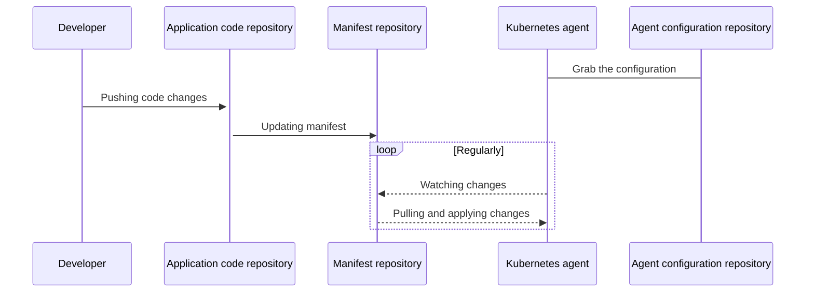

# GitLab Kubernetes Agent **(PREMIUM ONLY)**

> - [Introduced](https://gitlab.com/gitlab-org/gitlab/-/issues/223061) in [GitLab Premium](https://about.gitlab.com/pricing/) 13.4.
> - It's disabled on GitLab.com. Rolling this feature out to GitLab.com is [planned](https://gitlab.com/groups/gitlab-org/-/epics/3834).

CAUTION: **Warning:**
This feature might not be available to you. Check the **version history** note above for details.

The [GitLab Kubernetes Agent](https://gitlab.com/gitlab-org/cluster-integration/gitlab-agent)
is an active in-cluster component for solving GitLab and Kubernetes integration
tasks in a secure and cloud-native way. It enables:

- Integrating GitLab with a Kubernetes cluster behind a firewall or NAT
  (network address translation).
- Pull-based GitOps deployments by leveraging the
  [GitOps Engine](https://github.com/argoproj/gitops-engine).
- Real-time access to API endpoints within a cluster.

Many more features are planned. Please [review our roadmap](https://gitlab.com/groups/gitlab-org/-/epics/3329).

## GitLab Agent GitOps workflow

The GitLab Agent uses multiple GitLab projects to provide a flexible workflow
that can suit various needs. This diagram shows these repositories and the main
actors involved in a deployment:



There are several components that work in concert for the Agent to accomplish GitOps deployments:

- A properly-configured Kubernetes cluster.
- A configuration repository that contains a `config.yaml` file, which tells the
  Agent which repositories to synchronize with.
- A manifest repository that contains a `manifest.yaml`, which is tracked by the
  Agent and can be auto-generated. Any changes to `manifest.yaml` are applied to the cluster.

These repositories might be the same GitLab project or separate projects.

For more details, please refer to our [full architecture documentation](https://gitlab.com/gitlab-org/cluster-integration/gitlab-agent/-/blob/master/doc/architecture.md#high-level-architecture) in the Agent project.

## Get started with GitOps and the GitLab Agent

The setup process involves a few steps to enable GitOps deployments:

1. Installing the Agent server. This must be done one time for every GitLab installation.
1. Defining a configuration directory.
1. Creating an Agent record in GitLab.
1. Generating and copying a Secret token used to connect to the Agent.
1. Installing the Agent into the cluster.
1. Creating a `manifest.yaml`.

### Upgrades and version compatibility

As the GitLab Kubernetes Agent is a new product, we are constantly adding new features
to it. As a result, while shipped features are production ready, its internal API is
neither stable nor versioned yet. For this reason, GitLab only guarantees compatibility
between corresponding major.minor (X.Y) versions of GitLab and its cluster side
component, `agentk`.

Upgrade your agent installations together with GitLab upgrades: if you install
GitLab version 13.6, use version 13.6.x versions of `agentk`.

The available `agentk` versions can be found in
[its container registry](https://gitlab.com/gitlab-org/cluster-integration/gitlab-agent/container_registry/eyJuYW1lIjoiZ2l0bGFiLW9yZy9jbHVzdGVyLWludGVncmF0aW9uL2dpdGxhYi1hZ2VudC9hZ2VudGsiLCJ0YWdzX3BhdGgiOiIvZ2l0bGFiLW9yZy9jbHVzdGVyLWludGVncmF0aW9uL2dpdGxhYi1hZ2VudC9yZWdpc3RyeS9yZXBvc2l0b3J5LzEyMjMyMDUvdGFncz9mb3JtYXQ9anNvbiIsImlkIjoxMjIzMjA1LCJjbGVhbnVwX3BvbGljeV9zdGFydGVkX2F0IjpudWxsfQ==).

### Upgrades and Version compatibility

As the GitLab Kubernetes Agent is a new product, we are constantly adding new features to it. As a result, while shipped features are production ready, it's internal API is not stable nor versioned yet. For this reason, we only guarantee compatibility between corresponding major.minor versions of GitLab and its cluster side component, `agentk`. Please, upgrade your agent installations together with GitLab upgrades.

Example: having GitLab 13.6 installed, please use version 13.6.x versions of `agentk`.

The available `agentk` versions can be found in [its container registry](https://gitlab.com/gitlab-org/cluster-integration/gitlab-agent/container_registry/eyJuYW1lIjoiZ2l0bGFiLW9yZy9jbHVzdGVyLWludGVncmF0aW9uL2dpdGxhYi1hZ2VudC9hZ2VudGsiLCJ0YWdzX3BhdGgiOiIvZ2l0bGFiLW9yZy9jbHVzdGVyLWludGVncmF0aW9uL2dpdGxhYi1hZ2VudC9yZWdpc3RyeS9yZXBvc2l0b3J5LzEyMjMyMDUvdGFncz9mb3JtYXQ9anNvbiIsImlkIjoxMjIzMjA1LCJjbGVhbnVwX3BvbGljeV9zdGFydGVkX2F0IjpudWxsfQ==).

### Install the Kubernetes Agent Server

The GitLab Kubernetes Agent Server (KAS) can be deployed using [Omnibus
GitLab](https://docs.gitlab.com/omnibus/) or the [GitLab
chart](https://gitlab.com/gitlab-org/charts/gitlab). If you don't already have
GitLab installed, please refer to our [installation
documentation](https://docs.gitlab.com/ee/install/README.html).

NOTE: **Note:**
GitLab plans to include the KAS on [GitLab.com](https://gitlab.com/groups/gitlab-org/-/epics/3834).

#### Install with Omnibus

When using the [Omnibus GitLab](https://docs.gitlab.com/omnibus/) package:

1. Edit `/etc/gitlab/gitlab.rb`:

```plaintext
gitlab_kas['enable'] = true
```

1. [Reconfigure GitLab](../../../administration/restart_gitlab.md#omnibus-gitlab-reconfigure).

#### Install with the Helm chart

When installing or upgrading the GitLab Helm chart, consider the following Helm v3 example.
If you're using Helm v2, you must modify this example. See our [notes regarding deploy with Helm](https://docs.gitlab.com/charts/installation/deployment.html#deploy-using-helm).

You must set `global.kas.enabled=true` for the KAS to be properly installed and configured:

```shell
helm repo add gitlab https://charts.gitlab.io/
helm repo update
helm upgrade --install gitlab gitlab/gitlab \
  --timeout 600s \
  --set global.hosts.domain=<YOUR_DOMAIN> \
  --set global.hosts.externalIP=<YOUR_IP> \
  --set certmanager-issuer.email=<YOUR_EMAIL> \
  --set global.kas.enabled=true
```

### Define a configuration repository

Next, you need a GitLab repository to contain your Agent configuration. The minimal
repository layout looks like this:

```plaintext
.gitlab/agents/<agent-name>/config.yaml
```

The `config.yaml` file contents should look like this:

```yaml
gitops:
  manifest_projects:
  - id: "path-to/your-awesome-project"
```

### Create an Agent record in GitLab

Next, create an GitLab Rails Agent record so the Agent can associate itself with
the configuration repository project. Creating this record also creates a Secret needed to configure
the Agent in subsequent steps. You can create an Agent record either:

- Through the Rails console, by running `rails c`:

  ```ruby
  project = ::Project.find_by_full_path("path-to/your-awesome-project")
  agent = ::Clusters::Agent.create(name: "<agent-name>", project: project)
  token = ::Clusters::AgentToken.create(agent: agent)
  token.token # this will print out the token you need to use on the next step
  ```

- Through GraphQL: **(PREMIUM ONLY)**

  ```graphql
  mutation createAgent {
    createClusterAgent(input: { projectPath: "path-to/your-awesome-project", name: "<agent-name>" }) {
      clusterAgent {
        id
        name
      }
      errors
    }
  }

  mutation createToken {
    clusterAgentTokenCreate(input: { clusterAgentId: <cluster-agent-id-taken-from-the-previous-mutation> }) {
      secret # This is the value you need to use on the next step
      token {
        createdAt
        id
      }
      errors
    }
  }
  ```

  NOTE: **Note:**
  GraphQL only displays the token once, after creating it.

  If you are new to using the GitLab GraphQL API, refer to the
  [Getting started with the GraphQL API page](../../../api/graphql/getting_started.md),
  or the [GraphQL Explorer](https://gitlab.com/-/graphql-explorer).

### Create the Kubernetes secret

After generating the token, you must apply it to the Kubernetes cluster.

1. If you haven't previous defined or created a namespace, run the following command:

   ```shell
   kubectl create namespace <YOUR-DESIRED-NAMESPACE>
   ```

1. Run the following command to create your Secret:

   ```shell
   kubectl create secret generic -n <YOUR-DESIRED-NAMESPACE> gitlab-agent-token --from-literal=token='YOUR_AGENT_TOKEN'
   ```

### Install the Agent into the cluster

Next, install the in-cluster component of the Agent. This example file contains the
Kubernetes resources required for the Agent to be installed. You can modify this
example [`resources.yml` file](#example-resourcesyml-file) in the following ways:

- You can replace `gitlab-agent` with `<YOUR-DESIRED-NAMESPACE>`.
- For the `kas-address` (Kubernetes Agent Server), the agent can use the WebSockets
  or gRPC protocols to connect to the Agent Server. Depending on your cluster
  configuration and GitLab architecture, you may need to use one or the other.
  For the `gitlab-kas` Helm chart, an Ingress is created for the Agent Server using
  the `/-/kubernetes-agent` endpoint. This can be used for the WebSockets protocol connection.
  - Specify the `grpc` scheme (such as `grpc://gitlab-kas:5005`) to use gRPC directly.
    Encrypted gRPC is not supported yet. Follow the
    [Support TLS for gRPC communication issue](https://gitlab.com/gitlab-org/cluster-integration/gitlab-agent/-/issues/7)
    for progress updates.
  - Specify the `ws` scheme (such as `ws://gitlab-kas-ingress:80/-/kubernetes-agent`)
    to use an unencrypted WebSockets connection.
  - Specify the `wss` scheme (such as `wss://gitlab-kas-ingress:443/-/kubernetes-agent`)
    to use an encrypted WebSockets connection. This is the recommended option if
    installing the Agent into a separate cluster from your Agent Server.
- If you defined your own secret name, replace `gitlab-agent-token` with your secret name.

To apply this file, run the following command:

```shell
kubectl apply -n gitlab-agent -f ./resources.yml
```

To review your configuration, run the following command:

```shell
$ kubectl get pods --all-namespaces

NAMESPACE     NAME                               READY   STATUS    RESTARTS   AGE
gitlab-agent  gitlab-agent-77689f7dcb-5skqk      1/1     Running   0          51s
kube-system   coredns-f9fd979d6-n6wcw            1/1     Running   0          14m
kube-system   etcd-minikube                      1/1     Running   0          14m
kube-system   kube-apiserver-minikube            1/1     Running   0          14m
kube-system   kube-controller-manager-minikube   1/1     Running   0          14m
kube-system   kube-proxy-j6zdh                   1/1     Running   0          14m
kube-system   kube-scheduler-minikube            1/1     Running   0          14m
kube-system   storage-provisioner                1/1     Running   0          14m
```

#### Example `resources.yml` file

```yaml
apiVersion: v1
kind: ServiceAccount
metadata:
  name: gitlab-agent
---
apiVersion: apps/v1
kind: Deployment
metadata:
  name: gitlab-agent
spec:
  replicas: 1
  selector:
    matchLabels:
      app: gitlab-agent
  template:
    metadata:
      labels:
        app: gitlab-agent
    spec:
      serviceAccountName: gitlab-agent
      containers:
      - name: agent
        image: "registry.gitlab.com/gitlab-org/cluster-integration/gitlab-agent/agentk:latest"
        args:
        - --token-file=/config/token
        - --kas-address
        - grpc://host.docker.internal:5005  # {"$openapi":"kas-address"}
        volumeMounts:
        - name: token-volume
          mountPath: /config
      volumes:
      - name: token-volume
        secret:
          secretName: gitlab-agent-token
  strategy:
    type: RollingUpdate
    rollingUpdate:
      maxSurge: 0
      maxUnavailable: 1
---
apiVersion: rbac.authorization.k8s.io/v1
kind: ClusterRole
metadata:
  name: gitlab-agent-write
rules:
- resources:
  - '*'
  apiGroups:
  - '*'
  verbs:
  - create
  - update
  - delete
  - patch
---
apiVersion: rbac.authorization.k8s.io/v1
kind: ClusterRoleBinding
metadata:
  name: gitlab-agent-write-binding
roleRef:
  name: gitlab-agent-write
  kind: ClusterRole
  apiGroup: rbac.authorization.k8s.io
subjects:
- name: gitlab-agent
  kind: ServiceAccount
  namespace: gitlab-agent
---
apiVersion: rbac.authorization.k8s.io/v1
kind: ClusterRole
metadata:
  name: gitlab-agent-read
rules:
- resources:
  - '*'
  apiGroups:
  - '*'
  verbs:
  - get
  - list
  - watch
---
apiVersion: rbac.authorization.k8s.io/v1
kind: ClusterRoleBinding
metadata:
  name: gitlab-agent-read-binding
roleRef:
  name: gitlab-agent-read
  kind: ClusterRole
  apiGroup: rbac.authorization.k8s.io
subjects:
- name: gitlab-agent
  kind: ServiceAccount
  namespace: gitlab-agent
```

### Create a `manifest.yaml`

In a previous step, you configured a `config.yaml` to point to the GitLab projects
the Agent should synchronize. In each of those projects, you must create a `manifest.yaml`
file for the Agent to monitor. You can auto-generate this `manifest.yaml` with a
templating engine or other means.

Each time you commit and push a change to this file, the Agent logs the change:

```plaintext
2020-09-15_14:09:04.87946 gitlab-k8s-agent      : time="2020-09-15T10:09:04-04:00" level=info msg="Config: new commit" agent_id=1 commit_id=e6a3651f1faa2e928fe6120e254c122451be4eea
```

#### Example `manifest.yaml` file

This file creates a simple NGINX deployment.

```yaml
apiVersion: apps/v1
kind: Deployment
metadata:
  name: nginx-deployment
  namespace: gitlab-agent  # Can be any namespace managed by you that the agent has access to.
spec:
  selector:
    matchLabels:
      app: nginx
  replicas: 2
  template:
    metadata:
      labels:
        app: nginx
    spec:
      containers:
      - name: nginx
        image: nginx:1.14.2
        ports:
        - containerPort: 80
```

## Example projects

This basic GitOps example deploys NGINX:

- [Configuration repository](https://gitlab.com/gitlab-org/configure/examples/kubernetes-agent)
- [Manifest repository](https://gitlab.com/gitlab-org/configure/examples/gitops-project)
- [Install GitLab Runner](https://gitlab.com/gitlab-examples/install-runner-via-k8s-agent)
