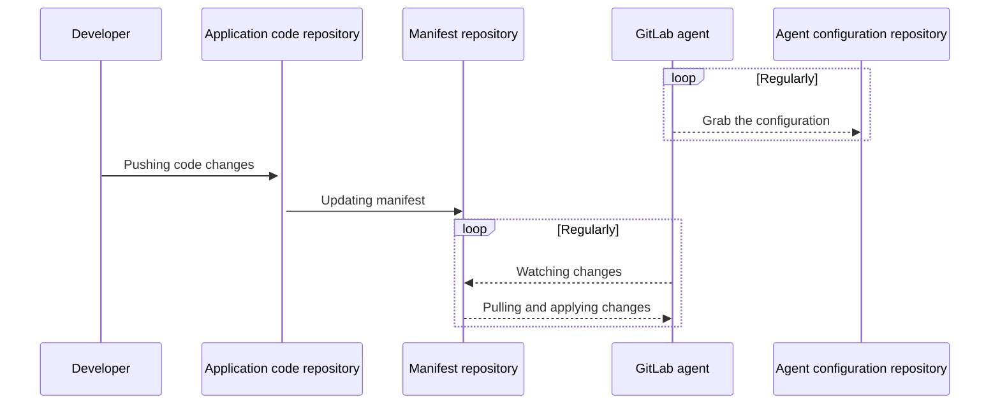

# Connecting a Kubernetes cluster with GitLab

> - [Introduced](https://gitlab.com/gitlab-org/gitlab/-/issues/223061) in GitLab 13.4.
> - Support for `grpcs` [introduced](https://gitlab.com/gitlab-org/cluster-integration/gitlab-agent/-/issues/7) in GitLab 13.6.
> - Agent Server [introduced](https://gitlab.com/gitlab-org/gitlab/-/issues/300960) on GitLab.com under `wss://kas.gitlab.com` through an Early Adopter Program in GitLab 13.10.
> - The agent became available to every project on GitLab.com in GitLab 13.11.
> - [Moved](https://gitlab.com/groups/gitlab-org/-/epics/6290) from GitLab Premium to GitLab Free in 14.5.
> - [Renamed](https://gitlab.com/groups/gitlab-org/-/epics/7167) from "GitLab Kubernetes Agent" to "GitLab agent for Kubernetes" in GitLab 14.6.

You can connect your Kubernetes cluster with GitLab to deploy, manage,
and monitor your cloud-native solutions. You can choose from two primary workflows.

In a **GitOps workflow**, you keep your Kubernetes manifests in GitLab. You install a GitLab agent in your cluster, and
any time you update your manifests, the agent updates the cluster. This workflow is fully driven with Git and is considered pull-based,
because the cluster is pulling updates from your GitLab repository.

In a **CI/CD** workflow, you use GitLab CI/CD to query and update your cluster by using the Kubernetes API.
This workflow is considered push-based, because GitLab is pushing requests from GitLab CI/CD to your cluster.

Both of these workflows require you to [install an agent in your cluster](install/index.md).

## Supported cluster versions

GitLab supports the following Kubernetes versions. You can upgrade your
Kubernetes version to a supported version at any time:

- 1.20 (support ends on July 22, 2022)
- 1.19 (support ends on February 22, 2022)
- 1.18 (support ends on November 22, 2021)
- 1.17 (support ends on September 22, 2021)

GitLab supports at least two production-ready Kubernetes minor
versions at any given time. GitLab regularly reviews the supported versions and
provides a three-month deprecation period before removing support for a specific
version. The list of supported versions is based on:

- The versions supported by major managed Kubernetes providers.
- The versions [supported by the Kubernetes community](https://kubernetes.io/releases/version-skew-policy/#supported-versions).

[This epic](https://gitlab.com/groups/gitlab-org/-/epics/4827) tracks support for other Kubernetes versions.

Some GitLab features might work on versions not listed here.

## Using Kubernetes with GitOps **(PREMIUM)**

With GitOps, you can manage containerized clusters and applications from a Git repository that:

- Is the single source of truth of your system.
- Is the single place where you operate your system.

By combining GitLab, Kubernetes, and GitOps, you can have:

- GitLab as the GitOps operator.
- Kubernetes as the automation and convergence system.
- GitLab CI/CD for Continuous Integration and the agent for Continuous Deployment.

Beyond that, you can use all the features offered by GitLab as
the all-in-one DevOps platform for your product and your team.

### GitOps workflow **(PREMIUM)**

The agent uses multiple GitLab projects to provide a flexible workflow
that can suit various needs. This diagram shows these repositories and the main
The agent uses multiple GitLab projects to provide a flexible workflow.
This diagram shows these repositories and the main
actors involved in a deployment:



For details, view the [architecture documentation](https://gitlab.com/gitlab-org/cluster-integration/gitlab-agent/-/blob/master/doc/architecture.md#high-level-architecture).

To perform GitOps deployments, you need:

- A properly-configured Kubernetes cluster where the GitLab agent is running.
- A project that contains the agent's configuration file (`config.yaml`) in the repository.
  This file tells the agent which repositories to synchronize with the cluster.
- A project that contains Kubernetes manifests. Any changes to manifests are applied to the cluster.

You can keep the agent's configuration file and Kubernetes manifests in one project, or you can use multiple.

- One GitLab project (recommended): When you use one project for both the Kubernetes manifests
  and the agent's configuration file, the projects can be either private or public.
- Two GitLab projects: When you use two different GitLab projects (one for Kubernetes
  manifests and another for the agent's configuration file), the project with Kubernetes manifests must
  be public. The project with the agent's configuration file can be either private or public.

Support for separate private projects is tracked in [this issue](https://gitlab.com/gitlab-org/gitlab/-/issues/283885).

## Remove an agent

You can remove an agent by using the [GitLab UI](#remove-an-agent-through-the-gitlab-ui) or the [GraphQL API](#remove-an-agent-with-the-gitlab-graphql-api).

### Remove an agent through the GitLab UI

> [Introduced](https://gitlab.com/gitlab-org/gitlab/-/issues/323055) in GitLab 14.7.

To remove an agent from the UI:

1. On the top bar, select **Menu > Projects** and find the project that contains the agent's configuration file.
1. From the left sidebar, select **Infrastructure > Kubernetes clusters**.
1. In the table, in the row for your agent, in the **Options** column, select the vertical ellipsis (**{ellipsis_v}**).
1. Select **Delete agent**.

### Remove an agent with the GitLab GraphQL API

1. Get the `<cluster-agent-token-id>` from a query in the interactive GraphQL explorer.
   - For GitLab.com, go to <https://gitlab.com/-/graphql-explorer> to open GraphQL Explorer.
   - For self-managed GitLab, go to `https://gitlab.example.com/-/graphql-explorer`, replacing `gitlab.example.com` with your instance's URL.

   ```graphql
   query{
     project(fullPath: "<full-path-to-agent-configuration-project>") {
       clusterAgent(name: "<agent-name>") {
         id
         tokens {
           edges {
             node {
               id
             }
           }
         }
       }
     }
   }
   ```

1. Remove an agent record with GraphQL by deleting the `clusterAgentToken`.

   ```graphql
   mutation deleteAgent {
     clusterAgentDelete(input: { id: "<cluster-agent-id>" } ) {
       errors
     }
   }

   mutation deleteToken {
     clusterAgentTokenDelete(input: { id: "<cluster-agent-token-id>" }) {
       errors
     }
   }
   ```

1. Verify whether the removal occurred successfully. If the output in the Pod logs includes `unauthenticated`, it means that the agent was successfully removed:

   ```json
   {
       "level": "warn",
       "time": "2021-04-29T23:44:07.598Z",
       "msg": "GetConfiguration.Recv failed",
       "error": "rpc error: code = Unauthenticated desc = unauthenticated"
   }
   ```

1. Delete the agent in your cluster:

   ```shell
   kubectl delete -n gitlab-kubernetes-agent -f ./resources.yml
   ```

## Migrating to the agent from the legacy certificate-based integration

Find out how to [migrate to the agent for Kubernetes](../../infrastructure/clusters/migrate_to_gitlab_agent.md) from the certificate-based integration.

## Kubernetes network security alerts **(ULTIMATE)**

> [Deprecated](https://gitlab.com/groups/gitlab-org/-/epics/7476) in GitLab 14.8, and planned for [removal](https://gitlab.com/groups/gitlab-org/-/epics/7477) in GitLab 15.0.

WARNING:
Cilium integration is in its end-of-life process. It's [deprecated](https://gitlab.com/groups/gitlab-org/-/epics/7476)
for use in GitLab 14.8, and planned for [removal](https://gitlab.com/groups/gitlab-org/-/epics/7477)
in GitLab 15.0.

The agent for Kubernetes also provides an integration with Cilium. This integration provides a simple way to
generate network policy-related alerts and to surface those alerts in GitLab.

Several components work in concert for the agent to generate the alerts:

- A working Kubernetes cluster.
- Cilium integration through either of these options:
  - Installation through [cluster management template](../../project/clusters/protect/container_network_security/quick_start_guide.md#use-the-cluster-management-template-to-install-cilium).
  - Enablement of [hubble-relay](https://docs.cilium.io/en/v1.8/concepts/overview/#hubble) on an
    existing installation.
- One or more network policies through any of these options:
  - Use the [Container Network Policy editor](../../application_security/policies/index.md#container-network-policy-editor) to create and manage policies.
  - Use an [AutoDevOps](../../application_security/policies/index.md#container-network-policy) configuration.
  - Add the required labels and annotations to existing network policies.
- A configuration repository with [Cilium configured in `config.yaml`](repository.md#surface-network-security-alerts-from-cluster-to-gitlab)

The setup process follows the same [agent's installation steps](install/index.md),
with the following differences:

- When you define a configuration repository, you must do so with [Cilium settings](repository.md#surface-network-security-alerts-from-cluster-to-gitlab).
- You do not need to specify the `gitops` configuration section.

## Related topics

- [Troubleshooting](troubleshooting.md)
- [Contribute to the GitLab agent's development](https://gitlab.com/gitlab-org/cluster-integration/gitlab-agent/-/tree/master/doc)
