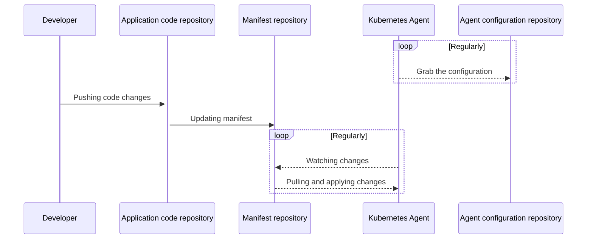
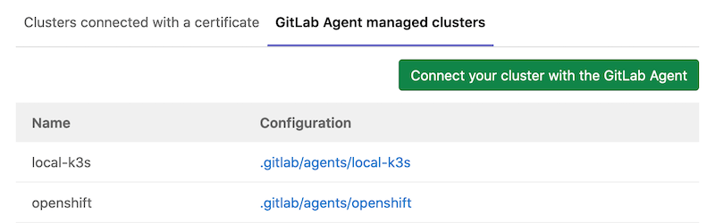

# GitLab Kubernetes Agent **(PREMIUM)**

> - [Introduced](https://gitlab.com/gitlab-org/gitlab/-/issues/223061) in [GitLab Premium](https://about.gitlab.com/pricing/) 13.4.
> - [Introduced](https://gitlab.com/gitlab-org/cluster-integration/gitlab-agent/-/issues/7) in GitLab 13.6, `grpcs` is supported.
> - [Introduced](https://gitlab.com/gitlab-org/gitlab/-/issues/300960) in GitLab 13.10, KAS became available on GitLab.com under `wss://kas.gitlab.com` through an Early Adopter Program.
> - Introduced in GitLab 13.11, the GitLab Kubernetes Agent became available to every project on GitLab.com.

The [GitLab Kubernetes Agent](https://gitlab.com/gitlab-org/cluster-integration/gitlab-agent)
is an active in-cluster component for solving GitLab and Kubernetes integration
tasks in a secure and cloud-native way. It enables:

- Integrating GitLab with a Kubernetes cluster behind a firewall or NAT
  (network address translation).
- Pull-based GitOps deployments.
- [Inventory object](../../infrastructure/clusters/deploy/inventory_object.md) to keep track of objects applied to your cluster.
- Real-time access to API endpoints in a cluster.
- Alert generation based on [Container network policy](../../application_security/threat_monitoring/index.md#container-network-policy).
- [CI/CD Tunnel](ci_cd_tunnel.md) that enables users to access Kubernetes clusters from GitLab CI/CD jobs even if there is no network connectivity between GitLab Runner and a cluster.

Many more features are planned. Please review [our roadmap](https://gitlab.com/groups/gitlab-org/-/epics/3329)
and [our development documentation](https://gitlab.com/gitlab-org/cluster-integration/gitlab-agent/-/tree/master/doc).

## GitLab Agent GitOps workflow

The GitLab Agent uses multiple GitLab projects to provide a flexible workflow
that can suit various needs. This diagram shows these repositories and the main
actors involved in a deployment:



There are several components that work in concert for the Agent to accomplish GitOps deployments:

- A properly-configured Kubernetes cluster where the Agent is running.
- A configuration repository that contains a `config.yaml` file, which tells the
  Agent which repositories to synchronize with the cluster.
- A manifest repository that contains manifest files. Any changes to manifest files are applied to the cluster.

You can use the same GitLab project or separate projects for configuration and manifest files, as follows:

- Single GitLab project (recommended): when you use a single repository to hold both the manifest and the configuration files, these projects can be either private or public, as you prefer.
- Two GitLab projects: when you opt to use two different GitLab projects, one for manifest files, and another for configuration files, the manifests project must be public, while the configuration project can be either private or public. Our backlog contains issues for adding support for
[private manifest repositories outside of the configuration project](https://gitlab.com/gitlab-org/gitlab/-/issues/220912) and
[group level agents](https://gitlab.com/gitlab-org/gitlab/-/issues/283885) in the future.

For more details, please refer to our [full architecture documentation](https://gitlab.com/gitlab-org/cluster-integration/gitlab-agent/-/blob/master/doc/architecture.md#high-level-architecture) in the Agent project.

## Get started with GitOps and the GitLab Agent

The setup process involves a few steps to enable GitOps deployments:

1. [Set up the Kubernetes Agent Server](#set-up-the-kubernetes-agent-server) for your GitLab instance.
1. [Define a configuration repository](#define-a-configuration-repository).
1. [Create an Agent record in GitLab](#create-an-agent-record-in-gitlab).
1. [Generate and copy a Secret token used to connect to the Agent](#create-the-kubernetes-secret).
1. [Install the Agent into the cluster](#install-the-agent-into-the-cluster).
1. [Create manifest files](#create-manifest-files).

### Upgrades and version compatibility

As the GitLab Kubernetes Agent is a new product, we are constantly adding new features
to it. As a result, while shipped features are production ready, its internal API is
neither stable nor versioned yet. For this reason, GitLab only guarantees compatibility
between corresponding major.minor (X.Y) versions of GitLab and its cluster side
component, `agentk`.

Upgrade your agent installations together with GitLab upgrades. To decide which version of `agentk` to install follow:

1. Open the [`GITLAB_KAS_VERSION`](https://gitlab.com/gitlab-org/gitlab/-/blob/master/GITLAB_KAS_VERSION) file from the GitLab Repository, which contains the latest `agentk` version associated with the `master` branch.
1. Change the `master` branch and select the Git tag associated with your version. For instance, you could change it to GitLab [v13.5.3-ee release](https://gitlab.com/gitlab-org/gitlab/-/blob/v13.5.3-ee/GITLAB_KAS_VERSION)

The available `agentk` and `kas` versions can be found in
[the container registry](https://gitlab.com/gitlab-org/cluster-integration/gitlab-agent/container_registry/).

### Set up the Kubernetes Agent Server

> [Introduced](https://gitlab.com/groups/gitlab-org/-/epics/3834) in [GitLab Premium](https://about.gitlab.com/pricing/) 13.10, the GitLab Kubernetes Agent Server (KAS) became available on GitLab.com under `wss://kas.gitlab.com`.

To use the KAS:

- If you are a self-managed user, follow the instructions to [install the Kubernetes Agent Server](../../../administration/clusters/kas.md).
- If you are a GitLab.com user, when you [set up the configuration repository](#define-a-configuration-repository) for your agent, use `wss://kas.gitlab.com` as the `--kas-address`.

### Define a configuration repository

> [Introduced](https://gitlab.com/gitlab-org/gitlab/-/issues/259669) in GitLab 13.7, the Agent manifest configuration can be added to multiple directories (or subdirectories) of its repository.

To configure an Agent, you need:

1. A GitLab repository to hold the configuration file.
1. Install the Agent in a cluster.

After installed, when you update the configuration file, GitLab transmits the
information to the cluster automatically without downtime.

In your repository, add the Agent configuration file under:

```plaintext
.gitlab/agents/<agent-name>/config.yaml
```

Your `config.yaml` file specifies all configurations of the Agent, such as:

- The manifest projects to synchronize.
- The address of the `hubble-relay` for the Network Security policy integrations.

As an example, a minimal Agent configuration that sets up only the manifest
synchronizations is:

```yaml
gitops:
  manifest_projects:
  - id: "path-to/your-manifest-project-1"
    paths:
    - glob: '/**/*.{yaml,yml,json}'
```

All the options for the [Kubernetes Agent configuration repository](repository.md) are documented separately.

### Create an Agent record in GitLab

Next, create a GitLab Rails Agent record to associate it with
the configuration repository project. Creating this record also creates a Secret needed to configure
the Agent in subsequent steps. You can create an Agent record with GraphQL:

  ```graphql
  mutation createAgent {
    # agent-name should be the same as specified above in the config.yaml
    createClusterAgent(input: { projectPath: "path-to/your-configuration-project", name: "<agent-name>" }) {
      clusterAgent {
        id
        name
      }
      errors
    }
  }

  mutation createToken {
    clusterAgentTokenCreate(
      input: {
        clusterAgentId: "<cluster-agent-id-taken-from-the-previous-mutation>"
        description: "<optional-description-of-token>"
        name: "<required-name-given-to-token>"
      }
    ) {
      secret # This is the value you need to use on the next step
      token {
        createdAt
        id
      }
      errors
    }
  }
  ```

WARNING:
GraphQL only displays the token and ids **one time** after creating it. Make sure to write down the `secret`, `clusterAgentId`, and `clusterAgentTokenId`; you'll need them later.

  If you are new to using the GitLab GraphQL API, refer to the
  [Getting started with the GraphQL API page](../../../api/graphql/getting_started.md),
  or the [GraphQL Explorer](https://gitlab.com/-/graphql-explorer).

### Install the Agent into the cluster

To install the in-cluster component of the Agent, first you need to define a namespace. To create a new namespace,
for example, `gitlab-kubernetes-agent`, run:

```shell
kubectl create namespace gitlab-kubernetes-agent
```

To perform a one-liner installation, run the command below. Make sure to replace:

- `your-agent-token` with the token received from the previous step.
- `gitlab-kubernetes-agent` with the namespace you defined in the previous step.
- `wss://kas.gitlab.example.com` with the configured access of the Kubernetes Agent Server (KAS). For GitLab.com users, the KAS is available under `wss://kas.gitlab.com`.

```shell
docker run --pull=always --rm registry.gitlab.com/gitlab-org/cluster-integration/gitlab-agent/cli:stable generate --agent-token=your-agent-token --kas-address=wss://kas.gitlab.example.com --agent-version stable --namespace gitlab-kubernetes-agent | kubectl apply -f -
```

Set `--agent-version` to the latest released patch version matching your
GitLab installation's major and minor versions. For example, if you have
GitLab v13.9.0, set `--agent-version=v13.9.1`.

WARNING:
Version `stable` can be used to refer to the latest stable release at the time when the command runs. It's fine for
testing purposes but for production please make sure to specify a matching version explicitly.

To find out the various options the above Docker container supports, run:

```shell
docker run --pull=always --rm registry.gitlab.com/gitlab-org/cluster-integration/gitlab-agent/cli:stable generate --help
```

#### Advanced installation

For more advanced configurations, we recommend to use [the `kpt` based installation method](https://gitlab.com/gitlab-org/cluster-integration/gitlab-agent/-/tree/master/build/deployment/gitlab-agent).

Otherwise, follow the manual installation steps described below.

##### Create the Kubernetes secret

After generating the token, you must apply it to the Kubernetes cluster.

To create your Secret, run:

```shell
kubectl create secret generic -n gitlab-kubernetes-agent gitlab-kubernetes-agent-token --from-literal=token='YOUR_AGENT_TOKEN'
```

The following example file contains the
Kubernetes resources required for the Agent to be installed. You can modify this
example [`resources.yml` file](#example-resourcesyml-file) in the following ways:

- Replace `namespace: gitlab-kubernetes-agent` with `namespace: <YOUR-DESIRED-NAMESPACE>`.
- You can configure `kas-address` (Kubernetes Agent Server) in several ways.
  The agent can use the WebSockets or gRPC protocols to connect to the Agent Server.
  Select the option appropriate for your cluster configuration and GitLab architecture:
  - The `wss` scheme (an encrypted WebSockets connection) is specified by default
    after you install the `gitlab-kas` sub-chart, or enable `gitlab-kas` for Omnibus GitLab.
    When using the sub-chart, you must set `wss://kas.host.tld:443` as
    `kas-address`, where `host.tld` is the domain you've setup for your GitLab installation.
    When using Omnibus GitLab, you must set `wss://GitLab.host.tld:443/-/kubernetes-agent/` as
    `kas-address`, where `GitLab.host.tld` is your GitLab hostname.
  - When using the sub-chart, specify the `ws` scheme (such as `ws://kas.host.tld:80`)
    to use an unencrypted WebSockets connection.
    When using the Omnibus GitLab, specify the `ws` scheme (such as `ws://GitLab.host.tld:80/-/kubernetes-agent/`).
  - Specify the `grpc` scheme if both Agent and Server are installed in one cluster.
    In this case, you may specify `kas-address` value as
    `grpc://gitlab-kas.<your-namespace>:8150`) to use gRPC directly, where `gitlab-kas`
    is the name of the service created by `gitlab-kas` chart, and `<your-namespace>`
    is the namespace where the chart was installed.
  - Specify the `grpcs` scheme to use an encrypted gRPC connection.
  - When deploying KAS through the [GitLab chart](https://docs.gitlab.com/charts/), it's possible to customize the
    `kas-address` for `wss` and `ws` schemes to whatever you need.
    Check the [chart's KAS Ingress documentation](https://docs.gitlab.com/charts/charts/gitlab/kas/#ingress)
    to learn more about it.
  - In the near future, Omnibus GitLab intends to provision `gitlab-kas` under a sub-domain by default, instead of the `/-/kubernetes-agent/` path. Please follow [this issue](https://gitlab.com/gitlab-org/omnibus-gitlab/-/issues/5784) for details.
- If you defined your own secret name, replace `gitlab-kubernetes-agent-token` with your
  secret name in the `secretName:` section.

To apply this file, run the following command:

```shell
kubectl apply -n gitlab-kubernetes-agent -f ./resources.yml
```

To review your configuration, run the following command:

```shell
$ kubectl get pods -n gitlab-kubernetes-agent

NAMESPACE                NAME                                          READY   STATUS    RESTARTS   AGE
gitlab-kubernetes-agent  gitlab-kubernetes-agent-77689f7dcb-5skqk      1/1     Running   0          51s
```

##### Example `resources.yml` file

```yaml
---
apiVersion: v1
kind: Namespace
metadata:
  name: gitlab-kubernetes-agent
---
apiVersion: v1
kind: ServiceAccount
metadata:
  name: gitlab-kubernetes-agent
---
apiVersion: apps/v1
kind: Deployment
metadata:
  name: gitlab-kubernetes-agent
spec:
  replicas: 1
  selector:
    matchLabels:
      app: gitlab-kubernetes-agent
  template:
    metadata:
      labels:
        app: gitlab-kubernetes-agent
    spec:
      serviceAccountName: gitlab-kubernetes-agent
      containers:
      - name: agent
        # Make sure to specify a matching version for production
        image: "registry.gitlab.com/gitlab-org/cluster-integration/gitlab-agent/agentk:stable"
        args:
        - --token-file=/config/token
        - --kas-address
        - wss://kas.host.tld:443 # replace this line with the line below if using Omnibus GitLab or GitLab.com.
        # - wss://gitlab.host.tld:443/-/kubernetes-agent/
        # - wss://kas.gitlab.com # for GitLab.com users, use this KAS.
        # - grpc://host.docker.internal:8150 # use this attribute when connecting from Docker.
        volumeMounts:
        - name: token-volume
          mountPath: /config
      volumes:
      - name: token-volume
        secret:
          secretName: gitlab-kubernetes-agent-token
  strategy:
    type: RollingUpdate
    rollingUpdate:
      maxSurge: 0
      maxUnavailable: 1
---
apiVersion: rbac.authorization.k8s.io/v1
kind: ClusterRole
metadata:
  name: gitlab-kubernetes-agent-write
rules:
- resources:
  - '*'
  apiGroups:
  - '*'
  verbs:
  - create
  - update
  - delete
  - patch
---
apiVersion: rbac.authorization.k8s.io/v1
kind: ClusterRoleBinding
metadata:
  name: gitlab-kubernetes-agent-write-binding
roleRef:
  name: gitlab-kubernetes-agent-write
  kind: ClusterRole
  apiGroup: rbac.authorization.k8s.io
subjects:
- name: gitlab-kubernetes-agent
  kind: ServiceAccount
  namespace: gitlab-kubernetes-agent
---
apiVersion: rbac.authorization.k8s.io/v1
kind: ClusterRole
metadata:
  name: gitlab-kubernetes-agent-read
rules:
- resources:
  - '*'
  apiGroups:
  - '*'
  verbs:
  - get
  - list
  - watch
---
apiVersion: rbac.authorization.k8s.io/v1
kind: ClusterRoleBinding
metadata:
  name: gitlab-kubernetes-agent-read-binding
roleRef:
  name: gitlab-kubernetes-agent-read
  kind: ClusterRole
  apiGroup: rbac.authorization.k8s.io
subjects:
- name: gitlab-kubernetes-agent
  kind: ServiceAccount
  namespace: gitlab-kubernetes-agent
```

### Create manifest files

In a previous step, you configured a `config.yaml` to point to the GitLab projects
the Agent should synchronize. Agent monitors each of those projects for changes to the manifest files it contains. You can auto-generate manifest files with a
templating engine or other means.

The agent is authorized to download manifests for the configuration
project, and public projects. Support for other private projects is
planned in the issue [Agent authorization for private manifest
projects](https://gitlab.com/gitlab-org/gitlab/-/issues/220912).

Each time you push a change to a monitored manifest repository, the Agent logs the change:

```plaintext
2020-09-15_14:09:04.87946 gitlab-k8s-agent      : time="2020-09-15T10:09:04-04:00" level=info msg="Config: new commit" agent_id=1 commit_id=e6a3651f1faa2e928fe6120e254c122451be4eea
```

#### Example manifest file

This file creates an NGINX deployment.

```yaml
apiVersion: apps/v1
kind: Deployment
metadata:
  name: nginx-deployment
  namespace: gitlab-kubernetes-agent  # Can be any namespace managed by you that the agent has access to.
spec:
  selector:
    matchLabels:
      app: nginx
  replicas: 2
  template:
    metadata:
      labels:
        app: nginx
    spec:
      containers:
      - name: nginx
        image: nginx:1.14.2
        ports:
        - containerPort: 80
```

## Example projects

The following example projects can help you get started with the Kubernetes Agent.

- [Configuration repository](https://gitlab.com/gitlab-org/configure/examples/kubernetes-agent)
- This basic GitOps example deploys NGINX: [Manifest repository](https://gitlab.com/gitlab-org/configure/examples/gitops-project)

### Deploying GitLab Runner with the Agent

You can use the Kubernetes Agent to
[deploy GitLab Runner in a Kubernetes cluster](https://docs.gitlab.com/runner/install/kubernetes-agent.html).

## Kubernetes Network Security Alerts

The GitLab Agent also provides an integration with Cilium. This integration provides a simple way to
generate network policy-related alerts and to surface those alerts in GitLab.

There are several components that work in concert for the Agent to generate the alerts:

- A working Kubernetes cluster.
- Cilium integration through either of these options:
  - Installation through [cluster management template](../../project/clusters/protect/container_network_security/quick_start_guide.md#use-the-cluster-management-template-to-install-cilium).
  - Enablement of [hubble-relay](https://docs.cilium.io/en/v1.8/concepts/overview/#hubble) on an
    existing installation.
- One or more network policies through any of these options:
  - Use the [Container Network Policy editor](../../application_security/threat_monitoring/index.md#container-network-policy-editor) to create and manage policies.
  - Use an [AutoDevOps](../../application_security/threat_monitoring/index.md#container-network-policy-management) configuration.
  - Add the required labels and annotations to existing network policies.
- A configuration repository with [Cilium configured in `config.yaml`](repository.md#surface-network-security-alerts-from-cluster-to-gitlab)

The setup process follows the same steps as [GitOps](#get-started-with-gitops-and-the-gitlab-agent),
with the following differences:

- When you define a configuration repository, you must do so with [Cilium settings](repository.md#surface-network-security-alerts-from-cluster-to-gitlab).
- You do not need to specify the `gitops` configuration section.

## Management interfaces

Users with at least the [Developer](../../permissions.md) can access the user interface
for the GitLab Kubernetes agent at **Infrastructure > Kubernetes clusters**, under the
**GitLab Agent managed clusters** tab. This page lists all registered agents for
the current project, and the configuration directory for each agent:



Additional management interfaces are planned for the GitLab Kubernetes Agent.
[Provide more feedback in the related epic](https://gitlab.com/groups/gitlab-org/-/epics/4739).

## Troubleshooting

If you face any issues while using GitLab Kubernetes Agent, you can read the
service logs with the following command

```shell
kubectl logs -f -l=app=gitlab-kubernetes-agent -n gitlab-kubernetes-agent
```

GitLab administrators can additionally view the [Kubernetes Agent Server logs](../../../administration/clusters/kas.md#troubleshooting).

### Agent logs - Transport: Error while dialing failed to WebSocket dial

```json
{"level":"warn","time":"2020-11-04T10:14:39.368Z","msg":"GetConfiguration failed","error":"rpc error: code = Unavailable desc = connection error: desc = \"transport: Error while dialing failed to WebSocket dial: failed to send handshake request: Get \\\"https://gitlab-kas:443/-/kubernetes-agent\\\": dial tcp: lookup gitlab-kas on 10.60.0.10:53: no such host\""}
```

This error is shown if there are some connectivity issues between the address
specified as `kas-address`, and your Agent pod. To fix it, make sure that you
specified the `kas-address` correctly.

```json
{"level":"error","time":"2021-06-25T21:15:45.335Z","msg":"Reverse tunnel","mod_name":"reverse_tunnel","error":"Connect(): rpc error: code = Unavailable desc = connection error: desc= \"transport: Error while dialing failed to WebSocket dial: expected handshake response status code 101 but got 301\""}
```

This error occurs if the `kas-address` doesn't include a trailing slash. To fix it, make sure that the
`wss` or `ws` URL ends with a training slash, such as `wss://GitLab.host.tld:443/-/kubernetes-agent/`
or `ws://GitLab.host.tld:80/-/kubernetes-agent/`.

### Agent logs - ValidationError(Deployment.metadata)

```json
{"level":"info","time":"2020-10-30T08:56:54.329Z","msg":"Synced","project_id":"root/kas-manifest001","resource_key":"apps/Deployment/kas-test001/nginx-deployment","sync_result":"error validating data: [ValidationError(Deployment.metadata): unknown field \"replicas\" in io.k8s.apimachinery.pkg.apis.meta.v1.ObjectMeta, ValidationError(Deployment.metadata): unknown field \"selector\" in io.k8s.apimachinery.pkg.apis.meta.v1.ObjectMeta, ValidationError(Deployment.metadata): unknown field \"template\" in io.k8s.apimachinery.pkg.apis.meta.v1.ObjectMeta]"}
```

This error is shown if a manifest file is malformed, and Kubernetes can't
create specified objects. Make sure that your manifest files are valid. You
may try using them to create objects in Kubernetes directly for more troubleshooting.

### Agent logs - Error while dialing failed to WebSocket dial: failed to send handshake request

```json
{"level":"warn","time":"2020-10-30T09:50:51.173Z","msg":"GetConfiguration failed","error":"rpc error: code = Unavailable desc = connection error: desc = \"transport: Error while dialing failed to WebSocket dial: failed to send handshake request: Get \\\"https://GitLabhost.tld:443/-/kubernetes-agent\\\": net/http: HTTP/1.x transport connection broken: malformed HTTP response \\\"\\\\x00\\\\x00\\\\x06\\\\x04\\\\x00\\\\x00\\\\x00\\\\x00\\\\x00\\\\x00\\\\x05\\\\x00\\\\x00@\\\\x00\\\"\""}
```

This error is shown if you configured `wss` as `kas-address` on the agent side,
but KAS on the server side is not available via `wss`. To fix it, make sure the
same schemes are configured on both sides.

It's not possible to set the `grpc` scheme due to the issue
[It is not possible to configure KAS to work with `grpc` without directly editing GitLab KAS deployment](https://gitlab.com/gitlab-org/gitlab/-/issues/276888). To use `grpc` while the
issue is in progress, directly edit the deployment with the
`kubectl edit deployment gitlab-kas` command, and change `--listen-websocket=true` to `--listen-websocket=false`. After running that command, you should be able to use
`grpc://gitlab-kas.<YOUR-NAMESPACE>:8150`.

### Agent logs - Decompressor is not installed for grpc-encoding

```json
{"level":"warn","time":"2020-11-05T05:25:46.916Z","msg":"GetConfiguration.Recv failed","error":"rpc error: code = Unimplemented desc = grpc: Decompressor is not installed for grpc-encoding \"gzip\""}
```

This error is shown if the version of the agent is newer that the version of KAS.
To fix it, make sure that both `agentk` and KAS use the same versions.

### Agent logs - Certificate signed by unknown authority

```json
{"level":"error","time":"2021-02-25T07:22:37.158Z","msg":"Reverse tunnel","mod_name":"reverse_tunnel","error":"Connect(): rpc error: code = Unavailable desc = connection error: desc = \"transport: Error while dialing failed to WebSocket dial: failed to send handshake request: Get \\\"https://GitLabhost.tld:443/-/kubernetes-agent/\\\": x509: certificate signed by unknown authority\""}
```

This error is shown if your GitLab instance is using a certificate signed by an internal CA that
is unknown to the agent. One approach to fixing it is to present the CA certificate file to the agent
via a Kubernetes `configmap` and mount the file in the agent `/etc/ssl/certs` directory from where it
will be picked up automatically.

For example, if your internal CA certificate is `myCA.pem`:

```plaintext
kubectl -n gitlab-kubernetes-agent create configmap ca-pemstore --from-file=myCA.pem
```

Then in `resources.yml`:

```yaml
    spec:
      serviceAccountName: gitlab-kubernetes-agent
      containers:
      - name: agent
        image: "registry.gitlab.com/gitlab-org/cluster-integration/gitlab-agent/agentk:<version>"
        args:
        - --token-file=/config/token
        - --kas-address
        - wss://kas.host.tld:443 # replace this line with the line below if using Omnibus GitLab or GitLab.com.
        # - wss://gitlab.host.tld:443/-/kubernetes-agent/
        # - wss://kas.gitlab.com # for GitLab.com users, use this KAS.
        # - grpc://host.docker.internal:8150 # use this attribute when connecting from Docker.
        volumeMounts:
        - name: token-volume
          mountPath: /config
        - name: ca-pemstore-volume
          mountPath: /etc/ssl/certs/myCA.pem
          subPath: myCA.pem
      volumes:
      - name: token-volume
        secret:
          secretName: gitlab-kubernetes-agent-token
      - name: ca-pemstore-volume
        configMap:
          name: ca-pemstore
          items:
          - key: myCA.pem
            path: myCA.pem
```

Alternatively, you can mount the certificate file at a different location and include it using the
`--ca-cert-file` agent parameter:

```yaml
      containers:
      - name: agent
        image: "registry.gitlab.com/gitlab-org/cluster-integration/gitlab-agent/agentk:<version>"
        args:
        - --ca-cert-file=/tmp/myCA.pem
        - --token-file=/config/token
        - --kas-address
        - wss://kas.host.tld:443 # replace this line with the line below if using Omnibus GitLab or GitLab.com.
        # - wss://gitlab.host.tld:443/-/kubernetes-agent/
        # - wss://kas.gitlab.com # for GitLab.com users, use this KAS.
        # - grpc://host.docker.internal:8150 # use this attribute when connecting from Docker.
        volumeMounts:
        - name: token-volume
          mountPath: /config
        - name: ca-pemstore-volume
          mountPath: /tmp/myCA.pem
          subPath: myCA.pem
```

## Remove the GitLab Kubernetes Agent

1. Remove an Agent record with GraphQL by deleting the `clusterAgent` and the `clusterAgentToken`.

   ```graphql
   mutation deleteAgent {
     clusterAgentDelete(input: { id: "<cluster-agent-id>" } ) {
       errors
     }
   }

   mutation deleteToken {
     clusterAgentTokenDelete(input: { id: "<cluster-agent-token-id>" }) {
       errors
     }
   }
   ```

1. Verify whether the removal occurred successfully. If the output in the Pod logs includes `unauthenticated`, it means that the agent was successfully removed:

   ```json
      {"level":"warn","time":"2021-04-29T23:44:07.598Z","msg":"GetConfiguration.Recv failed","error":"rpc error:
      code = Unauthenticated desc = unauthenticated"}
   ```

1. Delete the GitLab Kubernetes Agent in your cluster:

   ```shell
   kubectl delete -n gitlab-kubernetes-agent -f ./resources.yml
   ```
