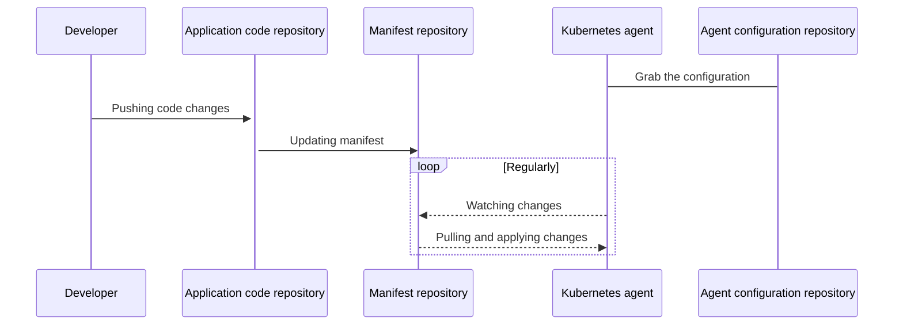

# GitLab Kubernetes Agent **(PREMIUM ONLY)**

> - [Introduced](https://gitlab.com/gitlab-org/gitlab/-/issues/223061) in [GitLab Premium](https://about.gitlab.com/pricing/) 13.4.
> - It's disabled on GitLab.com. Rolling this feature out to GitLab.com is [planned](https://gitlab.com/groups/gitlab-org/-/epics/3834).

CAUTION: **Warning:**
This feature might not be available to you. Check the **version history** note above for details.

The [GitLab Kubernetes Agent](https://gitlab.com/gitlab-org/cluster-integration/gitlab-agent)
is an active in-cluster component for solving GitLab and Kubernetes integration
tasks in a secure and cloud-native way. It enables:

- Integrating GitLab with a Kubernetes cluster behind a firewall or NAT
  (network address translation).
- Pull-based GitOps deployments by leveraging the
  [GitOps Engine](https://github.com/argoproj/gitops-engine).
- Real-time access to API endpoints within a cluster.

Many more features are planned. Please [review our roadmap](https://gitlab.com/groups/gitlab-org/-/epics/3329).

## GitLab Agent GitOps workflow

The GitLab Agent uses multiple GitLab projects to provide a flexible workflow
that can suit various needs. This diagram shows these repositories and the main
actors involved in a deployment:



There are several components that work in concert for the Agent to accomplish GitOps deployments:

- A properly-configured Kubernetes cluster.
- A configuration repository that contains a `config.yaml` file, which tells the
  Agent which repositories to synchronize with.
- A manifest repository that contains a `manifest.yaml`, which is tracked by the
  Agent and can be auto-generated. Any changes to `manifest.yaml` are applied to the cluster.

These repositories might be the same GitLab project or separate projects.

For more details, please refer to our [full architecture documentation](https://gitlab.com/gitlab-org/cluster-integration/gitlab-agent/-/blob/master/doc/architecture.md#high-level-architecture) in the Agent project.

## Get started with GitOps and the GitLab Agent

The setup process involves a few steps to enable GitOps deployments:

1. [Install the Agent server](#install-the-kubernetes-agent-server).
1. [Define a configuration repository](#define-a-configuration-repository).
1. [Create an Agent record in GitLab](#create-an-agent-record-in-gitlab).
1. [Generate and copy a Secret token used to connect to the Agent](#create-the-kubernetes-secret).
1. [Install the Agent into the cluster](#install-the-agent-into-the-cluster).
1. [Create a `manifest.yaml`](#create-a-manifestyaml).

### Upgrades and version compatibility

As the GitLab Kubernetes Agent is a new product, we are constantly adding new features
to it. As a result, while shipped features are production ready, its internal API is
neither stable nor versioned yet. For this reason, GitLab only guarantees compatibility
between corresponding major.minor (X.Y) versions of GitLab and its cluster side
component, `agentk`.

Upgrade your agent installations together with GitLab upgrades. To decide which version of `agentk`to install follow:

1. Open the [GITLAB_KAS_VERSION](https://gitlab.com/gitlab-org/gitlab/-/blob/master/GITLAB_KAS_VERSION) file from the GitLab Repository, which contains the latest `agentk` version associated with the `master` branch.
1. Change the `master` branch and select the Git tag associated with your version. For instance, you could change it to GitLab [v13.5.3-ee release](https://gitlab.com/gitlab-org/gitlab/-/blob/v13.5.3-ee/GITLAB_KAS_VERSION)

The available `agentk` versions can be found in
[its container registry](https://gitlab.com/gitlab-org/cluster-integration/gitlab-agent/container_registry/eyJuYW1lIjoiZ2l0bGFiLW9yZy9jbHVzdGVyLWludGVncmF0aW9uL2dpdGxhYi1hZ2VudC9hZ2VudGsiLCJ0YWdzX3BhdGgiOiIvZ2l0bGFiLW9yZy9jbHVzdGVyLWludGVncmF0aW9uL2dpdGxhYi1hZ2VudC9yZWdpc3RyeS9yZXBvc2l0b3J5LzEyMjMyMDUvdGFncz9mb3JtYXQ9anNvbiIsImlkIjoxMjIzMjA1LCJjbGVhbnVwX3BvbGljeV9zdGFydGVkX2F0IjpudWxsfQ==).

### Install the Kubernetes Agent Server

The GitLab Kubernetes Agent Server (KAS) can be deployed using [Omnibus
GitLab](https://docs.gitlab.com/omnibus/) or the [GitLab
chart](https://gitlab.com/gitlab-org/charts/gitlab). If you don't already have
GitLab installed, please refer to our [installation
documentation](https://docs.gitlab.com/ee/install/README.html).

NOTE: **Note:**
GitLab plans to include the KAS on [GitLab.com](https://gitlab.com/groups/gitlab-org/-/epics/3834).

#### Install with Omnibus

When using the [Omnibus GitLab](https://docs.gitlab.com/omnibus/) package:

1. Edit `/etc/gitlab/gitlab.rb`:

   ```plaintext
   gitlab_kas['enable'] = true
   ```

1. [Reconfigure GitLab](../../../administration/restart_gitlab.md#omnibus-gitlab-reconfigure).

To configure any additional options related to GitLab Kubernetes Agent Server,
refer to the **Enable GitLab KAS** section of the
[`gitlab.rb.template`](https://gitlab.com/gitlab-org/omnibus-gitlab/-/blob/master/files/gitlab-config-template/gitlab.rb.template).

#### Install with the Helm chart

When installing or upgrading the GitLab Helm chart, consider the following Helm v3 example.
If you're using Helm v2, you must modify this example. See our [notes regarding deploy with Helm](https://docs.gitlab.com/charts/installation/deployment.html#deploy-using-helm).

You must set `global.kas.enabled=true` for the KAS to be properly installed and configured:

```shell
helm repo add gitlab https://charts.gitlab.io/
helm repo update
helm upgrade --install gitlab gitlab/gitlab \
  --timeout 600s \
  --set global.hosts.domain=<YOUR_DOMAIN> \
  --set global.hosts.externalIP=<YOUR_IP> \
  --set certmanager-issuer.email=<YOUR_EMAIL> \
  --set global.kas.enabled=true
```

To specify other options related to the KAS sub-chart, create a `gitlab.kas` sub-section
of your `values.yaml` file:

```shell
gitlab:
  kas:
    # put your KAS custom options here
```

For details, read [Using the GitLab-KAS chart](https://docs.gitlab.com/charts/charts/gitlab/kas/).

### Define a configuration repository

Next, you need a GitLab repository to contain your Agent configuration. The minimal
repository layout looks like this:

```plaintext
.gitlab/agents/<agent-name>/config.yaml
```

Your `config.yaml` file can specify multiple manifest projects in the
section `manifest_projects`:

```yaml
gitops:
  manifest_projects:
  - id: "path-to/your-manifest-project-number1"
  ...
```

GitLab [versions 13.7 and later](https://gitlab.com/gitlab-org/gitlab/-/issues/259669) also
supports manifest projects containing
multiple directories (or subdirectories) of YAML files. For more information see our
documentation on the [Kubernetes Agent configuration respository](repository.md).

### Create an Agent record in GitLab

Next, create an GitLab Rails Agent record so the Agent can associate itself with
the configuration repository project. Creating this record also creates a Secret needed to configure
the Agent in subsequent steps. You can create an Agent record either:

- Through the Rails console:

  ```ruby
  project = ::Project.find_by_full_path("path-to/your-configuration-project")
  # agent-name should be the same as specified above in the config.yaml
  agent = ::Clusters::Agent.create(name: "<agent-name>", project: project)
  token = ::Clusters::AgentToken.create(agent: agent)
  token.token # this will print out the token you need to use on the next step
  ```

   For full details, read [Starting a Rails console session](../../../administration/operations/rails_console.md#starting-a-rails-console-session).

- Through GraphQL: **(PREMIUM ONLY)**

  ```graphql
  mutation createAgent {
    # agent-name should be the same as specified above in the config.yaml
    createClusterAgent(input: { projectPath: "path-to/your-configuration-project", name: "<agent-name>" }) {
      clusterAgent {
        id
        name
      }
      errors
    }
  }

  mutation createToken {
    clusterAgentTokenCreate(input: { clusterAgentId: <cluster-agent-id-taken-from-the-previous-mutation> }) {
      secret # This is the value you need to use on the next step
      token {
        createdAt
        id
      }
      errors
    }
  }
  ```

  NOTE: **Note:**
  GraphQL only displays the token one time after creating it.

  If you are new to using the GitLab GraphQL API, refer to the
  [Getting started with the GraphQL API page](../../../api/graphql/getting_started.md),
  or the [GraphQL Explorer](https://gitlab.com/-/graphql-explorer).

### Create the Kubernetes secret

After generating the token, you must apply it to the Kubernetes cluster.

1. If you haven't previously defined or created a namespace, run the following command:

   ```shell
   kubectl create namespace <YOUR-DESIRED-NAMESPACE>
   ```

1. Run the following command to create your Secret:

   ```shell
   kubectl create secret generic -n <YOUR-DESIRED-NAMESPACE> gitlab-agent-token --from-literal=token='YOUR_AGENT_TOKEN'
   ```

### Install the Agent into the cluster

Next, install the in-cluster component of the Agent. This example file contains the
Kubernetes resources required for the Agent to be installed. You can modify this
example [`resources.yml` file](#example-resourcesyml-file) in the following ways:

- Replace `namespace: gitlab-agent` with `namespace: <YOUR-DESIRED-NAMESPACE>`.
- You can configure `kas-address` (Kubernetes Agent Server) in several ways.
  The agent can use the WebSockets or gRPC protocols to connect to the Agent Server.
  Select the option appropriate for your cluster configuration and GitLab architecture:
  - The `wss` scheme (an encrypted WebSockets connection) is specified by default
    after you install `gitlab-kas` sub-chart or enable `kas` for Omnibus GitLab.
    In this case, you must set `wss://GitLab.host.tld:443/-/kubernetes-agent` as
    `kas-address`, where `GitLab.host.tld` is your GitLab hostname.
  - Specify the `ws` scheme (such as `ws://GitLab.host.tld:80/-/kubernetes-agent`)
    to use an unencrypted WebSockets connection.
  - Specify the `grpc` scheme if both Agent and Server are installed in one cluster.
    In this case, you may specify `kas-address` value as
    `grpc://gitlab-kas.<your-namespace>:5005`) to use gRPC directly, where `gitlab-kas`
    is the name of the service created by `gitlab-kas` chart, and `your-namespace`
    is the namespace where the chart was installed. Encrypted gRPC is not supported yet.
    Follow the
    [Support TLS for gRPC communication issue](https://gitlab.com/gitlab-org/cluster-integration/gitlab-agent/-/issues/7)
    for progress updates.
- If you defined your own secret name, replace `gitlab-agent-token` with your
  secret name in the `secretName:` section.

To apply this file, run the following command:

```shell
kubectl apply -n <YOUR-DESIRED-NAMESPACE> -f ./resources.yml
```

To review your configuration, run the following command:

```shell
$ kubectl get pods -n <YOUR-DESIRED-NAMESPACE>

NAMESPACE     NAME                               READY   STATUS    RESTARTS   AGE
gitlab-agent  gitlab-agent-77689f7dcb-5skqk      1/1     Running   0          51s
```

#### Example `resources.yml` file

```yaml
apiVersion: v1
kind: ServiceAccount
metadata:
  name: gitlab-agent
---
apiVersion: apps/v1
kind: Deployment
metadata:
  name: gitlab-agent
spec:
  replicas: 1
  selector:
    matchLabels:
      app: gitlab-agent
  template:
    metadata:
      labels:
        app: gitlab-agent
    spec:
      serviceAccountName: gitlab-agent
      containers:
      - name: agent
        image: "registry.gitlab.com/gitlab-org/cluster-integration/gitlab-agent/agentk:latest"
        args:
        - --token-file=/config/token
        - --kas-address
        - wss://gitlab.host.tld:443/-/kubernetes-agent
        volumeMounts:
        - name: token-volume
          mountPath: /config
      volumes:
      - name: token-volume
        secret:
          secretName: gitlab-agent-token
  strategy:
    type: RollingUpdate
    rollingUpdate:
      maxSurge: 0
      maxUnavailable: 1
---
apiVersion: rbac.authorization.k8s.io/v1
kind: ClusterRole
metadata:
  name: gitlab-agent-write
rules:
- resources:
  - '*'
  apiGroups:
  - '*'
  verbs:
  - create
  - update
  - delete
  - patch
---
apiVersion: rbac.authorization.k8s.io/v1
kind: ClusterRoleBinding
metadata:
  name: gitlab-agent-write-binding
roleRef:
  name: gitlab-agent-write
  kind: ClusterRole
  apiGroup: rbac.authorization.k8s.io
subjects:
- name: gitlab-agent
  kind: ServiceAccount
  namespace: gitlab-agent
---
apiVersion: rbac.authorization.k8s.io/v1
kind: ClusterRole
metadata:
  name: gitlab-agent-read
rules:
- resources:
  - '*'
  apiGroups:
  - '*'
  verbs:
  - get
  - list
  - watch
---
apiVersion: rbac.authorization.k8s.io/v1
kind: ClusterRoleBinding
metadata:
  name: gitlab-agent-read-binding
roleRef:
  name: gitlab-agent-read
  kind: ClusterRole
  apiGroup: rbac.authorization.k8s.io
subjects:
- name: gitlab-agent
  kind: ServiceAccount
  namespace: gitlab-agent
```

### Create a `manifest.yaml`

In a previous step, you configured a `config.yaml` to point to the GitLab projects
the Agent should synchronize. In each of those projects, you must create a `manifest.yaml`
file for the Agent to monitor. You can auto-generate this `manifest.yaml` with a
templating engine or other means.

The agent is authorized to download manifests for the configuration
project, and public projects. Support for other private projects is
planned in the issue [Agent authorization for private manifest
projects](https://gitlab.com/gitlab-org/gitlab/-/issues/220912).

Each time you commit and push a change to this file, the Agent logs the change:

```plaintext
2020-09-15_14:09:04.87946 gitlab-k8s-agent      : time="2020-09-15T10:09:04-04:00" level=info msg="Config: new commit" agent_id=1 commit_id=e6a3651f1faa2e928fe6120e254c122451be4eea
```

#### Example `manifest.yaml` file

This file creates an NGINX deployment.

```yaml
apiVersion: apps/v1
kind: Deployment
metadata:
  name: nginx-deployment
  namespace: gitlab-agent  # Can be any namespace managed by you that the agent has access to.
spec:
  selector:
    matchLabels:
      app: nginx
  replicas: 2
  template:
    metadata:
      labels:
        app: nginx
    spec:
      containers:
      - name: nginx
        image: nginx:1.14.2
        ports:
        - containerPort: 80
```

## Example projects

The following example projects can help you get started with the Kubernetes Agent.

### Simple NGINX deployment

This basic GitOps example deploys NGINX:

- [Configuration repository](https://gitlab.com/gitlab-org/configure/examples/kubernetes-agent)
- [Manifest repository](https://gitlab.com/gitlab-org/configure/examples/gitops-project)

### Deploying GitLab Runner with the Agent

These instructions assume that the Agent is already set up as described in the
[Get started with GitOps](#get-started-with-gitops-and-the-gitlab-agent):

1. Check the possible
   [Runner chart YAML values](https://gitlab.com/gitlab-org/charts/gitlab-runner/blob/master/values.yaml)
   on the Runner chart documentation, and create a `runner-chart-values.yaml` file
   with the configuration that fits your needs, such as:

    ```yaml
    ## The GitLab Server URL (with protocol) that want to register the runner against
    ## ref: https://docs.gitlab.com/runner/commands/README.html#gitlab-runner-register
    ##
    gitlabUrl: https://gitlab.my.domain.com/

    ## The Registration Token for adding new Runners to the GitLab Server. This must
    ## be retrieved from your GitLab Instance.
    ## ref: https://docs.gitlab.com/ce/ci/runners/README.html
    ##
    runnerRegistrationToken: "XXXXXXYYYYYYZZZZZZ"

    ## For RBAC support:
    rbac:
      create: true

    ## Run all containers with the privileged flag enabled
    ## This will allow the docker:dind image to run if you need to run Docker
    ## commands. Please read the docs before turning this on:
    ## ref: https://docs.gitlab.com/runner/executors/kubernetes.html#using-dockerdind
    runners:
      privileged: true
    ```

1. Create a single manifest file to install the Runner chart with your cluster agent:

   ```shell
   helm template --namespace gitlab gitlab-runner -f runner-chart-values.yaml gitlab/gitlab-runner > manifest.yaml
   ```

1. Push your `manifest.yaml` to your manifest repository.

## Troubleshooting

If you face any issues while using GitLab Kubernetes Agent, you can read the
service logs with the following commands:

- KAS pod logs - Tail these logs with the
  `kubectl logs -f -l=app=kas -n <YOUR-GITLAB-NAMESPACE>`
  command. In Omnibus GitLab, the logs reside in `/var/log/gitlab/gitlab-kas/`.
- Agent pod logs - Tail these logs with the
  `kubectl logs -f -l=app=gitlab-agent -n <YOUR-DESIRED-NAMESPACE>` command.

### KAS logs - GitOps: failed to get project info

```plaintext
{"level":"warn","time":"2020-10-30T08:37:26.123Z","msg":"GitOps: failed to get project info","agent_id":4,"project_id":"root/kas-manifest001","error":"error kind: 0; status: 404"}
```

This error is shown if the specified manifest project `root/kas-manifest001`
doesn't exist, or if a project is private. To fix it, make sure the project exists
and its visibility is [set to public](../../../public_access/public_access.md).

### KAS logs - Configuration file not found

```plaintext
time="2020-10-29T04:44:14Z" level=warning msg="Config: failed to fetch" agent_id=2 error="configuration file not found: \".gitlab/agents/test-agent/config.yaml\
```

This error is shown if the path to the configuration project was specified incorrectly,
or if the path to `config.yaml` inside the project is not valid.

### Agent logs - Transport: Error while dialing failed to WebSocket dial

```plaintext
{"level":"warn","time":"2020-11-04T10:14:39.368Z","msg":"GetConfiguration failed","error":"rpc error: code = Unavailable desc = connection error: desc = \"transport: Error while dialing failed to WebSocket dial: failed to send handshake request: Get \\\"https://gitlab-kas:443/-/kubernetes-agent\\\": dial tcp: lookup gitlab-kas on 10.60.0.10:53: no such host\""}
```

This error is shown if there are some connectivity issues between the address
specified as `kas-address`, and your Agent pod. To fix it, make sure that you
specified the `kas-address` correctly.

### Agent logs - ValidationError(Deployment.metadata

```plaintext
{"level":"info","time":"2020-10-30T08:56:54.329Z","msg":"Synced","project_id":"root/kas-manifest001","resource_key":"apps/Deployment/kas-test001/nginx-deployment","sync_result":"error validating data: [ValidationError(Deployment.metadata): unknown field \"replicas\" in io.k8s.apimachinery.pkg.apis.meta.v1.ObjectMeta, ValidationError(Deployment.metadata): unknown field \"selector\" in io.k8s.apimachinery.pkg.apis.meta.v1.ObjectMeta, ValidationError(Deployment.metadata): unknown field \"template\" in io.k8s.apimachinery.pkg.apis.meta.v1.ObjectMeta]"}
```

This error is shown if your `manifest.yaml` file is malformed, and Kubernetes can't
create specified objects. Make sure that your `manifest.yaml` file is valid. You
may try using it to create objects in Kubernetes directly for more troubleshooting.

### Agent logs - Error while dialing failed to WebSocket dial: failed to send handshake request

```plaintext
{"level":"warn","time":"2020-10-30T09:50:51.173Z","msg":"GetConfiguration failed","error":"rpc error: code = Unavailable desc = connection error: desc = \"transport: Error while dialing failed to WebSocket dial: failed to send handshake request: Get \\\"https://GitLabhost.tld:443/-/kubernetes-agent\\\": net/http: HTTP/1.x transport connection broken: malformed HTTP response \\\"\\\\x00\\\\x00\\\\x06\\\\x04\\\\x00\\\\x00\\\\x00\\\\x00\\\\x00\\\\x00\\\\x05\\\\x00\\\\x00@\\\\x00\\\"\""}
```

This error is shown if you configured `wss` as `kas-address` on the agent side,
but KAS on the server side is not available via `wss`. To fix it, make sure the
same schemes are configured on both sides.

It's not possible to set the `grpc` scheme due to the issue
[It is not possible to configure KAS to work with `grpc` without directly editing GitLab KAS deployment](https://gitlab.com/gitlab-org/gitlab/-/issues/276888). To use `grpc` while the
issue is in progress, directly edit the deployment with the
`kubectl edit deployment gitlab-kas` command, and change `--listen-websocket=true` to `--listen-websocket=false`. After running that command, you should be able to use
`grpc://gitlab-kas.<YOUR-NAMESPACE>:5005`.

#### Agent logs - Decompressor is not installed for grpc-encoding

```plaintext
{"level":"warn","time":"2020-11-05T05:25:46.916Z","msg":"GetConfiguration.Recv failed","error":"rpc error: code = Unimplemented desc = grpc: Decompressor is not installed for grpc-encoding \"gzip\""}
```

This error is shown if the version of the agent is newer that the version of KAS.
To fix it, make sure that both `agentk` and KAS use the same versions.
