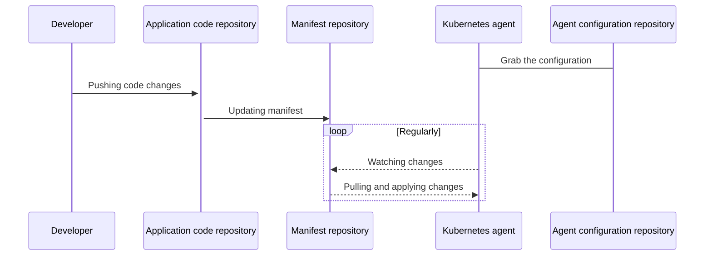

# GitLab Kubernetes Agent

## Goals

The [GitLab Kubernetes Agent](https://gitlab.com/gitlab-org/cluster-integration/gitlab-agent) is an active in-cluster component for solving GitLab and Kubernetes integration tasks in a secure and cloud native way.

Features:

1. Makes it possible to integrate GitLab with a Kubernetes cluster behind a firewall or NAT
1. Enables pull-based GitOps deployments by leveraging the [GitOps Engine](https://github.com/argoproj/gitops-engine)
1. Allows for real-time access to API endpoints within a cluster.
1. Many more features are planned. Please [review our roadmap](https://gitlab.com/groups/gitlab-org/-/epics/3329).

## Architecture

### GitLab Agent GitOps workflow



Please refer to our [full architecture documentation in the Agent project](https://gitlab.com/gitlab-org/cluster-integration/gitlab-agent/-/blob/master/doc/architecture.md#high-level-architecture).

## Getting started with GitOps using the GitLab Agent and the GitLab Cloud Native Helm chart

There are several components that work in concert for the Agent to accomplish GitOps deployments:

1. A Kubernetes cluster that is properly configured
1. A configuration repository that contains a `config.yaml` file. This `config.yaml` tells the Agent which repositories to synchronize with.
1. A manifest repository that contains a `manifest.yaml`. This `manifest.yaml` (which can be autogenerated) is tracked by the Agent and any changes to the file are automatically applied to the cluster.

The setup process involves a few steps that, once completed, will enable GitOps deployments to work

1. Installing the Agent server via GitLab Helm chart
1. Defining a configuration directory
1. Creating an Agent record in GitLab
1. Generating and copying a Secret token used to connect to the Agent
1. Installing the Agent into the cluster
1. Creating a `manifest.yaml`

### Installing the Agent server via Helm

Currently the GitLab Kubernetes Agent can only be deployed via our [Helm chart](https://gitlab.com/gitlab-org/charts/gitlab).

NOTE: We are working quickly to [include the Agent in Official Linux Package](https://gitlab.com/gitlab-org/gitlab/-/issues/223060).

If you don't already have GitLab installed via Helm please refer to our [installation documentation](https://docs.gitlab.com/charts/installation/)

When installing/upgrading the GitLab Helm chart please consider the following Helm 2 example (if using Helm 3 please modify):

```shell
helm upgrade --force --install gitlab . \
  --timeout 600 \
  --set global.hosts.domain=<YOUR_DOMAIN> \
  --set global.hosts.externalIP=<YOUR_IP> \
  --set certmanager-issuer.email=<YOUR_EMAIL> \
  --set name=gitlab-instance \
  --set global.kas.enabled=true
```

`global.kas.enabled=true` must be set in order for the Agent to be properly installed and configured.

### Defining a configuration repository

Next you will need a GitLab repository that will contain your Agent configuration.

The minimal repository layout looks like this:

`.gitlab/agents/<agent-name>/config.yaml`

The `config.yaml` file contents should look like this:

```yaml
gitops:
  manifest_projects:
  - id: "path-to/your-awesome-project"
```

### Creating an Agent record in GitLab

Next you will need to create an GitLab Rails Agent record so that your GitLab project so that the Agent itself can associate with a GitLab project. This process will also yield a Secret that you will use to configure the Agent in subsequent steps.

There are two ways to accomplish this:

1. Via the Rails console
1. Via GraphQL

To do this you could either run `rails c` or via GraphQL. From `rails c`:

```ruby
  project = ::Project.find_by_full_path("path-to/your-awesome-project")
  agent = ::Clusters::Agent.create(name: "<agent-name>", project: project)
  token = ::Clusters::AgentToken.create(agent: agent)
  token.token # this will print out the token you need to use on the next step
```

or using GraphQL:

with this approach, you'll need a premium license to use this feature.

If you are new to using the GitLab GraphQL API please refer to the [Getting started with the GraphQL API page](../../../api/graphql/getting_started.md) or check out the [GraphQL Explorer](https://gitlab.com/-/graphql-explorer).

```json
  mutation createAgent {
    createClusterAgent(input: { projectPath: "path-to/your-awesome-project", name: "<agent-name>" }) {
      clusterAgent {
        id
        name
      }
      errors
    }
  }

  mutation createToken {
    clusterAgentTokenCreate(input: { clusterAgentId: <cluster-agent-id-taken-from-the-previous-mutation> }) {
      secret # This is the value you need to use on the next step
      token {
        createdAt
        id
      }
      errors
    }
  }
```

Note that GraphQL will only show you the token once, after you've created it.

### Creating the Kubernetes secret

Once the token has been generated it needs to be applied to the Kubernetes cluster.

If you didn't previously define or create a namespace you need to do that first:

```shell
kubectl create namespace <YOUR-DESIRED-NAMESPACE>
```

Run the following command to create your Secret:

```shell
kubectl create secret generic -n <YOUR-DESIRED-NAMESPACE> gitlab-agent-token --from-literal=token='YOUR_AGENT_TOKEN'
```

### Installing the Agent into the cluster

Next you are now ready to install the in-cluster component of the Agent. The below is an example YAML file of the Kubernetes resources required for the Agent to be installed.

Let's highlight a few of the details in the example below:

1. You can replace `gitlab-agent` with <YOUR-DESIRED-NAMESPACE>
1. For the `kas-address` (Kubernetes Agent Server), you can replace `grpc://host.docker.internal:5005` with the address of the kas agent that was initialized via your Helm install.
1. If you defined your own secret name, then replace `gitlab-agent-token` with your secret name.

`./resources.yml`

```yaml
apiVersion: v1
kind: ServiceAccount
metadata:
  name: gitlab-agent
---
apiVersion: apps/v1
kind: Deployment
metadata:
  name: gitlab-agent
spec:
  replicas: 1
  selector:
    matchLabels:
      app: gitlab-agent
  template:
    metadata:
      labels:
        app: gitlab-agent
    spec:
      serviceAccountName: gitlab-agent
      containers:
      - name: agent
        image: "registry.gitlab.com/gitlab-org/cluster-integration/gitlab-agent/agentk:latest"
        args:
        - --token-file=/config/token
        - --kas-address
        - grpc://host.docker.internal:5005 # {"$openapi":"kas-address"}
        volumeMounts:
        - name: token-volume
          mountPath: /config
      volumes:
      - name: token-volume
        secret:
          secretName: gitlab-agent-token
  strategy:
    type: RollingUpdate
    rollingUpdate:
      maxSurge: 0
      maxUnavailable: 1
---
apiVersion: rbac.authorization.k8s.io/v1
kind: ClusterRole
metadata:
  name: gitlab-agent-write
rules:
- resources:
  - '*'
  apiGroups:
  - '*'
  verbs:
  - create
  - update
  - delete
  - patch
---
apiVersion: rbac.authorization.k8s.io/v1
kind: ClusterRoleBinding
metadata:
  name: gitlab-agent-write-binding
roleRef:
  name: gitlab-agent-write
  kind: ClusterRole
  apiGroup: rbac.authorization.k8s.io
subjects:
- name: gitlab-agent
  kind: ServiceAccount
  namespace: gitlab-agent
---
apiVersion: rbac.authorization.k8s.io/v1
kind: ClusterRole
metadata:
  name: gitlab-agent-read
rules:
- resources:
  - '*'
  apiGroups:
  - '*'
  verbs:
  - get
  - list
  - watch
---
apiVersion: rbac.authorization.k8s.io/v1
kind: ClusterRoleBinding
metadata:
  name: gitlab-agent-read-binding
roleRef:
  name: gitlab-agent-read
  kind: ClusterRole
  apiGroup: rbac.authorization.k8s.io
subjects:
- name: gitlab-agent
  kind: ServiceAccount
  namespace: gitlab-agent

```

```shell
kubectl apply -n gitlab-agent -f ./resources.yml
```

```plaintext
$ kubectl get pods --all-namespaces
NAMESPACE     NAME                               READY   STATUS    RESTARTS   AGE
gitlab-agent  gitlab-agent-77689f7dcb-5skqk      1/1     Running   0          51s
kube-system   coredns-f9fd979d6-n6wcw            1/1     Running   0          14m
kube-system   etcd-minikube                      1/1     Running   0          14m
kube-system   kube-apiserver-minikube            1/1     Running   0          14m
kube-system   kube-controller-manager-minikube   1/1     Running   0          14m
kube-system   kube-proxy-j6zdh                   1/1     Running   0          14m
kube-system   kube-scheduler-minikube            1/1     Running   0          14m
kube-system   storage-provisioner                1/1     Running   0          14m
```

### Creating a `manifest.yaml`

In the above step, you configured a `config.yaml` to point to which GitLab projects the Agent should synchronize. Within each one of those projects, you need to create a `manifest.yaml` file which the Agent will monitor. This `manifest.yaml` can be autogenerated by a templating engine or other means.

Example `manifest.yaml`:

```yaml
apiVersion: apps/v1
kind: Deployment
metadata:
  name: nginx-deployment
spec:
  selector:
    matchLabels:
      app: nginx
  replicas: 2
  template:
    metadata:
      labels:
        app: nginx
    spec:
      containers:
      - name: nginx
        image: nginx:1.14.2
        ports:
        - containerPort: 80
```

The above file creates a simple NGINX deployment.

Each time you commit and push a change to the `manifest.yaml` the Agent will observe the change. Example log:

```plaintext
2020-09-15_14:09:04.87946 gitlab-k8s-agent      : time="2020-09-15T10:09:04-04:00" level=info msg="Config: new commit" agent_id=1 commit_id=e6a3651f1faa2e928fe6120e254c122451be4eea
```

## Example projects

Basic GitOps example deploying NGINX: [Configuration repository](https://gitlab.com/gitlab-org/configure/examples/kubernetes-agent), [Manifest repository](https://gitlab.com/gitlab-org/configure/examples/gitops-project)
