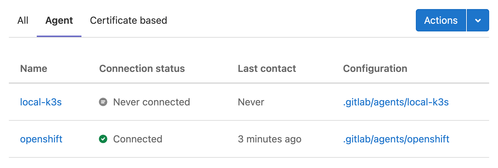
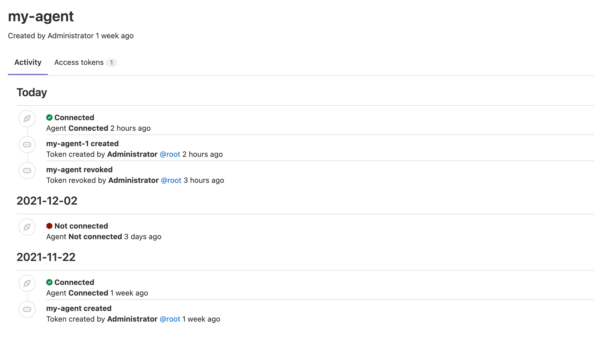

# Install the GitLab Agent **(FREE)**

> [Moved](https://gitlab.com/groups/gitlab-org/-/epics/6290) from GitLab Premium to GitLab Free in 14.5.

To get started with the Agent, install it in your cluster.

## Prerequisites **(SELF)**

- An existing Kubernetes cluster.
- On self-managed GitLab instances, a GitLab administrator needs to set up the [GitLab Agent Server (KAS)](../../../../administration/clusters/kas.md).

## Installation steps

To install the [Agent](../index.md) in your cluster:

1. [Define a configuration repository](#define-a-configuration-repository).
1. [Register an agent with GitLab](#register-an-agent-with-gitlab).
1. [Install the agent into the cluster](#install-the-agent-into-the-cluster).

<i class="fa fa-youtube-play youtube" aria-hidden="true"></i> Watch a GitLab 14.2 [walking-through video](https://www.youtube.com/watch?v=XuBpKtsgGkE) with this process.

### Define a configuration repository

> - [Introduced](https://gitlab.com/gitlab-org/gitlab/-/issues/259669) in GitLab 13.7, the Agent manifest configuration can be added to multiple directories (or subdirectories) of its repository.
> - Group authorization was [introduced](https://gitlab.com/groups/gitlab-org/-/epics/5784) in GitLab 14.3.

To create an agent, you need:

1. A GitLab repository to hold the configuration file.
1. Install the Agent in a cluster.

After installed, when you update the configuration file, GitLab transmits the
information to the cluster automatically without downtime.

In your repository, add the Agent configuration file under:

```plaintext
.gitlab/agents/<agent-name>/config.yaml
```

Make sure that `<agent-name>` conforms to the [Agent's naming format](https://gitlab.com/gitlab-org/cluster-integration/gitlab-agent/-/blob/master/doc/identity_and_auth.md#agent-identity-and-name).

WARNING:
The agent is only recognized if you use `.yaml` extension for the `config.yaml` file. The extension `.yml` is **not** recognized.

You **don't have to add any content** to this file when you create it. The fact that the file exists
tells GitLab that this is an agent configuration file and enables the [CI/CD tunnel](../ci_cd_tunnel.md#example-for-a-kubectl-command-using-the-cicd-tunnel). Later on, you can use this
file to [configure the agent](../repository.md) by setting up parameters such as:

- Groups and projects that can access the agent via the [CI/CD Tunnel](../ci_cd_tunnel.md).
- [Manifest projects to synchronize](../repository.md#synchronize-manifest-projects).
- The address of the `hubble-relay` for the [Network Security policy integrations](../../../project/clusters/protect/index.md).

To see all the settings available, read the [Agent configuration repository documentation](../repository.md).

### Register an agent with GitLab

> [Introduced](https://gitlab.com/groups/gitlab-org/-/epics/5786) in GitLab 14.1, you can create a new Agent record directly from the GitLab UI.

Next, create a GitLab Rails Agent record to associate it with
the configuration repository project. Creating this record also creates a Secret needed to configure
the Agent in subsequent steps.

In GitLab:

1. Ensure that [GitLab CI/CD is enabled in your project](../../../../ci/enable_or_disable_ci.md#enable-cicd-in-a-project).
1. From your project's sidebar, select **Infrastructure > Kubernetes clusters**.
1. Select **Actions**.
1. From the **Select an agent** dropdown, select the agent you want to connect and select **Register an agent** to access the installation form.
1. The form reveals your registration token. Securely store this secret token as you cannot view it again.
1. Copy the command under **Recommended installation method**.

### Install the agent into the cluster

In your computer:

1. Open your local terminal and connect to your cluster.
1. Run the command you copied when registering your cluster in the previous step.

See the following sections to learn about customizing the installation.

## Simple installation method

The command provided by GitLab does the following things:

- Creates a namespace for the deployment (`gitlab-kubernetes-agent`).
- Sets up a service account with `cluster-admin` rights. Read more on [how you can restrict this service account](#customize-the-permissions-for-the-agentk-service-account).
- Creates a `Secret` resource for the agent registration token.
- Creates a `Deployment` resource for the `agentk` pod.

The one-liner installer can be customized at the command line. To find out the various options the above Docker container supports, run:

```shell
docker run --pull=always --rm registry.gitlab.com/gitlab-org/cluster-integration/gitlab-agent/cli:stable generate --help
```

WARNING:
`--agent-version stable` can be used to refer to the latest stable release at the time when the command runs. It's fine for
testing purposes but for production please make sure to specify a matching version explicitly.

## Advanced installation method

For more advanced configurations, we recommend to use [the `kpt` based installation method](https://gitlab.com/gitlab-org/cluster-integration/gitlab-agent/-/tree/master/build/deployment/gitlab-agent).

Otherwise, follow the manual installation steps described below.

### Customize the permissions for the `agentk` service account

The GitLab Agent for Kubernetes allows you to fully own your cluster and requires only the permissions you give. Still, for easy getting started, by default the generated manifests provide `cluster-admin` rights to the agent.

As part of the advanced installation method, you can restrict the agent access rights using Kustomize overlays. [An example is commented out](https://gitlab.com/gitlab-org/cluster-integration/gitlab-agent/-/blob/master/build/deployment/gitlab-agent/cluster/kustomization.yaml) in the `kpt` package you retrieved as part of the installation.

To create restricted permissions:

1. Copy the `cluster` directory.
1. Edit the `kustomization.yaml` and `components/*` files based on your requirements.
1. Run `kustomize build <your copied directory> | kubectl apply -f -` to apply your configuration.

The above setup allows you to regularly update from the upstream package using `kpt pkg update gitlab-agent --strategy resource-merge` and maintain your customizations at the same time.

## Example projects

The following example projects can help you get started with the Agent.

- [Configuration repository](https://gitlab.com/gitlab-org/configure/examples/kubernetes-agent)
- This basic GitOps example deploys NGINX: [Manifest repository](https://gitlab.com/gitlab-org/configure/examples/gitops-project)

## View installed Agents

Users with at least the [Developer](../../../permissions.md) can access the user interface
for the Agent at **Infrastructure > Kubernetes clusters**, under the
**Agent** tab. This page lists all registered agents for the current project,
and the configuration directory for each agent:



Additional management interfaces are planned for the GitLab Agent.
[Provide more feedback in the related epic](https://gitlab.com/groups/gitlab-org/-/epics/4739).

## View Agent activity information

> [Introduced](https://gitlab.com/gitlab-org/gitlab/-/issues/277323) in GitLab 14.6.

Users with at least the [Developer](../../../permissions.md) can view the Agent's activity events.
The activity logs help you to identify problems and get the information you need for troubleshooting.
You can see events from a week before the current date.
To access an agent's activity:

1. Go to your agent's configuration repository.
1. From the sidebar, select **Infrastructure > Kubernetes clusters**.
1. Select the **Agent** tab.
1. Select the agent you want to see the activity.

You can see the following events on the activity list:

- Agent registration:
  - When a new token is **created**.
- Connection events:
  - When an agent is successfully **connected** to a cluster.

Note that the connection status is logged when you connect an agent for the first time
or after more than an hour of inactivity.



## Upgrades and version compatibility

The Agent is comprised of two major components: `agentk` and `kas`.
As we provide `kas` installers built into the various GitLab installation methods, the required `kas` version corresponds to the GitLab `major.minor` (X.Y) versions.

At the same time, `agentk` and `kas` can differ by 1 minor version in either direction. For example,
`agentk` 14.4 supports `kas` 14.3, 14.4, and 14.5 (regardless of the patch).

A feature introduced in a given GitLab minor version might work with other `agentk` or `kas` versions.
To make sure that it works, use at least the same `agentk` and `kas` minor version. For example,
if your GitLab version is 14.2, use at least `agentk` 14.2 and `kas` 14.2.

We recommend upgrading your `kas` installations together with GitLab instances' upgrades, and to upgrade the `agentk` installations after upgrading GitLab.

The available `agentk` and `kas` versions can be found in
[the container registry](https://gitlab.com/gitlab-org/cluster-integration/gitlab-agent/container_registry/).
