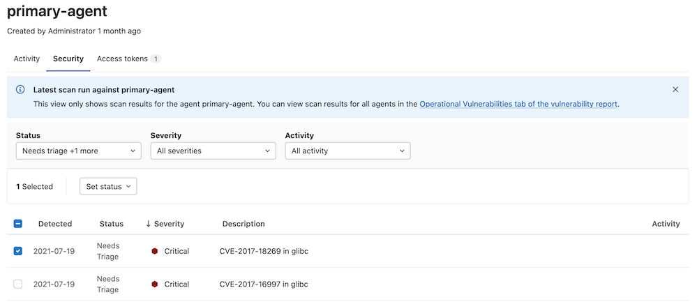

DETAILS:
**Tier:** Ultimate
**Offering:** GitLab.com, GitLab Self-Managed, GitLab Dedicated

> - [Deprecated](https://gitlab.com/gitlab-org/gitlab/-/issues/368828) the starboard directive in GitLab 15.4. The starboard directive is scheduled for removal in GitLab 16.0.

## Supported architectures

In GitLab agent for Kubernetes 16.10.0 and later and GitLab agent Helm Chart 1.25.0 and later, operational container scanning (OCS) is supported for `linux/arm64` and `linux/amd64`. For earlier versions, only `linux/amd64` is supported.

## Enable operational container scanning

You can use OCS to scan container images in your cluster for security vulnerabilities.
In GitLab agent 16.9 and later, OCS uses a [wrapper image](https://gitlab.com/gitlab-org/security-products/analyzers/trivy-k8s-wrapper) around [Trivy](https://github.com/aquasecurity/trivy) to scan images for vulnerabilities.
Before GitLab 16.9, OCS directly used the [Trivy](https://github.com/aquasecurity/trivy) image.

OCS can be configured to run on a cadence by using `agent config` or a project's scan execution policy.

NOTE:
If both `agent config` and `scan execution policies` are configured, the configuration from `scan execution policy` takes precedence.

### Enable via agent configuration

To enable scanning of images within your Kubernetes cluster via the agent configuration, add a `container_scanning` configuration block to your agent
configuration with a `cadence` field containing a [CRON expression](https://en.wikipedia.org/wiki/Cron) for when the scans are run.

```yaml
container_scanning:
  cadence: '0 0 * * *' # Daily at 00:00 (Kubernetes cluster time)
```

The `cadence` field is required. GitLab supports the following types of CRON syntax for the cadence field:

- A daily cadence of once per hour at a specified hour, for example: `0 18 * * *`
- A weekly cadence of once per week on a specified day and at a specified hour, for example: `0 13 * * 0`

NOTE:
Other elements of the [CRON syntax](https://docs.oracle.com/cd/E12058_01/doc/doc.1014/e12030/cron_expressions.htm) may work in the cadence field if supported by the [cron](https://github.com/robfig/cron) we are using in our implementation, however, GitLab does not officially test or support them.

NOTE:
The CRON expression is evaluated in [UTC](https://www.timeanddate.com/worldclock/timezone/utc) using the system-time of the Kubernetes-agent pod.

By default, operational container scanning does not scan any workloads for vulnerabilities.
You can set the `vulnerability_report` block with the `namespaces`
field which can be used to select which namespaces are scanned. For example,
if you would like to scan only the `default`, `kube-system` namespaces, you can use this configuration:

```yaml
container_scanning:
  cadence: '0 0 * * *'
  vulnerability_report:
    namespaces:
      - default
      - kube-system
```

For every target namespace, all images in the following workload resources are scanned by default:

- Pod
- ReplicaSet
- ReplicationController
- StatefulSet
- DaemonSet
- CronJob
- Job

This can be customized by [configuring the Trivy Kubernetes Resource Detection](#configure-trivy-kubernetes-resource-detection).

### Enable via scan execution policies

To enable scanning of images in your Kubernetes cluster by using scan execution policies, use the
[scan execution policy editor](../../application_security/policies/scan_execution_policies.md#scan-execution-policy-editor)
to create a new schedule rule.

NOTE:
The Kubernetes agent must be running in your cluster to scan running container images

NOTE:
Operational Container Scanning operates independently of GitLab pipelines. It is fully automated and managed by the Kubernetes Agent, which initiates new scans at the scheduled time configured in the Scan Execution Policy. The agent creates a dedicated Job within your cluster to perform the scan and report findings back to GitLab.

Here is an example of a policy which enables operational container scanning within the cluster the Kubernetes agent is attached to:

```yaml
- name: Enforce Container Scanning in cluster connected through my-gitlab-agent for default and kube-system namespaces
  enabled: true
  rules:
  - type: schedule
    cadence: '0 10 * * *'
    agents:
      <agent-name>:
        namespaces:
        - 'default'
        - 'kube-system'
  actions:
  - scan: container_scanning
```

The keys for a schedule rule are:

- `cadence` (required): a [CRON expression](https://docs.oracle.com/cd/E12058_01/doc/doc.1014/e12030/cron_expressions.htm) for when the scans are run
- `agents:<agent-name>` (required): The name of the agent to use for scanning
- `agents:<agent-name>:namespaces` (required): The Kubernetes namespaces to scan.

NOTE:
Other elements of the [CRON syntax](https://docs.oracle.com/cd/E12058_01/doc/doc.1014/e12030/cron_expressions.htm) may work in the cadence field if supported by the [cron](https://github.com/robfig/cron) we are using in our implementation, however, GitLab does not officially test or support them.

NOTE:
The CRON expression is evaluated in [UTC](https://www.timeanddate.com/worldclock/timezone/utc) using the system-time of the Kubernetes-agent pod.

You can view the complete schema within the [scan execution policy documentation](../../application_security/policies/scan_execution_policies.md#scan-execution-policies-schema).

## OCS vulnerability resolution for multi cluster configuration

To ensure accurate vulnerability tracking with OCS, you should create a separate GitLab project with OCS enabled for each cluster. If you have multiple clusters, be sure to use one project for each cluster.

OCS resolves vulnerabilities that are no longer found in your cluster after each scan by comparing the current scan vulnerabilities with those previously detected. Any vulnerabilities from earlier scans that are no longer present in the current scan are resolved for the GitLab project.

If multiple clusters are configured in the same project, an OCS scan in one cluster (for example, Project A) would resolve previously detected vulnerabilities from another cluster (for example, Project B), leading to incorrect vulnerability reporting.

## Configure scanner resource requirements

By default the scanner pod's default resource requirements are:

```yaml
requests:
  cpu: 100m
  memory: 100Mi
  ephemeral_storage: 1Gi
limits:
  cpu: 500m
  memory: 500Mi
  ephemeral_storage: 3Gi
```

You can customize it with a `resource_requirements` field.

```yaml
container_scanning:
  resource_requirements:
    requests:
      cpu: '0.2'
      memory: 200Mi
      ephemeral_storage: 2Gi
    limits:
      cpu: '0.7'
      memory: 700Mi
      ephemeral_storage: 4Gi
```

When using a fractional value for CPU, format the value as a string.

NOTE:

- Resource requirements can only be set by using the agent configuration. If you enabled Operational Container Scanning through scan execution policies and need to configure resource requirements, you should do so via the agent configuration file.
- When using Google Kubernetes Engine (GKE) for Kubernetes orchestration, [the ephemeral storage limit value will always be set to equal the request value](https://cloud.google.com/kubernetes-engine/docs/concepts/autopilot-resource-requests#resource-limits). This is enforced by GKE.

## Custom repository for Trivy K8s Wrapper

During a scan, OCS deploys pods using an image from the [Trivy K8s Wrapper repository](https://gitlab.com/security-products/trivy-k8s-wrapper/container_registry/5992609), which transmits the vulnerability report generated by [Trivy Kubernetes](https://aquasecurity.github.io/trivy/v0.54/docs/target/kubernetes) to OCS.

If your cluster's firewall restricts access to the Trivy K8s Wrapper repository, you can configure OCS to pull the image from a custom repository. Ensure that the custom repository mirrors the Trivy K8s Wrapper repository for compatibility.

```yaml
container_scanning:
  trivy_k8s_wrapper_image:
    repository: "your-custom-registry/your-image-path"
```

## Configure scan timeout

> - [Introduced](https://gitlab.com/gitlab-org/gitlab/-/issues/497460) in GitLab 17.7.

By default, the Trivy scan times out after five minutes. The agent itself provides an extra 15 minutes to read the chained configmaps and transmit the vulnerabilities.

To customize the Trivy timeout duration:

- Specify the duration in seconds with the `scanner_timeout` field.

For example:

```yaml
container_scanning:
  scanner_timeout: "3600s" # 60 minutes
```

## Configure Trivy report size

> - [Introduced](https://gitlab.com/gitlab-org/gitlab/-/issues/497460) in GitLab 17.7.

By default, the Trivy report is limited to 100 MB, which is sufficient for most scans. However, if you have a lot of workloads, you might need to increase the limit.

To do this:

- Specify the limit in bytes with the `report_max_size` field.

For example:

```yaml
container_scanning:
  report_max_size: "300000000" # 300MB
```

## Configure Trivy Kubernetes resource detection

> - [Introduced](https://gitlab.com/gitlab-org/gitlab/-/issues/431707) in GitLab 17.9.

By default, Trivy looks for the following Kubernetes resource types to discover scannable images:

- Pod
- ReplicaSet
- ReplicationController
- StatefulSet
- DaemonSet
- CronJob
- Job
- Deployment

You can limit the Kubernetes resource types that Trivy discovers, for example to only scan "active" images.

To do this:

- Specify the resource types with the `resource_types` field:

  ```yaml
  container_scanning:
    vulnerability_report:
      resource_types:
        - Deployment
        - Pod
        - Job
  ```

## Configure Trivy report artifact deletion

> - [Introduced](https://gitlab.com/gitlab-org/gitlab/-/issues/480845) in GitLab 17.9.

By default, the GitLab agent deletes the Trivy report artifact after a scan has completed.

You can configure the GitLab agent to preserve the report artifact, so you can view the report in its raw state.

To do this:

- Set `delete_report_artifact` to `false`:

  ```yaml
  container_scanning:
    delete_report_artifact: false
  ```

## View cluster vulnerabilities

To view vulnerability information in GitLab:

1. On the left sidebar, select **Search or go to** and find the project that contains the agent configuration file.
1. Select **Operate > Kubernetes clusters**.
1. Select the **Agent** tab.
1. Select an agent to view the cluster vulnerabilities.



This information can also be found under [operational vulnerabilities](../../application_security/vulnerability_report/_index.md#operational-vulnerabilities).

NOTE:
You must have at least the Developer role.

## Scanning private images

> - [Introduced](https://gitlab.com/gitlab-org/gitlab/-/issues/415451) in GitLab 16.4.

To scan private images, the scanner relies on the image pull secrets (direct references and from the service account) to pull the image.

## Known issues

In GitLab agent 16.9 and later, operational container scanning:

- Handles Trivy reports of up to 100 MB. For previous releases, this limit is 10 MB.
- Is [disabled](../../../development/fips_gitlab.md#unsupported-features-in-fips-mode) when the GitLab agent runs in `fips` mode.

## Troubleshooting

### `Error running Trivy scan. Container terminated reason: OOMKilled`

OCS might fail with an OOM error if there are too many resources to be scanned or if the images being scanned are large.

To resolve this, [configure the resource requirement](#configure-scanner-resource-requirements) to increase the amount of memory available.

### `Pod ephemeral local storage usage exceeds the total limit of containers`

OCS scans could fail for Kubernetes clusters that have low default ephemeral storage. For example, [GKE autopilot](https://cloud.google.com/kubernetes-engine/docs/concepts/autopilot-resource-requests#defaults) sets the default ephemeral storage to 1GB. This is an issue for OCS when scanning namespaces with large images, as there may not be enough space to store all data necessary for OCS.

To resolve this, [configure the resource requirement](#configure-scanner-resource-requirements) to increase the amount of ephemeral storage available.

Another message indicative of this issue may be: `OCS Scanning pod evicted due to low resources. Please configure higher resource limits.`

### `Error running Trivy scan due to context timeout`

OCS might fail to complete a scan if it takes Trivy too long to complete the scan. The default scan timeout is 5 minutes, with an extra 15 minutes for the agent to read the results and transmit the vulnerabilities.

To resolve this, [configure the scanner timeout](#configure-scan-timeout) to increase the amount of memory available.

### `trivy report size limit exceeded`

OCS might fail with this error if the generated Trivy report size is larger than the default maximum limit.

To resolve this, [configure the max Trivy report size](#configure-trivy-report-size) to increase the maximum allowed size of the Trivy report.
