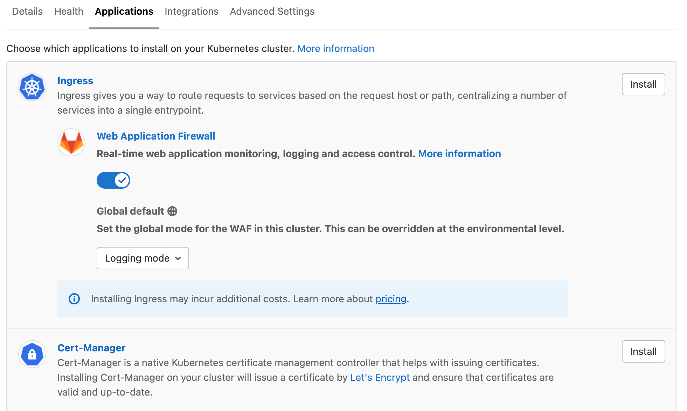

# GitLab Managed Apps (DEPRECATED) **(FREE)**

NOTE:
The new recommended way to manage cluster applications is to use the [cluster management project template](management_project_template.md).
If you want to migrate your GitLab managed apps management to this template, reference to [migrating from GitLab managed apps to project template](migrating_from_gma_to_project_template.md).

**GitLab Managed Apps** was created to help you configure applications in your
cluster directly from GitLab. You could use this feature through two different
methods: "one-click install" and "CI/CD template". Both methods are **deprecated**:

- The **one-click install** method was [removed](https://gitlab.com/gitlab-org/gitlab/-/merge_requests/63348) in GitLab 14.0.
- The **CI/CD template method** was deprecated in GitLab 13.12 and is scheduled
  to be removed in GitLab 15.0.

Both methods were limiting as you couldn't fully customize your third-party apps installed
through GitLab Managed Apps. Therefore, we decided to deprecate this feature and provide
better [GitOps-driven alternatives](https://about.gitlab.com/direction/configure/kubernetes_management/#gitlab-managed-applications) to our users, such as [cluster integrations](integrations.md#cluster-integrations) and [cluster management project](management_project.md).

## Install using GitLab CI/CD (DEPRECATED)

> - [Introduced](https://gitlab.com/gitlab-org/gitlab/-/merge_requests/20822) in GitLab 12.6.
> - [Deprecated](https://gitlab.com/gitlab-org/gitlab/-/issues/327908) in GitLab 13.12.

WARNING:
The GitLab Managed Apps CI/CD installation method was [deprecated in 13.12](https://gitlab.com/gitlab-org/gitlab/-/issues/327908).
Your applications continue to work. However, we no longer support and maintain the GitLab CI/CD template for
Managed Apps (`Managed-Cluster-Applications.gitlab-ci.yml`).
The new recommended way to manage cluster applications is to use the [cluster management project template](management_project_template.md).
If you want to migrate your GitLab managed apps management to this template, reference to [migrating from GitLab managed apps to project template](migrating_from_gma_to_project_template.md).

The CI/CD template was the primary method for installing applications to clusters via GitLab Managed Apps
and customize them through Helm.

Supported applications:

- [Ingress](#install-ingress-using-gitlab-cicd)
- [cert-manager](#install-cert-manager-using-gitlab-cicd)
- [Sentry](#install-sentry-using-gitlab-cicd)
- [GitLab Runner](#install-gitlab-runner-using-gitlab-cicd)
- [Cilium](#install-cilium-using-gitlab-cicd)
- [Falco](#install-falco-using-gitlab-cicd)
- [Vault](#install-vault-using-gitlab-cicd)
- [JupyterHub](#install-jupyterhub-using-gitlab-cicd)
- [Elastic Stack](#install-elastic-stack-using-gitlab-cicd)
- [Crossplane](#install-crossplane-using-gitlab-cicd)
- [Fluentd](#install-fluentd-using-gitlab-cicd)
- [Knative](#install-knative-using-gitlab-cicd)
- [PostHog](#install-posthog-using-gitlab-cicd)
- [Prometheus](#install-prometheus-using-gitlab-cicd)

### Usage

You can find and import all the files referenced below
in the [example cluster applications
project](https://gitlab.com/gitlab-org/cluster-integration/example-cluster-applications/).

To install applications using GitLab CI/CD:

1. Connect the cluster to a [cluster management project](management_project.md).
1. In that project, add a `.gitlab-ci.yml` file with the following content:

   ```yaml
   include:
     - template: Managed-Cluster-Applications.gitlab-ci.yml
   ```

   The job provided by this template connects to the `*` (default) cluster using tools provided
   in a custom Docker image. It requires that you have a runner registered with the Docker,
   Kubernetes, or Docker Machine executor.

   To install to a specific cluster, read
   [Use the template with a custom environment](#use-the-template-with-a-custom-environment).

1. Add a `.gitlab/managed-apps/config.yaml` file to define which
  applications you would like to install. Define the `installed` key as
  `true` to install the application and `false` to uninstall the
  application. For example, to install Ingress:

   ```yaml
   ingress:
     installed: true
   ```

1. Optionally, define `.gitlab/managed-apps/<application>/values.yaml` file to
   customize values for the installed application.

A GitLab CI/CD pipeline runs on the default branch to install the
applications you have configured. In case of pipeline failure, the
output of the [Helm Tiller](https://v2.helm.sh/docs/install/#running-tiller-locally) binary
is saved as a [CI job artifact](../../ci/pipelines/job_artifacts.md).

#### Usage in GitLab versions earlier than 13.5

For GitLab versions 13.5 and earlier, the Ingress, Fluentd, Prometheus, and Sentry
apps were fetched from the central Helm stable repository (`https://kubernetes-charts.storage.googleapis.com/`).
This repository [was deleted](https://github.com/helm/charts#deprecation-timeline)
on November 13, 2020. This causes the installation CI/CD pipeline to
fail. Upgrade to GitLab 13.6, or alternatively, you can
use the following `.gitlab-ci.yml`, which has been tested in GitLab 13.5:

```yaml
include:
  - template: Managed-Cluster-Applications.gitlab-ci.yml

apply:
  image: "registry.gitlab.com/gitlab-org/cluster-integration/cluster-applications:v0.37.0"
```

### Use the template with a custom environment

If you only want apps to be installed on a specific cluster, or if your cluster's
scope does not match `production`, you can override the environment name in your `.gitlab-ci.yml`
file:

```yaml
include:
  - template: Managed-Cluster-Applications.gitlab-ci.yml

apply:
  except:
    variables:
      - '$CI_JOB_NAME == "apply"'

.managed-apps:
  extends: apply

example-install:
  extends: .managed-apps
  environment:
    name: example/production
```

### Important notes

Note the following:

- We recommend using the cluster management project exclusively for managing deployments to a cluster.
  Do not add your application's source code to such projects.
- When you set the value for `installed` key back to `false`, the application is
  unprovisioned from the cluster.
- If you update `.gitlab/managed-apps/<application>/values.yaml` with new values, the
  application is redeployed.

### Install Ingress using GitLab CI/CD

> [Deprecated](https://gitlab.com/gitlab-org/gitlab/-/issues/327908) in GitLab 13.12.

To install Ingress, define the `.gitlab/managed-apps/config.yaml` file
with:

```yaml
ingress:
  installed: true
```

Ingress is installed into the `gitlab-managed-apps` namespace
of your cluster.

You can customize the installation of Ingress by defining a
`.gitlab/managed-apps/ingress/values.yaml` file in your cluster
management project. Refer to the
[chart](https://github.com/helm/charts/tree/master/stable/nginx-ingress)
for the available configuration options.

Support for installing the Ingress managed application is provided by the GitLab Configure group.
If you run into unknown issues, [open a new issue](https://gitlab.com/gitlab-org/gitlab/-/issues/new),
and ping at least 2 people from the
[Configure group](https://about.gitlab.com/handbook/product/categories/#configure-group).

### Install cert-manager using GitLab CI/CD

> [Deprecated](https://gitlab.com/gitlab-org/gitlab/-/issues/327908) in GitLab 13.12.

cert-manager is installed using GitLab CI/CD by defining configuration in
`.gitlab/managed-apps/config.yaml`.

cert-manager:

- Is installed into the `gitlab-managed-apps` namespace of your cluster.
- Can be installed with or without a default
  [Let's Encrypt `ClusterIssuer`](https://cert-manager.io/docs/configuration/acme/), which requires an
  email address to be specified. The email address is used by Let's Encrypt to
  contact you about expiring certificates and issues related to your account.

The following configuration is required to install cert-manager using GitLab CI/CD:

```yaml
certManager:
  installed: true
  letsEncryptClusterIssuer:
    installed: true
    email: "user@example.com"
```

The following installs cert-manager using GitLab CI/CD without the default `ClusterIssuer`:

```yaml
certManager:
  installed: true
  letsEncryptClusterIssuer:
    installed: false
```

You can customize the installation of cert-manager by defining a
`.gitlab/managed-apps/cert-manager/values.yaml` file in your cluster
management project. Refer to the
[chart](https://github.com/jetstack/cert-manager) for the
available configuration options.

Support for installing the Cert Manager managed application is provided by the
GitLab Configure group. If you run into unknown issues,
[open a new issue](https://gitlab.com/gitlab-org/gitlab/-/issues/new), and ping at
least 2 people from the
[Configure group](https://about.gitlab.com/handbook/product/categories/#configure-group).

### Install Sentry using GitLab CI/CD

> [Deprecated](https://gitlab.com/gitlab-org/gitlab/-/issues/327908) in GitLab 13.12.

The Sentry Helm chart [recommends](https://github.com/helm/charts/blob/f6e5784f265dd459c5a77430185d0302ed372665/stable/sentry/values.yaml#L284-L285)
at least 3 GB of available RAM for database migrations.

To install Sentry, define the `.gitlab/managed-apps/config.yaml` file
with:

```yaml
sentry:
  installed: true
```

Sentry is installed into the `gitlab-managed-apps` namespace
of your cluster.

You can customize the installation of Sentry by defining
`.gitlab/managed-apps/sentry/values.yaml` file in your cluster
management project. Refer to the
[chart](https://github.com/helm/charts/tree/master/stable/sentry)
for the available configuration options.

We recommend you pay close attention to the following configuration options:

- `email`. Needed to invite users to your Sentry instance and to send error emails.
- `user`. Where you can set the login credentials for the default administrator user.
- `postgresql`. For a PostgreSQL password that can be used when running future updates.

When upgrading, it's important to provide the existing PostgreSQL password (given
using the `postgresql.postgresqlPassword` key) to avoid authentication errors.
Read the [PostgreSQL chart documentation](https://github.com/helm/charts/tree/master/stable/postgresql#upgrade)
for more information.

Here is an example configuration for Sentry:

```yaml
# Admin user to create
user:
  # Indicated to create the admin user or not,
  # Default is true as the initial installation.
  create: true
  email: "<your email>"
  password: "<your password>"

email:
  from_address: "<your from email>"
  host: smtp
  port: 25
  use_tls: false
  user: "<your email username>"
  password: "<your email password>"
  enable_replies: false

ingress:
  enabled: true
  hostname: "<sentry.example.com>"

# Needs to be here between runs.
# See https://github.com/helm/charts/tree/master/stable/postgresql#upgrade for more info
postgresql:
  postgresqlPassword: example-postgresql-password
```

Support for installing the Sentry managed application is provided by the
GitLab Health group. If you run into unknown issues,
[open a new issue](https://gitlab.com/gitlab-org/gitlab/-/issues/new), and ping at
least 2 people from the
[Health group](https://about.gitlab.com/handbook/product/categories/#health-group).

### Install PostHog using GitLab CI/CD

> [Deprecated](https://gitlab.com/gitlab-org/gitlab/-/issues/327908) in GitLab 13.12.

[PostHog](https://posthog.com) 🦔 is a developer-friendly, open-source product analytics platform.

To install PostHog into the `gitlab-managed-apps` namespace of your cluster,
define the `.gitlab/managed-apps/config.yaml` file with:

```yaml
posthog:
  installed: true
```

You can customize the installation of PostHog by defining `.gitlab/managed-apps/posthog/values.yaml`
in your cluster management project. Refer to the
[Configuration section](https://github.com/PostHog/charts/tree/master/charts/posthog)
of the PostHog chart's README for the available configuration options.

You must provide a PostgreSQL password in `postgresql.postgresqlPassword`
to avoid authentication errors. Read the
[PostgreSQL chart documentation](https://github.com/helm/charts/tree/master/stable/postgresql#upgrade)
for more information.

Redis pods are restarted between upgrades. To prevent downtime, provide a Redis
password using the `redis.password` key. This prevents a new password from
being generated on each restart.

Here is an example configuration for PostHog:

```yaml
ingress:
  enabled: true
  hostname: "<posthog.example.com>"

# This will be autogenerated if you skip it. Include if you have 2 or more web replicas
posthogSecret: 'long-secret-key-used-to-sign-cookies'

# Needs to be here between runs.
# See https://github.com/helm/charts/tree/master/stable/postgresql#upgrade for more info
postgresql:
  postgresqlPassword: example-postgresql-password

# Recommended to set this to a value to redis prevent downtime between upgrades
redis:
  password: example-redis-password
```

Support for the PostHog managed application is provided by the PostHog team.
If you run into issues,
[open a support ticket](https://github.com/PostHog/posthog/issues/new/choose) directly.

### Install Prometheus using GitLab CI/CD

> - [Introduced](https://gitlab.com/gitlab-org/gitlab/-/merge_requests/25138) in GitLab 12.8.
> - [Deprecated](https://gitlab.com/gitlab-org/gitlab/-/issues/327908) in GitLab 13.12.

[Prometheus](https://prometheus.io/docs/introduction/overview/) is an
open-source monitoring and alerting system for supervising your
deployed applications.

To install Prometheus into the `gitlab-managed-apps` namespace of your cluster,
define the `.gitlab/managed-apps/config.yaml` file with:

```yaml
prometheus:
  installed: true
```

You can customize the installation of Prometheus by defining
`.gitlab/managed-apps/prometheus/values.yaml` in your cluster management
project. Refer to the
[Configuration section](https://github.com/helm/charts/tree/master/stable/prometheus#configuration)
of the Prometheus chart's README for the available configuration options.

Support for installing the Prometheus managed application is provided by the
GitLab APM group. If you run into unknown issues,
[open a new issue](https://gitlab.com/gitlab-org/gitlab/-/issues/new), and ping at
least 2 people from the [APM group](https://about.gitlab.com/handbook/product/categories/#apm-group).

### Install GitLab Runner using GitLab CI/CD

> [Deprecated](https://gitlab.com/gitlab-org/gitlab/-/issues/327908) in GitLab 13.12.

GitLab Runner is installed using GitLab CI/CD by defining configuration in
`.gitlab/managed-apps/config.yaml`.

The following configuration is required to install GitLab Runner using GitLab CI/CD:

```yaml
gitlabRunner:
  installed: true
```

GitLab Runner is installed into the `gitlab-managed-apps` namespace of your cluster.

For GitLab Runner to function, you _must_ specify the following:

- `gitlabUrl`: The GitLab server full URL (for example, `https://gitlab.example.com`)
  to register the Runner against.
- `runnerRegistrationToken`: The registration token for adding new runners to GitLab.
  This must be [retrieved from your GitLab instance](../../ci/runners/index.md).

These values can be specified using [CI/CD variables](../../ci/variables/index.md):

- `GITLAB_RUNNER_GITLAB_URL` is used for `gitlabUrl`.
- `GITLAB_RUNNER_REGISTRATION_TOKEN` is used for `runnerRegistrationToken`

The methods of specifying these values are mutually exclusive. Either specify variables `GITLAB_RUNNER_REGISTRATION_TOKEN` and `GITLAB_RUNNER_TOKEN` as CI variables (recommended) or provide values for `runnerRegistrationToken:` and `runnerToken:` in `.gitlab/managed-apps/gitlab-runner/values.yaml`. If you choose to use CI variables, comment out or remove `runnerRegistrationToken:` and `runnerToken:` from `.gitlab/managed-apps/gitlab-runner/values`.

The runner registration token allows connection to a project by a runner and therefore should be treated as a secret to prevent malicious use and code exfiltration through a runner. For this reason, we recommend that you specify the runner registration token as a [protected variable](../../ci/variables/index.md#protect-a-cicd-variable) and [masked variable](../../ci/variables/index.md#mask-a-cicd-variable) and do not commit them to the Git repository in the `values.yaml` file.

You can customize the installation of GitLab Runner by defining
`.gitlab/managed-apps/gitlab-runner/values.yaml` file in your cluster
management project. Refer to the
[chart](https://gitlab.com/gitlab-org/charts/gitlab-runner) for the
available configuration options.

Support for installing the GitLab Runner managed application is provided by the
GitLab Runner group. If you run into unknown issues,
[open a new issue](https://gitlab.com/gitlab-org/gitlab/-/issues/new), and ping at
least 2 people from the
[Runner group](https://about.gitlab.com/handbook/product/categories/#runner-group).

### Install Cilium using GitLab CI/CD

> - [Introduced](https://gitlab.com/gitlab-org/cluster-integration/cluster-applications/-/merge_requests/22) in GitLab 12.8.
> - [Deprecated](https://gitlab.com/gitlab-org/gitlab/-/issues/327908) in GitLab 13.12.

[Cilium](https://cilium.io/) is a networking plugin for Kubernetes that you can use to implement
support for [NetworkPolicy](https://kubernetes.io/docs/concepts/services-networking/network-policies/)
resources. For more information, see [Network Policies](../../topics/autodevops/stages.md#network-policy).

<i class="fa fa-youtube-play youtube" aria-hidden="true"></i>
For an overview, see the
[Container Network Security Demo for GitLab 12.8](https://www.youtube.com/watch?v=pgUEdhdhoUI).

Enable Cilium in the `.gitlab/managed-apps/config.yaml` file to install it:

```yaml
# possible values are gke or eks
clusterType: gke

cilium:
  installed: true
```

The `clusterType` variable enables the recommended Helm variables for a corresponding cluster type.
You can check the recommended variables for each cluster type in the official documentation:

- [Google GKE](https://docs.cilium.io/en/v1.8/gettingstarted/k8s-install-gke/#deploy-cilium)
- [AWS EKS](https://docs.cilium.io/en/v1.8/gettingstarted/k8s-install-eks/#deploy-cilium)

Do not use `clusterType` for sandbox environments like [Minikube](https://minikube.sigs.k8s.io/docs/).

You can customize Cilium's Helm variables by defining the
`.gitlab/managed-apps/cilium/values.yaml` file in your cluster
management project. Refer to the
[Cilium chart](https://github.com/cilium/cilium/tree/master/install/kubernetes/cilium)
for the available configuration options.

You can check Cilium's installation status on the cluster management page:

- [Project-level cluster](../project/clusters/index.md): Navigate to your project's
  **Infrastructure > Kubernetes clusters** page.
- [Group-level cluster](../group/clusters/index.md): Navigate to your group's
  **Kubernetes** page.

WARNING:
Installation and removal of the Cilium requires a **manual**
[restart](https://docs.cilium.io/en/stable/gettingstarted/k8s-install-helm/#restart-unmanaged-pods)
of all affected pods in all namespaces to ensure that they are
[managed](https://docs.cilium.io/en/v1.8/operations/troubleshooting/#ensure-managed-pod)
by the correct networking plugin. Whenever Hubble is enabled, its related pod might require a
restart depending on whether it started prior to Cilium. For more information, see
[Failed Deployment](https://kubernetes.io/docs/concepts/workloads/controllers/deployment/#failed-deployment)
in the Kubernetes docs.

NOTE:
Major upgrades might require additional setup steps. For more information, see
the official [upgrade guide](https://docs.cilium.io/en/v1.8/operations/upgrade/).

By default, Cilium's
[audit mode](https://docs.cilium.io/en/v1.8/gettingstarted/policy-creation/#enable-policy-audit-mode)
is enabled. In audit mode, Cilium doesn't drop disallowed packets. You
can use `policy-verdict` log to observe policy-related decisions. You
can disable audit mode by adding the following to
`.gitlab/managed-apps/cilium/values.yaml`:

```yaml
config:
  policyAuditMode: false

agent:
  monitor:
    eventTypes: ["drop"]
```

The Cilium monitor log for traffic is logged out by the
`cilium-monitor` sidecar container. You can check these logs with the following command:

```shell
kubectl -n gitlab-managed-apps logs -l k8s-app=cilium -c cilium-monitor
```

You can disable the monitor log in `.gitlab/managed-apps/cilium/values.yaml`:

```yaml
agent:
  monitor:
    enabled: false
```

The [Hubble](https://github.com/cilium/hubble) monitoring daemon is enabled by default
and it's set to collect per namespace flow metrics. This metrics are accessible on the
[Threat Monitoring](../application_security/threat_monitoring/index.md)
dashboard. You can disable Hubble by adding the following to
`.gitlab/managed-apps/cilium/values.yaml`:

```yaml
global:
  hubble:
    enabled: false
```

You can also adjust Helm values for Hubble by using
`.gitlab/managed-apps/cilium/values.yaml`:

```yaml
global:
  hubble:
    enabled: true
    metrics:
      enabled:
      - 'flow:sourceContext=namespace;destinationContext=namespace'
```

Support for installing the Cilium managed application is provided by the
GitLab Container Security group. If you run into unknown issues,
[open a new issue](https://gitlab.com/gitlab-org/gitlab/-/issues/new), and ping at
least 2 people from the
[Container Security group](https://about.gitlab.com/handbook/product/categories/#container-security-group).

### Install Falco using GitLab CI/CD

> - [Introduced](https://gitlab.com/gitlab-org/cluster-integration/cluster-applications/-/merge_requests/91) in GitLab 13.1.
> - [Deprecated](https://gitlab.com/gitlab-org/gitlab/-/issues/327908) in GitLab 13.12.

GitLab Container Host Security Monitoring uses [Falco](https://falco.org/)
as a runtime security tool that listens to the Linux kernel using eBPF. Falco parses system calls
and asserts the stream against a configurable rules engine in real-time. For more information, see
[Falco's Documentation](https://falco.org/docs/).

You can enable Falco in the
`.gitlab/managed-apps/config.yaml` file:

```yaml
falco:
  installed: true
```

You can customize Falco's Helm variables by defining the
`.gitlab/managed-apps/falco/values.yaml` file in your cluster
management project. Refer to the
[Falco chart](https://github.com/falcosecurity/charts/tree/master/falco)
for the available configuration options.

WARNING:
By default eBPF support is enabled and Falco uses an
[eBPF probe](https://falco.org/docs/event-sources/drivers/#using-the-ebpf-probe)
to pass system calls to user space. If your cluster doesn't support this, you can
configure it to use Falco kernel module instead by adding the following to
`.gitlab/managed-apps/falco/values.yaml`:

```yaml
ebpf:
  enabled: false
```

In rare cases where probe installation on your cluster isn't possible and the kernel/probe
isn't pre-compiled, you may need to manually prepare the kernel module or eBPF probe with
[`driverkit`](https://github.com/falcosecurity/driverkit#against-a-kubernetes-cluster)
and install it on each cluster node.

By default, Falco is deployed with a limited set of rules. To add more rules, add
the following to `.gitlab/managed-apps/falco/values.yaml` (you can get examples from
[Cloud Native Security Hub](https://securityhub.dev/)):

```yaml
customRules:
  file-integrity.yaml: |-
    - rule: Detect New File
      desc: detect new file created
      condition: >
        evt.type = chmod or evt.type = fchmod
      output: >
        File below a known directory opened for writing (user=%user.name
        command=%proc.cmdline file=%fd.name parent=%proc.pname pcmdline=%proc.pcmdline gparent=%proc.aname[2])
      priority: ERROR
      tags: [filesystem]
    - rule: Detect New Directory
      desc: detect new directory created
      condition: >
        mkdir
      output: >
        File below a known directory opened for writing (user=%user.name
        command=%proc.cmdline file=%fd.name parent=%proc.pname pcmdline=%proc.pcmdline gparent=%proc.aname[2])
      priority: ERROR
      tags: [filesystem]
```

By default, Falco only outputs security events to logs as JSON objects. To set it to output to an
[external API](https://falco.org/docs/alerts/#https-output-send-alerts-to-an-https-end-point)
or [application](https://falco.org/docs/alerts/#program-output),
add the following to `.gitlab/managed-apps/falco/values.yaml`:

```yaml
falco:
  programOutput:
    enabled: true
    keepAlive: false
    program: mail -s "Falco Notification" someone@example.com

  httpOutput:
    enabled: true
    url: http://some.url
```

You can check these logs with the following command:

```shell
kubectl -n gitlab-managed-apps logs -l app=falco
```

Support for installing the Falco managed application is provided by the
GitLab Container Security group. If you run into unknown issues,
[open a new issue](https://gitlab.com/gitlab-org/gitlab/-/issues/new), and ping at
least 2 people from the
[Container Security group](https://about.gitlab.com/handbook/product/categories/#container-security-group).

### Install Vault using GitLab CI/CD

> - [Introduced](https://gitlab.com/gitlab-org/gitlab/-/issues/9982) in GitLab 12.9.
> - [Deprecated](https://gitlab.com/gitlab-org/gitlab/-/issues/327908) in GitLab 13.12.

[HashiCorp Vault](https://www.vaultproject.io/) is a secrets management solution which
can be used to safely manage and store passwords, credentials, certificates, and more. A Vault
installation could be leveraged to provide a single secure data store for credentials
used in your applications, GitLab CI/CD jobs, and more. It could also serve as a way of
providing SSL/TLS certificates to systems and deployments in your infrastructure. Leveraging
Vault as a single source for all these credentials allows greater security by having
a single source of access, control, and auditability around all your sensitive
credentials and certificates. This feature requires giving GitLab the highest level of access and
control. Therefore, if GitLab is compromised, the security of this Vault instance is as well. To
avoid this security risk, GitLab recommends using your own HashiCorp Vault to leverage
[external secrets with CI](../../ci/secrets/index.md).

To install Vault, enable it in the `.gitlab/managed-apps/config.yaml` file:

```yaml
vault:
  installed: true
```

By default you receive a basic Vault setup with no scalable storage backend. This
is enough for simple testing and small-scale deployments, though has limits
to how much it can scale, and as it's a single instance deployment, upgrading the
Vault application causes downtime.

To optimally use Vault in a production environment, it's ideal to have a good understanding
of the internals of Vault and how to configure it. This can be done by reading
the [Vault Configuration guide](../../ci/secrets/#configure-your-vault-server),
the [Vault documentation](https://www.vaultproject.io/docs/internals) and
the Vault Helm chart [`values.yaml` file](https://github.com/hashicorp/vault-helm/blob/v0.3.3/values.yaml).

At a minimum, most users set up:

- A [seal](https://www.vaultproject.io/docs/configuration/seal) for extra encryption
  of the main key.
- A [storage backend](https://www.vaultproject.io/docs/configuration/storage) that's
  suitable for environment and storage security requirements.
- [HA Mode](https://www.vaultproject.io/docs/concepts/ha).
- The [Vault UI](https://www.vaultproject.io/docs/configuration/ui).

The following is an example values file (`.gitlab/managed-apps/vault/values.yaml`)
that configures Google Key Management Service for auto-unseal, using a Google Cloud Storage backend, enabling
the Vault UI, and enabling HA with 3 pod replicas. The `storage` and `seal` stanzas
below are examples and should be replaced with settings specific to your environment.

```yaml
# Enable the Vault WebUI
ui:
  enabled: true
server:
  # Disable the built in data storage volume as it's not safe for High Availability mode
  dataStorage:
    enabled: false
  # Enable High Availability Mode
  ha:
    enabled: true
    # Configure Vault to listen on port 8200 for normal traffic and port 8201 for inter-cluster traffic
    config: |
      listener "tcp" {
        tls_disable = 1
        address = "[::]:8200"
        cluster_address = "[::]:8201"
      }
      # Configure Vault to store its data in a GCS Bucket backend
      storage "gcs" {
        path = "gcs://my-vault-storage/vault-bucket"
        ha_enabled = "true"
      }
      # Configure Vault to unseal storage using a GKMS key
      seal "gcpckms" {
         project     = "vault-helm-dev-246514"
         region      = "global"
         key_ring    = "vault-helm-unseal-kr"
         crypto_key  = "vault-helm-unseal-key"
      }
```

After you have successfully installed Vault, you must
[initialize the Vault](https://learn.hashicorp.com/tutorials/vault/getting-started-deploy#initializing-the-vault)
and obtain the initial root token. You need access to your Kubernetes cluster that
Vault has been deployed into in order to do this. To initialize the Vault, get a
shell to one of the Vault pods running inside Kubernetes (typically this is done
by using the `kubectl` command line tool). After you have a shell into the pod,
run the `vault operator init` command:

```shell
kubectl -n gitlab-managed-apps exec -it vault-0 sh
/ $ vault operator init
```

This should give you your unseal keys and initial root token. Make sure to note these down
and keep these safe, as they're required to unseal the Vault throughout its lifecycle.

Support for installing the Vault managed application is provided by the
GitLab Release Management group. If you run into unknown issues,
[open a new issue](https://gitlab.com/gitlab-org/gitlab/-/issues/new), and ping at
least 2 people from the
[Release Management group](https://about.gitlab.com/handbook/product/categories/#release-management-group).

### Install JupyterHub using GitLab CI/CD

> - [Introduced](https://gitlab.com/gitlab-org/cluster-integration/cluster-applications/-/merge_requests/40) in GitLab 12.8.
> - [Deprecated](https://gitlab.com/gitlab-org/gitlab/-/issues/327908) in GitLab 13.12.

JupyterHub is installed using GitLab CI/CD by defining configuration in
`.gitlab/managed-apps/config.yaml` as follows:

```yaml
jupyterhub:
  installed: true
  gitlabProjectIdWhitelist: []
  gitlabGroupWhitelist: []
```

In the configuration:

- `gitlabProjectIdWhitelist` restricts GitLab authentication to only members of the specified projects.
- `gitlabGroupWhitelist` restricts GitLab authentication to only members of the specified groups.
- Specifying an empty array for both allows any user on the GitLab instance to sign in.

JupyterHub is installed into the `gitlab-managed-apps` namespace of your cluster.

For JupyterHub to function, you must set up an [OAuth Application](../../integration/oauth_provider.md).
Set:

- "Redirect URI" to `http://<JupyterHub Host>/hub/oauth_callback`.
- "Scope" to `api read_repository write_repository`.

In addition, the following variables must be specified using [CI/CD variables](../../ci/variables/index.md):

- `JUPYTERHUB_PROXY_SECRET_TOKEN` - Secure string used for signing communications
  from the hub. Read [`proxy.secretToken`](https://zero-to-jupyterhub.readthedocs.io/en/stable/reference/reference.html#proxy-secrettoken).
- `JUPYTERHUB_COOKIE_SECRET` - Secure string used for signing secure cookies. Read
  [`hub.cookieSecret`](https://zero-to-jupyterhub.readthedocs.io/en/stable/reference/reference.html#hub-cookiesecret).
- `JUPYTERHUB_HOST` - Hostname used for the installation. For example, `jupyter.gitlab.example.com`.
- `JUPYTERHUB_GITLAB_HOST` - Hostname of the GitLab instance used for authentication.
  For example, `gitlab.example.com`.
- `JUPYTERHUB_AUTH_CRYPTO_KEY` - A 32-byte encryption key used to set
  [`auth.state.cryptoKey`](https://zero-to-jupyterhub.readthedocs.io/en/stable/reference/reference.html#auth-state-cryptokey).
- `JUPYTERHUB_AUTH_GITLAB_CLIENT_ID` - "Application ID" for the OAuth Application.
- `JUPYTERHUB_AUTH_GITLAB_CLIENT_SECRET` - "Secret" for the OAuth Application.

By default, JupyterHub is installed using a
[default values file](https://gitlab.com/gitlab-org/cluster-integration/cluster-applications/-/blob/master/src/default-data/jupyterhub/values.yaml.gotmpl).
You can customize the installation of JupyterHub by defining a
`.gitlab/managed-apps/jupyterhub/values.yaml` file in your cluster management project.

Refer to the
[chart reference](https://zero-to-jupyterhub.readthedocs.io/en/stable/reference/reference.html) for the
available configuration options.

Support for installing the JupyterHub managed application is provided by the GitLab Configure group.
If you run into unknown issues,
[open a new issue](https://gitlab.com/gitlab-org/gitlab/-/issues/new), and ping at
least 2 people from the
[Configure group](https://about.gitlab.com/handbook/product/categories/#configure-group).

### Install Elastic Stack using GitLab CI/CD

> - [Introduced](https://gitlab.com/gitlab-org/gitlab/-/merge_requests/25138) in GitLab 12.8.
> - [Deprecated](https://gitlab.com/gitlab-org/gitlab/-/issues/327908) in GitLab 13.12.

Elastic Stack is installed using GitLab CI/CD by defining configuration in
`.gitlab/managed-apps/config.yaml`.

The following configuration is required to install Elastic Stack using GitLab CI/CD:

```yaml
elasticStack:
  installed: true
```

Elastic Stack is installed into the `gitlab-managed-apps` namespace of your cluster.

You can check the default
[`values.yaml`](https://gitlab.com/gitlab-org/gitlab/-/blob/master/vendor/elastic_stack/values.yaml)
we set for this chart.

You can customize the installation of Elastic Stack by defining
`.gitlab/managed-apps/elastic-stack/values.yaml` file in your cluster
management project. Refer to the
[chart](https://gitlab.com/gitlab-org/charts/elastic-stack) for all
available configuration options.

Support for installing the Elastic Stack managed application is provided by the
GitLab APM group. If you run into unknown issues,
[open a new issue](https://gitlab.com/gitlab-org/gitlab/-/issues/new), and ping at
least 2 people from the [APM group](https://about.gitlab.com/handbook/product/categories/#apm-group).

### Install Crossplane using GitLab CI/CD

> - [Introduced](https://gitlab.com/gitlab-org/gitlab/-/issues/35675) in GitLab 12.9.
> - [Deprecated](https://gitlab.com/gitlab-org/gitlab/-/issues/327908) in GitLab 13.12.

Crossplane is installed using GitLab CI/CD by defining configuration in
`.gitlab/managed-apps/config.yaml`.

The following configuration is required to install Crossplane using GitLab CI/CD:

```yaml
Crossplane:
  installed: true
```

Crossplane is installed into the `gitlab-managed-apps` namespace of your cluster.

You can check the default
[`values.yaml`](https://github.com/crossplane/crossplane/blob/master/cluster/charts/crossplane/values.yaml.tmpl)
we set for this chart.

You can customize the installation of Crossplane by defining
`.gitlab/managed-apps/crossplane/values.yaml` file in your cluster
management project. Refer to the
[chart](https://github.com/crossplane/crossplane/tree/master/cluster/charts/crossplane#configuration)
for the available configuration options. Note that this link points to the documentation
for the current development release, which may differ from the version you have installed.

Support for the Crossplane managed application is provided by the Crossplane team.
If you run into issues,
[open a support ticket](https://github.com/crossplane/crossplane/issues/new/choose) directly.

### Install Fluentd using GitLab CI/CD

> - [Introduced](https://gitlab.com/gitlab-org/cluster-integration/cluster-applications/-/merge_requests/76) in GitLab 12.10.
> - [Deprecated](https://gitlab.com/gitlab-org/gitlab/-/issues/327908) in GitLab 13.12.

To install Fluentd into the `gitlab-managed-apps` namespace of your cluster using
GitLab CI/CD, define the following configuration in `.gitlab/managed-apps/config.yaml`:

```yaml
Fluentd:
  installed: true
```

You can also review the default values set for this chart in the
[`values.yaml`](https://github.com/helm/charts/blob/master/stable/fluentd/values.yaml) file.

You can customize the installation of Fluentd by defining
`.gitlab/managed-apps/fluentd/values.yaml` file in your cluster management
project. Refer to the
[configuration chart](https://github.com/helm/charts/tree/master/stable/fluentd#configuration)
for the current development release of Fluentd for all available configuration options.

The configuration chart link points to the current development release, which
may differ from the version you have installed. To ensure compatibility, switch
to the specific branch or tag you are using.

Support for installing the Fluentd managed application is provided by the
GitLab Container Security group. If you run into unknown issues,
[open a new issue](https://gitlab.com/gitlab-org/gitlab/-/issues/new), and ping at
least 2 people from the
[Container Security group](https://about.gitlab.com/handbook/product/categories/#container-security-group).

### Install Knative using GitLab CI/CD

> [Deprecated](https://gitlab.com/gitlab-org/gitlab/-/issues/327908) in GitLab 13.12.

To install Knative, define the `.gitlab/managed-apps/config.yaml` file
with:

```yaml
knative:
  installed: true
```

You can customize the installation of Knative by defining `.gitlab/managed-apps/knative/values.yaml`
file in your cluster management project. Refer to the [chart](https://gitlab.com/gitlab-org/charts/knative)
for all available configuration options.

Here is an example configuration for Knative:

```yaml
domain: 'my.wildcard.A.record.dns'
```

If you plan to use GitLab Serverless capabilities, be sure to set an `A record`
wildcard domain on your custom configuration.

Support for installing the Knative managed application is provided by the
GitLab Configure group. If you run into unknown issues,
[open a new issue](https://gitlab.com/gitlab-org/gitlab/-/issues/new), and ping at
least 2 people from the
[Configure group](https://about.gitlab.com/handbook/product/categories/#configure-group).

#### Knative Metrics

GitLab provides [Invocation Metrics](../project/clusters/serverless/index.md#invocation-metrics)
for your functions. To collect these metrics, you must have:

1. Knative and Prometheus managed applications installed on your cluster.
1. Manually applied the custom metrics on your cluster by running the following command:

   ```shell
   kubectl apply -f https://gitlab.com/gitlab-org/cluster-integration/cluster-applications/-/raw/02c8231e30ef5b6725e6ba368bc63863ceb3c07d/src/default-data/knative/istio-metrics.yaml
   ```

#### Uninstall Knative

To uninstall Knative, you must first manually remove any custom metrics you have added
by running the following command:

```shell
kubectl delete -f https://gitlab.com/gitlab-org/cluster-integration/cluster-applications/-/raw/02c8231e30ef5b6725e6ba368bc63863ceb3c07d/src/default-data/knative/istio-metrics.yaml
```

### Install AppArmor using GitLab CI/CD

> - [Introduced](https://gitlab.com/gitlab-org/cluster-integration/cluster-applications/-/merge_requests/100) in GitLab 13.1.
> - [Deprecated](https://gitlab.com/gitlab-org/gitlab/-/issues/327908) in GitLab 13.12.

To install AppArmor into the `gitlab-managed-apps` namespace of your cluster using
GitLab CI/CD, define the following configuration in `.gitlab/managed-apps/config.yaml`:

```yaml
apparmor:
  installed: true
```

You can define one or more AppArmor profiles by adding them into
`.gitlab/managed-apps/apparmor/values.yaml` as the following:

```yaml
profiles:
  profile-one: |-
    profile profile-one {
      file,
    }
```

Refer to the [AppArmor chart](https://gitlab.com/gitlab-org/charts/apparmor) for more information on this chart.

#### Using AppArmor profiles in your deployments

After installing AppAmor, you can use profiles by adding Pod Annotations. If you're using
Auto DevOps, you can [customize `auto-deploy-values.yaml`](../../topics/autodevops/customize.md#customize-values-for-helm-chart)
to annotate your pods. Although it's helpful to be aware of the
[list of custom attributes](https://gitlab.com/gitlab-org/cluster-integration/auto-deploy-image/-/tree/master/assets/auto-deploy-app#gitlabs-auto-deploy-helm-chart),
you're only required to set `podAnnotations` as follows:

```yaml
podAnnotations:
  container.apparmor.security.beta.kubernetes.io/auto-deploy-app: localhost/profile-one
```

The only information to be changed here is the profile name which is `profile-one`
in this example. Refer to the
[AppArmor tutorial](https://kubernetes.io/docs/tutorials/clusters/apparmor/#securing-a-pod)
for more information on how AppArmor is integrated in Kubernetes.

#### Using PodSecurityPolicy in your deployments

To enable AppArmor annotations on a Pod Security Policy you must first
load the corresponding AppArmor profile.

[Pod Security Policies](https://kubernetes.io/docs/concepts/policy/pod-security-policy/) are
resources at the cluster level that control security-related
properties of deployed pods. You can use such a policy to enable
loaded AppArmor profiles and apply necessary pod restrictions across a
cluster. You can deploy a new policy by adding the following
to`.gitlab/managed-apps/apparmor/values.yaml`:

```yaml
securityPolicies:
  example:
    defaultProfile: profile-one
    allowedProfiles:
    - profile-one
    - profile-two
    spec:
      privileged: false
      seLinux:
        rule: RunAsAny
      supplementalGroups:
        rule: RunAsAny
      runAsUser:
        rule: RunAsAny
      fsGroup:
        rule: RunAsAny
      volumes:
        - '*'
```

This example creates a single policy named `example` with the provided specification,
and enables [AppArmor annotations](https://kubernetes.io/docs/tutorials/clusters/apparmor/#podsecuritypolicy-annotations) on it.

Support for installing the AppArmor managed application is provided by the
GitLab Container Security group. If you run into unknown issues,
[open a new issue](https://gitlab.com/gitlab-org/gitlab/-/issues/new), and ping
at least 2 people from the
[Container Security group](https://about.gitlab.com/handbook/product/categories/#container-security-group).

## Install with one click (REMOVED)

> [Removed](https://gitlab.com/groups/gitlab-org/-/epics/4280) in GitLab 14.0.

The one-click installation method was deprecated in GitLab 13.9 and removed in [GitLab 14.0](https://gitlab.com/groups/gitlab-org/-/epics/4280).
The removal does not break nor uninstall any apps you have installed, it only
removes the "Applications" tab from the cluster page.
The new recommended way to manage cluster applications is to use the [cluster management project template](management_project_template.md).

- If you want to migrate your GitLab managed apps management to this template, read
  [migrating from GitLab managed apps to project template](migrating_from_gma_to_project_template.md).
- If you don't want to use the template, you can also manually manage your applications.
  For that, follow the process to
  [take ownership of your GitLab Managed Apps](#take-ownership-of-your-gitlab-managed-apps).

If you are not yet on GitLab 14.0 or later, you can refer to [an older version of this document](https://docs.gitlab.com/13.12/ee/user/clusters/applications.html#install-with-one-click-deprecated).

## Browse applications logs

> [Introduced](https://gitlab.com/gitlab-org/gitlab/-/merge_requests/36769) in GitLab 13.2.

Logs produced by pods running **GitLab Managed Apps** can be browsed using
[**Log Explorer**](../project/clusters/kubernetes_pod_logs.md).

## Take ownership of your GitLab Managed Apps

> [Introduced](https://gitlab.com/gitlab-org/gitlab/-/issues/327803) in GitLab 13.12.

With the removal of the One-click install method in GitLab 14.0,
the **Applications** tab (under your project's **Infrastructure > Kubernetes clusters**)
is no longer displayed:



This tab was dedicated to installing and maintaining GitLab Managed Apps.
To continue managing your installed applications, one of the possible ways is to
install [Helm](https://helm.sh/) locally, as described below.

### View installed applications

To view the applications you have installed in your cluster through GitLab Managed Apps,
you need to verify the resources you have in the `gitlab-managed-apps` namespace.
On your computer, [configure `kubectl`](https://kubernetes.io/docs/reference/kubectl/overview/)
to connect to your cluster, open the terminal and run:

```shell
kubectl get all -n gitlab-managed-apps
```

If there is no output or the namespace does not exist, you do not have any applications
installed through GitLab Managed Apps. If this is the case, you have nothing else to do.

### Identify the Helm version

Next, verify which Helm version GitLab used to install your applications.

#### For apps installed with Helm v3

To list your apps installed with Helm v3, run:

```shell
kubectl get secrets -n gitlab-managed-apps | grep 'helm.sh/release'
```

You can manage these applications with Helm v3 and you don't need any further steps.

All applications not listed with the command above were installed with Helm v2.

#### For apps installed with Helm v2

If you have apps installed with Helm v2, you can either:

- A. Install Helm v3 and [upgrade your apps to Helm v3](https://helm.sh/docs/topics/v2_v3_migration/).
- B. Install Helm v2 and keep using this Helm version, which is not recommended as Helm v2 was deprecated in favor of
Helm v3.

If you choose to keep using Helm v2 (B), follow the steps below to manage your apps:

1. Install [Helm v2](https://v2.helm.sh/docs/install/) in your computer.
1. Start a local Tiller server:

   ```shell
   export TILLER_NAMESPACE=gitlab-managed-apps
   tiller -listen localhost:44134
   ```

1. In another tab, initialize your Helm client:

   ```shell
   export HELM_HOST="localhost:44134"
   helm init --client-only
   ```

1. Now your environment is ready to manage your apps with Helm v2. For example, to list your releases:

   ```shell
   helm ls
   ```

### Cluster integrations

Some applications were not only installed in your cluster by GitLab through
Managed Apps but were also directly integrated with GitLab. If you had one of
these applications installed before GitLab 14.0, then a corresponding [cluster
integration](integrations.md) has been automatically enabled:

- [Prometheus cluster integration](integrations.md#prometheus-cluster-integration)
- [Elastic Stack cluster integration](integrations.md#elastic-stack-cluster-integration)
