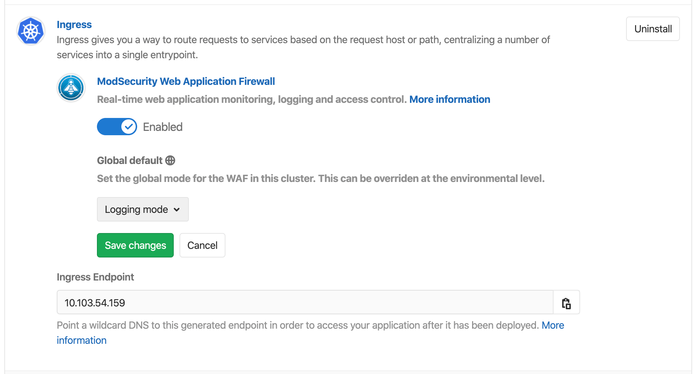
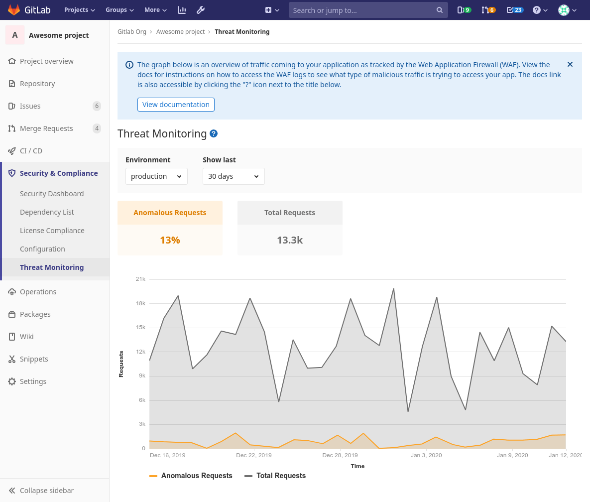
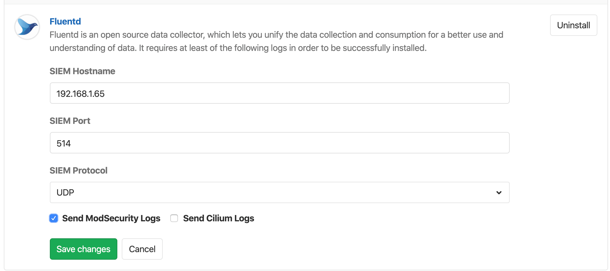

# GitLab Managed Apps

GitLab provides **GitLab Managed Apps**, a one-click install for various applications which can
be added directly to your configured cluster.

These applications are needed for [Review Apps](../../ci/review_apps/index.md)
and [deployments](../../ci/environments.md) when using [Auto DevOps](../../topics/autodevops/index.md).

You can install them after you
[create a cluster](../project/clusters/add_remove_clusters.md).

## Installing applications

Applications managed by GitLab will be installed onto the `gitlab-managed-apps` namespace.

This namespace:

- Is different from the namespace used for project deployments.
- Is created once.
- Has a non-configurable name.

To see a list of available applications to install. For a:

- [Project-level cluster](../project/clusters/index.md), navigate to your project's
  **{cloud-gear}** **Operations > Kubernetes**.
- [Group-level cluster](../group/clusters/index.md), navigate to your group's
  **{cloud-gear}** **Kubernetes** page.

Install Helm first as it's used to install other applications.

NOTE: **Note:**
As of GitLab 11.6, Helm will be upgraded to the latest version supported
by GitLab before installing any of the applications.

The following applications can be installed:

- [Helm](#helm)
- [Ingress](#ingress)
- [cert-manager](#cert-manager)
- [Prometheus](#prometheus)
- [GitLab Runner](#gitlab-runner)
- [JupyterHub](#jupyterhub)
- [Knative](#knative)
- [Crossplane](#crossplane)
- [Elastic Stack](#elastic-stack)
- [Fluentd](#fluentd)

With the exception of Knative, the applications will be installed in a dedicated
namespace called `gitlab-managed-apps`.

NOTE: **Note:**
Some applications are installable only for a project-level cluster.
Support for installing these applications in a group-level cluster is
planned for future releases.
For updates, see [the issue tracking
progress](https://gitlab.com/gitlab-org/gitlab/-/issues/24411).

CAUTION: **Caution:**
If you have an existing Kubernetes cluster with Helm already installed,
you should be careful as GitLab cannot detect it. In this case, installing
Helm via the applications will result in the cluster having it twice, which
can lead to confusion during deployments.

### Helm

> - Introduced in GitLab 10.2 for project-level clusters.
> - Introduced in GitLab 11.6 for group-level clusters.

[Helm](https://helm.sh/docs/) is a package manager for Kubernetes and is
required to install all the other applications. It is installed in its
own pod inside the cluster which can run the `helm` CLI in a safe
environment.

NOTE: **Note:**
Installing Helm as a GitLab-managed App behind a proxy is not supported,
but a [workaround](../../topics/autodevops/index.md#installing-helm-behind-a-proxy)
is available.

### cert-manager

> Introduced in GitLab 11.6 for project- and group-level clusters.

[cert-manager](https://cert-manager.io/docs/) is a native
Kubernetes certificate management controller that helps with issuing
certificates. Installing cert-manager on your cluster will issue a
certificate by [Let's Encrypt](https://letsencrypt.org/) and ensure that
certificates are valid and up-to-date.

The chart used to install this application depends on the version of GitLab used. In:

- GitLab 12.3 and newer, the [jetstack/cert-manager](https://github.com/jetstack/cert-manager)
  chart is used with a [`values.yaml`](https://gitlab.com/gitlab-org/gitlab/blob/master/vendor/cert_manager/values.yaml)
  file.
- GitLab 12.2 and older, the [stable/cert-manager](https://github.com/helm/charts/tree/master/stable/cert-manager)
  chart was used.

If you have installed cert-manager prior to GitLab 12.3, Let's Encrypt will
[block requests from older versions of cert-manager](https://community.letsencrypt.org/t/blocking-old-cert-manager-versions/98753).

To resolve this:

1. Uninstall cert-manager (consider [backing up any additional configuration](https://cert-manager.io/docs/tutorials/backup/)).
1. Install cert-manager again.

### GitLab Runner

> - Introduced in GitLab 10.6 for project-level clusters.
> - Introduced in GitLab 11.10 for group-level clusters.

[GitLab Runner](https://docs.gitlab.com/runner/) is the open source
project that is used to run your jobs and send the results back to
GitLab. It is used in conjunction with [GitLab
CI/CD](../../ci/README.md), the open-source continuous integration
service included with GitLab that coordinates the jobs.

If the project is on GitLab.com, shared Runners are available
(the first 2000 minutes are free, you can
[buy more later](../../subscriptions/index.md#purchasing-additional-ci-minutes))
and you do not have to deploy one if they are enough for your needs. If a
project-specific Runner is desired, or there are no shared Runners, it is easy
to deploy one.

Note that the deployed Runner will be set as **privileged**, which means it will essentially
have root access to the underlying machine. This is required to build Docker images,
so it is the default. Make sure you read the
[security implications](../project/clusters/index.md#security-implications)
before deploying one.

NOTE: **Note:**
The [`runner/gitlab-runner`](https://gitlab.com/gitlab-org/charts/gitlab-runner)
chart is used to install this application, using
[a preconfigured `values.yaml`](https://gitlab.com/gitlab-org/charts/gitlab-runner/-/blob/master/values.yaml)
file. Customizing the installation by modifying this file is not supported.

### Ingress

> - Introduced in GitLab 10.2 for project-level clusters.
> - Introduced in GitLab 11.6 for group-level clusters.

[Ingress](https://kubernetes.io/docs/concepts/services-networking/ingress/) provides load balancing, SSL termination, and name-based virtual hosting
out of the box. It acts as a web proxy for your applications and is useful
if you want to use [Auto DevOps](../../topics/autodevops/index.md) or deploy your own web apps.

The Ingress Controller installed is [Ingress-NGINX](https://kubernetes.io/docs/concepts/services-networking/ingress/),
which is supported by the Kubernetes community.

NOTE: **Note:**
With the following procedure, a load balancer must be installed in your cluster
to obtain the endpoint. You can use either
Ingress, or Knative's own load balancer ([Istio](https://istio.io)) if using Knative.

In order to publish your web application, you first need to find the endpoint which will be either an IP
address or a hostname associated with your load balancer.

To install it, click on the **Install** button for Ingress. GitLab will attempt
to determine the external endpoint and it should be available within a few minutes.

#### Determining the external endpoint automatically

> [Introduced](https://gitlab.com/gitlab-org/gitlab-foss/-/merge_requests/17052) in GitLab 10.6.

After you install Ingress, the external endpoint should be available within a few minutes.

TIP: **Tip:**
This endpoint can be used for the
[Auto DevOps base domain](../../topics/autodevops/index.md#auto-devops-base-domain)
using the `KUBE_INGRESS_BASE_DOMAIN` environment variable.

If the endpoint doesn't appear and your cluster runs on Google Kubernetes Engine:

1. Check your [Kubernetes cluster on Google Kubernetes Engine](https://console.cloud.google.com/kubernetes) to ensure there are no errors on its nodes.
1. Ensure you have enough [Quotas](https://console.cloud.google.com/iam-admin/quotas) on Google Kubernetes Engine. For more information, see [Resource Quotas](https://cloud.google.com/compute/quotas).
1. Check [Google Cloud's Status](https://status.cloud.google.com/) to ensure they are not having any disruptions.

Once installed, you may see a `?` for "Ingress IP Address" depending on the
cloud provider. For EKS specifically, this is because the ELB is created
with a DNS name, not an IP address. If GitLab is still unable to
determine the endpoint of your Ingress or Knative application, you can
[determine it manually](#determining-the-external-endpoint-manually).

NOTE: **Note:**
The [`stable/nginx-ingress`](https://github.com/helm/charts/tree/master/stable/nginx-ingress)
chart is used to install this application with a
[`values.yaml`](https://gitlab.com/gitlab-org/gitlab/blob/master/vendor/ingress/values.yaml)
file.

#### Determining the external endpoint manually

If the cluster is on GKE, click the **Google Kubernetes Engine** link in the
**Advanced settings**, or go directly to the
[Google Kubernetes Engine dashboard](https://console.cloud.google.com/kubernetes/)
and select the proper project and cluster. Then click **Connect** and execute
the `gcloud` command in a local terminal or using the **Cloud Shell**.

If the cluster is not on GKE, follow the specific instructions for your
Kubernetes provider to configure `kubectl` with the right credentials.
The output of the following examples will show the external endpoint of your
cluster. This information can then be used to set up DNS entries and forwarding
rules that allow external access to your deployed applications.

If you installed Ingress via the **Applications**, run the following command:

```shell
kubectl get service --namespace=gitlab-managed-apps ingress-nginx-ingress-controller -o jsonpath='{.status.loadBalancer.ingress[0].ip}'
```

Some Kubernetes clusters return a hostname instead, like [Amazon EKS](https://aws.amazon.com/eks/). For these platforms, run:

```shell
kubectl get service --namespace=gitlab-managed-apps ingress-nginx-ingress-controller -o jsonpath='{.status.loadBalancer.ingress[0].hostname}'
```

For Istio/Knative, the command will be different:

```shell
kubectl get svc --namespace=istio-system istio-ingressgateway -o jsonpath='{.status.loadBalancer.ingress[0].ip} '
```

Otherwise, you can list the IP addresses of all load balancers:

```shell
kubectl get svc --all-namespaces -o jsonpath='{range.items[?(@.status.loadBalancer.ingress)]}{.status.loadBalancer.ingress[*].ip} '
```

NOTE: **Note:**
If EKS is used, an [Elastic Load Balancer](https://docs.aws.amazon.com/elasticloadbalancing/)
will also be created, which will incur additional AWS costs.

NOTE: **Note:**
You may see a trailing `%` on some Kubernetes versions, **do not include it**.

The Ingress is now available at this address and will route incoming requests to
the proper service based on the DNS name in the request. To support this, a
wildcard DNS CNAME record should be created for the desired domain name. For example,
`*.myekscluster.com` would point to the Ingress hostname obtained earlier.

#### Using a static IP

By default, an ephemeral external IP address is associated to the cluster's load
balancer. If you associate the ephemeral IP with your DNS and the IP changes,
your apps will not be able to be reached, and you'd have to change the DNS
record again. In order to avoid that, you should change it into a static
reserved IP.

Read how to [promote an ephemeral external IP address in GKE](https://cloud.google.com/compute/docs/ip-addresses/reserve-static-external-ip-address#promote_ephemeral_ip).

#### Pointing your DNS at the external endpoint

Once you've set up the external endpoint, you should associate it with a [wildcard DNS
record](https://en.wikipedia.org/wiki/Wildcard_DNS_record) such as `*.example.com.`
in order to be able to reach your apps. If your external endpoint is an IP address,
use an A record. If your external endpoint is a hostname, use a CNAME record.

#### Web Application Firewall (ModSecurity)

> [Introduced](https://gitlab.com/gitlab-org/gitlab/-/merge_requests/21966) in GitLab 12.7.

A Web Application Firewall (WAF) examines traffic being sent or received,
and can block malicious traffic before it reaches your application. The benefits
of a WAF are:

- Real-time security monitoring for your application
- Logging of all your HTTP traffic to the application
- Access control for your application
- Highly configurable logging and blocking rules

Out of the box, GitLab provides you with a WAF known as [`ModSecurity`](https://www.modsecurity.org/).

ModSecurity is a toolkit for real-time web application monitoring, logging,
and access control. With GitLab's offering, the [OWASP's Core Rule Set](https://www.modsecurity.org/CRS/Documentation/),
which provides generic attack detection capabilities, is automatically applied.

This feature:

- Runs in "Detection-only mode" unless configured otherwise.
- Is viewable by checking your Ingress controller's `modsec` log for rule violations.
  For example:

  ```shell
  kubectl logs -n gitlab-managed-apps $(kubectl get pod -n gitlab-managed-apps -l app=nginx-ingress,component=controller --no-headers=true -o custom-columns=:metadata.name) modsecurity-log -f
  ```

To enable WAF, switch its respective toggle to the enabled position when installing or updating [Ingress application](#ingress).

If this is your first time using GitLab's WAF, we recommend you follow the
[quick start guide](../../topics/web_application_firewall/quick_start_guide.md).

There is a small performance overhead by enabling ModSecurity. If this is
considered significant for your application, you can disable ModSecurity's
rule engine for your deployed application in any of the following ways:

1. Setting [the deployment variable](../../topics/autodevops/index.md)
`AUTO_DEVOPS_MODSECURITY_SEC_RULE_ENGINE` to `Off`. This will prevent ModSecurity
from processing any requests for the given application or environment.

1. Switching its respective toggle to the disabled position and applying changes through the **Save changes** button. This will reinstall
Ingress with the recent changes.



##### Logging and blocking modes

To help you tune your WAF rules, you can globally set your WAF to either
**Logging** or **Blocking** mode:

- **Logging mode** - Allows traffic matching the rule to pass, and logs the event.
- **Blocking mode** - Prevents traffic matching the rule from passing, and logs the event.

To change your WAF's mode:

1. [Install ModSecurity](../../topics/web_application_firewall/quick_start_guide.md) if you have not already done so.
1. Navigate to **{cloud-gear}** **Operations > Kubernetes**.
1. In **Applications**, scroll to **Ingress**.
1. Under **Global default**, select your desired mode.
1. Click **Save changes**.

##### WAF version updates

Enabling, disabling, or changing the logging mode for **ModSecurity** is only allowed within same version of [Ingress](#ingress) due to limitations in [Helm](https://helm.sh/) which might be overcome in future releases.

**ModSecurity** UI controls are disabled if the version deployed differs from the one available in GitLab, while actions at the [Ingress](#ingress) level, such as uninstalling, can still be performed:


Updating [Ingress](#ingress) to the most recent version enables you to take advantage of bug fixes, security fixes, and performance improvements. To update [Ingress application](#ingress), you must first uninstall it, and then re-install it as described in [Install ModSecurity](../../topics/web_application_firewall/quick_start_guide.md).

##### Viewing Web Application Firewall traffic

> [Introduced](https://gitlab.com/gitlab-org/gitlab/issues/14707) in [GitLab Ultimate](https://about.gitlab.com/pricing/) 12.9.

You can view Web Application Firewall traffic by navigating to your project's
**Security & Compliance > Threat Monitoring** page.

From there, you can see tracked over time:

- The total amount of traffic to your application.
- The proportion of traffic that is considered anomalous by the Web Application
  Firewall's default [OWASP ruleset](https://www.modsecurity.org/CRS/Documentation/).

If a significant percentage of traffic is anomalous, it should be investigated
for potential threats, which can be done by
[examining the Web Application Firewall logs](#web-application-firewall-modsecurity).



### JupyterHub

> - Introduced in GitLab 11.0 for project-level clusters.
> - Introduced in GitLab 12.3 for group and instance-level clusters.

[JupyterHub](https://jupyterhub.readthedocs.io/en/stable/) is a
multi-user service for managing notebooks across a team. [Jupyter
Notebooks](https://jupyter-notebook.readthedocs.io/en/latest/) provide a
web-based interactive programming environment used for data analysis,
visualization, and machine learning.

Authentication will be enabled only for [project
members](../project/members/index.md) for project-level clusters and group
members for group-level clusters with [Developer or
higher](../permissions.md) access to the associated project or group.

We use a [custom Jupyter
image](https://gitlab.com/gitlab-org/jupyterhub-user-image/blob/master/Dockerfile)
that installs additional useful packages on top of the base Jupyter. You
will also see ready-to-use DevOps Runbooks built with Nurtch's [Rubix library](https://github.com/Nurtch/rubix).

More information on
creating executable runbooks can be found in [our Runbooks
documentation](../project/clusters/runbooks/index.md#configure-an-executable-runbook-with-gitlab). Note that
Ingress must be installed and have an IP address assigned before
JupyterHub can be installed.

NOTE: **Note:**
The [`jupyter/jupyterhub`](https://jupyterhub.github.io/helm-chart/)
chart is used to install this application with a
[`values.yaml`](https://gitlab.com/gitlab-org/gitlab/blob/master/vendor/jupyter/values.yaml)
file.

#### Jupyter Git Integration

> - [Introduced](https://gitlab.com/gitlab-org/gitlab-foss/-/merge_requests/28783) in GitLab 12.0 for project-level clusters.
> - [Introduced](https://gitlab.com/gitlab-org/gitlab-foss/-/merge_requests/32512) in GitLab 12.3 for group and instance-level clusters.

When installing JupyterHub onto your Kubernetes cluster, [JupyterLab's Git extension](https://github.com/jupyterlab/jupyterlab-git)
is automatically provisioned and configured using the authenticated user's:

- Name.
- Email.
- Newly created access token.

JupyterLab's Git extension enables full version control of your notebooks as well as issuance of Git commands within Jupyter.
Git commands can be issued via the **Git** tab on the left panel or via Jupyter's command line prompt.

NOTE: **Note:**
JupyterLab's Git extension stores the user token in the JupyterHub DB in encrypted format
and in the single user Jupyter instance as plain text. This is because [Git requires storing
credentials as plain text](https://git-scm.com/docs/git-credential-store). Potentially, if
a nefarious user finds a way to read from the file system in the single user Jupyter instance
they could retrieve the token.


You can clone repositories from the files tab in Jupyter:


### Knative

> - Introduced in GitLab 11.5 for project-level clusters.
> - Introduced in GitLab 12.3 for group- and instance-level clusters.

[Knative](https://cloud.google.com/knative/) provides a platform to
create, deploy, and manage serverless workloads from a Kubernetes
cluster. It is used in conjunction with, and includes
[Istio](https://istio.io) to provide an external IP address for all
programs hosted by Knative.

You will be prompted to enter a wildcard
domain where your applications will be exposed. Configure your DNS
server to use the external IP address for that domain. For any
application created and installed, they will be accessible as
`<program_name>.<kubernetes_namespace>.<domain_name>`. This will require
your Kubernetes cluster to have [RBAC
enabled](../project/clusters/add_remove_clusters.md#rbac-cluster-resources).

NOTE: **Note:**
The [`knative/knative`](https://storage.googleapis.com/triggermesh-charts)
chart is used to install this application.

### Prometheus

> - Introduced in GitLab 10.4 for project-level clusters.
> - Introduced in GitLab 11.11 for group-level clusters.

[Prometheus](https://prometheus.io/docs/introduction/overview/) is an
open-source monitoring and alerting system useful to supervise your
deployed applications.

GitLab is able to monitor applications automatically, using the
[Prometheus integration](../project/integrations/prometheus.md). Kubernetes container CPU and
memory metrics are automatically collected, and response metrics are retrieved
from NGINX Ingress as well.

To enable monitoring, simply install Prometheus into the cluster with the
**Install** button.

NOTE: **Note:**
The [`stable/prometheus`](https://github.com/helm/charts/tree/master/stable/prometheus)
chart is used to install this application with a
[`values.yaml`](https://gitlab.com/gitlab-org/gitlab/blob/master/vendor/prometheus/values.yaml)
file.

### Crossplane

> - [Introduced](https://gitlab.com/gitlab-org/gitlab/issues/34702) in GitLab 12.5 for project-level clusters.

[Crossplane](https://crossplane.github.io/docs/v0.9/) is a multi-cloud control plane useful for
managing applications and infrastructure across multiple clouds. It extends the
Kubernetes API using:

- Custom resources.
- Controllers that watch those custom resources.

Crossplane allows provisioning and lifecycle management of infrastructure components
across cloud providers in a uniform manner by abstracting cloud provider-specific
configurations.

The Crossplane GitLab-managed application:

- Installs Crossplane with a provider of choice on a Kubernetes cluster attached to the
  project repository.
- Can then be used to provision infrastructure or managed applications such as
  PostgreSQL (for example, CloudSQL from GCP or RDS from AWS) and other services
  required by the application via the Auto DevOps pipeline.

For information on configuring Crossplane installed on the cluster, see
[Crossplane configuration](crossplane.md).

NOTE: **Note:**
[`alpha/crossplane`](https://charts.crossplane.io/alpha/) chart v0.4.1 is used to
install Crossplane using the
[`values.yaml`](https://github.com/crossplane/crossplane/blob/master/cluster/charts/crossplane/values.yaml.tmpl)
file.

### Elastic Stack

> Introduced in GitLab 12.7 for project- and group-level clusters.

[Elastic Stack](https://www.elastic.co/elastic-stack) is a complete end-to-end
log analysis solution which helps in deep searching, analyzing and visualizing the logs
generated from different machines.

GitLab is able to gather logs from pods in your cluster automatically.
Filebeat will run as a DaemonSet on each node in your cluster, and it will ship container logs to Elasticsearch for querying.
GitLab will then connect to Elasticsearch for logs instead of the Kubernetes API,
and you will have access to more advanced querying capabilities.

Log data is automatically deleted after 30 days using [Curator](https://www.elastic.co/guide/en/elasticsearch/client/curator/5.5/about.html).

To enable log shipping:

1. Navigate to **{cloud-gear}** **Operations > Kubernetes**.
1. In **Kubernetes Cluster**, select a cluster.
1. In the **Applications** section, find **Elastic Stack** and click **Install**.

NOTE: **Note:**
The [`stable/elastic-stack`](https://github.com/helm/charts/tree/master/stable/elastic-stack)
chart is used to install this application with a
[`values.yaml`](https://gitlab.com/gitlab-org/gitlab/blob/master/vendor/elastic_stack/values.yaml)
file.

NOTE: **Note:**
The chart will deploy 5 Elasticsearch nodes: 2 masters, 2 data and 1 client node,
with resource requests totalling 0.125 CPU and 4.5GB RAM. Each data node requests 1.5GB of memory,
which makes it incompatible with clusters of `f1-micro` and `g1-small` instance types.

NOTE: **Note:**
The Elastic Stack cluster application is intended as a log aggregation solution and is not related to our
[Advanced Global Search](../search/advanced_global_search.md) functionality, which uses a separate
Elasticsearch cluster.

#### Optional: deploy Kibana to perform advanced queries

If you are an advanced user and have direct access to your Kubernetes cluster using `kubectl` and `helm`, you can deploy Kibana manually.

The following assumes that `helm` has been [initialized](https://v2.helm.sh/docs/helm/) with `helm init`.

Save the following to `kibana.yml`:

```yaml
elasticsearch:
  enabled: false

logstash:
  enabled: false

kibana:
  enabled: true
  env:
    ELASTICSEARCH_HOSTS: http://elastic-stack-elasticsearch-client.gitlab-managed-apps.svc.cluster.local:9200
```

Then install it on your cluster:

```shell
helm install --name kibana stable/elastic-stack --values kibana.yml
```

To access Kibana, forward the port to your local machine:

```shell
kubectl port-forward svc/kibana 5601:443
```

Then, you can visit Kibana at `http://localhost:5601`.

### Fluentd

> Introduced in GitLab 12.10 for project- and group-level clusters.

[Fluentd](https://www.fluentd.org/) is an open source data collector, which enables
you to unify the data collection and consumption to better use and understand
your data. Fluentd sends logs in syslog format.

To enable Fluentd:

1. Navigate to **{cloud-gear}** **Operations > Kubernetes** and click
   **Applications**. You will be prompted to enter a host, port and protocol
   where the WAF logs will be sent to via syslog.
1. Provide the host domain name or URL in **SIEM Hostname**.
1. Provide the host port number in **SIEM Port**.
1. Select a **SIEM Protocol**.
1. Select at least one of the available logs (such as WAF or Cilium).
1. Click **Save changes**.



### Future apps

Interested in contributing a new GitLab managed app? Visit the
[development guidelines page](../../development/kubernetes.md#gitlab-managed-apps)
to get started.

## Install using GitLab CI/CD (alpha)

> [Introduced](https://gitlab.com/gitlab-org/gitlab/-/merge_requests/20822) in GitLab 12.6.

CAUTION: **Warning:**
This is an _alpha_ feature, and it is subject to change at any time without
prior notice.

This alternative method allows users to install GitLab-managed
applications using GitLab CI/CD. It also allows customization of the
install using Helm `values.yaml` files.

Supported applications:

- [Ingress](#install-ingress-using-gitlab-cicd)
- [cert-manager](#install-cert-manager-using-gitlab-cicd)
- [Sentry](#install-sentry-using-gitlab-cicd)
- [GitLab Runner](#install-gitlab-runner-using-gitlab-cicd)
- [Cilium](#install-cilium-using-gitlab-cicd)
- [Vault](#install-vault-using-gitlab-cicd)
- [JupyterHub](#install-jupyterhub-using-gitlab-cicd)
- [Elastic Stack](#install-elastic-stack-using-gitlab-cicd)
- [Crossplane](#install-crossplane-using-gitlab-cicd)
- [Fluentd](#install-fluentd-using-gitlab-cicd)
- [Knative](#install-knative-using-gitlab-cicd)

### Usage

You can find and import all the files referenced below
in the [example cluster applications
project](https://gitlab.com/gitlab-org/cluster-integration/example-cluster-applications/).

To install applications using GitLab CI/CD:

1. Connect the cluster to a [cluster management project](management_project.md).
1. In that project, add a `.gitlab-ci.yml` file with the following content:

   ```yaml
   include:
     - template: Managed-Cluster-Applications.gitlab-ci.yml
   ```

1. Add a `.gitlab/managed-apps/config.yaml` file to define which
  applications you would like to install. Define the `installed` key as
  `true` to install the application and `false` to uninstall the
  application. For example, to install Ingress:

   ```yaml
   ingress:
     installed: true
   ```

1. Optionally, define `.gitlab/managed-apps/<application>/values.yaml` file to
   customize values for the installed application.

A GitLab CI/CD pipeline will then run on the `master` branch to install the
applications you have configured. In case of pipeline failure, the
output of the [Helm
Tiller](https://v2.helm.sh/docs/install/#running-tiller-locally) binary
will be saved as a [CI job artifact](../../ci/pipelines/job_artifacts.md).

### Important notes

Note the following:

- We recommend using the cluster management project exclusively for managing deployments to a cluster.
  Do not add your application's source code to such projects.
- When you set the value for `installed` key back to `false`, the application will be
  unprovisioned from the cluster.
- If you update `.gitlab/managed-apps/<application>/values.yaml` with new values, the
  application will be redeployed.

### Install Ingress using GitLab CI/CD

To install Ingress, define the `.gitlab/managed-apps/config.yaml` file
with:

```yaml
ingress:
  installed: true
```

Ingress will then be installed into the `gitlab-managed-apps` namespace
of your cluster.

You can customize the installation of Ingress by defining a
`.gitlab/managed-apps/ingress/values.yaml` file in your cluster
management project. Refer to the
[chart](https://github.com/helm/charts/tree/master/stable/nginx-ingress)
for the available configuration options.

### Install cert-manager using GitLab CI/CD

cert-manager is installed using GitLab CI/CD by defining configuration in
`.gitlab/managed-apps/config.yaml`.

cert-manager:

- Is installed into the `gitlab-managed-apps` namespace of your cluster.
- Can be installed with or without a default [Let's Encrypt `ClusterIssuer`](https://cert-manager.io/docs/configuration/acme/), which requires an
  email address to be specified. The email address is used by Let's Encrypt to
  contact you about expiring certificates and issues related to your account.

The following configuration is required to install cert-manager using GitLab CI/CD:

```yaml
certManager:
  installed: true
  letsEncryptClusterIssuer:
    installed: true
    email: "user@example.com"
```

The following installs cert-manager using GitLab CI/CD without the default `ClusterIssuer`:

```yaml
certManager:
  installed: true
  letsEncryptClusterIssuer:
    installed: false
```

You can customize the installation of cert-manager by defining a
`.gitlab/managed-apps/cert-manager/values.yaml` file in your cluster
management project. Refer to the
[chart](https://hub.helm.sh/charts/jetstack/cert-manager) for the
available configuration options.

### Install Sentry using GitLab CI/CD

NOTE: **Note:**
The Sentry Helm chart [recommends](https://github.com/helm/charts/blob/f6e5784f265dd459c5a77430185d0302ed372665/stable/sentry/values.yaml#L284-L285) at least 3GB of available RAM for database migrations.

To install Sentry, define the `.gitlab/managed-apps/config.yaml` file
with:

```yaml
sentry:
  installed: true
```

Sentry will then be installed into the `gitlab-managed-apps` namespace
of your cluster.

You can customize the installation of Sentry by defining
`.gitlab/managed-apps/sentry/values.yaml` file in your cluster
management project. Refer to the
[chart](https://github.com/helm/charts/tree/master/stable/sentry)
for the available configuration options.

We recommend you pay close attention to the following configuration options:

- `email`. Needed to invite users to your Sentry instance and to send error emails.
- `user`. Where you can set the login credentials for the default admin user.
- `postgresql`. For a PostgreSQL password that can be used when running future updates.

NOTE: **Note:**
When upgrading it is important to provide the existing PostgreSQL password (given using the `postgresql.postgresqlPassword` key) or you will receive authentication errors. See the [PostgreSQL chart documentation](https://github.com/helm/charts/tree/master/stable/postgresql#upgrade) for more information.

Here is an example configuration for Sentry:

```yaml
# Admin user to create
user:
  # Indicated to create the admin user or not,
  # Default is true as the initial installation.
  create: true
  email: "<your email>"
  password: "<your password>"

email:
  from_address: "<your from email>"
  host: smtp
  port: 25
  use_tls: false
  user: "<your email username>"
  password: "<your email password>"
  enable_replies: false

ingress:
  enabled: true
  hostname: "<sentry.example.com>"

# Needs to be here between runs.
# See https://github.com/helm/charts/tree/master/stable/postgresql#upgrade for more info
postgresql:
  postgresqlPassword: example-postgresql-password
```

### Install GitLab Runner using GitLab CI/CD

GitLab Runner is installed using GitLab CI/CD by defining configuration in
`.gitlab/managed-apps/config.yaml`.

The following configuration is required to install GitLab Runner using GitLab CI/CD:

```yaml
gitlabRunner:
  installed: true
```

GitLab Runner is installed into the `gitlab-managed-apps` namespace of your cluster.

In order for GitLab Runner to function, you **must** specify the following:

- `gitlabUrl` - the GitLab server full URL (for example, `https://example.gitlab.com`) to register the Runner against.
- `runnerRegistrationToken` - The registration token for adding new Runners to GitLab. This must be
  [retrieved from your GitLab instance](../../ci/runners/README.md).

These values can be specified using [CI variables](../../ci/variables/README.md):

- `GITLAB_RUNNER_GITLAB_URL` will be used for `gitlabUrl`.
- `GITLAB_RUNNER_REGISTRATION_TOKEN` will be used for `runnerRegistrationToken`

You can customize the installation of GitLab Runner by defining
`.gitlab/managed-apps/gitlab-runner/values.yaml` file in your cluster
management project. Refer to the
[chart](https://gitlab.com/gitlab-org/charts/gitlab-runner) for the
available configuration options.

### Install Cilium using GitLab CI/CD

> [Introduced](https://gitlab.com/gitlab-org/cluster-integration/cluster-applications/-/merge_requests/22) in GitLab 12.8.

[Cilium](https://cilium.io/) is a networking plugin for Kubernetes that you can use to implement
support for [NetworkPolicy](https://kubernetes.io/docs/concepts/services-networking/network-policies/)
resources. For more information, see [Network Policies](../../topics/autodevops/stages.md#network-policy).

<i class="fa fa-youtube-play youtube" aria-hidden="true"></i>
For an overview, see the [Container Network Security Demo for GitLab 12.8](https://www.youtube.com/watch?v=pgUEdhdhoUI).

Enable Cilium in the `.gitlab/managed-apps/config.yaml` file to install it:

```yaml
# possible values are gke, eks or you can leave it blank
clusterType: gke

cilium:
  installed: true
```

The `clusterType` variable enables the recommended Helm variables for
a corresponding cluster type. The default value is blank. You can
check the recommended variables for each cluster type in the official
documentation:

- [Google GKE](https://cilium.readthedocs.io/en/stable/gettingstarted/k8s-install-gke/#prepare-deploy-cilium)
- [AWS EKS](https://cilium.readthedocs.io/en/stable/gettingstarted/k8s-install-eks/#prepare-deploy-cilium)

You can customize Cilium's Helm variables by defining the
`.gitlab/managed-apps/cilium/values.yaml` file in your cluster
management project. Refer to the
[Cilium chart](https://github.com/cilium/cilium/tree/master/install/kubernetes/cilium)
for the available configuration options.

CAUTION: **Caution:**
Installation and removal of the Cilium [requires restart](https://cilium.readthedocs.io/en/stable/gettingstarted/k8s-install-gke/#restart-remaining-pods)
of all affected pods in all namespaces to ensure that they are
[managed](https://cilium.readthedocs.io/en/stable/troubleshooting/#ensure-pod-is-managed-by-cilium)
by the correct networking plugin.

NOTE: **Note:**
Major upgrades might require additional setup steps, please consult
the official [upgrade guide](https://docs.cilium.io/en/stable/install/upgrade/) for more
information.

By default, Cilium will drop all non-whitelisted packets upon policy
deployment. The audit mode is scheduled for release in
[Cilium 1.8](https://github.com/cilium/cilium/pull/9970). In the audit
mode, non-whitelisted packets will not be dropped, and audit
notifications will be generated instead. GitLab provides alternative Docker
images for Cilium with the audit patch included. You can switch to the
custom build and enable the audit mode by adding the following to
`.gitlab/managed-apps/cilium/values.yaml`:

```yaml
global:
  registry: registry.gitlab.com/gitlab-org/defend/cilium
  policyAuditMode: true

agent:
  monitor:
    eventTypes: ["drop", "audit"]
```

The Cilium monitor log for traffic is logged out by the
`cilium-monitor` sidecar container. You can check these logs with the following command:

```shell
kubectl -n gitlab-managed-apps logs cilium-XXXX cilium-monitor
```

You can disable the monitor log in `.gitlab/managed-apps/cilium/values.yaml`:

```yaml
agent:
  monitor:
    enabled: false
```

The [Hubble](https://github.com/cilium/hubble) monitoring daemon is
enabled by default and it's set to collect per namespace flow
metrics. This metrics are accessible on the [Threat Monitoring](../application_security/threat_monitoring/index.md)
dashboard. You can disable Hubble by adding the following to
`.gitlab/managed-apps/config.yaml`:

```yaml
cilium:
  installed: true
  hubble:
    installed: false
```

You can also adjust Helm values for Hubble via
`.gitlab/managed-apps/cilium/hubble-values.yaml`:

```yaml
metrics:
  enabled:
    - 'flow:sourceContext=namespace;destinationContext=namespace'
```

### Install Vault using GitLab CI/CD

> [Introduced](https://gitlab.com/gitlab-org/gitlab/issues/9982) in GitLab 12.9.

[Hashicorp Vault](https://www.vaultproject.io/) is a secrets management solution which
can be used to safely manage and store passwords, credentials, certificates and more. A Vault
installation could be leveraged to provide a single secure data store for credentials
used in your applications, GitLab CI/CD jobs, and more. It could also serve as a way of
providing SSL/TLS certificates to systems and deployments in your infrastructure. Leveraging
Vault as a single source for all these credentials allows greater security by having
a single source of access, control, and auditability around all your sensitive
credentials and certificates.

To install Vault, enable it in the `.gitlab/managed-apps/config.yaml` file:

```yaml
vault:
  installed: true
```

By default you will get a basic Vault setup with no high availability nor any scalable
storage backend. This is enough for simple testing and small scale deployments, though has limits
to how much it can scale, and as it is a single instance deployment, you will experience downtime
when upgrading the Vault application.

To optimally use Vault in a production environment, it's ideal to have a good understanding
of the internals of Vault and how to configure it. This can be done by reading the
[the Vault documentation](https://www.vaultproject.io/docs/internals/) as well as
the Vault Helm chart [`values.yaml` file](https://github.com/hashicorp/vault-helm/blob/v0.3.3/values.yaml).

At a minimum you will likely set up:

- A [seal](https://www.vaultproject.io/docs/configuration/seal/) for extra encryption
  of the master key.
- A [storage backend](https://www.vaultproject.io/docs/configuration/storage/) that is
  suitable for environment and storage security requirements.
- [HA Mode](https://www.vaultproject.io/docs/concepts/ha/).
- [The Vault UI](https://www.vaultproject.io/docs/configuration/ui/).

The following is an example values file (`.gitlab/managed-apps/vault/values.yaml`)
that configures Google Key Management Service for auto-unseal, using a Google Cloud Storage backend, enabling
the Vault UI, and enabling HA with 3 pod replicas. The `storage` and `seal` stanzas
below are examples and should be replaced with settings specific to your environment.

```yaml
# Enable the Vault WebUI
ui:
  enabled: true
server:
  # Disable the built in data storage volume as it's not safe for Hight Availablity mode
  dataStorage:
    enabled: false
  # Enable High Availability Mode
  ha:
    enabled: true
    # Configure Vault to listen on port 8200 for normal traffic and port 8201 for inter-cluster traffic
    config: |
      listener "tcp" {
        tls_disable = 1
        address = "[::]:8200"
        cluster_address = "[::]:8201"
      }
      # Configure Vault to store its data in a GCS Bucket backend
      storage "gcs" {
        path = "gcs://my-vault-storage/vault-bucket"
        ha_enabled = "true"
      }
      # Configure Vault to automatically unseal storage using a GKMS key
      seal "gcpckms" {
         project     = "vault-helm-dev-246514"
         region      = "global"
         key_ring    = "vault-helm-unseal-kr"
         crypto_key  = "vault-helm-unseal-key"
      }
```

Once you have successfully installed Vault, you will need to [initialize the Vault](https://learn.hashicorp.com/vault/getting-started/deploy#initializing-the-vault)
and obtain the initial root token. You will need access to your Kubernetes cluster that Vault has been deployed into in order to do this.
To initialise the Vault, get a shell to one of the Vault pods running inside Kubernetes (typically this is done by using the `kubectl` command line tool).
Once you have a shell into the pod, run the `vault operator init` command:

```shell
kubectl -n gitlab-managed-apps exec -it vault-0 sh
/ $ vault operator init
```

This should give you your unseal keys and initial root token. Make sure to note these down
and keep these safe as you will need them to unseal the Vault throughout its lifecycle.

### Install JupyterHub using GitLab CI/CD

> [Introduced](https://gitlab.com/gitlab-org/cluster-integration/cluster-applications/-/merge_requests/40) in GitLab 12.8.

JupyterHub is installed using GitLab CI/CD by defining configuration in
`.gitlab/managed-apps/config.yaml` as follows:

```yaml
jupyterhub:
  installed: true
  gitlabProjectIdWhitelist: []
  gitlabGroupWhitelist: []
```

In the configuration:

- `gitlabProjectIdWhitelist` restricts GitLab authentication to only members of the specified projects.
- `gitlabGroupWhitelist` restricts GitLab authentication to only members of the specified groups.
- Specifying an empty array for both will allow any user on the GitLab instance to sign in.

JupyterHub is installed into the `gitlab-managed-apps` namespace of your cluster.

For JupyterHub to function, you must set up an [OAuth Application](../../integration/oauth_provider.md).
Set:

- "Redirect URI" to `http://<JupyterHub Host>/hub/oauth_callback`.
- "Scope" to `api read_repository write_repository`.

In addition, the following variables must be specified using [CI variables](../../ci/variables/README.md):

| CI Variable                            | Description                                                                                                                                                         |
|:---------------------------------------|:--------------------------------------------------------------------------------------------------------------------------------------------------------------------|
| `JUPYTERHUB_PROXY_SECRET_TOKEN`        | Secure string used for signing communications from the hub. See[`proxy.secretToken`](https://zero-to-jupyterhub.readthedocs.io/en/stable/reference/reference.html#proxy-secrettoken).             |
| `JUPYTERHUB_COOKIE_SECRET`             | Secure string used for signing secure cookies. See [`hub.cookieSecret`](https://zero-to-jupyterhub.readthedocs.io/en/stable/reference/reference.html#hub-cookiesecret).               |
| `JUPYTERHUB_HOST`                      | Hostname used for the installation. For example, `jupyter.gitlab.example.com`.                                                                                      |
| `JUPYTERHUB_GITLAB_HOST`               | Hostname of the GitLab instance used for authentication. For example, `gitlab.example.com`.                                                                         |
| `JUPYTERHUB_AUTH_CRYPTO_KEY`           | A 32-byte encryption key used to set [`auth.state.cryptoKey`](https://zero-to-jupyterhub.readthedocs.io/en/stable/reference/reference.html#auth-state-cryptokey). |
| `JUPYTERHUB_AUTH_GITLAB_CLIENT_ID`     | "Application ID" for the OAuth Application.                                                                                                                         |
| `JUPYTERHUB_AUTH_GITLAB_CLIENT_SECRET` | "Secret" for the OAuth Application.                                                                                                                                 |

By default, JupyterHub will be installed using a
[default values file](https://gitlab.com/gitlab-org/cluster-integration/cluster-applications/-/blob/master/src/default-data/jupyterhub/values.yaml.gotmpl).
You can customize the installation of JupyterHub by defining a
`.gitlab/managed-apps/jupyterhub/values.yaml` file in your cluster management project.

Refer to the
[chart reference](https://zero-to-jupyterhub.readthedocs.io/en/stable/reference.html) for the
available configuration options.

### Install Elastic Stack using GitLab CI/CD

> [Introduced](https://gitlab.com/gitlab-org/cluster-integration/cluster-applications/-/merge_requests/45) in GitLab 12.8.

Elastic Stack is installed using GitLab CI/CD by defining configuration in
`.gitlab/managed-apps/config.yaml`.

The following configuration is required to install Elastic Stack using GitLab CI/CD:

```yaml
elasticStack:
  installed: true
```

Elastic Stack is installed into the `gitlab-managed-apps` namespace of your cluster.

You can check the default [`values.yaml`](https://gitlab.com/gitlab-org/gitlab/-/blob/master/vendor/elastic_stack/values.yaml) we set for this chart.

You can customize the installation of Elastic Stack by defining
`.gitlab/managed-apps/elastic-stack/values.yaml` file in your cluster
management project. Refer to the
[chart](https://github.com/helm/charts/blob/master/stable/elastic-stack/values.yaml) for the
available configuration options.

NOTE: **Note:**
In this alpha implementation of installing Elastic Stack through CI, reading the environment logs through Elasticsearch is unsupported. This is supported if [installed via the UI](#elastic-stack).

### Install Crossplane using GitLab CI/CD

> [Introduced](https://gitlab.com/gitlab-org/gitlab/issues/35675) in GitLab 12.9.

Crossplane is installed using GitLab CI/CD by defining configuration in
`.gitlab/managed-apps/config.yaml`.

The following configuration is required to install Crossplane using GitLab CI/CD:

```yaml
Crossplane:
  installed: true
```

Crossplane is installed into the `gitlab-managed-apps` namespace of your cluster.

You can check the default
[`values.yaml`](https://github.com/crossplane/crossplane/blob/master/cluster/charts/crossplane/values.yaml.tmpl)
we set for this chart.

You can customize the installation of Crossplane by defining
`.gitlab/managed-apps/crossplane/values.yaml` file in your cluster
management project. Refer to the
[chart](https://github.com/crossplane/crossplane/tree/master/cluster/charts/crossplane#configuration) for the
available configuration options. Note that this link points to the documentation for the current development release, which may differ from the version you have installed.

### Install Fluentd using GitLab CI/CD

> [Introduced](https://gitlab.com/gitlab-org/cluster-integration/cluster-applications/-/merge_requests/76) in GitLab 12.10.

To install Fluentd into the `gitlab-managed-apps` namespace of your cluster using GitLab CI/CD, define the following configuration in `.gitlab/managed-apps/config.yaml`:

```yaml
Fluentd:
  installed: true
```

You can also review the default values set for this chart in the [`values.yaml`](https://github.com/helm/charts/blob/master/stable/fluentd/values.yaml) file.

You can customize the installation of Fluentd by defining
`.gitlab/managed-apps/fluentd/values.yaml` file in your cluster management
project. Refer to the
[configuration chart for the current development release of Fluentd](https://github.com/helm/charts/tree/master/stable/fluentd#configuration)
for the available configuration options.

NOTE: **Note:**
The configuration chart link points to the current development release, which
may differ from the version you have installed. To ensure compatibility, switch
to the specific branch or tag you are using.

### Install Knative using GitLab CI/CD

To install Knative, define the `.gitlab/managed-apps/config.yaml` file
with:

```yaml
knative:
  installed: true
```

You can customize the installation of Knative by defining `.gitlab/managed-apps/knative/values.yaml`
file in your cluster management project. Refer to the [chart](https://gitlab.com/gitlab-org/charts/knative)
for the available configuration options.

Here is an example configuration for Knative:

```yaml
domain: 'my.wildcard.A.record.dns'
```

If you plan to use GitLab Serverless capabilities, be sure to set an A record wildcard domain on your custom configuration.

#### Knative Metrics

GitLab provides [Invocation Metrics](../project/clusters/serverless/index.md#invocation-metrics) for your functions. To collect these metrics, you must have:

1. Knative and Prometheus managed applications installed on your cluster.
1. Manually applied the custom metrics on your cluster by running the following command:

   ```bash
   kubectl apply -f https://gitlab.com/gitlab-org/cluster-integration/cluster-applications/-/raw/02c8231e30ef5b6725e6ba368bc63863ceb3c07d/src/default-data/knative/istio-metrics.yaml
   ```

#### Uninstall Knative

To uninstall Knative, you must first manually remove any custom metrics you have added
by running the following command:

```bash
kubectl delete -f https://gitlab.com/gitlab-org/cluster-integration/cluster-applications/-/raw/02c8231e30ef5b6725e6ba368bc63863ceb3c07d/src/default-data/knative/istio-metrics.yaml
```

## Upgrading applications

> [Introduced](https://gitlab.com/gitlab-org/gitlab-foss/-/merge_requests/24789) in GitLab 11.8.

The applications below can be upgraded.

| Application | GitLab version |
| ----------- | -------------- |
| Runner  | 11.8+          |

To upgrade an application:

1. For a:
   - [Project-level cluster](../project/clusters/index.md),
     navigate to your project's **Operations > Kubernetes**.
   - [Group-level cluster](../group/clusters/index.md),
     navigate to your group's **Kubernetes** page.
1. Select your cluster.
1. If an upgrade is available, the **Upgrade** button is displayed. Click the button to upgrade.

NOTE: **Note:**
Upgrades will reset values back to the values built into the `runner`
chart plus the values set by
[`values.yaml`](https://gitlab.com/gitlab-org/gitlab/blob/master/vendor/runner/values.yaml)

## Uninstalling applications

> [Introduced](https://gitlab.com/gitlab-org/gitlab-foss/issues/60665) in GitLab 11.11.

The applications below can be uninstalled.

| Application | GitLab version | Notes |
| ----------- | -------------- | ----- |
| cert-manager | 12.2+         | The associated private key will be deleted and cannot be restored. Deployed applications will continue to use HTTPS, but certificates will not be renewed. Before uninstalling, you may wish to [back up your configuration](https://cert-manager.io/docs/tutorials/backup/) or [revoke your certificates](https://letsencrypt.org/docs/revoking/). |
| GitLab Runner  | 12.2+         | Any running pipelines will be canceled. |
| Helm  | 12.2+         | The associated Tiller pod, the `gitlab-managed-apps` namespace, and all of its resources will be deleted and cannot be restored. |
| Ingress  | 12.1+         | The associated load balancer and IP will be deleted and cannot be restored. Furthermore, it can only be uninstalled if JupyterHub is not installed. |
| JupyterHub  | 12.1+         | All data not committed to GitLab will be deleted and cannot be restored. |
| Knative  | 12.1+         | The associated IP will be deleted and cannot be restored. |
| Prometheus  | 11.11+         | All data will be deleted and cannot be restored. |
| Crossplane  | 12.5+         | All data will be deleted and cannot be restored. |
| Elastic Stack  | 12.7+         | All data will be deleted and cannot be restored. |
| Sentry  | 12.6+         | The PostgreSQL persistent volume will remain and should be manually removed for complete uninstall.  |

To uninstall an application:

1. For a:
   - [Project-level cluster](../project/clusters/index.md),
     navigate to your project's **Operations > Kubernetes**.
   - [Group-level cluster](../group/clusters/index.md),
     navigate to your group's **Kubernetes** page.
1. Select your cluster.
1. Click the **Uninstall** button for the application.

Support for uninstalling all applications is planned for progressive rollout.
To follow progress, see [the relevant
epic](https://gitlab.com/groups/gitlab-org/-/epics/1201).

## Troubleshooting applications

Applications can fail with the following error:

```text
Error: remote error: tls: bad certificate
```

To avoid installation errors:

- Before starting the installation of applications, make sure that time is synchronized
  between your GitLab server and your Kubernetes cluster.
- Ensure certificates are not out of sync. When installing applications, GitLab expects a new cluster with no previous installation of Helm.

  You can confirm that the certificates match via `kubectl`:

  ```shell
  kubectl get configmaps/values-content-configuration-ingress -n gitlab-managed-apps -o \
  "jsonpath={.data['cert\.pem']}" | base64 -d > a.pem
  kubectl get secrets/tiller-secret -n gitlab-managed-apps -o "jsonpath={.data['ca\.crt']}" | base64 -d > b.pem
  diff a.pem b.pem
  ```

### Error installing managed apps on EKS cluster

If you're using a managed cluster on AWS EKS, and you are not able to install some of the managed
apps, consider checking the logs.

You can check the logs by running following commands:

```shell
kubectl get pods --all-namespaces
kubectl get services --all-namespaces
```

If you are getting the `Failed to assign an IP address to container` error, it's probably due to the
instance type you've specified in the AWS configuration.
The number and size of nodes might not have enough IP addresses to run or install those pods.

For reference, all the AWS instance IP limits are found
[in this AWS repository on GitHub](https://github.com/aws/amazon-vpc-cni-k8s/blob/master/pkg/awsutils/vpc_ip_resource_limit.go) (search for `InstanceENIsAvailable`).
