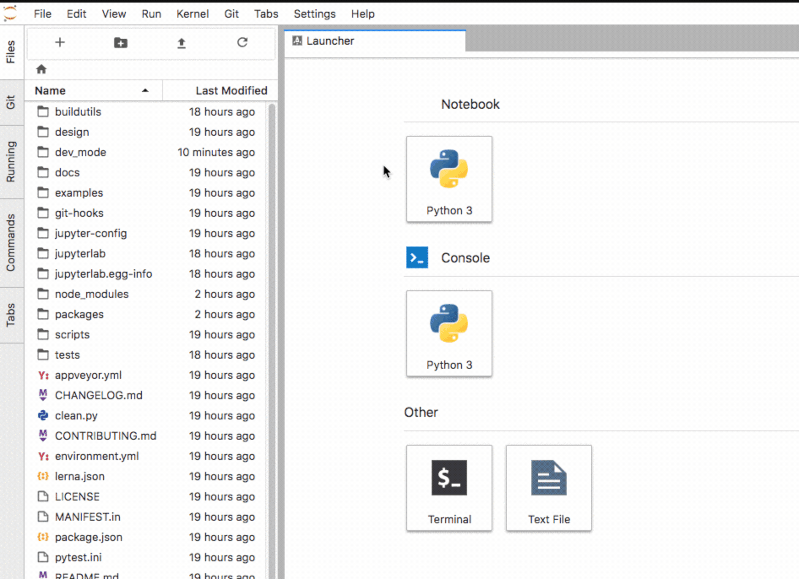
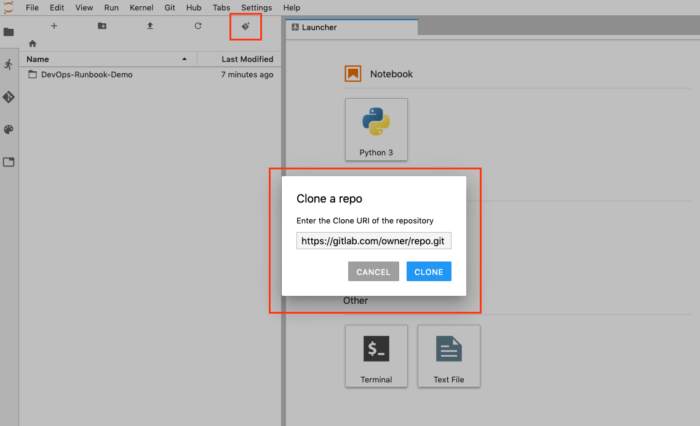

# GitLab Managed Apps

GitLab provides **GitLab Managed Apps**, a one-click install for various applications which can
be added directly to your configured cluster.

These applications are needed for [Review Apps](../../ci/review_apps/index.md)
and [deployments](../../ci/environments.md) when using [Auto DevOps](../../topics/autodevops/index.md).

You can install them after you
[create a cluster](../project/clusters/add_remove_clusters.md).

## Installing applications

Applications managed by GitLab will be installed onto the `gitlab-managed-apps` namespace.

This namespace:

- Is different from the namespace used for project deployments.
- Is created once.
- Has a non-configurable name.

To see a list of available applications to install. For a:

- [Project-level cluster](../project/clusters/index.md), navigate to your project's
  **Operations > Kubernetes**.
- [Group-level cluster](../group/clusters/index.md), navigate to your group's **Kubernetes** page.

Install Helm first as it's used to install other applications.

NOTE: **Note:**
As of GitLab 11.6, Helm will be upgraded to the latest version supported
by GitLab before installing any of the applications.

The following applications can be installed:

- [Helm](#helm)
- [Ingress](#ingress)
- [cert-manager](#cert-manager)
- [Prometheus](#prometheus)
- [GitLab Runner](#gitlab-runner)
- [JupyterHub](#jupyterhub)
- [Knative](#knative)
- [Crossplane](#crossplane)

With the exception of Knative, the applications will be installed in a dedicated
namespace called `gitlab-managed-apps`.

NOTE: **Note:**
Some applications are installable only for a project-level cluster.
Support for installing these applications in a group-level cluster is
planned for future releases.
For updates, see [the issue tracking
progress](https://gitlab.com/gitlab-org/gitlab-foss/issues/51989).

CAUTION: **Caution:**
If you have an existing Kubernetes cluster with Helm already installed,
you should be careful as GitLab cannot detect it. In this case, installing
Helm via the applications will result in the cluster having it twice, which
can lead to confusion during deployments.

### Helm

> - Introduced in GitLab 10.2 for project-level clusters.
> - Introduced in GitLab 11.6 for group-level clusters.

[Helm](https://helm.sh/docs/) is a package manager for Kubernetes and is
required to install all the other applications. It is installed in its
own pod inside the cluster which can run the `helm` CLI in a safe
environment.

NOTE: **Note:**
Installing Helm as a GitLab-managed App behind a proxy is not supported,
but a [workaround](../../topics/autodevops/index.md#installing-helm-behind-a-proxy)
is available.

### cert-manager

> Introduced in GitLab 11.6 for project- and group-level clusters.

[cert-manager](https://docs.cert-manager.io/en/latest/) is a native
Kubernetes certificate management controller that helps with issuing
certificates. Installing cert-manager on your cluster will issue a
certificate by [Let's Encrypt](https://letsencrypt.org/) and ensure that
certificates are valid and up-to-date.

The chart used to install this application depends on the version of GitLab used. In:

- GitLab 12.3 and newer, the [jetstack/cert-manager](https://github.com/jetstack/cert-manager)
  chart is used with a [`values.yaml`](https://gitlab.com/gitlab-org/gitlab/blob/master/vendor/cert_manager/values.yaml)
  file.
- GitLab 12.2 and older, the [stable/cert-manager](https://github.com/helm/charts/tree/master/stable/cert-manager)
  chart was used.

If you have installed cert-manager prior to GitLab 12.3, Let's Encrypt will
[block requests from older versions of cert-manager](https://community.letsencrypt.org/t/blocking-old-cert-manager-versions/98753).

To resolve this:

1. Uninstall cert-manager (consider [backing up any additional configuration](https://docs.cert-manager.io/en/latest/tasks/backup-restore-crds.html)).
1. Install cert-manager again.

### GitLab Runner

> - Introduced in GitLab 10.6 for project-level clusters.
> - Introduced in GitLab 11.10 for group-level clusters.

[GitLab Runner](https://docs.gitlab.com/runner/) is the open source
project that is used to run your jobs and send the results back to
GitLab. It is used in conjunction with [GitLab
CI/CD](../../ci/README.md), the open-source continuous integration
service included with GitLab that coordinates the jobs.

If the project is on GitLab.com, shared Runners are available
(the first 2000 minutes are free, you can
[buy more later](../../subscriptions/index.md#extra-shared-runners-pipeline-minutes))
and you do not have to deploy one if they are enough for your needs. If a
project-specific Runner is desired, or there are no shared Runners, it is easy
to deploy one.

Note that the deployed Runner will be set as **privileged**, which means it will essentially
have root access to the underlying machine. This is required to build Docker images,
so it is the default. Make sure you read the
[security implications](../project/clusters/index.md#security-implications)
before deploying one.

NOTE: **Note:**
The [`runner/gitlab-runner`](https://gitlab.com/gitlab-org/charts/gitlab-runner)
chart is used to install this application with a
[`values.yaml`](https://gitlab.com/gitlab-org/gitlab/blob/master/vendor/runner/values.yaml)
file. Customizing installation by modifying this file is not supported.

### Ingress

> - Introduced in GitLab 10.2 for project-level clusters.
> - Introduced in GitLab 11.6 for group-level clusters.

[Ingress](https://kubernetes.github.io/ingress-nginx/) can provide load
balancing, SSL termination, and name-based virtual hosting. It acts as a
web proxy for your applications and is useful if you want to use [Auto
DevOps](../../topics/autodevops/index.md) or deploy your own web apps.

NOTE: **Note:**
With the following procedure, a load balancer must be installed in your cluster
to obtain the endpoint. You can use either
Ingress, or Knative's own load balancer ([Istio](https://istio.io)) if using Knative.

In order to publish your web application, you first need to find the endpoint which will be either an IP
address or a hostname associated with your load balancer.

To install it, click on the **Install** button for Ingress. GitLab will attempt
to determine the external endpoint and it should be available within a few minutes.

#### Determining the external endpoint automatically

> [Introduced](https://gitlab.com/gitlab-org/gitlab-foss/merge_requests/17052) in GitLab 10.6.

After you install Ingress, the external endpoint should be available within a few minutes.

TIP: **Tip:**
This endpoint can be used for the
[Auto DevOps base domain](../../topics/autodevops/index.md#auto-devops-base-domain)
using the `KUBE_INGRESS_BASE_DOMAIN` environment variable.

If the endpoint doesn't appear and your cluster runs on Google Kubernetes Engine:

1. Check your [Kubernetes cluster on Google Kubernetes Engine](https://console.cloud.google.com/kubernetes) to ensure there are no errors on its nodes.
1. Ensure you have enough [Quotas](https://console.cloud.google.com/iam-admin/quotas) on Google Kubernetes Engine. For more information, see [Resource Quotas](https://cloud.google.com/compute/quotas).
1. Check [Google Cloud's Status](https://status.cloud.google.com/) to ensure they are not having any disruptions.

Once installed, you may see a `?` for "Ingress IP Address" depending on the
cloud provider. For EKS specifically, this is because the ELB is created
with a DNS name, not an IP address. If GitLab is still unable to
determine the endpoint of your Ingress or Knative application, you can
[determine it manually](#determining-the-external-endpoint-manually).

NOTE: **Note:**
The [`stable/nginx-ingress`](https://github.com/helm/charts/tree/master/stable/nginx-ingress)
chart is used to install this application with a
[`values.yaml`](https://gitlab.com/gitlab-org/gitlab/blob/master/vendor/ingress/values.yaml)
file.

#### Determining the external endpoint manually

If the cluster is on GKE, click the **Google Kubernetes Engine** link in the
**Advanced settings**, or go directly to the
[Google Kubernetes Engine dashboard](https://console.cloud.google.com/kubernetes/)
and select the proper project and cluster. Then click **Connect** and execute
the `gcloud` command in a local terminal or using the **Cloud Shell**.

If the cluster is not on GKE, follow the specific instructions for your
Kubernetes provider to configure `kubectl` with the right credentials.
The output of the following examples will show the external endpoint of your
cluster. This information can then be used to set up DNS entries and forwarding
rules that allow external access to your deployed applications.

If you installed Ingress via the **Applications**, run the following command:

```bash
kubectl get service --namespace=gitlab-managed-apps ingress-nginx-ingress-controller -o jsonpath='{.status.loadBalancer.ingress[0].ip}'
```

Some Kubernetes clusters return a hostname instead, like [Amazon EKS](https://aws.amazon.com/eks/). For these platforms, run:

```bash
kubectl get service --namespace=gitlab-managed-apps ingress-nginx-ingress-controller -o jsonpath='{.status.loadBalancer.ingress[0].hostname}'
```

For Istio/Knative, the command will be different:

```bash
kubectl get svc --namespace=istio-system knative-ingressgateway -o jsonpath='{.status.loadBalancer.ingress[0].ip} '
```

Otherwise, you can list the IP addresses of all load balancers:

```bash
kubectl get svc --all-namespaces -o jsonpath='{range.items[?(@.status.loadBalancer.ingress)]}{.status.loadBalancer.ingress[*].ip} '
```

NOTE: **Note:**
If EKS is used, an [Elastic Load Balancer](https://docs.aws.amazon.com/elasticloadbalancing/)
will also be created, which will incur additional AWS costs.

NOTE: **Note:**
You may see a trailing `%` on some Kubernetes versions, **do not include it**.

The Ingress is now available at this address and will route incoming requests to
the proper service based on the DNS name in the request. To support this, a
wildcard DNS CNAME record should be created for the desired domain name. For example,
`*.myekscluster.com` would point to the Ingress hostname obtained earlier.

#### Using a static IP

By default, an ephemeral external IP address is associated to the cluster's load
balancer. If you associate the ephemeral IP with your DNS and the IP changes,
your apps will not be able to be reached, and you'd have to change the DNS
record again. In order to avoid that, you should change it into a static
reserved IP.

Read how to [promote an ephemeral external IP address in GKE](https://cloud.google.com/compute/docs/ip-addresses/reserve-static-external-ip-address#promote_ephemeral_ip).

#### Pointing your DNS at the external endpoint

Once you've set up the external endpoint, you should associate it with a [wildcard DNS
record](https://en.wikipedia.org/wiki/Wildcard_DNS_record) such as `*.example.com.`
in order to be able to reach your apps. If your external endpoint is an IP address,
use an A record. If your external endpoint is a hostname, use a CNAME record.

#### Web Application Firewall (ModSecurity)

> [Introduced](https://gitlab.com/gitlab-org/gitlab/merge_requests/21966) in GitLab 12.7.

Out of the box, GitLab provides you real-time security monitoring with
[ModSecurity](https://kubernetes.github.io/ingress-nginx/user-guide/nginx-configuration/annotations/#modsecurity).

Modsecurity is a toolkit for real-time web application monitoring, logging,
and access control. With GitLab's offering, the [OWASP's Core Rule Set](https://www.modsecurity.org/CRS/Documentation/), which provides generic attack detection capabilities,
is automatically applied.

This feature:

- Runs in "Detection-only mode" unless configured otherwise.
- Is viewable by checking your Ingress controller's `modsec` log for rule violations.
  For example:

  ```sh
  kubectl logs -n gitlab-managed-apps $(kubectl get pod -n gitlab-managed-apps -l app=nginx-ingress,component=controller --no-headers=true -o custom-columns=:metadata.name) modsecurity-log -f
  ```

To enable ModSecurity, check the **Enable Web Application Firewall** checkbox
when installing your [Ingress application](#ingress).

There is a small performance overhead by enabling ModSecurity. If this is
considered significant for your application, you can disable ModSecurity's
rule engine for your deployed application by setting
[the deployment variable](../../topics/autodevops/index.md)
`AUTO_DEVOPS_MODSECURITY_SEC_RULE_ENGINE` to `Off`. This will prevent ModSecurity
from processing any requests for the given application or environment.

To permanently disable it, you must [uninstall](#uninstalling-applications) and
reinstall your Ingress application for the changes to take effect.

### JupyterHub

> - Introduced in GitLab 11.0 for project-level clusters.
> - Introduced in GitLab 12.3 for group and instance-level clusters.

[JupyterHub](https://jupyterhub.readthedocs.io/en/stable/) is a
multi-user service for managing notebooks across a team. [Jupyter
Notebooks](https://jupyter-notebook.readthedocs.io/en/latest/) provide a
web-based interactive programming environment used for data analysis,
visualization, and machine learning.

Authentication will be enabled only for [project
members](../project/members/index.md) for project-level clusters and group
members for group-level clusters with [Developer or
higher](../permissions.md) access to the associated project or group.

We use a [custom Jupyter
image](https://gitlab.com/gitlab-org/jupyterhub-user-image/blob/master/Dockerfile)
that installs additional useful packages on top of the base Jupyter. You
will also see ready-to-use DevOps Runbooks built with Nurtch's [Rubix library](https://github.com/Nurtch/rubix).

More information on
creating executable runbooks can be found in [our Runbooks
documentation](../project/clusters/runbooks/index.md#executable-runbooks). Note that
Ingress must be installed and have an IP address assigned before
JupyterHub can be installed.

NOTE: **Note:**
The [`jupyter/jupyterhub`](https://jupyterhub.github.io/helm-chart/)
chart is used to install this application with a
[`values.yaml`](https://gitlab.com/gitlab-org/gitlab/blob/master/vendor/jupyter/values.yaml)
file.

#### Jupyter Git Integration

> [Introduced](https://gitlab.com/gitlab-org/gitlab-foss/merge_requests/28783) in GitLab 12.0 for project-level clusters.
> [Introduced](https://gitlab.com/gitlab-org/gitlab-foss/merge_requests/32512) in GitLab 12.3 for group and instance-level clusters.

When installing JupyterHub onto your Kubernetes cluster, [JupyterLab's Git extension](https://github.com/jupyterlab/jupyterlab-git)
is automatically provisioned and configured using the authenticated user's:

- Name.
- Email.
- Newly created access token.

JupyterLab's Git extension enables full version control of your notebooks as well as issuance of Git commands within Jupyter.
Git commands can be issued via the **Git** tab on the left panel or via Jupyter's command line prompt.

NOTE: **Note:**
JupyterLab's Git extension stores the user token in the JupyterHub DB in encrypted format
and in the single user Jupyter instance as plain text. This is because [Git requires storing
credentials as plain text](https://git-scm.com/docs/git-credential-store). Potentially, if
a nefarious user finds a way to read from the file system in the single user Jupyter instance
they could retrieve the token.



You can clone repositories from the files tab in Jupyter:



### Knative

> - Introduced in GitLab 11.5 for project-level clusters.
> - Introduced in GitLab 12.3 for group- and instance-level clusters.

[Knative](https://cloud.google.com/knative/) provides a platform to
create, deploy, and manage serverless workloads from a Kubernetes
cluster. It is used in conjunction with, and includes
[Istio](https://istio.io) to provide an external IP address for all
programs hosted by Knative.

You will be prompted to enter a wildcard
domain where your applications will be exposed. Configure your DNS
server to use the external IP address for that domain. For any
application created and installed, they will be accessible as
`<program_name>.<kubernetes_namespace>.<domain_name>`. This will require
your Kubernetes cluster to have [RBAC
enabled](../project/clusters/add_remove_clusters.md#rbac-cluster-resources).

NOTE: **Note:**
The [`knative/knative`](https://storage.googleapis.com/triggermesh-charts)
chart is used to install this application.

### Prometheus

> - Introduced in GitLab 10.4 for project-level clusters.
> - Introduced in GitLab 11.11 for group-level clusters.

[Prometheus](https://prometheus.io/docs/introduction/overview/) is an
open-source monitoring and alerting system useful to supervise your
deployed applications.

GitLab is able to monitor applications automatically, using the
[Prometheus integration](../project/integrations/prometheus.md). Kubernetes container CPU and
memory metrics are automatically collected, and response metrics are retrieved
from NGINX Ingress as well.

To enable monitoring, simply install Prometheus into the cluster with the
**Install** button.

NOTE: **Note:**
The [`stable/prometheus`](https://github.com/helm/charts/tree/master/stable/prometheus)
chart is used to install this application with a
[`values.yaml`](https://gitlab.com/gitlab-org/gitlab/blob/master/vendor/prometheus/values.yaml)
file.

### Crossplane

> - [Introduced](https://gitlab.com/gitlab-org/gitlab/issues/34702) in GitLab 12.5 for project-level clusters.

[Crossplane](https://crossplane.io/docs) is a multi-cloud control plane useful for
managing applications and infrastructure across multiple clouds. It extends the
Kubernetes API using:

- Custom resources.
- Controllers that watch those custom resources.

Crossplane allows provisioning and lifecycle management of infrastructure components
across cloud providers in a uniform manner by abstracting cloud provider-specific
configurations.

The Crossplane GitLab-managed application:

- Installs Crossplane with a provider of choice on a Kubernetes cluster attached to the
  project repository.
- Can then be used to provision infrastructure or managed applications such as
  PostgreSQL (for example, CloudSQL from GCP or RDS from AWS) and other services
  required by the application via the Auto DevOps pipeline.

For information on configuring Crossplane installed on the cluster, see
[Crossplane configuration](crossplane.md).

NOTE: **Note:**
[`alpha/crossplane`](https://charts.crossplane.io/alpha/) chart v0.4.1 is used to
install Crossplane using the
[`values.yaml`](https://github.com/crossplaneio/crossplane/blob/master/cluster/charts/crossplane/values.yaml.tmpl)
file.

#### Enabling installation

This is a preliminary release of Crossplane as a GitLab-managed application. By default,
the ability to install it is disabled.

To allow installation of Crossplane as a GitLab-managed application, ask a GitLab
administrator to run following command within a Rails console:

```ruby
Feature.enable(:enable_cluster_application_crossplane)
```

## Install using GitLab CI (alpha)

> [Introduced](https://gitlab.com/gitlab-org/gitlab/merge_requests/20822) in GitLab 12.6.

CAUTION: **Warning:**
This is an _alpha_ feature, and it is subject to change at any time without
prior notice.

This alternative method allows users to install GitLab-managed
applications using GitLab CI. It also allows customization of the
install using Helm `values.yaml` files.

Supported applications:

- [Ingress](#install-ingress-using-gitlab-ci)
- [cert-manager](#install-cert-manager-using-gitlab-ci)
- [Sentry](#install-sentry-using-gitlab-ci)

### Usage

You can find and import all the files referenced below
in the [example cluster applications
project](https://gitlab.com/gitlab-org/cluster-integration/example-cluster-applications/).

To install applications using GitLab CI:

1. Connect the cluster to a [cluster management project](management_project.md).
1. In that project, add a `.gitlab-ci.yml` file with the following content:

    ```yaml
    include:
      - template: Managed-Cluster-Applications.gitlab-ci.yml
    ```

1. Add a `.gitlab/managed-apps/config.yaml` file to define which
  applications you would like to install. Define the `installed` key as
  `true` to install the application and `false` to uninstall the
  application. For example, to install Ingress:

    ```yaml
    ingress:
      installed: true
    ```

1. Optionally, define `.gitlab/managed-apps/<application>/values.yaml` file to
   customize values for the installed application.

A GitLab CI pipeline will then run on the `master` branch to install the
applications you have configured.

### Install Ingress using GitLab CI

To install Ingress, define the `.gitlab/managed-apps/config.yaml` file
with:

```yaml
ingress:
  installed: true
```

Ingress will then be installed into the `gitlab-managed-apps` namespace
of your cluster.

You can customize the installation of Ingress by defining
`.gitlab/managed-apps/ingress/values.yaml` file in your cluster
management project. Refer to the
[chart](https://github.com/helm/charts/tree/master/stable/nginx-ingress)
for the available configuration options.

### Install cert-manager using GitLab CI

cert-manager is installed using GitLab CI by defining configuration in
`.gitlab/managed-apps/config.yaml`.

cert-manager:

- Is installed into the `gitlab-managed-apps` namespace of your cluster.
- Can be installed with or without a default [Let's Encrypt `ClusterIssuer`](https://cert-manager.io/docs/configuration/acme/), which requires an
  email address to be specified. The email address is used by Let's Encrypt to
  contact you about expiring certificates and issues related to your account.

The following configuration is required to install cert-manager using GitLab CI:

```yaml
certManager:
  installed: true
  letsEncryptClusterIssuer:
    installed: true
    email: "user@example.com"
```

The following installs cert-manager using GitLab CI without the default `ClusterIssuer`:

```yaml
certManager:
  installed: true
  letsEncryptClusterIssuer:
    installed: false
```

You can customize the installation of Ingress by defining
`.gitlab/managed-apps/cert-manager/values.yaml` file in your cluster
management project. Refer to the
[chart](https://hub.helm.sh/charts/jetstack/cert-manager) for the
available configuration options.

### Install Sentry using GitLab CI

NOTE: **Note:**
The Sentry Helm chart [recommends](https://github.com/helm/charts/blob/f6e5784f265dd459c5a77430185d0302ed372665/stable/sentry/values.yaml#L284-L285) at least 3GB of available RAM for database migrations.

To install Sentry, define the `.gitlab/managed-apps/config.yaml` file
with:

```yaml
sentry:
  installed: true
```

Sentry will then be installed into the `gitlab-managed-apps` namespace
of your cluster.

You can customize the installation of Sentry by defining
`.gitlab/managed-apps/sentry/values.yaml` file in your cluster
management project. Refer to the
[chart](https://github.com/helm/charts/tree/master/stable/sentry)
for the available configuration options.

We recommend you pay close attention to the following configuration options:

- `email`. Needed to invite users to your Sentry instance and to send error emails.
- `user`. Where you can set the login credentials for the default admin user.
- `postgresql`. For a PostgreSQL password that can be used when running future updates.

NOTE: **Note:**
When upgrading it is important to provide the existing PostgreSQL password (given using the `postgresql.postgresqlPassword` key) or you will receive authentication errors. See the [PostgreSQL chart documentation](https://github.com/helm/charts/tree/master/stable/postgresql#upgrade) for more information.

Here is an example configuration for Sentry:

```yaml
# Admin user to create
user:
  # Indicated to create the admin user or not,
  # Default is true as the initial installation.
  create: true
  email: "<your email>"
  password: "<your password>"

email:
  from_address: "<your from email>"
  host: smtp
  port: 25
  use_tls: false
  user: "<your email username>"
  password: "<your email password>"
  enable_replies: false

ingress:
  enabled: true
  hostname: "<sentry.example.com>"

# Needs to be here between runs.
# See https://github.com/helm/charts/tree/master/stable/postgresql#upgrade for more info
postgresql:
  postgresqlPassword: example-postgresql-password
```

## Upgrading applications

> [Introduced](https://gitlab.com/gitlab-org/gitlab-foss/merge_requests/24789) in GitLab 11.8.

The applications below can be upgraded.

| Application | GitLab version |
| ----------- | -------------- |
| Runner  | 11.8+          |

To upgrade an application:

1. For a:
   - [Project-level cluster](../project/clusters/index.md),
     navigate to your project's **Operations > Kubernetes**.
   - [Group-level cluster](../group/clusters/index.md),
     navigate to your group's **Kubernetes** page.
1. Select your cluster.
1. If an upgrade is available, the **Upgrade** button is displayed. Click the button to upgrade.

NOTE: **Note:**
Upgrades will reset values back to the values built into the `runner`
chart plus the values set by
[`values.yaml`](https://gitlab.com/gitlab-org/gitlab/blob/master/vendor/runner/values.yaml)

## Uninstalling applications

> [Introduced](https://gitlab.com/gitlab-org/gitlab-foss/issues/60665) in GitLab 11.11.

The applications below can be uninstalled.

| Application | GitLab version | Notes |
| ----------- | -------------- | ----- |
| cert-manager | 12.2+         | The associated private key will be deleted and cannot be restored. Deployed applications will continue to use HTTPS, but certificates will not be renewed. Before uninstalling, you may wish to [back up your configuration](https://docs.cert-manager.io/en/latest/tasks/backup-restore-crds.html) or [revoke your certificates](https://letsencrypt.org/docs/revoking/). |
| GitLab Runner  | 12.2+         | Any running pipelines will be canceled. |
| Helm  | 12.2+         | The associated Tiller pod, the `gitlab-managed-apps` namespace, and all of its resources will be deleted and cannot be restored. |
| Ingress  | 12.1+         | The associated load balancer and IP will be deleted and cannot be restored. Furthermore, it can only be uninstalled if JupyterHub is not installed. |
| JupyterHub  | 12.1+         | All data not committed to GitLab will be deleted and cannot be restored. |
| Knative  | 12.1+         | The associated IP will be deleted and cannot be restored. |
| Prometheus  | 11.11+         | All data will be deleted and cannot be restored. |
| Crossplane  | 12.5+         | All data will be deleted and cannot be restored. |
| Sentry  | 12.6+         | The PostgreSQL persistent volume will remain and should be manually removed for complete uninstall.  |

To uninstall an application:

1. For a:
   - [Project-level cluster](../project/clusters/index.md),
     navigate to your project's **Operations > Kubernetes**.
   - [Group-level cluster](../group/clusters/index.md),
     navigate to your group's **Kubernetes** page.
1. Select your cluster.
1. Click the **Uninstall** button for the application.

Support for uninstalling all applications is planned for progressive rollout.
To follow progress, see [the relevant
epic](https://gitlab.com/groups/gitlab-org/-/epics/1201).

## Troubleshooting applications

Applications can fail with the following error:

```text
Error: remote error: tls: bad certificate
```

To avoid installation errors:

- Before starting the installation of applications, make sure that time is synchronized
  between your GitLab server and your Kubernetes cluster.
- Ensure certificates are not out of sync. When installing applications, GitLab expects a new cluster with no previous installation of Helm.

  You can confirm that the certificates match via `kubectl`:

  ```sh
  kubectl get configmaps/values-content-configuration-ingress -n gitlab-managed-apps -o \
  "jsonpath={.data['cert\.pem']}" | base64 -d > a.pem
  kubectl get secrets/tiller-secret -n gitlab-managed-apps -o "jsonpath={.data['ca\.crt']}" | base64 -d > b.pem
  diff a.pem b.pem
  ```
