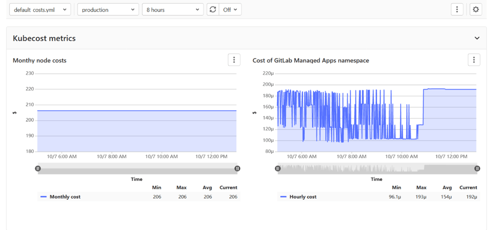

# Cluster cost management **(ULTIMATE)**

> [Introduced](https://gitlab.com/gitlab-org/gitlab/-/issues/216737) in [GitLab Ultimate](https://about.gitlab.com/pricing/) 13.5.

Cluster cost management provides insights into cluster resource usage. GitLab provides an example
[`kubecost-cost-model`](https://gitlab.com/gitlab-examples/kubecost-cost-model/)
project that uses the GitLab Prometheus integration and
[Kubecost's `cost-model`](https://github.com/kubecost/cost-model) to provide cluster cost
insights within GitLab:



## Configure cluster cost management

To get started with cluster cost management, you need [Maintainer](../permissions.md)
permissions in a project or group.

1. Clone the [`kubecost-cost-model`](https://gitlab.com/gitlab-examples/kubecost-cost-model/)
   example repository, which contains minor modifications to the upstream Kubecost
   `cost-model` project:
   - Configures your Prometheus endpoint to the GitLab-managed Prometheus. You may
     need to change this value if you use a non-managed Prometheus.
   - Adds the necessary annotations to the deployment manifest to be scraped by
     GitLab-managed Prometheus.
   - Changes the Google Pricing API access key to the GitLab access key.
   - Contains definitions for a custom GitLab Metrics dashboard to show the cost insights.
1. Connect GitLab with Prometheus, depending on your configuration:
   - *If Prometheus is already configured,* navigate to **Settings > Integrations > Prometheus**
     to provide the API endpoint of your Prometheus server.
   - *To use the Prometheus cluster integration,* navigate to your cluster's **Details** page,
     select the **Integrations** tab, and follow the instructions to enable the Prometheus
     cluster integration.
1. Set up the Prometheus integration on the cloned example project.
1. Add the Kubecost `cost-model` to your cluster:
   - *For non-managed clusters*, deploy it with GitLab CI/CD.
   - *To deploy it manually*, use the following commands:

     ```shell
     kubectl create namespace cost-model
     kubectl apply -f kubernetes/ --namespace cost-model
     ```

To access the cost insights, navigate to **Monitor > Metrics** and select
the `default_costs.yml` dashboard. You can [customize](#customize-the-cost-dashboard)
this dashboard.

### Customize the cost dashboard

You can customize the cost dashboard by editing the `.gitlab/dashboards/default_costs.yml`
file or creating similar dashboard configuration files. To learn more, read about
[customizing dashboards in our documentation](/ee/operations/metrics/dashboards/).

#### Available metrics

Metrics contain both instance and node labels. The instance label is scheduled for deprecation in a future version.

- `node_cpu_hourly_cost` - Hourly cost per vCPU on this node.
- `node_gpu_hourly_cost` - Hourly cost per GPU on this node.
- `node_ram_hourly_cost` - Hourly cost per gigabyte of memory on this node.
- `node_total_hourly_cost` - Total node cost per hour.
- `container_cpu_allocation` - Average number of CPUs requested/used over the previous minute.
- `container_gpu_allocation` - Average number of GPUs requested over the previous minute.
- `container_memory_allocation_bytes` - Average bytes of RAM requested/used over the previous minute.
- `pod_pvc_allocation` - Bytes provisioned for a PVC attached to a pod.
- `pv_hourly_cost` - Hourly cost per GB on a persistent volume.

Some examples are provided in the
[`kubecost-cost-model` repository](https://gitlab.com/gitlab-examples/kubecost-cost-model/-/blob/master/PROMETHEUS.md#example-queries).
