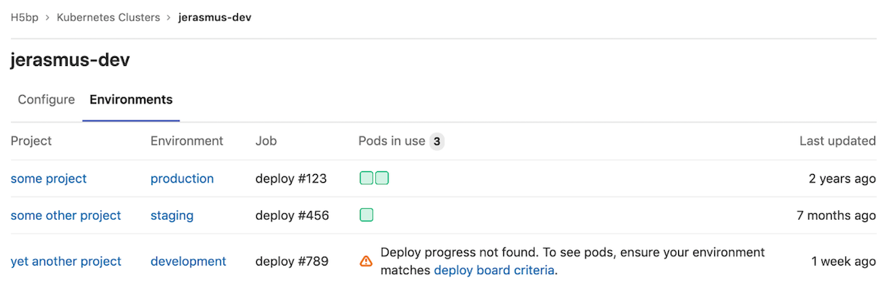

DETAILS:
**Tier:** Premium, Ultimate
**Offering:** GitLab.com, GitLab Self-Managed, GitLab Dedicated

> - [Disabled on GitLab Self-Managed](https://gitlab.com/gitlab-org/gitlab/-/issues/353410) in GitLab 15.0.

WARNING:
This feature was [deprecated](https://gitlab.com/groups/gitlab-org/configure/-/epics/8) in GitLab 14.5.

FLAG:
On GitLab Self-Managed, by default this feature is not available. To make it available, an administrator can [enable the feature flag](../../administration/feature_flags.md) named `certificate_based_clusters`.

Cluster environments provide a consolidated view of which CI [environments](../../ci/environments/_index.md) are
deployed to the Kubernetes cluster and it:

- Shows the project and the relevant environment related to the deployment.
- Displays the status of the pods for that environment.

## Overview

With cluster environments, you can gain insight into:

- Which projects are deployed to the cluster.
- How many pods are in use for each project's environment.
- The CI job that was used to deploy to that environment.

Access to cluster environments is restricted to
[group maintainers and owners](../permissions.md#group-members-permissions)

## Usage

To:

- Track environments for the cluster, you must
  [deploy to a Kubernetes cluster](../project/clusters/deploy_to_cluster.md)
  successfully.
- Show pod usage correctly, you must
  [enable deploy boards](../project/deploy_boards.md#enabling-deploy-boards).

After you have successful deployments to your group-level or instance-level cluster:

1. Go to your group's **Kubernetes** page.
1. Select the **Environments** tab.

Only successful deployments to the cluster are included in this page.
Non-cluster environments aren't included.
