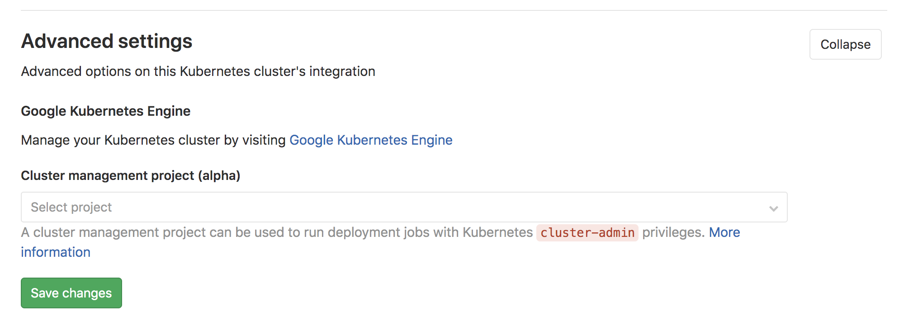

# Cluster management project **(FREE)**

> [Introduced](https://gitlab.com/gitlab-org/gitlab/-/issues/32810) in GitLab 12.5

A project can be designated as the management project for a cluster.
A management project can be used to run deployment jobs with
Kubernetes
[`cluster-admin`](https://kubernetes.io/docs/reference/access-authn-authz/rbac/#user-facing-roles)
privileges.

This can be useful for:

- Creating pipelines to install cluster-wide applications into your cluster, see [management project template](management_project_template.md) for details.
- Any jobs that require `cluster-admin` privileges.

## Permissions

Only the management project receives `cluster-admin` privileges. All
other projects continue to receive [namespace scoped `edit` level privileges](../project/clusters/cluster_access.md#rbac-cluster-resources).

Management projects are restricted to the following:

- For project-level clusters, the management project must be in the same
  namespace (or descendants) as the cluster's project.
- For group-level clusters, the management project must be in the same
  group (or descendants) as the cluster's group.
- For instance-level clusters, there are no such restrictions.

## Usage

To use a cluster management project for a cluster:

1. Select the project.
1. Configure your pipelines.
1. Set an environment scope.

### Selecting a cluster management project

To select a cluster management project to use:

1. Navigate to the appropriate configuration page. For a:
   - [Project-level cluster](../project/clusters/index.md), go to your project's
     **Infrastructure > Kubernetes clusters** page.
   - [Group-level cluster](../group/clusters/index.md), go to your group's **Kubernetes**
     page.
   - [Instance-level cluster](../instance/clusters/index.md), go to **Menu >** **{admin}** **Admin > Kubernetes** page.
1. Select the project using **Cluster management project field** in the **Advanced settings**
   section.



### Configuring your pipeline

After designating a project as the management project for the cluster,
write a [`.gitlab-ci.yml`](../../ci/yaml/index.md) in that project. For example:

```yaml
configure cluster:
  stage: deploy
  script: kubectl get namespaces
  environment:
    name: production
```

### Setting the environment scope

[Environment
scopes](../project/clusters/multiple_kubernetes_clusters.md#setting-the-environment-scope)
are usable when associating multiple clusters to the same management
project.

Each scope can only be used by a single cluster for a management project.

For example, let's say the following Kubernetes clusters are associated
to a management project:

| Cluster     | Environment scope |
| ----------- | ----------------- |
| Development | `*`               |
| Staging     | `staging`         |
| Production  | `production`      |

The following environments set in
[`.gitlab-ci.yml`](../../ci/yaml/index.md) deploy to the
Development, Staging, and Production cluster respectively.

```yaml
stages:
  - deploy

configure development cluster:
  stage: deploy
  script: kubectl get namespaces
  environment:
    name: development

configure staging cluster:
  stage: deploy
  script: kubectl get namespaces
  environment:
    name: staging

configure production cluster:
  stage: deploy
  script: kubectl get namespaces
  environment:
    name: production
```
