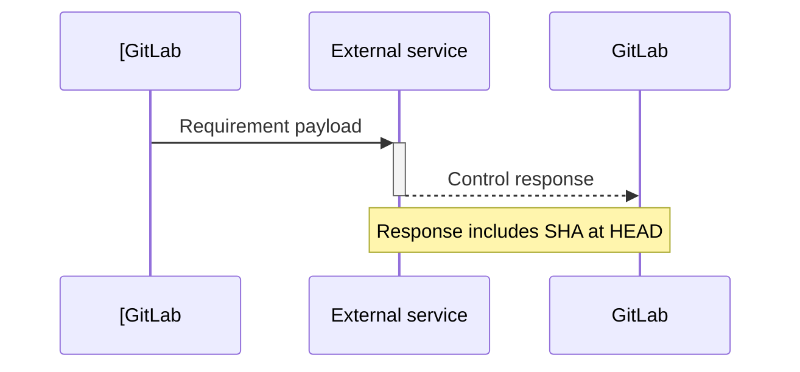



- Tier: Premium, Ultimate
- Offering: GitLab.com, GitLab Self-Managed, GitLab Dedicated



You can create a compliance framework that is a label to identify that your project has certain compliance
requirements or needs additional oversight.

In the Ultimate tier, the compliance framework can optionally enforce
[compliance pipeline configuration](compliance_pipelines.md) and
[security policies](../application_security/policies/_index.md#scope) to the projects on which it is applied.

Compliance frameworks are created on top-level groups. If a project is moved outside of its existing top-level group,
its frameworks are removed.

You can apply up to 20 compliance frameworks to each project.

For a click-through demo, see [Compliance frameworks](https://gitlab.navattic.com/compliance).
<!-- Demo published on 2025-01-27 -->

## Prerequisites

- To create, edit, and delete compliance frameworks, users must have either:
  - The Owner role for the top-level group.
  - Be assigned a [custom role](../custom_roles/_index.md) with the `admin_compliance_framework`
    [custom permission](../custom_roles/abilities.md#compliance-management).
- To add or remove a compliance framework to or from a project, the group to which the project belongs must have a
  compliance framework.

## Create, edit, or delete a compliance framework

You can create, edit, or delete a compliance framework from a compliance framework report. For more information, see:

- [Create a new compliance framework](compliance_center/compliance_frameworks_report.md#create-a-new-compliance-framework).
- [Edit a compliance framework](compliance_center/compliance_frameworks_report.md#edit-a-compliance-framework).
- [Delete a compliance framework](compliance_center/compliance_frameworks_report.md#delete-a-compliance-framework).

You can create, edit, or delete a compliance framework from a compliance projects report. For more information, see:

- [Create a new compliance framework](compliance_center/compliance_projects_report.md#create-a-new-compliance-framework).
- [Edit a compliance framework](compliance_center/compliance_projects_report.md#edit-a-compliance-framework).
- [Delete a compliance framework](compliance_center/compliance_projects_report.md#delete-a-compliance-framework).

Subgroups and projects have access to all compliance frameworks created on their top-level group. However, compliance frameworks cannot be created, edited,
or deleted at the subgroup or project level. Project owners can choose a framework to apply to their projects.

## Apply a compliance framework to a project



- Assigning multiple compliance frameworks [introduced](https://gitlab.com/groups/gitlab-org/-/epics/13294) in GitLab 17.3.



You can apply multiple compliance frameworks to a project but cannot apply compliance frameworks to projects in personal namespaces.

To apply a compliance framework to a project, apply the compliance framework through the
[Compliance projects report](compliance_center/compliance_projects_report.md#apply-a-compliance-framework-to-projects-in-a-group).

You can use the [GraphQL API](../../api/graphql/reference/_index.md#mutationprojectupdatecomplianceframeworks) to apply one or many
compliance frameworks to a project.

If you create compliance frameworks on subgroups with GraphQL, the framework is created on the root ancestor if the user
has the correct permissions. The GitLab UI presents a read-only view to discourage this behavior.

## Default compliance frameworks



- [Introduced](https://gitlab.com/gitlab-org/gitlab/-/issues/375036) in GitLab 15.6.



Group owners can set a default compliance framework. The default framework is applied to all the new and imported
projects that are created in that group. It does not affect the framework applied to the existing projects. The
default framework cannot be deleted.

A compliance framework that is set to default has a **default** label.

### Set and remove a default by using the compliance center

To set as default (or remove the default) from [compliance projects report](compliance_center/compliance_projects_report.md):

1. On the left sidebar, select **Search or go to** and find your group.
1. Select **Secure > Compliance center**.
1. On the page, select the **Projects** tab.
1. Hover over a compliance framework, select the **Edit Framework** tab.
1. Select **Set as default**.
1. Select **Save changes**.

To set as default (or remove the default) from [compliance framework report](compliance_center/compliance_frameworks_report.md):

1. On the left sidebar, select **Search or go to** and find your group.
1. Select **Secure > Compliance center**.
1. On the page, select the **Frameworks** tab.
1. Hover over a compliance framework, select the **Edit Framework** tab.
1. Select **Set as default**.
1. Select **Save changes**.

## Remove a compliance framework from a project

To remove a compliance framework from one or multiple project in a group, remove the compliance framework through the
[Compliance projects report](compliance_center/compliance_projects_report.md#remove-a-compliance-framework-from-projects-in-a-group).

## Import and export compliance frameworks



- [Introduced](https://gitlab.com/groups/gitlab-org/-/epics/16499) in GitLab 17.11.



Download existing compliance frameworks as JSON files and upload new frameworks from JSON templates.

A library of JSON templates is available from the
[Compliance Adherence Templates](https://gitlab.com/gitlab-org/software-supply-chain-security/compliance/engineering/compliance-adherence-templates) project.
Use these templates to quickly adopt predefined compliance frameworks.

### Export a compliance framework as a JSON file

With this feature, you can share and back up compliance frameworks.

To export a compliance framework from the compliance center:

1. On the left sidebar, select **Search or go to** and find your group.
1. Select **Secure > Compliance center**.
1. On the page, select the **Frameworks** tab.
1. Locate the compliance framework you wish to export.
1. Select the vertical ellipsis ().
1. Select **Export as JSON file**.

The JSON file is downloaded to your local system.

### Import a compliance framework from a JSON file

With this feature, you can use shared or backed up compliance frameworks.

To import a compliance framework by using a JSON template:

1. On the left sidebar, select **Search or go to** and find your group.
1. Select **Secure > Compliance center**.
1. On the page, select the **Frameworks** tab.
1. Select **New framework**.
1. Select **Import framework**.
1. In the dialog that appears, select the JSON file from your local system.

If the import is successful, the new compliance framework appears in the list. Any errors are displayed for correction.

## Requirements



- Tier: Ultimate
- Offering: GitLab.com, GitLab Self-Managed, GitLab Dedicated





- [Introduced](https://gitlab.com/gitlab-org/gitlab/-/merge_requests/186525) in GitLab 17.11 [with a flag](../../administration/feature_flags.md) named `enable_standards_adherence_dashboard_v2`. Disabled by default.



In GitLab Ultimate, you can define specific **requirements** for a compliance framework. Requirements are made up of one or more **controls**, which are checks against the configuration or behavior of projects that are assigned the framework. There is maximum of 5 controls per requirement.

### Controls

Each control includes logic that GitLab uses during scheduled or triggered scans to evaluate a project's adherence. For more details on how adherence is tracked, see [Compliance status report](compliance_center/compliance_status_report.md).

#### GitLab controls

The following controls are available to use in framework requirements:

- **SAST running**
- **At least two approvals**
- **Author approved merge request**
- **Committers approved merge request**
- **Internal visibility is forbidden**
- **Default branch protected**
- **Auth SSO enabled**
- **Secret detection running**
- **Dependency scanning running**
- **Container scanning running**
- **License compliance running**
- **DAST running**
- **API security running**
- **Fuzz testing running**
- **Code quality running**
- **IaC scanning running**
- **Code changes requires code owners**
- **Reset approvals on push**
- **Status checks required**
- **Require branch up to date**
- **Resolve discussions required**
- **Require linear history**
- **Restrict push/merge access**
- **Force push disabled**
- **Terraform enabled**

#### External controls

External controls are API calls to external systems that request the status of an external control or requirement.

You can create a external control that sends data to third-party tools.

When the [compliance scans](compliance_center/compliance_status_report.md#scan-timing-and-triggers) are run, GitLab sends a notification. The users or automated workflows can then update the status of control from outside of GitLab.

With this integration, you can integrate with third-party workflow tools, like ServiceNow, or the custom tool of your choice. The third-party tool
responds with an associated status. This status is then displayed in the [Compliance status report](compliance_center/compliance_status_report.md).

You can configure external controls for each individual project. External controls are not shared between projects.
Status checks fail if an external control stays in the pending state for more than six hours.

##### Add external controls

To add an external control when creating or editing a framework:

1. On the left sidebar, select **Search or go to** and find your group.
1. Select **Secure > Compliance center**.
1. On the page, select the **Frameworks** tab.
1. Select **New framework** or edit an existing one.
1. In the **Requirements** section, select **New requirement**.
1. Select **Add an external control**.
1. In the feilds edit **External URL** and **HMAC shared secret**.
1. Select **Save changes to the framework** to save the requirment.

##### External control lifecycle

External controls have an **asynchronous** workflow. [Compliance scans](compliance_center/compliance_status_report.md#scan-timing-and-triggers) emit a payload to an external service whenever.

When the payload is received, the external service can then run any required processes before posting its response back to the merge request using the REST API.

External controls have the following states:

- `pending` - The default state. No response has been received from the external service.
- `passed` - A response from the external service has been received and approved by it.
- `failed` - A response from the external service has been received and denied by it.

If something changes outside of GitLab, you can set the status of an external control by using the API. You don't need to wait for a payload to be sent first.

### Add requirements

To add a requirement when creating or editing a framework:

1. On the left sidebar, select **Search or go to** and find your group.
1. Select **Secure > Compliance center**.
1. On the page, select the **Frameworks** tab.
1. Select **New framework** or edit an existing one.
1. In the **Requirements** section, select **New requirement**.
1. In the popup add **Name** and **Description**.
1. Select **Add a GitLab control** to add more controls.
1. In the control dropdown search and select a control.
1. Select **Save changes to the framework** to save the requirment.

### Edit requirements

To edit a requirement when creating or editing a framework:

1. On the left sidebar, select **Search or go to** and find your group.
1. Select **Secure > Compliance center**.
1. On the page, select the **Frameworks** tab.
1. Select **New framework** or edit an existing one.
1. In the **Requirements** section, select **Action** > **Edit**.
1. In the popup edit **Name** and **Description**.
1. Select **Add a GitLab control** to add more controls.
1. In the control dropdown search and select a control.
1. Select  to remove a control.
1. Select **Save changes to the framework** to save the requirment.
