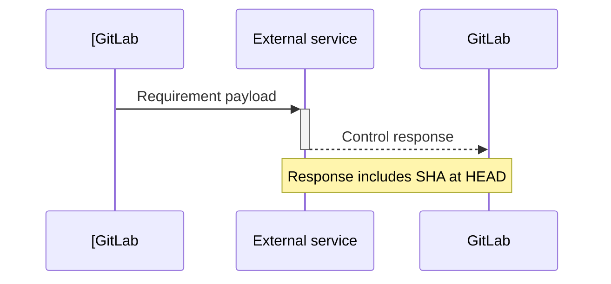



- Tier: Premium, Ultimate
- Offering: GitLab.com, GitLab Self-Managed, GitLab Dedicated



You can create a compliance framework that is a label to identify that your project has certain compliance
requirements or needs additional oversight.

In the Ultimate tier, the compliance framework can optionally enforce
[compliance pipeline configuration](compliance_pipelines.md) and
[security policies](../application_security/policies/_index.md#scope) to the projects on which it is applied.

Compliance frameworks are created on top-level groups. If a project is moved outside of its existing top-level group,
its frameworks are removed.

You can apply up to 20 compliance frameworks to each project.

For a click-through demo, see [Compliance frameworks](https://gitlab.navattic.com/compliance).
<!-- Demo published on 2025-01-27 -->

## Prerequisites

- To create, edit, and delete compliance frameworks, users must have either:
  - The Owner role for the top-level group.
  - Be assigned a [custom role](../custom_roles/_index.md) with the `admin_compliance_framework`
    [custom permission](../custom_roles/abilities.md#compliance-management).
- To add or remove a compliance framework to or from a project, the group to which the project belongs must have a
  compliance framework.

## Create, edit, or delete a compliance framework

You can create, edit, or delete a compliance framework from a compliance framework report. For more information, see:

- [Create a new compliance framework](compliance_center/compliance_frameworks_report.md#create-a-new-compliance-framework).
- [Edit a compliance framework](compliance_center/compliance_frameworks_report.md#edit-a-compliance-framework).
- [Delete a compliance framework](compliance_center/compliance_frameworks_report.md#delete-a-compliance-framework).

You can create, edit, or delete a compliance framework from a compliance projects report. For more information, see:

- [Create a new compliance framework](compliance_center/compliance_projects_report.md#create-a-new-compliance-framework).
- [Edit a compliance framework](compliance_center/compliance_projects_report.md#edit-a-compliance-framework).
- [Delete a compliance framework](compliance_center/compliance_projects_report.md#delete-a-compliance-framework).

Subgroups and projects have access to all compliance frameworks created on their top-level group. However, compliance frameworks cannot be created, edited,
or deleted at the subgroup or project level. Project owners can choose a framework to apply to their projects.

## Apply a compliance framework to a project



- Assigning multiple compliance frameworks [introduced](https://gitlab.com/groups/gitlab-org/-/epics/13294) in GitLab 17.3.



You can apply multiple compliance frameworks to a project but cannot apply compliance frameworks to projects in personal namespaces.

To apply a compliance framework to a project, apply the compliance framework through the
[Compliance projects report](compliance_center/compliance_projects_report.md#apply-a-compliance-framework-to-projects-in-a-group).

You can use the [GraphQL API](../../api/graphql/reference/_index.md#mutationprojectupdatecomplianceframeworks) to apply one or many
compliance frameworks to a project.

If you create compliance frameworks on subgroups with GraphQL, the framework is created on the root ancestor if the user
has the correct permissions. The GitLab UI presents a read-only view to discourage this behavior.

## Default compliance frameworks



- [Introduced](https://gitlab.com/gitlab-org/gitlab/-/issues/375036) in GitLab 15.6.



Group owners can set a default compliance framework. The default framework is applied to all the new and imported
projects that are created in that group. It does not affect the framework applied to the existing projects. The
default framework cannot be deleted.

A compliance framework that is set to default has a **default** label.

### Set and remove a default by using the compliance center

To set as default (or remove the default) from [compliance projects report](compliance_center/compliance_projects_report.md):

1. On the left sidebar, select **Search or go to** and find your group.
1. Select **Secure > Compliance center**.
1. On the page, select the **Projects** tab.
1. Hover over a compliance framework, select the **Edit Framework** tab.
1. Select **Set as default**.
1. Select **Save changes**.

To set as default (or remove the default) from [compliance framework report](compliance_center/compliance_frameworks_report.md):

1. On the left sidebar, select **Search or go to** and find your group.
1. Select **Secure > Compliance center**.
1. On the page, select the **Frameworks** tab.
1. Hover over a compliance framework, select the **Edit Framework** tab.
1. Select **Set as default**.
1. Select **Save changes**.

## Remove a compliance framework from a project

To remove a compliance framework from one or multiple project in a group, remove the compliance framework through the
[Compliance projects report](compliance_center/compliance_projects_report.md#remove-a-compliance-framework-from-projects-in-a-group).

## Import and export compliance frameworks



- [Introduced](https://gitlab.com/groups/gitlab-org/-/epics/16499) in GitLab 17.11.



Download existing compliance frameworks as JSON files and upload new frameworks from JSON templates.

A library of JSON templates is available from the
[Compliance Adherence Templates](https://gitlab.com/gitlab-org/software-supply-chain-security/compliance/engineering/compliance-adherence-templates) project.
Use these templates to quickly adopt predefined compliance frameworks.

### Export a compliance framework as a JSON file

With this feature, you can share and back up compliance frameworks.

To export a compliance framework from the compliance center:

1. On the left sidebar, select **Search or go to** and find your group.
1. Select **Secure > Compliance center**.
1. On the page, select the **Frameworks** tab.
1. Locate the compliance framework you wish to export.
1. Select the vertical ellipsis ().
1. Select **Export as JSON file**.

The JSON file is downloaded to your local system.

### Import a compliance framework from a JSON file

With this feature, you can use shared or backed up compliance frameworks.

To import a compliance framework by using a JSON template:

1. On the left sidebar, select **Search or go to** and find your group.
1. Select **Secure > Compliance center**.
1. On the page, select the **Frameworks** tab.
1. Select **New framework**.
1. Select **Import framework**.
1. In the dialog that appears, select the JSON file from your local system.

If the import is successful, the new compliance framework appears in the list. Any errors are displayed for correction.

## Requirements



- Tier: Ultimate
- Offering: GitLab.com, GitLab Self-Managed, GitLab Dedicated





- [Introduced](https://gitlab.com/gitlab-org/gitlab/-/merge_requests/186525) in GitLab 17.11 [with a flag](../../administration/feature_flags.md) named `enable_standards_adherence_dashboard_v2`. Disabled by default.



In GitLab Ultimate, you can define specific **requirements** for a compliance framework. Requirements are made up of one or more **controls**, which are checks against the configuration or behavior of projects that are assigned the framework. There is maximum of 5 controls per requirement.

### Controls

Each control includes logic that GitLab uses during scheduled or triggered scans to evaluate a project's adherence. For more details on how adherence is tracked, see [Compliance status report](compliance_center/compliance_status_report.md).

#### GitLab controls

The following controls are available to use in framework requirements:

### GitLab Compliance Controls

This table documents all available controls that can be used in GitLab compliance frameworks. Controls are checks against the configuration or behavior of projects that are assigned to a compliance framework.

| Name | ID | Description | Documentation Link |
|------|----|-----------|--------------------|
| SAST running | `scanner_sast_running` | Ensures Static Application Security Testing (SAST) is configured and running in the project pipelines. | [SAST Configuration](../../user/application_security/sast/_index.md) |
| At least two approvals | `minimum_approvals_required_2` | Ensures that merge requests require at least two approvals before merging. | [Merge request approvals](../../user/project/merge_requests/approvals/_index.md) |
| Author approved merge request | `merge_request_prevent_author_approval` | Ensures that the author of a merge request cannot approve their own changes. | [Merge request approvals](../../user/project/merge_requests/approvals/_index.md) |
| Committers approved merge request | `merge_request_prevent_committers_approval` | Ensures that users who have committed to a merge request cannot approve it. | [Merge Request Approvals](../../user/project/merge_requests/approvals/_index.md) |
| Internal visibility is forbidden | `project_visibility_not_internal` | Ensures projects are not set to internal visibility. | [Project Visibility](../../user/public_access.md) |
| Default branch protected | `default_branch_protected` | Ensures the default branch has protection rules enabled. | [Protected Branches](../../user/project/repository/branches/protected.md) |
| Auth SSO enabled | `auth_sso_enabled` | Ensures Single Sign-On (SSO) authentication is enabled for the project. | [SSO for GitLab.com Groups](../../user/group/saml_sso/_index.md) |
| Secret detection running | `scanner_secret_detection_running` | Ensures secret detection scanning is configured and running in the project pipelines. | [Secret Detection](../../user/application_security/secret_detection/_index.md) |
| Dependency scanning running | `scanner_dep_scanning_running` | Ensures dependency scanning is configured and running in the project pipelines. | [Dependency Scanning](../../user/application_security/dependency_scanning/_index.md) |
| Container scanning running | `scanner_container_scanning_running` | Ensures container scanning is configured and running in the project pipelines. | [Container Scanning](../../user/application_security/container_scanning/_index.md) |
| License compliance running | `scanner_license_compliance_running` | Ensures license compliance scanning is configured and running in the project pipelines. | [License Compliance](../../user/compliance/license_approval_policies.md) |
| DAST running | `scanner_dast_running` | Ensures Dynamic Application Security Testing (DAST) is configured and running in the project pipelines. | [DAST Configuration](../../user/application_security/dast/_index.md) |
| API security running | `scanner_api_security_running` | Ensures API security scanning is configured and running in the project pipelines. | [API Security](../../user/application_security/api_security/_index.md) |
| Fuzz testing running | `scanner_fuzz_testing_running` | Ensures fuzz testing is configured and running in the project pipelines. | [Fuzz Testing](../../user/application_security/coverage_fuzzing/_index.md) |
| Code quality running | `scanner_code_quality_running` | Ensures code quality scanning is configured and running in the project pipelines. | [Code Quality](../../ci/testing/code_quality.md) |
| IaC scanning running | `scanner_iac_running` | Ensures Infrastructure as Code (IaC) scanning is configured and running in the project pipelines. | [IaC Security](../../user/application_security/iac_scanning/_index.md) |
| Code changes requires code owners | `code_changes_requires_code_owners` | Ensures code changes require approval from code owners. | [Code Owners](../../user/project/codeowners/_index.md) |
| Reset approvals on push | `reset_approvals_on_push` | Ensures approvals are reset when new commits are pushed to the merge request. | [Reset Approvals on Push](../../user/project/merge_requests/approvals/settings.md) |
| Status checks required | `status_checks_required` | Ensures status checks must pass before merging is allowed. | [Status Checks](../../user/project/merge_requests/status_checks.md) |
| Require branch up to date | `require_branch_up_to_date` | Ensures the source branch is up to date with the target branch before merging. | [Merge Requests](../../user/project/merge_requests/methods/_index.md) |
| Resolve discussions required | `resolve_discussions_required` | Ensures all discussions must be resolved before merging is allowed. | [Resolve Discussions](../../user/discussions/_index.md) |
| Require linear history | `require_linear_history` | Ensures a linear commit history by forbidding merge commits. | [Merge Request Fast-forward Merges](../../user/project/merge_requests/methods/_index.md#fast-forward-merge) |
| Restrict push/merge access | `restrict_push_merge_access` | Restricts who can push to or merge into protected branches. | [Protected Branches](../../user/project/repository/branches/protected.md) |
| Force push disabled | `force_push_disabled` | Prevents force pushing to repositories. | [Protected Branches](../../user/project/repository/branches/protected.md) |
| Terraform enabled | `terraform_enabled` | Ensures Terraform integration is enabled for the project. | [Terraform in GitLab](../../administration/terraform_state.md) |
| Version control enabled | `version_control_enabled` | Ensures version control functionality is enabled for the project. | [Git in GitLab](../../topics/git/_index.md) |
| Issue tracking enabled | `issue_tracking_enabled` | Ensures issue tracking functionality is enabled for the project. | [GitLab Issues](../../user/project/issues/_index.md) |
| Stale branch cleanup enabled | `stale_branch_cleanup_enabled` | Ensures automatic cleanup of stale branches is enabled. | [Deleting Branches](../../user/project/repository/branches/_index.md) |
| Branch deletion disabled | `branch_deletion_disabled` | Prevents deletion of branches. | [Protected Branches](../../user/project/repository/branches/protected.md) |
| Review and archive stale repositories | `review_and_archive_stale_repos` | Ensures stale repositories are reviewed and archived. | [Archiving Projects](../../user/project/settings/_index.md) |
| Review and remove inactive users | `review_and_remove_inactive_users` | Ensures inactive users are reviewed and removed. | [Managing Users](../../administration/admin_area.md) |
| Minimum number of admins | `minimum_number_of_admins` | Ensures a minimum number of administrators are assigned to the project. | [Project Members](../../user/project/members/_index.md) |
| Require MFA for contributors | `require_mfa_for_contributors` | Ensures contributors have Multi-Factor Authentication enabled. | [MFA for Contributors](../../user/profile/account/two_factor_authentication.md) |
| Require MFA at org level | `require_mfa_at_org_level` | Ensures Multi-Factor Authentication is required at the organization level. | [Group-level MFA Enforcement](../../user/profile/account/two_factor_authentication.md) |
| Ensure 2 admins per repository | `ensure_2_admins_per_repo` | Ensures at least two administrators are assigned to each repository. | [Project Members](../../user/project/members/_index.md) |
| Strict permission for repository | `strict_permissions_for_repo` | Ensures strict permissions are set for repository access. | [Project Members Permissions](../../user/permissions.md) |
| Secure webhooks | `secure_webhooks` | Ensures webhooks are securely configured. | [Webhooks](../../user/project/integrations/webhooks.md) |
| Restricted build access | `restricted_build_access` | Restricts access to build artifacts and pipeline outputs. | [Pipeline Security](../../ci/pipelines/settings.md) |
| GitLab license level ultimate | `gitlab_license_level_ultimate` | Ensures the GitLab instance is using an Ultimate license level. | [GitLab Licensing](https://about.gitlab.com/pricing/feature-comparison/) |
| Status page configured | `status_page_configured` | Ensures a status page is configured for the project. | [Status Page](../../operations/incident_management/status_page.md) |
| Has valid CI config | `has_valid_ci_config` | Ensures the project has a valid CI/CD configuration. | [CI/CD Pipeline Configuration](../../ci/yaml/_index.md) |
| Error tracking enabled | `error_tracking_enabled` | Ensures error tracking is enabled for the project. | [Error Tracking](../../operations/error_tracking.md) |
| Default branch users can push | `default_branch_users_can_push` | Controls whether users can push directly to the default branch. | [Protected Branches](../../user/project/repository/branches/protected.md) |
| Default branch protected from direct push | `default_branch_protected_from_direct_push` | Prevents direct pushes to the default branch. | [Protected Branches](../../user/project/repository/branches/protected.md) |
| Push protection enabled | `push_protection_enabled` | Ensures push protection is enabled for sensitive files. | [Push Rules](../../user/project/repository/push_rules.md) |
| Project marked for deletion | `project_marked_for_deletion` | Checks if project is marked for deletion (false is compliant). | [Project Settings](../../user/project/settings/_index.md) |
| Project archived | `project_archived` | Checks if project is archived (typically false is compliant). | [Archiving Projects](../../user/project/settings/_index.md) |
| Default branch users can merge | `default_branch_users_can_merge` | Controls whether users can merge changes to the default branch. | [Protected Branches](../../user/project/repository/branches/protected.md) |
| Merge request commit reset approvals | `merge_request_commit_reset_approvals` | Ensures new commits to merge requests reset approvals. | [Reset Approvals on Push](../../user/project/merge_requests/approvals/settings.md) |
| Project visibility not public | `project_visibility_not_public` | Ensures projects are not set to public visibility. | [Project Visibility](../../user/public_access.md) |
| Package hunter no findings untriaged | `package_hunter_no_findings_untriaged` | Ensures all package hunter findings are triaged. | [Package Hunter](../../user/application_security/triage/_index.md) |
| Project pipelines not public | `project_pipelines_not_public` | Ensures project pipelines are not publicly visible. | [Pipeline Settings](../../ci/pipelines/settings.md) |
| Vulnerabilities SLO days over threshold | `vulnerabilities_slo_days_over_threshold` | Ensures vulnerabilities are addressed within SLO thresholds. | [Vulnerability Management](../../user/application_security/vulnerabilities/_index.md) |
| Merge requests approval rules prevent editing | `merge_requests_approval_rules_prevent_editing` | Prevents editing of merge request approval rules. | [Merge Request Approvals Settings](../../user/project/merge_requests/approvals/settings.md) |
| Project user defined variables restricted to maintainers | `project_user_defined_variables_restricted_to_maintainers` | Restricts creation of project variables to maintainers only. | [Project CI/CD Variables](../../ci/variables/_index.md) |
| Merge requests require code owner approval | `merge_requests_require_code_owner_approval` | Ensures merge requests require approval from code owners. | [Code Owners](../../user/project/codeowners/_index.md) |
| CI/CD job token scope enabled | `cicd_job_token_scope_enabled` | Ensures CI/CD job token scope restrictions are enabled. | [CI/CD Job Token](../../ci/jobs/ci_job_token.md) |

#### External controls

External controls are API calls to external systems that request the status of an external control or requirement.

You can create a external control that sends data to third-party tools.

When the [compliance scans](compliance_center/compliance_status_report.md#scan-timing-and-triggers) are run, GitLab sends a notification. The users or automated workflows can then update the status of control from outside of GitLab.

With this integration, you can integrate with third-party workflow tools, like ServiceNow, or the custom tool of your choice. The third-party tool
responds with an associated status. This status is then displayed in the [Compliance status report](compliance_center/compliance_status_report.md).

You can configure external controls for each individual project. External controls are not shared between projects.
Status checks fail if an external control stays in the pending state for more than six hours.

#### Add external controls

To add an external control when creating or editing a framework:

1. On the left sidebar, select **Search or go to** and find your group.
1. Select **Secure > Compliance center**.
1. On the page, select the **Frameworks** tab.
1. Select **New framework** or edit an existing one.
1. In the **Requirements** section, select **New requirement**.
1. Select **Add an external control**.
1. In the fields edit **External URL** and **`HMAC` shared secret**.
1. Select **Save changes to the framework** to save the requirement.

#### External control lifecycle

External controls have an **asynchronous** workflow. [Compliance scans](compliance_center/compliance_status_report.md#scan-timing-and-triggers) emit a payload to an external service whenever.

When the payload is received, the external service can then run any required processes before posting its response back to the merge request using the REST API.

External controls can have one of three statuses.

| Status    | Description |
|:----------|:------------|
| `pending` | Default status. No response received from the external service. |
| `passed`  | Response received from the external service and the external control was approved by the external service. |
| `failed`  | Response received from the external service and the external control was denied by the external service. |

If something changes outside of GitLab, you can set the status of an external control by using the API. You don't need to wait for a payload to be sent first.

### Add requirements

To add a requirement when creating or editing a framework:

1. On the left sidebar, select **Search or go to** and find your group.
1. Select **Secure > Compliance center**.
1. On the page, select the **Frameworks** tab.
1. Select **New framework** or edit an existing one.
1. In the **Requirements** section, select **New requirement**.
1. In the dialog add **Name** and **Description**.
1. Select **Add a GitLab control** to add more controls.
1. In the control dropdown list search and select a control.
1. Select **Save changes to the framework** to save the requirement.

### Edit requirements

To edit a requirement when creating or editing a framework:

1. On the left sidebar, select **Search or go to** and find your group.
1. Select **Secure > Compliance center**.
1. On the page, select the **Frameworks** tab.
1. Select **New framework** or edit an existing one.
1. In the **Requirements** section, select **Action** > **Edit**.
1. In the dialog edit **Name** and **Description**.
1. Select **Add a GitLab control** to add more controls.
1. In the control dropdown list search and select a control.
1. Select  to remove a control.
1. Select **Save changes to the framework** to save the requirement.
