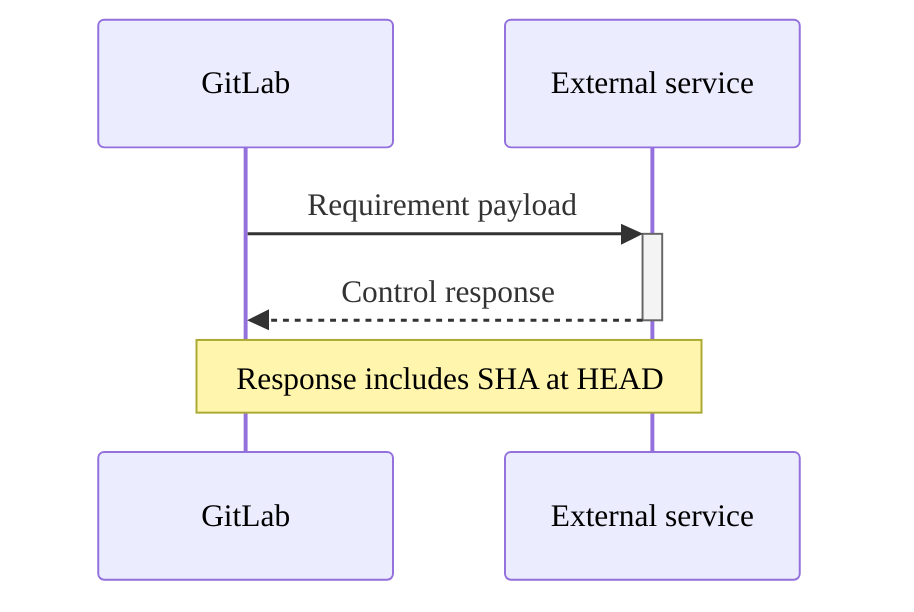



- Tier: Premium, Ultimate
- Offering: GitLab.com, GitLab Self-Managed, GitLab Dedicated



You can create a compliance framework that is a label to identify that your project has certain compliance
requirements or needs additional oversight.

In the Ultimate tier, the compliance framework can optionally enforce
[compliance pipeline configuration](../compliance_pipelines.md) and
[security policies](../../application_security/policies/enforcement/_index.md#scope) to the projects on which it is applied.

Compliance frameworks are created on top-level groups. If a project is moved outside of its existing top-level group,
its frameworks are removed.

You can apply up to 20 compliance frameworks to each project.

For a click-through demo, see [Custom Compliance frameworks](https://gitlab.navattic.com/custom-compliance).
<!-- Demo published on 2025-10-09 -->

## Prerequisites

- To create, edit, and delete compliance frameworks, users must have either:
  - The Owner role for the top-level group.
  - Be assigned a [custom role](../../custom_roles/_index.md) with the `admin_compliance_framework`
    [custom permission](../../custom_roles/abilities.md#compliance-management).
- To add or remove a compliance framework to or from a project, the group to which the project belongs must have a
  compliance framework.

## Create, edit, or delete a compliance framework

You can create, edit, or delete a compliance framework by using either a compliance frameworks report or a compliance projects report.

For more information on using a compliance frameworks report, see:

- [Create a new compliance framework](../compliance_center/compliance_frameworks_report.md#create-a-new-compliance-framework).
- [Edit a compliance framework](../compliance_center/compliance_frameworks_report.md#edit-a-compliance-framework).
- [Delete a compliance framework](../compliance_center/compliance_frameworks_report.md#delete-a-compliance-framework).

For more information on using a compliance projects report, see:

- [Create a new compliance framework](../compliance_center/compliance_projects_report.md#create-a-new-compliance-framework).
- [Edit a compliance framework](../compliance_center/compliance_projects_report.md#edit-a-compliance-framework).
- [Delete a compliance framework](../compliance_center/compliance_projects_report.md#delete-a-compliance-framework).
Subgroups and projects have access to all compliance frameworks created on their top-level group. However, compliance frameworks cannot be created, edited,
or deleted by using subgroups or projects. Project owners can choose a framework to apply to their projects.

## Apply a compliance framework to a project



- Applying multiple compliance frameworks [introduced](https://gitlab.com/groups/gitlab-org/-/epics/13294) in GitLab 17.3.
- Applying a compliance framework to a project through a compliance framework [introduced](https://gitlab.com/groups/gitlab-org/-/epics/16747) in GitLab 17.11.



You can apply multiple compliance frameworks to a project but cannot apply compliance frameworks to projects in personal namespaces.

To apply a compliance framework to a project, apply the compliance framework through the
[compliance projects report](../compliance_center/compliance_projects_report.md#apply-a-compliance-framework-to-projects-in-a-group).

You can use the [GraphQL API](../../../api/graphql/reference/_index.md#mutationprojectupdatecomplianceframeworks) to apply one or many
compliance frameworks to a project.

If you create compliance frameworks on subgroups with GraphQL, the framework is created on the root ancestor if the user
has the correct permissions. The GitLab UI presents a read-only view to discourage this behavior.

To apply a compliance framework to a project through a compliance framework:

1. On the left sidebar, select **Search or go to** and find your group. If you've [turned on the new navigation](../../interface_redesign.md#turn-new-navigation-on-or-off), this field is on the top bar.
1. Select **Secure** > **Compliance center**.
1. On the page, select the **Projects** tab.
1. Hover over a compliance framework, select the **Edit Framework** tab.
1. Select **Projects** section.
1. Select projects from the list.
1. Select **Update Framework**.

## Default compliance frameworks



- [Introduced](https://gitlab.com/gitlab-org/gitlab/-/issues/375036) in GitLab 15.6.



Group owners can set a default compliance framework. The default framework is applied to all the new and imported
projects that are created in that group. It does not affect the framework applied to the existing projects. The
default framework cannot be deleted.

A compliance framework that is set to default has a `default` label.

### Set and remove a default by using the compliance center

To set as default (or remove the default) from [compliance projects report](../compliance_center/compliance_projects_report.md):

1. On the left sidebar, select **Search or go to** and find your group. If you've [turned on the new navigation](../../interface_redesign.md#turn-new-navigation-on-or-off), this field is on the top bar.
1. Select **Secure** > **Compliance center**.
1. On the page, select the **Projects** tab.
1. Hover over a compliance framework, select the **Edit Framework** tab.
1. Select **Set as default**.
1. Select **Save changes**.

To set as default (or remove the default) from [compliance framework report](../compliance_center/compliance_frameworks_report.md):

1. On the left sidebar, select **Search or go to** and find your group. If you've [turned on the new navigation](../../interface_redesign.md#turn-new-navigation-on-or-off), this field is on the top bar.
1. Select **Secure** > **Compliance center**.
1. On the page, select the **Frameworks** tab.
1. Hover over a compliance framework, select the **Edit Framework** tab.
1. Select **Set as default**.
1. Select **Save changes**.

## Remove a compliance framework from a project

To remove a compliance framework from one or multiple project in a group, remove the compliance framework through the
[compliance projects report](../compliance_center/compliance_projects_report.md#remove-a-compliance-framework-from-projects-in-a-group).

## Import and export compliance frameworks



- [Introduced](https://gitlab.com/groups/gitlab-org/-/epics/16499) in GitLab 17.11.



Download existing compliance frameworks as JSON files and upload new frameworks from JSON templates.

A library of JSON templates is available from the
[Compliance Adherence Templates](https://gitlab.com/gitlab-org/software-supply-chain-security/compliance/engineering/compliance-adherence-templates) project.
Use these templates to quickly adopt predefined compliance frameworks.

### Export a compliance framework as a JSON file

With this feature, you can share and back up compliance frameworks.

To export a compliance framework from the compliance center:

1. On the left sidebar, select **Search or go to** and find your group. If you've [turned on the new navigation](../../interface_redesign.md#turn-new-navigation-on-or-off), this field is on the top bar.
1. Select **Secure** > **Compliance center**.
1. On the page, select the **Frameworks** tab.
1. Locate the compliance framework you wish to export.
1. Select the vertical ellipsis ().
1. Select **Export as JSON file**.

The JSON file is downloaded to your local system.

### Import a compliance framework from a JSON file

With this feature, you can use shared or backed up compliance frameworks. The JSON file must not have the same name as an existing compliance framework.

To import a compliance framework by using a JSON template:

1. On the left sidebar, select **Search or go to** and find your group. If you've [turned on the new navigation](../../interface_redesign.md#turn-new-navigation-on-or-off), this field is on the top bar.
1. Select **Secure** > **Compliance center**.
1. On the page, select the **Frameworks** tab.
1. Select **New framework**.
1. Select **Import framework**.
1. In the dialog that appears, select the JSON file from your local system.

If the import is successful, the new compliance framework appears in the list. Any errors are displayed for correction.

### JSON template structure and schema

Compliance framework JSON templates follow a specific schema structure that defines the framework metadata, requirements, and associated controls. Understanding this structure helps you create custom templates or modify existing ones to meet your organization's specific compliance needs.

#### Framework properties

Each JSON template contains the following top-level properties:

| Property | Type | Required | Description |
|----------|------|----------|-------------|
| `name` | String | Yes | The display name of the compliance framework. |
| `description` | String | Yes | A detailed description of the framework's purpose. |
| `color` | String | Yes | Hexadecimal color code for the framework (for example, `#1f75cb`). |
| `requirements` | Array | No | Array of requirement objects that define the compliance controls. |

#### Requirements structure

Each requirement in the `requirements` array contains:

| Property | Type | Required | Description |
|----------|------|----------|-------------|
| `name` | String | Yes | The name of the compliance requirement. |
| `description` | String | Yes | Detailed description of what the requirement enforces. |
| `controls` | Array | Yes | Array of control objects that implement the requirement. |

#### Control structure

Each control in the `controls` array defines a specific check:

| Property | Type | Required | Description |
|----------|------|----------|-------------|
| `name` | String | Yes | The GitLab control ID (for example, `scanner_sast_running`). |
| `control_type` | String | Yes | Always `"internal"` for GitLab controls. |
| `expression` | Object | Yes | Defines the evaluation logic for the control. |

#### Expression object

The `expression` object defines how the control is evaluated:

| Property | Type | Required | Description |
|----------|------|----------|-------------|
| `field` | String | Yes | The field name to evaluate (matches the control name). |
| `operator` | String | Yes | Comparison operator (`=`, `>=`, `<=`, `>`, `<`). |
| `value` | Mixed | Yes | Expected value (boolean, number, or string). |

#### Example JSON template structure

Here's a simplified example that shows the complete structure:

```json
{
  "name": "Example Compliance Framework",
  "description": "Example framework demonstrating JSON structure",
  "color": "#1f75cb",
  "requirements": [
    {
      "name": "Security Scanning Requirement",
      "description": "Ensure security scanning is enabled for all projects",
      "controls": [
        {
          "name": "scanner_sast_running",
          "control_type": "internal",
          "expression": {
            "field": "scanner_sast_running",
            "operator": "=",
            "value": true
          }
        },
        {
          "name": "minimum_approvals_required_2",
          "control_type": "internal",
          "expression": {
            "field": "minimum_approvals_required",
            "operator": ">=",
            "value": 2
          }
        }
      ]
    }
  ]
}
```

## Requirements



- Tier: Ultimate
- Offering: GitLab.com, GitLab Self-Managed, GitLab Dedicated





- [Introduced](https://gitlab.com/gitlab-org/gitlab/-/merge_requests/186525) in GitLab 17.11 [with a flag](../../../administration/feature_flags/_index.md) named `enable_standards_adherence_dashboard_v2`. Enabled by default.
- [Generally available](https://gitlab.com/gitlab-org/gitlab/-/issues/535563) in GitLab 18.3. Feature flag `enable_standards_adherence_dashboard_v2` removed.



In GitLab Ultimate, you can define specific **requirements** for a compliance framework. Requirements are made up of one
or more controls, which are checks against the configuration or behavior of projects that are assigned the framework. Each requirement has a maximum of five controls.

Each control includes logic that GitLab uses during scheduled or triggered scans to evaluate a project's adherence. For
more details on how adherence is tracked, see [Compliance status report](../compliance_center/compliance_status_report.md).

You can use GitLab compliance controls or external controls for framework requirements.

### GitLab compliance controls

GitLab compliance controls can be used in GitLab compliance frameworks. Controls are checks against the configuration or
behavior of projects that are assigned to a compliance framework.

Combine GitLab compliance controls to help you meet
[compliance standards](compliance_standards.md).

<!-- Updates to control names must be reflected also in compliance_standards.md -->

| Control name                                             | Control ID                                                 | Description |
|:---------------------------------------------------------|:-----------------------------------------------------------|:------------|
| API security running                                     | `scanner_api_security_running`                             | Ensures that [API security scanning](../../application_security/api_security/_index.md) is configured and running in the project's default branch pipeline. Requires a successful pipeline run. |
| At least one approval                                    | `minimum_approvals_required_1`                             | Ensures that merge requests [require at least one approvals](../../project/merge_requests/approvals/_index.md) before merging. |
| At least two approvals                                   | `minimum_approvals_required_2`                             | Ensures that merge requests [require at least two approvals](../../project/merge_requests/approvals/_index.md) before merging. |
| Auth SSO enabled                                         | `auth_sso_enabled`                                         | Ensures that [Single Sign-On (SSO) authentication](../../group/saml_sso/_index.md) is enabled for the project. |
| Author approved merge request is forbidden               | `merge_request_prevent_author_approval`                    | Ensures that the author of a merge request [cannot approve their own changes](../../project/merge_requests/approvals/_index.md). |
| Branch deletion disabled                                 | `branch_deletion_disabled`                                 | Ensures that [branches can't be deleted](../../project/repository/branches/protected.md). |
| CI/CD job token scope enabled                            | `cicd_job_token_scope_enabled`                             | Ensures that [CI/CD job token](../../../ci/jobs/ci_job_token.md) scope restrictions are enabled. |
| Code changes require code owners                         | `code_changes_requires_code_owners`                        | Ensures that code changes require approval from [code owners](../../project/codeowners/_index.md). |
| Code owner approval required                             | `code_owner_approval_required`                             | Ensures that [code owners file](../../project/codeowners/_index.md) is configured. |
| Code quality running                                     | `scanner_code_quality_running`                             | Ensures that [code quality scanning](../../../ci/testing/code_quality.md) is configured and running in the project's default branch pipeline. Requires a successful pipeline run. |
| Committers approved merge request is forbidden           | `merge_request_prevent_committers_approval`                | Ensures that users who have [committed to a merge request cannot approve it](../../project/merge_requests/approvals/_index.md). |
| Container scanning running                               | `scanner_container_scanning_running`                       | Ensures that [container scanning](../../application_security/container_scanning/_index.md) is configured and running in the project's default branch pipeline. Requires a successful pipeline run. |
| DAST running                                             | `scanner_dast_running`                                     | Ensures that [Dynamic Application Security Testing](../../application_security/dast/_index.md) (DAST) is configured and running in the project's default branch pipeline. Requires a successful pipeline run. |
| Default branch protected                                 | `default_branch_protected`                                 | Ensures that the default branch has [protection rules](../../project/repository/branches/protected.md) enabled. |
| Default branch protected from direct push                | `default_branch_protected_from_direct_push`                | [Prevents direct pushes to the default branch](../../project/repository/branches/protected.md). |
| Default branch users can merge                           | `default_branch_users_can_merge`                           | Controls [whether users can merge changes to the default branch](../../project/repository/branches/protected.md). |
| Default branch users can push                            | `default_branch_users_can_push`                            | Controls [whether users can push directly to the default branch](../../project/repository/branches/protected.md). |
| Dependency scanning running                              | `scanner_dep_scanning_running`                             | Ensures that [dependency scanning](../../application_security/dependency_scanning/_index.md) is configured and running in the project's default branch pipeline. Requires a successful pipeline run. **Note**: On GitLab Self-Managed instances (from 18.4), this control may fail when using [SBOM-based dependency scanning](../../application_security/dependency_scanning/dependency_scanning_sbom/_index.md) due to artifact differences. See [compatibility considerations](../../application_security/dependency_scanning/dependency_scanning_sbom/_index.md#compliance-framework-compatibility). |
| Ensure two administrators per repository                 | `ensure_2_admins_per_repo`                                 | Ensures that [at least two Owners](../../project/members/_index.md) are assigned to each project. |
| Error tracking enabled                                   | `error_tracking_enabled`                                   | Ensures that [error tracking](../../../operations/error_tracking.md) is enabled for the project. |
| Force push disabled                                      | `force_push_disabled`                                      | Prevents [force pushing](../../project/repository/branches/protected.md) to repositories. |
| Forks exist for the project                              | `has_forks`                                                | Ensures that the project has been [forked](../../project/repository/forking_workflow.md) |
| Fuzz testing running                                     | `scanner_fuzz_testing_running`                             | Ensures that [fuzz testing](../../application_security/coverage_fuzzing/_index.md) is configured and running in the project's default branch pipeline. Requires a successful pipeline run. |
| GitLab license level Ultimate                            | `gitlab_license_level_ultimate`                            | Ensures that the GitLab instance is using an [Ultimate license](https://about.gitlab.com/pricing/feature-comparison/). |
| Has valid CI/CD configuration                            | `has_valid_ci_config`                                      | Ensures that the project has a [valid CI/CD configuration](../../../ci/yaml/_index.md). |
| IaC scanning running                                     | `scanner_iac_running`                                      | Ensures [Infrastructure as Code (IaC) scanning](../../application_security/iac_scanning/_index.md) is configured and running in the project's default branch pipeline. Requires a successful pipeline run. |
| Internal visibility is forbidden                         | `project_visibility_not_internal`                          | Ensures that projects are not set to [internal visibility](../../public_access.md). |
| Issue tracking enabled                                   | `issue_tracking_enabled`                                   | Ensures that [issue tracking](../../project/issues/_index.md) is enabled for the project. |
| License compliance running                               | `scanner_license_compliance_running`                       | Ensures that [license compliance scanning](../license_approval_policies.md) is configured and running in the project's default branch pipeline. Requires a successful pipeline run. |
| Merge request commit resets approvals                    | `merge_request_commit_reset_approvals`                     | Ensures that [new commits to merge requests reset approvals](../../project/merge_requests/approvals/settings.md). |
| Merge requests approval rules prevent editing            | `merge_requests_approval_rules_prevent_editing`            | Ensures that [merge request approval rules](../../project/merge_requests/approvals/settings.md) can't be edited. |
| Merge requests require code owner approval               | `merge_requests_require_code_owner_approval`               | Ensures that merge requests require approval from [code owners](../../project/codeowners/_index.md). |
| More members than admins                                 | `more_members_than_admins`                                 | Ensures fewer Administrators [(Owners or Maintainers)](../../project/members/_index.md) are assigned to the project than total members. |
| Package Hunter no findings untriaged                     | `package_hunter_no_findings_untriaged`                     | Ensures that all [Package Hunter](../../application_security/triage/_index.md) findings are triaged. |
| Project not archived                                     | `project_archived`                                         | Checks whether the [project is archived](../../project/settings/_index.md). Typically `false` is compliant. |
| Project not marked for deletion                          | `project_marked_for_deletion`                              | Checks whether the [project is marked for deletion](../../project/settings/_index.md). `false` is compliant. |
| Project pipelines not public                             | `project_pipelines_not_public`                             | Ensures that [project pipelines are not publicly visible](../../../ci/pipelines/settings.md). |
| Project repository exists                                | `project_repo_exists`                                      | Ensures that a [Git repository](../../../topics/git/_index.md) exists for the project. |
| Project visibility not public                            | `project_visibility_not_public`                            | Ensures that projects are not set to [public visibility](../../public_access.md). |
| Protected branches exist                                 | `protected_branches_set`                                   | Ensures that project contains [protected branches](../../project/repository/branches/protected.md). |
| Push protection enabled                                  | `push_protection_enabled`                                  | Ensures that [push protection](../../project/repository/push_rules.md) is enabled for sensitive files. |
| Require branch up to date                                | `require_branch_up_to_date`                                | Ensures that the [source branch is up to date with the target branch before merging](../../project/merge_requests/methods/_index.md). |
| Require linear history                                   | `require_linear_history`                                   | Ensures a [linear commit history](../../project/merge_requests/methods/_index.md#fast-forward-merge) by forbidding merge commits. |
| Require MFA at organization level                        | `require_mfa_at_org_level`                                 | Ensures that [multi-factor authentication](../../profile/account/two_factor_authentication.md) is required at the organization level. |
| Require MFA for contributors                             | `require_mfa_for_contributors`                             | Ensures that [contributors have multi-factor authentication enabled](../../profile/account/two_factor_authentication.md). |
| Requires signed commits                                  | `require_signed_commits`                                   | Ensures that [signed commits](../../project/repository/signed_commits) are required. |
| Reset approvals on push                                  | `reset_approvals_on_push`                                  | Ensures that [approvals are reset when new commits are pushed](../../project/merge_requests/approvals/settings.md) to the merge request. |
| Resolve discussions required                             | `resolve_discussions_required`                             | Ensures that all [discussions must be resolved](../../discussions/_index.md) before merging is allowed. |
| Restrict push/merge access                               | `restrict_push_merge_access`                               | Restricts who can push to or merge into [protected branches](../../project/repository/branches/protected.md). |
| Restricted build access                                  | `restricted_build_access`                                  | Ensures [restricted access to build artifacts and pipeline outputs](../../../ci/pipelines/settings.md). |
| Review and archive stale repositories                    | `review_and_archive_stale_repos`                           | Ensures that stale repositories are reviewed and [archived](../../project/settings/_index.md). |
| Review and remove inactive users                         | `review_and_remove_inactive_users`                         | Ensures that [inactive users](../../../administration/admin_area.md) are reviewed and removed. |
| SAST running                                             | `scanner_sast_running`                                     | Ensures that [static application security testing](../../application_security/sast/_index.md) (SAST) is configured and running in the project's default branch pipeline. Requires a successful pipeline run. |
| Secret detection running                                 | `scanner_secret_detection_running`                         | Ensures that [secret detection scanning](../../application_security/secret_detection/_index.md) is configured and running in the project's default branch pipeline. Requires a successful pipeline run. |
| Secure webhooks                                          | `secure_webhooks`                                          | Ensures that [webhooks](../../project/integrations/webhooks.md) are securely configured. |
| Stale branch cleanup enabled                             | `stale_branch_cleanup_enabled`                             | Ensures that [automatic cleanup of stale branches](../../project/repository/branches/_index.md) is enabled. |
| Status checks required                                   | `status_checks_required`                                   | Ensures that [status checks](../../project/merge_requests/status_checks.md) must pass before merging is allowed. |
| Status page configured                                   | `status_page_configured`                                   | Ensures that a [status page](../../../operations/incident_management/status_page.md) is configured for the project. |
| Strict Permission for Repository                         | `strict_permissions_for_repo`                              | Ensures that [strict permissions](../../permissions.md) are set for repository access. |
| Terraform enabled                                        | `terraform_enabled`                                        | Ensures that the [Terraform integration](../../../administration/terraform_state.md) is enabled for the project. |
| User-defined CI/CD variables restricted to maintainers   | `project_user_defined_variables_restricted_to_maintainers` | Ensures that only users with the maintainer role or higher can pass [user-defined variables when triggering pipelines](../../../ci/variables/_index.md). |
| Vulnerabilities SLO days over threshold                  | `vulnerabilities_slo_days_over_threshold`                  | Ensures that [vulnerabilities are addressed](../../application_security/vulnerabilities/_index.md) inside SLO thresholds (180 days). |

### External controls



- External control name [introduced](https://gitlab.com/gitlab-org/gitlab/-/merge_requests/192177) in GitLab 18.1.



External controls are API calls to external systems that request the status of an external control or requirement.

You can create a external control that sends data to third-party tools.

When the [compliance scans](../compliance_center/compliance_status_report.md#scan-timing-and-triggers) are run, GitLab sends a notification. The users or automated workflows can then update the status of control from outside of GitLab.

With this integration, you can integrate with third-party workflow tools, like ServiceNow, or the custom tool of your choice. The third-party tool
responds with an associated status. This status is then displayed in the [Compliance status report](../compliance_center/compliance_status_report.md).

You can configure external controls for each individual project. External controls are not shared between projects.
Status checks fail if an external control stays in the pending state for more than six hours.

#### Add external controls

To add an external control when creating or editing a framework:

1. On the left sidebar, select **Search or go to** and find your group. If you've [turned on the new navigation](../../interface_redesign.md#turn-new-navigation-on-or-off), this field is on the top bar.
1. Select **Secure** > **Compliance center**.
1. On the page, select the **Frameworks** tab.
1. Select **New framework** or edit an existing one.
1. In the **Requirements** section, select **New requirement**.
1. Select **Add an external control**.
1. In the fields edit **External Control Name**, **External URL** and **`HMAC` shared secret**.
1. Optional. Turn off the **Ping enabled** toggle to control whether GitLab sends notifications to the external service during compliance scans.
1. Select **Save changes to the framework** to save the requirement.

#### Ping enabled setting



- [Introduced](https://gitlab.com/gitlab-org/gitlab/-/issues/538898) in GitLab 18.5.



The **Ping enabled** setting controls whether GitLab requests external control status updates from external systems every 12 hours.

- Enabled (default): GitLab automatically sends HTTP requests to the external service URL every 12 hours and updates the external control status based on the response.
- Disabled: GitLab does not send notifications to the external service and the external control displays a **Disabled** badge in the compliance framework UI. To request
  the status of an external control, you must manually use the [External Controls API](../../../api/external_controls.md).

#### External control lifecycle

External controls have an **asynchronous** workflow. [Compliance scans](../compliance_center/compliance_status_report.md#scan-timing-and-triggers) emit a payload to an external service whenever.



After the payload is received, the external service can run any required processes. The external service can then post
its response back to the merge request by using the REST API.

External controls can have one of three statuses.

| Status    | Description |
|:----------|:------------|
| `pending` | Default status. No response received from the external service. |
| `pass`  | Response received from the external service and the external control was approved by the external service. |
| `fail`  | Response received from the external service and the external control was denied by the external service. |

If something changes outside of GitLab, you can set the [status of an external control by using the API](../../../api/external_controls.md). You don't need to wait for a payload to be sent first.

### Add requirements

To add a requirement when creating or editing a framework:

1. On the left sidebar, select **Search or go to** and find your group. If you've [turned on the new navigation](../../interface_redesign.md#turn-new-navigation-on-or-off), this field is on the top bar.
1. Select **Secure** > **Compliance center**.
1. On the page, select the **Frameworks** tab.
1. Select **New framework** or edit an existing one.
1. In the **Requirements** section, select **New requirement**.
1. In the dialog add **Name** and **Description**.
1. Select **Add a GitLab control** to add more controls.
1. In the control dropdown list search and select a control.
1. Select **Save changes to the framework** to save the requirement.

### Edit requirements

To edit a requirement when creating or editing a framework:

1. On the left sidebar, select **Search or go to** and find your group. If you've [turned on the new navigation](../../interface_redesign.md#turn-new-navigation-on-or-off), this field is on the top bar.
1. Select **Secure** > **Compliance center**.
1. On the page, select the **Frameworks** tab.
1. Select **New framework** or edit an existing one.
1. In the **Requirements** section, select **Action** > **Edit**.
1. In the dialog edit **Name** and **Description**.
1. Select **Add a GitLab control** to add more controls.
1. In the control dropdown list search and select a control.
1. Select  to remove a control.
1. Select **Save changes to the framework** to save the requirement.

## Troubleshooting

When working with compliance frameworks, you might encounter the following issues.

### Error: `Unable to determine the correct upload URL`

You will encounter this error during a [compliance framework import](#import-a-compliance-framework-from-a-json-file) if a compliance framework already exists with the same name as
the JSON template.
