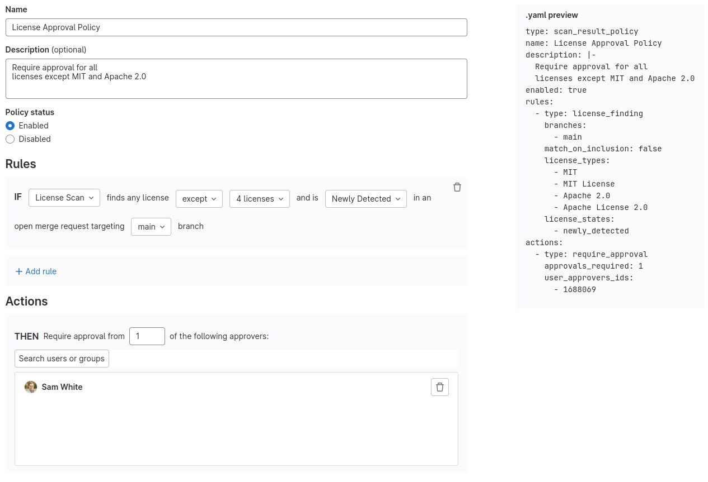
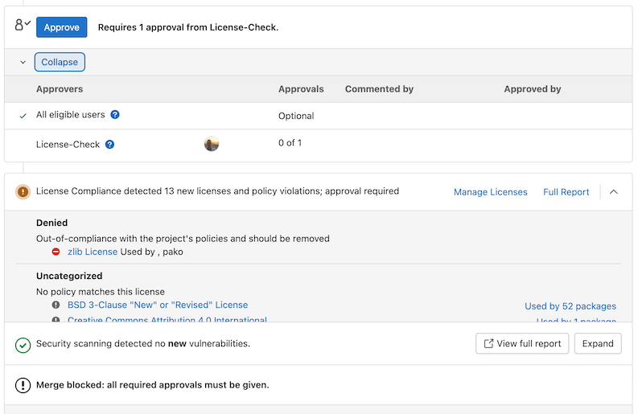

DETAILS:
**Tier:** Ultimate
**Offering:** GitLab.com, GitLab Self-Managed, GitLab Dedicated

> - [Introduced](https://gitlab.com/groups/gitlab-org/-/epics/8092) in GitLab 15.9 [with a flag](../../administration/feature_flags.md) named `license_scanning_policies`.
> - [Generally available](https://gitlab.com/gitlab-org/gitlab/-/issues/397644) in GitLab 15.11. Feature flag `license_scanning_policies` removed.

Use license approval policies to specify criteria that determines when approval is required before a merge request can be merged.

NOTE:
License approval policies are applicable to [protected](../project/repository/branches/protected.md) target branches only.

The following video provides an overview of these policies.

  See the video: <a href="https://www.youtube.com/watch?v=34qBQ9t8qO8">Overview of GitLab License Approval Policies</a>.

<figure class="video-container">
  <iframe src="https://www.youtube-nocookie.com/embed/34qBQ9t8qO8" frameborder="0" allowfullscreen> </iframe>
</figure>

## Prerequisites to creating a new license approval policy

License approval policies rely on the output of a dependency scanning job to verify that requirements have been met. If dependency scanning has not been properly configured, and therefore no dependency scanning jobs ran related to an open MR, the policy has no data with which to verify the requirements. When security policies are missing data for evaluation, by default they fail closed and assume the merge request could contain vulnerabilities. You can opt out of the default behavior with the `fallback_behavior` property and set policies to fail open. A policy that fails open has all invalid and unenforceable rules unblocked.

To ensure enforcement of your policies, you should enable dependency scanning on your target development projects. You can achieve this a few different ways:

- Create a global [scan execution policy](../application_security/policies/scan_execution_policies.md) that enforces Dependency Scanning to run in all target development projects.
- Use a [Compliance Pipeline](../group/compliance_frameworks.md) to define a Dependency Scanning job that is enforced on projects enforced by a given Compliance Framework.
- Work with development teams to configure [Dependency Scanning](../application_security/dependency_scanning/_index.md) in each of their project's `.gitlab-ci.yml` files or enable by using the [Security Configuration panel](../application_security/configuration/_index.md).

License approval policies require license information from [GitLab-supported packages](license_scanning_of_cyclonedx_files/_index.md#supported-languages-and-package-managers).

## Create a new license approval policy

Create a license approval policy to enforce license compliance.

To create a license approval policy:

1. [Link a security policy project](../application_security/policies/_index.md#policy-implementation) to your development group, subgroup, or project (the Owner role is required).
1. On the left sidebar, select **Search or go to** and find your project.
1. Select **Secure > Policies**.
1. Create a new [Merge request approval Policy](../application_security/policies/merge_request_approval_policies.md).
1. In your policy rule, select **License scanning**.

## Criteria defining which licenses require approval

The following types of criteria can be used to determine which licenses are "approved" or "denied" and require approval.

- When any license in a list of explicitly prohibited licenses is detected.
- When any license is detected except for licenses that have been explicitly listed as acceptable.

## Criteria to compare licenses detected in the merge request branch to licenses in the default branch

The following types of criteria can be used to determine whether or not approval is required based on the licenses that exist in the default branch:

- Denied licenses can be configured to only require approval if the denied license is part of a dependency that does not already exist in the default branch.
- Denied licenses can be configured to require approval if the denied license exists in any component that already exists in the default branch.

If a license is found that violates the license approval policy, it blocks the merge request and instructs the developer to remove it. Note, the merge request is not able to be merged until the `denied` license is removed unless an eligible approver for the License Approval Policy approves the merge request.

## Troubleshooting

### The License Compliance widget is stuck in a loading state

A loading spinner is displayed in the following scenarios:

- While the pipeline is in progress.
- If the pipeline is complete, but still parsing the results in the background.
- If the license scanning job is complete, but the pipeline is still running.

The License Compliance widget polls every few seconds for updated results. When the pipeline is complete, the first poll after pipeline completion triggers the parsing of the results. This can take a few seconds depending on the size of the generated report.

The final state is when a successful pipeline run has been completed, parsed, and the licenses displayed in the widget.

### License approval policies block merge requests due to `unknown` licenses

License approval policies may block merge requests due to `unknown` licenses in certain scenarios. This can happen in
any of the following situations:

- The dependency scanning job fails to identify a license for a particular component.
- A new or uncommon license is used that is not recognized by the scanning tool.
- The license information is missing or incomplete in the component's metadata.

To address this issue:

1. Review the **Licenses** tab in the pipeline page to identify which components have `unknown` licenses or review `out-of-policy` licenses generated by the GitLab Security Bot.
1. Manually investigate these components to determine their actual licenses.
1. If the licenses cannot be determined or are not acceptable, consider removing or replacing the affected components.

If you need to temporarily allow merging with `unknown` licenses:

1. Edit your license approval policy.
1. Add `unknown` to the list of allowed licenses.
1. After addressing the issue, remember to remove `unknown` from the allowed licenses list to maintain proper license compliance.

We are planning enhancements to allow for excluding licenses only for specific packages in [epic 10203](https://gitlab.com/groups/gitlab-org/-/epics/10203).

Always consult with your legal team when dealing with license compliance issues, especially when handling `unknown` licenses.
