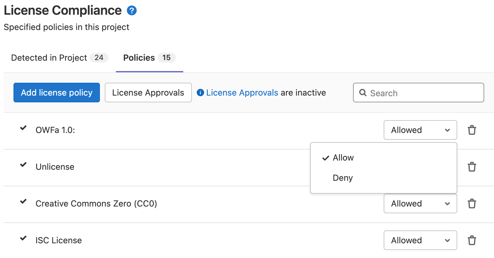
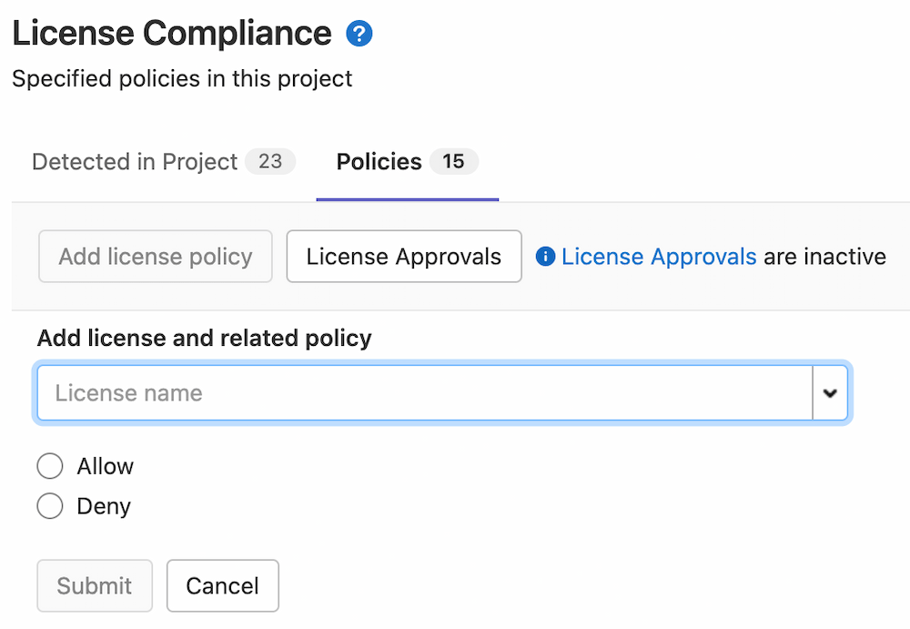
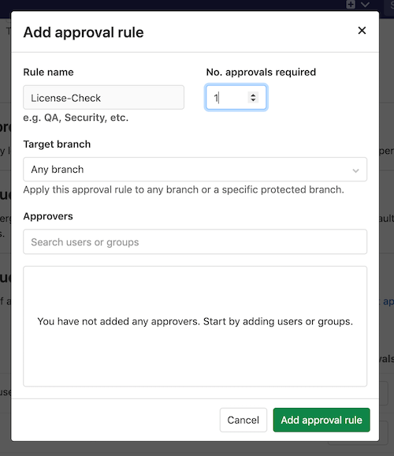

# License Check Policies (deprecated) **(ULTIMATE)**

> [Deprecated](https://gitlab.com/gitlab-org/gitlab/-/issues/390417) in GitLab 15.9.

WARNING:
This feature was [deprecated](https://gitlab.com/gitlab-org/gitlab/-/issues/390417) in GitLab 15.9. Users should migrate over to use [License Approval Policies](license_approval_policies.md) prior to GitLab 16.0.

License check policies allow you to specify licenses that are `allowed` or `denied` in a project. If a `denied`
license is newly committed it blocks the merge request and instructs the developer to remove it.
Note, the merge request is not able to be merged until the `denied` license is removed.
You may add a [`License-Check` approval rule](#enabling-license-approvals-within-a-project),
which enables a designated approver that can approve and then merge a merge request with `denied` license.

These policies can be configured by using the [Managed Licenses API](../../api/managed_licenses.md).

The **Policies** tab in the project's license compliance section displays your project's license
policies. Project maintainers can specify policies in this section.

Developers of the project can view the policies configured in a project.

## Enabling License Approvals within a project

Prerequisites:

- Maintainer or Owner role.

`License-Check` is a [merge request approval](../project/merge_requests/approvals/index.md) rule
you can enable to allow an individual or group to approve a merge request that contains a `denied`
license.

You can enable `License-Check` one of two ways:

1. On the top bar, select **Main menu > Projects** and find your project.
1. On the left sidebar, select **Settings > General**.
1. Expand **Merge request approvals**.
1. Select **Enable** or **Edit**.
1. Add or change the **Rule name** to `License-Check` (case sensitive).

- Create an approval group in the [project policies section for License Compliance](license_check_rules.md#license-check-policies-deprecated).
  You must set this approval group's number of approvals required to greater than zero. After you
  enable this group in your project, the approval rule is enabled for all merge requests.

Any code changes cause the approvals required to reset.

An approval is required when a license report:

- Contains a dependency that includes a software license that is `denied`.
- Is not generated during pipeline execution.

An approval is optional when a license report:

- Contains no software license violations.
- Contains only new licenses that are `allowed` or unknown.

## Troubleshooting

### The License Compliance widget is stuck in a loading state

A loading spinner is displayed in the following scenarios:

- While the pipeline is in progress.
- If the pipeline is complete, but still parsing the results in the background.
- If the license scanning job is complete, but the pipeline is still running.

The License Compliance widget polls every few seconds for updated results. When the pipeline is complete, the first poll after pipeline completion triggers the parsing of the results. This can take a few seconds depending on the size of the generated report.

The final state is when a successful pipeline run has been completed, parsed, and the licenses displayed in the widget.
