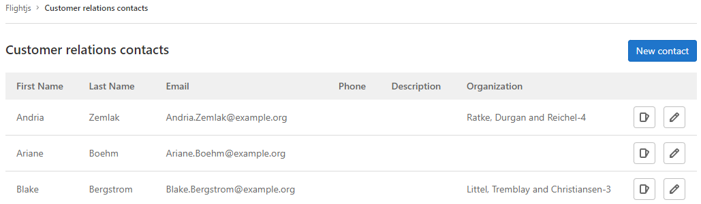
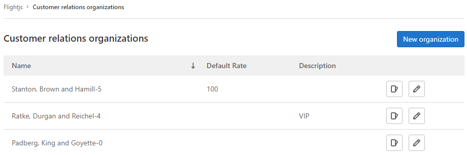

DETAILS:
**Tier:** Free, Premium, Ultimate
**Offering:** GitLab.com, GitLab Self-Managed, GitLab Dedicated

> - [Introduced](https://gitlab.com/gitlab-org/gitlab/-/issues/2256) in GitLab 14.6 [with a flag](../../administration/feature_flags.md) named `customer_relations`. Disabled by default.
> - In GitLab 14.8 and later, you can [create contacts and organizations only in top-level groups](https://gitlab.com/gitlab-org/gitlab/-/issues/350634).
> - [Enabled on GitLab.com and GitLab Self-Managed](https://gitlab.com/gitlab-org/gitlab/-/issues/346082) in GitLab 15.0.
> - [Feature flag removed](https://gitlab.com/gitlab-org/gitlab/-/issues/346082) in GitLab 15.1.
> - [Changed](https://gitlab.com/gitlab-org/gitlab/-/merge_requests/169256) the minimum user role from Reporter to Planner in GitLab 17.7.

NOTE:
This feature is not under active development, but
[community contributions](https://about.gitlab.com/community/contribute/) are welcome.
To determine if the feature meets your needs, see the open issues in the [Managing and billing Clients Epic](https://gitlab.com/groups/gitlab-org/-/epics/5323).

With customer relations management (CRM) you can create a record of contacts
(individuals) and organizations (companies) and relate them to issues.

By default, contacts and organizations can only be created for top-level groups.
To create contacts and organizations in other groups, [assign the group as a contact source](#configure-the-contact-source).

You can use contacts and organizations to tie work to customers for billing and reporting purposes.
For more information about what is planned for the future, see [issue 2256](https://gitlab.com/gitlab-org/gitlab/-/issues/2256).

## Permissions

| Permission                         | Guest | Planner | Group Reporter | Group Developer, Maintainer, and Owner |
|------------------------------------|-------|---------|----------------|----------------------------------------|
| View contacts/organizations        |       | ✓       | ✓              | ✓                                      |
| View issue contacts                |       | ✓       | ✓              | ✓                                      |
| Add/remove issue contacts          |       | ✓       | ✓              | ✓                                      |
| Create/edit contacts/organizations |       |         |                | ✓                                      |

## Enable customer relations management (CRM)

> - [Enabled by default](https://gitlab.com/gitlab-org/gitlab/-/merge_requests/108378) in GitLab 16.9.

Customer relations management features are enabled at the group level. If your
group also contains subgroups, and you want to use CRM features in the subgroup,
CRM features must also be enabled for the subgroup.

To enable customer relations management in a group or subgroup:

1. On the left sidebar, select **Search or go to** and find your group or subgroup.
1. Select **Settings > General**.
1. Expand the **Permissions and group features** section.
1. Select **Customer relations is enabled**.
1. Select **Save changes**.

## Configure the contact source

> - [Available](https://gitlab.com/gitlab-org/gitlab/-/merge_requests/167475) in GitLab 17.6.

By default, contacts are sourced from an issue's top-level group.

The contact source for a group will apply to all subgroups,
unless they have a contact source configured.

To configure the contact source for a group or subgroup:

1. On the left sidebar, select **Search or go to** and find your group or subgroup.
1. Select **Settings > General**.
1. Expand the **Permissions and group features** section.
1. Select **Contact source > Search for a group**.
1. Select the group from which you wish to source contacts.
1. Select **Save changes**.

## Contacts

### View contacts linked to a group

Prerequisites:

- You must have at least the Planner role for the group.

To view a group's contacts:

1. On the left sidebar, select **Search or go to** and find your group.
1. Select **Plan > Customer relations**.



### Create a contact

Prerequisites:

- You must have at least the Developer role for the group.

To create a contact:

1. On the left sidebar, select **Search or go to** and find your group.
1. Select **Plan > Customer relations**.
1. Select **New contact**.
1. Complete all required fields.
1. Select **Create new contact**.

You can also [create](../../api/graphql/reference/_index.md#mutationcustomerrelationscontactcreate)
contacts using the GraphQL API.

### Edit a contact

Prerequisites:

- You must have at least the Developer role for the group.

To edit an existing contact:

1. On the left sidebar, select **Search or go to** and find your group.
1. Select **Plan > Customer relations**.
1. Next to the contact you wish to edit, select **Edit** (**{pencil}**).
1. Edit the required fields.
1. Select **Save changes**.

You can also [edit](../../api/graphql/reference/_index.md#mutationcustomerrelationscontactupdate)
contacts using the GraphQL API.

#### Change the state of a contact

Each contact can be in one of two states:

- **Active**: contacts in this state can be added to an issue.
- **Inactive**: contacts in this state cannot be added to an issue.

To change the state of a contact:

1. On the left sidebar, select **Search or go to** and find your group.
1. Select **Plan > Customer relations**.
1. Next to the contact you wish to edit, select **Edit** (**{pencil}**).
1. Select or clear the **Active** checkbox.
1. Select **Save changes**.

## Organizations

### View organizations

Prerequisites:

- You must have at least the Planner role for the group.

To view a group's organizations:

1. On the left sidebar, select **Search or go to** and find your group.
1. Select **Plan > Customer relations**.
1. In the upper right, select **Organizations**.



### Create an organization

Prerequisites:

- You must have at least the Developer role for the group.

To create an organization:

1. On the left sidebar, select **Search or go to** and find your group.
1. Select **Plan > Customer relations**.
1. In the upper right, select **Organizations**.
1. Select **New organization**.
1. Complete all required fields.
1. Select **Create new organization**.

You can also [create](../../api/graphql/reference/_index.md#mutationcustomerrelationsorganizationcreate)
organizations using the GraphQL API.

### Edit an organization

Prerequisites:

- You must have at least the Developer role for the group.

To edit an existing organization:

1. On the left sidebar, select **Search or go to** and find your group.
1. Select **Plan > Customer relations**.
1. In the upper right, select **Organizations**.
1. Next to the organization you wish to edit, select **Edit** (**{pencil}**).
1. Edit the required fields.
1. Select **Save changes**.

You can also [edit](../../api/graphql/reference/_index.md#mutationcustomerrelationsorganizationupdate)
organizations using the GraphQL API.

## Issues

If you use [Service Desk](../project/service_desk/_index.md) and create issues from emails,
issues are linked to contacts matching the email addresses in the sender and CC of the email.

### View issues linked to a contact

Prerequisites:

- You must have at least the Planner role for the group.

To view a contact's issues, select a contact from the issue sidebar, or:

1. On the left sidebar, select **Search or go to** and find your group.
1. Select **Plan > Customer relations**.
1. Next to the contact whose issues you wish to view, select **View issues** (**{issues}**).

### View issues linked to an organization

Prerequisites:

- You must have at least the Planner role for the group.

To view an organization's issues:

1. On the left sidebar, select **Search or go to** and find your group.
1. Select **Plan > Customer relations**.
1. In the upper right, select **Organizations**.
1. Next to the organization whose issues you wish to view, select **View issues** (**{issues}**).

### View contacts linked to an issue

Prerequisites:

- You must have at least the Planner role for the group.

You can view contacts associated with an issue in the right sidebar.

To view a contact's details, hover over the contact's name.


You can also view issue contacts using the
[GraphQL](../../api/graphql/reference/_index.md#mutationcustomerrelationsorganizationcreate)
API.

### Add contacts to an issue

Prerequisites:

- You must have at least the Planner role for the group.

To add [active](#change-the-state-of-a-contact) contacts to an issue use the `/add_contacts [contact:address@example.com]`
[quick action](../project/quick_actions.md).

You can also add, remove, or replace issue contacts using the
[GraphQL](../../api/graphql/reference/_index.md#mutationissuesetcrmcontacts)
API.

### Remove contacts from an issue

Prerequisites:

- You must have at least the Planner role for the group.

To remove contacts from an issue use the `/remove_contacts [contact:address@example.com]`
[quick action](../project/quick_actions.md).

You can also add, remove, or replace issue contacts using the
[GraphQL](../../api/graphql/reference/_index.md#mutationissuesetcrmcontacts)
API.

## Autocomplete contacts

> - [Introduced](https://gitlab.com/gitlab-org/gitlab/-/issues/2256) in GitLab 14.8 [with a flag](../../administration/feature_flags.md) named `contacts_autocomplete`. Disabled by default.
> - [Enabled on GitLab.com and GitLab Self-Managed](https://gitlab.com/gitlab-org/gitlab/-/issues/352123) in GitLab 15.0.
> - [Generally available](https://gitlab.com/gitlab-org/gitlab/-/issues/352123) in GitLab 15.2. [Feature flag `contacts_autocomplete`](https://gitlab.com/gitlab-org/gitlab/-/issues/352123) removed.

When you use the `/add_contacts` quick action, follow it with `[contact:` and an autocomplete list with the [active](#change-the-state-of-a-contact) contacts appears:

```plaintext
/add_contacts [contact:
```

When you use the `/remove_contacts` quick action, follow it with `[contact:` and an autocomplete list with the contacts added to the issue appears:

```plaintext
/remove_contacts [contact:
```

## Moving objects with CRM entries

When you move an issue or project and the **parent group contact source matches**,
issues retain their contacts.

When you move an issue or project and the **parent group contact source changes**,
issues lose their contacts.

When you move a group with a [contact source configured](#configure-the-contact-source)
or it's **contact source remains unchanged**,
issues retain their contacts.

When you move a group and its **contact source changes**:

- All unique contacts and organizations are migrated to the new top-level group.
- Contacts that already exist (by email address) are deemed duplicates and deleted.
- Organizations that already exist (by name) are deemed duplicates and deleted.
- All issues retain their contacts or are updated to point at contacts with the same email address.

If you do not have permission to create contacts and organizations in the new
top-level group, the group transfer fails.
