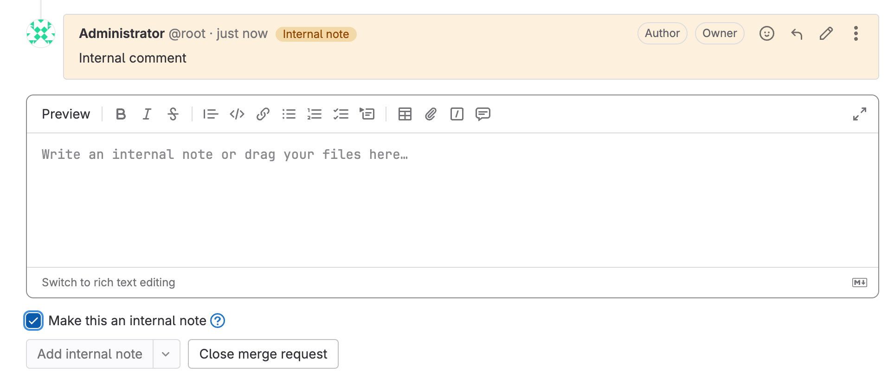
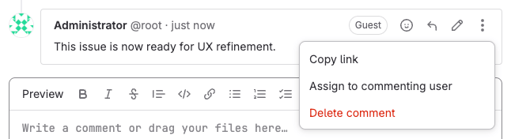
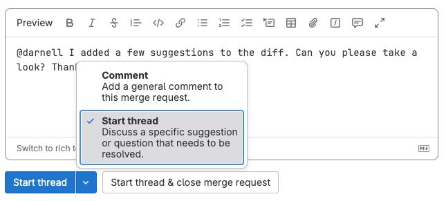

DETAILS:
**Tier:** Free, Premium, Ultimate
**Offering:** GitLab.com, GitLab Self-Managed, GitLab Dedicated

> - Paginated merge request discussions [introduced](https://gitlab.com/gitlab-org/gitlab/-/issues/340172) in GitLab 15.1 [with a flag](../../administration/feature_flags.md) named `paginated_mr_discussions`. Disabled by default.
> - Paginated merge request discussions [enabled on GitLab.com](https://gitlab.com/gitlab-org/gitlab/-/issues/364497) in GitLab 15.2.
> - Paginated merge request discussions [enabled on GitLab Self-Managed](https://gitlab.com/gitlab-org/gitlab/-/issues/364497) in GitLab 15.3.
> - Paginated merge request discussions [generally available](https://gitlab.com/gitlab-org/gitlab/-/issues/370075) in GitLab 15.8. Feature flag `paginated_mr_discussions` removed.
> - Comments and threads on Wiki pages [introduced](https://gitlab.com/groups/gitlab-org/-/epics/14461) in GitLab 17.7 [with a flag](../../administration/feature_flags.md) named `wiki_comments`. Disabled by default.

GitLab encourages communication through comments, threads, and
[suggesting changes for code](../project/merge_requests/reviews/suggestions.md).
Comments support [Markdown](../markdown.md) and [quick actions](../project/quick_actions.md).

Two types of comments are available:

- A standard comment.
- A comment in a thread, which you can [resolve](../project/merge_requests/_index.md#resolve-a-thread).

You can [suggest code changes](../project/merge_requests/reviews/suggestions.md) in your commit diff comment,
which the user can accept through the user interface.

## Places you can add comments

You can create comments in places like:

- Commit diffs.
- Commits.
- Designs.
- Epics.
- Issues.
- Merge requests.
- Snippets.
- Tasks.
- OKRs.
- Wiki pages. The `wiki_comments` feature flag must be enabled. For more information, see the history.

Each object can have as many as 5,000 comments.

## Mentions

You can mention a user or a group (including [subgroups](../group/subgroups/_index.md#mention-subgroups)) in your GitLab
instance with `@username` or `@groupname`. GitLab notifies all mentioned users with to-do items and emails.
Users can change this setting for themselves in the [notification settings](../profile/notifications.md).

You can quickly see which comments involve you, because GitLab highlights
mentions for yourself (the current, authenticated user) in a different color.

### Mentioning all members

> - [Flag](../../administration/feature_flags.md) named `disable_all_mention` [introduced](https://gitlab.com/gitlab-org/gitlab/-/merge_requests/110586) in GitLab 16.1. Disabled by default. [Enabled on GitLab.com](https://gitlab.com/gitlab-org/gitlab/-/issues/18442).

FLAG:
The availability of this feature is controlled by a feature flag.
For more information, see the history.

Avoid mentioning `@all` in comments and descriptions. `@all` mentions more than
just the participants of the project, issue, or merge request, but all members
of that project's parent group. All these users receive an email notification
and a to-do item, and might interpret it as spam.

When you enable this feature flag, typing `@all` in comments and descriptions
results in plain text instead of mentioning all users.
When you disable this feature, existing `@all` mentions in the Markdown texts are unchanged,
and remain as links. Only future `@all` mentions appear as plain text.

Notifications and mentions can be disabled in
[a group's settings](../group/manage.md#disable-email-notifications).

### Mention a group in an issue or merge request

When you mention a group in a comment, every member of the group gets a to-do item
added to their to-do list.

1. On the left sidebar, select **Search or go to** and find your project.
1. For merge requests, select **Code > Merge requests**, and find your merge request.
1. For issues, select **Plan > Issues**, and find your issue.
1. In a comment, type `@` followed by the user, group, or subgroup namespace.
   For example, `@alex`, `@alex-team`, or `@alex-team/marketing`.
1. Select **Comment**.

GitLab creates a to-do item for all the group and subgroup members.

For more information on mentioning subgroups, see [Mention subgroups](../group/subgroups/_index.md#mention-subgroups).

## Add a comment to a merge request diff

When you add comments to a merge request diff, these comments persist, even when you:

- Force-push after a rebase.
- Amend a commit.

To add a commit diff comment:

1. On the left sidebar, select **Search or go to** and find your project.
1. Select **Code > Merge requests**, and find your merge request.
1. Select the **Commits** tab, then select the commit message.
1. By the line you want to comment on, hover over the line number and select **Comment** (**{comment}**).
   You can select multiple lines by dragging the **Comment** (**{comment}**) icon.
1. Enter your comment.
1. To add your comment immediately, select **Add comment now**, or use the keyboard shortcut:
   - macOS: <kbd>Shift</kbd> + <kbd>Command</kbd> + <kbd>Enter</kbd>
   - All other OSes: <kbd>Shift</kbd> + <kbd>Control</kbd> + <kbd>Enter</kbd>
1. To leave your comment unpublished until you finish a review, select **Start a review**, or use the keyboard shortcut:
   - macOS: <kbd>Command</kbd> + <kbd>Enter</kbd>
   - All other OSes: <kbd>Control</kbd> + <kbd>Enter</kbd>

The comment displays on the merge request's **Overview** tab.

The comment is not displayed on your project's **Code > Commits** page.

NOTE:
When your comment contains a reference to a commit included in the merge request,
it's converted to a link in the context of the merge request.
For example, `28719b171a056960dfdc0012b625d0b47b123196` becomes `28719b17` that links to
`https://gitlab.example.com/example-group/example-project/-/merge_requests/12345/diffs?commit_id=28719b171a056960dfdc0012b625d0b47b123196`.

## Reply to a comment by sending email

If you have ["reply by email"](../../administration/reply_by_email.md) configured,
you can reply to comments by sending an email.

- When you reply to a standard comment, it creates another standard comment.
- When you reply to a threaded comment, it creates a reply in the thread.
- When you [send an email to an issue email address](../project/issues/managing_issues.md#copy-issue-email-address),
  it creates a standard comment.

You can use [Markdown](../markdown.md) and [quick actions](../project/quick_actions.md) in your email replies.

## Edit a comment

You can edit your own comment at any time.
Anyone with at least the Maintainer role can also edit a comment made by someone else.

To edit a comment:

1. On the comment, select **Edit comment** (**{pencil}**).
1. Make your edits.
1. Select **Save changes**.

### Edit a comment to add a mention

By default, when you mention a user, GitLab [creates a to-do item](../todos.md#actions-that-create-to-do-items)
for them, and sends them a [notification email](../profile/notifications.md).

If you edit an existing comment to add a user mention that wasn't there before, GitLab:

- Creates a to-do item for the mentioned user.
- Does not send a notification email.

## Prevent comments by locking the discussion

You can prevent public comments in an issue or merge request.
When you do, only project members can add and edit comments.

Prerequisites:

- In merge requests, you must have at least the Developer role.
- In issues, you must have at least the Reporter role.

To lock an issue or merge request:

1. On the left sidebar, select **Search or go to** and find your project.
1. For merge requests, select **Code > Merge requests**, and find your merge request.
1. For issues, select **Plan > Issues**, and find your issue.
1. In the upper-right corner, select **Merge request actions** or **Issue actions**
   (**{ellipsis_v}**), then select **Lock discussion**.

GitLab adds a system note to the page details.

You must unlock all locked discussions in closed issues or merge requests before you can
reopen the issue or merge request.

## Add an internal note

> - [Renamed](https://gitlab.com/gitlab-org/gitlab/-/merge_requests/87403) from "confidential comments" to "internal notes" in GitLab 15.0.
> - [Enabled on GitLab.com and GitLab Self-Managed](https://gitlab.com/gitlab-org/gitlab/-/merge_requests/87383) in GitLab 15.0.
> - [Feature flag `confidential_notes`](https://gitlab.com/gitlab-org/gitlab/-/issues/362712) removed in GitLab 15.2.
> - [Changed](https://gitlab.com/gitlab-org/gitlab/-/issues/363045) permissions in GitLab 15.6 to at least the Reporter role. In GitLab 15.5 and earlier, issue or epic authors and assignees could also read and create internal notes.
> - Internal comments [introduced](https://gitlab.com/gitlab-org/gitlab/-/merge_requests/142003) for merge requests in GitLab 16.9.

Use internal notes to protect information added to a _public_ issue, epic, or merge request.
Internal notes differ from public comments:

- Only project members with least the Reporter role can view the internal note.
- You can't convert internal notes to regular comments.
- All replies to internal notes are also internal.
- Internal notes display an **Internal note** badge and are shown in a different
  color than public comments:

Prerequisites:

- You must have at least the Reporter role for the project.

To add an internal note:

1. On the issue, epic, or merge request, in the **Comment** text box, enter a comment.
1. Below the comment, select **Make this an internal note**.
1. Select **Add internal note**.

You can also mark an entire [issue as confidential](../project/issues/confidential_issues.md),
or create [confidential merge requests](../project/merge_requests/confidential.md).

## Show only comments

In discussions with many comments, filter the discussion to show only comments or history of
changes ([system notes](../project/system_notes.md)). System notes include changes to the description, mentions in other GitLab
objects, or changes to labels, assignees, and the milestone.
GitLab saves your preference, and applies it to every issue, merge request, or epic you view.

1. On a merge request, issue, or epic, select the **Overview** tab.
1. On the right side of the page, from the **Sort or filter** dropdown list, select a filter:
   - **Show all activity**: Display all user comments and system notes.
   - **Show comments only**: Display only user comments.
   - **Show history only**: Display only activity notes.

## Change activity sort order

Reverse the default order and interact with the activity feed sorted by most recent items
at the top. GitLab saves your preference in local storage and applies it to every issue,
merge request, or epic you view.

To change the activity sort order:

1. Open the **Overview** tab in a merge request, issue, or epic.
1. On the right side of the page, from the **Sort or filter** dropdown list, select the sort order
   **Newest first** or **Oldest first** (default).

## View description change history

DETAILS:
**Tier:** Premium, Ultimate
**Offering:** GitLab.com, GitLab Self-Managed, GitLab Dedicated

You can see changes to the description listed in the history.

To compare the changes, select **Compare with previous version**.

## Assign an issue to the commenting user

You can assign an issue to a user who made a comment.

1. In the comment, select the **More Actions** (**{ellipsis_v}**) menu.
1. Select **Assign to commenting user**:
   
1. To unassign the commenter, select the button again.

## Create a thread by replying to a standard comment

When you reply to a standard comment, you create a thread.

Prerequisites:

- You must have at least the Guest role.
- You must be in an issue, merge request, or epic. Threads in commits and snippets are not supported.

To create a thread by replying to a comment:

1. In the upper-right corner of the comment, select **Reply to comment** (**{reply}**)
   to display the reply section.
1. Enter your reply.
1. Select **Reply** or **Add comment now** (depending on where in the UI you are replying).

GitLab converts the top comment to a thread.

## Create a thread without replying to a comment

You can create a thread without replying to a standard comment.

Prerequisites:

- You must have at least the Guest role.
- You must be in an issue, merge request, commit, or snippet.

To create a thread:

1. Enter a comment.
1. Below the comment, to the right of **Comment**, select the down arrow (**{chevron-down}**).
1. From the list, select **Start thread**.
1. Select **Start thread** again.

## Resolve a thread

> - Resolvable threads for issues [introduced](https://gitlab.com/gitlab-org/gitlab/-/issues/31114) in GitLab 16.3 [with a flag](../../administration/feature_flags.md) named `resolvable_issue_threads`. Disabled by default.
> - Resolvable threads for issues [enabled on GitLab.com and GitLab Self-Managed](https://gitlab.com/gitlab-org/gitlab/-/issues/31114) in GitLab 16.4.
> - Resolvable threads for issues [generally available](https://gitlab.com/gitlab-org/gitlab/-/issues/31114) in GitLab 16.7. Feature flag `resolvable_issue_threads` removed.
> - Resolvable threads for tasks, objectives, and key results [generally available](https://gitlab.com/gitlab-org/gitlab/-/issues/458818) in GitLab 17.3.
> - Resolvable threads for epics [introduced](https://gitlab.com/gitlab-org/gitlab/-/issues/458818) in GitLab 17.5. Your administrator must have [enabled the new look for epics](../group/epics/epic_work_items.md).

You can resolve a thread when you want to finish a conversation.

Prerequisites:

- You must be in an epic, issue, task, objective, key result, or merge request. For epics, your administrator must have [enabled the new look for epics](../group/epics/epic_work_items.md).
- You must have at least the Developer role or be the author of the issue or merge request.

To resolve a thread:

1. Go to the thread.
1. Do one of the following:
   - In the upper-right corner of the original comment, select **Resolve thread** (**{check-circle}**).
   - Below the last reply, in the **Reply** field, select **Resolve thread**.
   - Below the last reply, in the **Reply** field, enter text, select the **Resolve thread** checkbox, and select **Add comment now**.

Additionally, in merge requests, you can [do more with threads](../project/merge_requests/_index.md#resolve-a-thread),
such as:

- Move unresolved threads to a new issue.
- Prevent merging until all threads are resolved.

## Summarize issue discussions with Duo Chat

DETAILS:
**Tier:** Ultimate with GitLab Duo Enterprise - [Start a trial](https://about.gitlab.com/solutions/gitlab-duo-pro/sales/?type=free-trial)
**Offering:** GitLab.com, GitLab Self-Managed, GitLab Dedicated
**LLM:** Anthropic [Claude 3.5 Sonnet](https://console.cloud.google.com/vertex-ai/publishers/anthropic/model-garden/claude-3-5-sonnet)

> - [Introduced](https://gitlab.com/groups/gitlab-org/-/epics/10344) in GitLab 16.0 as an [experiment](../../policy/development_stages_support.md#experiment).
> - [Moved](https://gitlab.com/gitlab-org/gitlab/-/issues/454550) to GitLab Duo and promoted to [beta](../../policy/development_stages_support.md#beta) in GitLab 17.3 [with a flag](../../administration/feature_flags.md) named `summarize_notes_with_duo`. Disabled by default.
> - [Enabled by default](https://gitlab.com/gitlab-org/gitlab/-/merge_requests/162122) in GitLab 17.4.
> - Changed to require GitLab Duo add-on in GitLab 17.6 and later.

Generate a summary of discussions on an issue.

Prerequisites:

- You must have permission to view the issue.

To generate a summary of issue discussions:

1. In an issue, scroll to the **Activity** section.
1. Select **View summary**.

The comments in the issue are summarized in as many as 10 list items.
You can ask follow up questions based on the response.

**Data usage**: When you use this feature, the text of all comments on the issue are sent to
the large language model.
