# Discussions

The ability to contribute conversationally is offered throughout GitLab.

You can leave a comment in the following places:

- issues
- merge requests
- snippets
- commits
- commit diffs

The comment area supports [Markdown] and [quick actions]. One can edit their
own comment at any time, and anyone with [Master access level][permissions] or
higher can also edit a comment made by someone else.

You could also reply to the notification email in order to reply to a comment,
provided that [Reply by email] is configured by your GitLab admin. This also
supports [Markdown] and [quick actions] as if replied from the web.

Apart from the standard comments, you also have the option to create a comment
in the form of a resolvable or threaded discussion.

## Resolvable discussions

>**Notes:**
- The main feature was [introduced][ce-5022] in GitLab 8.11.
- Resolvable discussions can be added only to merge request diffs.

Discussion resolution helps keep track of progress during planning or code review.
Resolving comments prevents you from forgetting to address feedback and lets you
hide discussions that are no longer relevant.

!["A discussion between two people on a piece of code"][discussion-view]

Comments and discussions can be resolved by anyone with at least Developer
access to the project or the author of the merge request.

### Commit discussions in the context of a merge request

> [Introduced][ce-31847] in GitLab 10.3.

For reviewers with commit-based workflow, it may be useful to add discussions to
specific commit diffs in the context of a merge request. These discussions will
persist through a commit ID change when:

- force-pushing after a rebase
- amending a commit

To create a commit diff discussion:

1. Navigate to the merge request **Commits** tab. A list of commits that
   constitute the merge request will be shown.

    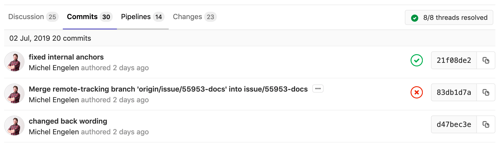

1. Navigate to a specific commit, click on the **Changes** tab (where you
   will only be presented diffs from the selected commit), and leave a comment.

    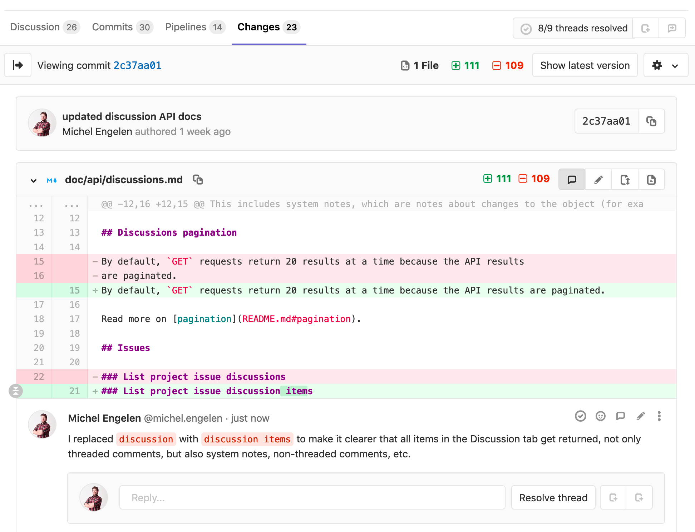

1. Any discussions created this way will be shown in the merge request's
   **Discussions** tab and are resolvable.

    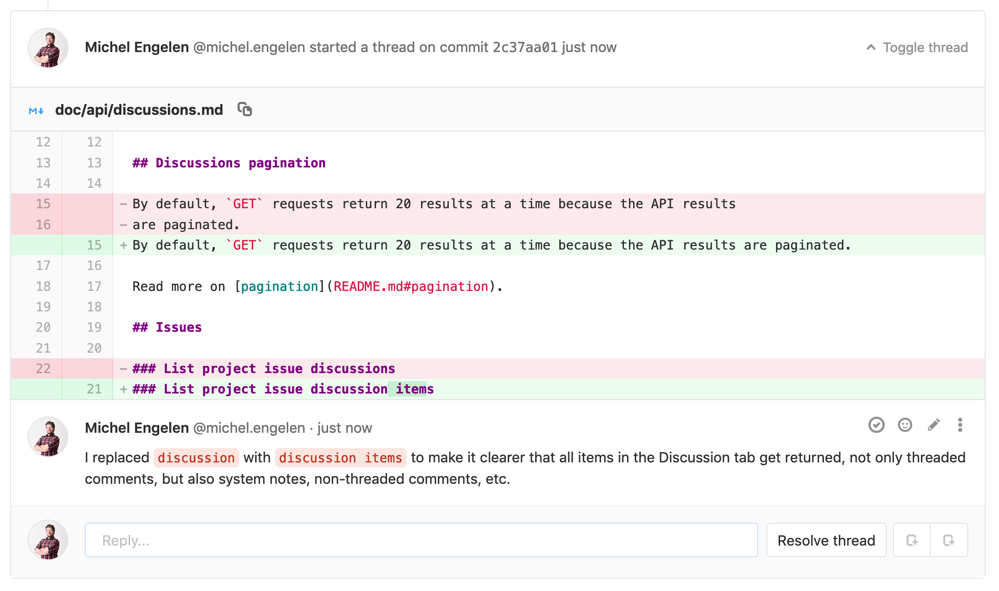

Discussions created this way will only appear in the original merge request
and not when navigating to that commit under your project's
**Repository > Commits** page.

TIP: **Tip:**
When a link of a commit reference is found in a discussion inside a merge
request, it will be automatically converted to a link in the context of the
current merge request.

### Jumping between unresolved discussions

When a merge request has a large number of comments it can be difficult to track
what remains unresolved. You can jump between unresolved discussions with the
Jump button next to the Reply field on a discussion.

You can also jump to the first unresolved discussion from the button next to the
resolved discussions tracker.

!["3/4 discussions resolved"][discussions-resolved]

### Marking a comment or discussion as resolved

You can mark a discussion as resolved by clicking the **Resolve discussion**
button at the bottom of the discussion.

!["Resolve discussion" button][resolve-discussion-button]

Alternatively, you can mark each comment as resolved individually.

!["Resolve comment" button][resolve-comment-button]

### Move all unresolved discussions in a merge request to an issue

> [Introduced][ce-8266] in GitLab 9.1

To continue all open discussions from a merge request in a new issue, click the
**Resolve all discussions in new issue** button.

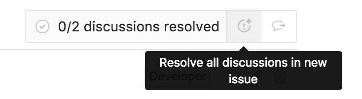

Alternatively, when your project only accepts merge requests [when all discussions
are resolved](#only-allow-merge-requests-to-be-merged-if-all-discussions-are-resolved),
there will be an **open an issue to resolve them later** link in the merge
request widget.

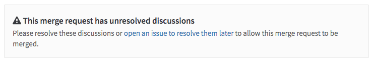

This will prepare an issue with its content referring to the merge request and
the unresolved discussions.

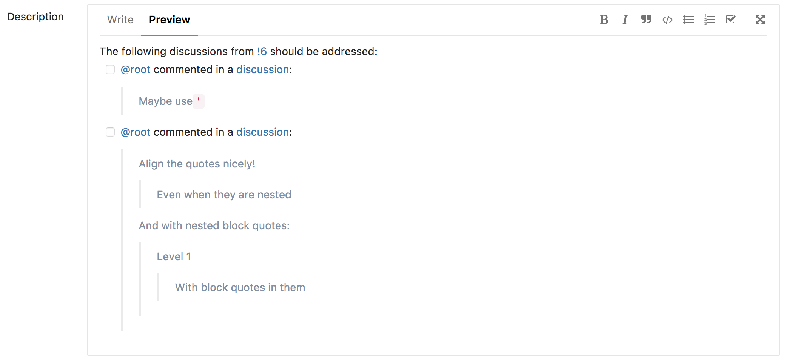

Hitting **Submit issue** will cause all discussions to be marked as resolved and
add a note referring to the newly created issue.

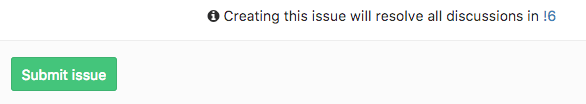

You can now proceed to merge the merge request from the UI.

### Moving a single discussion to a new issue

> [Introduced][ce-8266] in GitLab 9.1

To create a new issue for a single discussion, you can use the **Resolve this
discussion in a new issue** button.

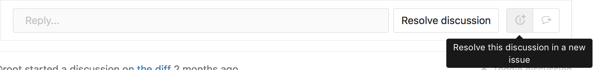

This will direct you to a new issue prefilled with the content of the
discussion, similar to the issues created for delegating multiple
discussions at once. Saving the issue will mark the discussion as resolved and
add a note to the merge request discussion referencing the new issue.

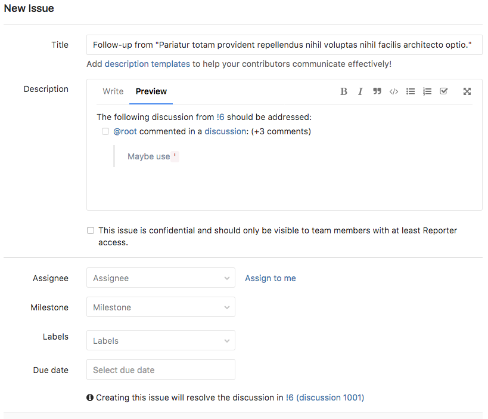

### Only allow merge requests to be merged if all discussions are resolved

> [Introduced][ce-7125] in GitLab 8.14.

You can prevent merge requests from being merged until all discussions are
resolved.

Navigate to your project's settings page, select the
**Only allow merge requests to be merged if all discussions are resolved** check
box and hit **Save** for the changes to take effect.

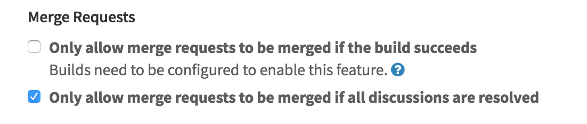

From now on, you will not be able to merge from the UI until all discussions
are resolved.

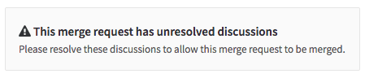

### Automatically resolve merge request diff discussions when they become outdated

> [Introduced][ce-14053] in GitLab 10.0.

You can automatically resolve merge request diff discussions on lines modified
with a new push.

Navigate to your project's settings page, select the **Automatically resolve
merge request diffs discussions on lines changed with a push** check box and hit
**Save** for the changes to take effect.

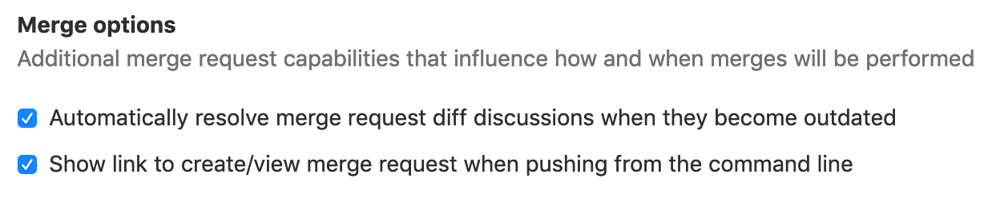

From now on, any discussions on a diff will be resolved by default if a push
makes that diff section outdated. Discussions on lines that don't change and
top-level resolvable discussions are not automatically resolved.

## Commit discussions

You can add comments and discussion threads to a particular commit under your
project's **Repository > Commits**.

CAUTION: **Attention:**
Discussions created this way will be lost if the commit ID changes after a
force push.

## Threaded discussions

> [Introduced][ce-7527] in GitLab 9.1.

While resolvable discussions are only available to merge request diffs,
discussions can also be added without a diff. You can start a specific
discussion which will look like a thread, on issues, commits, snippets, and
merge requests.

To start a threaded discussion, click on the **Comment** button toggle dropdown,
select **Start discussion** and click **Start discussion** when you're ready to
post the comment.

This will post a comment with a single thread to allow you to discuss specific
comments in greater detail.

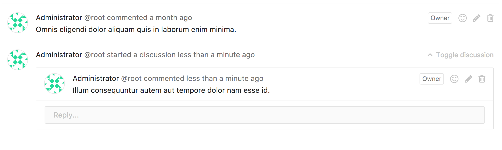

## Image discussions

> [Introduced][ce-14061] in GitLab 10.1.

Sometimes a discussion is revolved around an image. With image discussions,
you can easily target a specific coordinate of an image and start a discussion
around it. Image discussions are available in merge requests and commit detail views.

To start an image discussion, hover your mouse over the image. Your mouse pointer
should convert into an icon, indicating that the image is available for commenting.
Simply click anywhere on the image to create a new discussion.

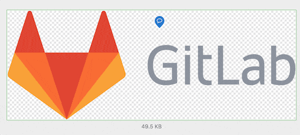

After you click on the image, a comment form will be displayed that would be the start
of your discussion. Once you save your comment, you will see a new badge displayed on
top of your image. This badge represents your discussion.

>**Note:**
This discussion badge is typically associated with a number that is only used as a visual
reference for each discussion. In the merge request discussion tab,
this badge will be indicated with a comment icon since each discussion will render a new
image section.

Image discussions also work on diffs that replace an existing image. In this diff view
mode, you can toggle the different view modes and still see the discussion point badges.

| 2-up | Swipe | Onion Skin |
| :-----------: | :----------: | :----------: |
| 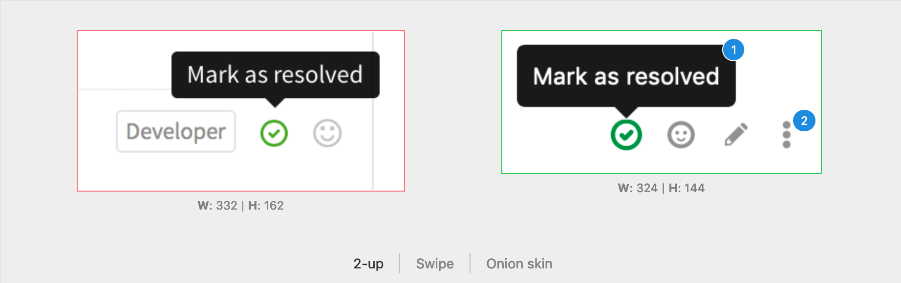 |  |  |

Image discussions also work well with resolvable discussions. Resolved discussions
on diffs (not on the merge request discussion tab) will appear collapsed on page
load and will have a corresponding badge counter to match the counter on the image.

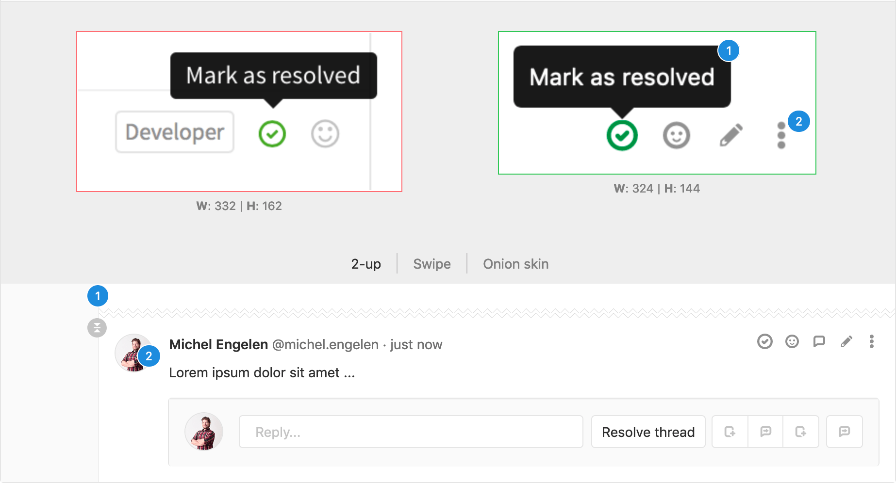

## Lock discussions

> [Introduced][ce-14531] in GitLab 10.1.

For large projects with many contributors, it may be useful to stop discussions
in issues or merge requests in these scenarios:

- The project maintainer has already resolved the discussion and it is not helpful
for continued feedback. The project maintainer has already directed new conversation
to newer issues or merge requests.
- The people participating in the discussion are trolling, abusive, or otherwise
being unproductive.

In these cases, a user with Master permissions or higher in the project can lock (and unlock)
an issue or a merge request, using the "Lock" section in the sidebar:

| Unlock | Lock |
| :-----------: | :----------: |
| 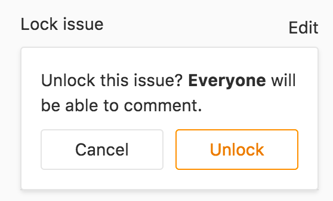 | 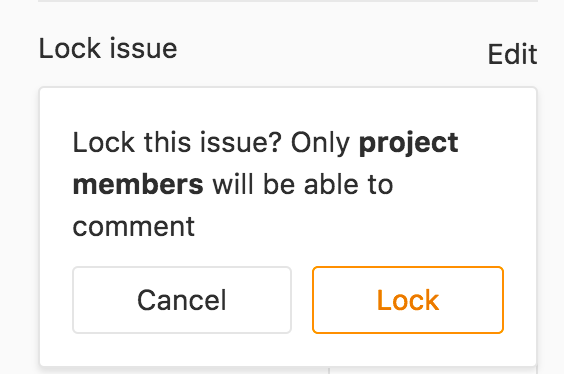 |

System notes indicate locking and unlocking.

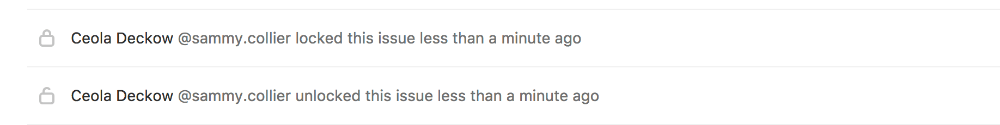

In a locked issue or merge request, only team members can add new comments and
edit existing comments. Non-team members are restricted from adding or editing comments.

| Team member | Non-team member |
| :-----------: | :----------: |
| 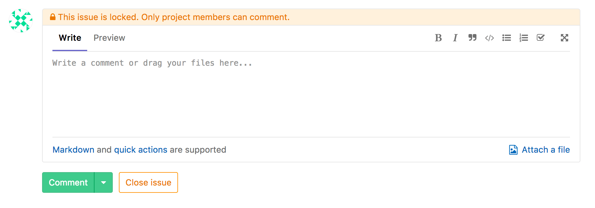 | 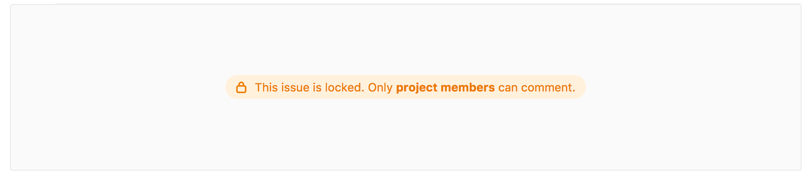 |

[ce-5022]: https://gitlab.com/gitlab-org/gitlab-ce/merge_requests/5022
[ce-7125]: https://gitlab.com/gitlab-org/gitlab-ce/merge_requests/7125
[ce-7527]: https://gitlab.com/gitlab-org/gitlab-ce/merge_requests/7527
[ce-7180]: https://gitlab.com/gitlab-org/gitlab-ce/merge_requests/7180
[ce-8266]: https://gitlab.com/gitlab-org/gitlab-ce/merge_requests/8266
[ce-14053]: https://gitlab.com/gitlab-org/gitlab-ce/merge_requests/14053
[ce-14061]: https://gitlab.com/gitlab-org/gitlab-ce/merge_requests/14061
[ce-14531]: https://gitlab.com/gitlab-org/gitlab-ce/merge_requests/14531
[ce-31847]: https://gitlab.com/gitlab-org/gitlab-ce/merge_requests/31847
[resolve-discussion-button]: img/resolve_discussion_button.png
[resolve-comment-button]: img/resolve_comment_button.png
[discussion-view]: img/discussion_view.png
[discussions-resolved]: img/discussions_resolved.png
[markdown]: ../markdown.md
[quick actions]: ../project/quick_actions.md
[permissions]: ../permissions.md
[Reply by email]: ../../administration/reply_by_email.md
