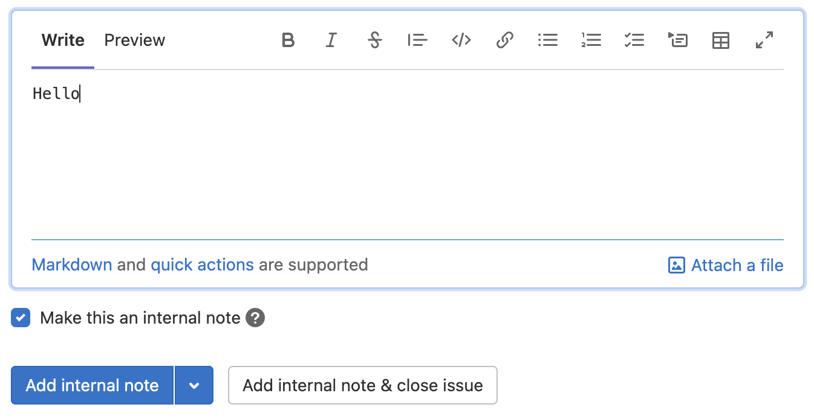
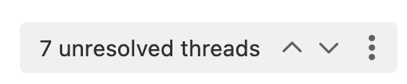

# Comments and threads **(FREE)**

> - Paginated merge request discussions [introduced](https://gitlab.com/gitlab-org/gitlab/-/issues/340172) in GitLab 15.1 [with a flag](../../administration/feature_flags.md) named `paginated_mr_discussions`. Disabled by default.
> - Paginated merge request discussions [enabled on GitLab.com](https://gitlab.com/gitlab-org/gitlab/-/issues/364497) in GitLab 15.2.
> - Paginated merge request discussions [enabled on self-managed](https://gitlab.com/gitlab-org/gitlab/-/issues/364497) in GitLab 15.3.
> - Paginated merge request discussions [generally available](https://gitlab.com/gitlab-org/gitlab/-/issues/370075) in GitLab 15.8. Feature flag `paginated_mr_discussions` removed.

GitLab encourages communication through comments, threads, and
[code suggestions](../project/merge_requests/reviews/suggestions.md).

Two types of comments are available:

- A standard comment.
- A comment in a thread, which can be [resolved](#resolve-a-thread).

In a comment, you can enter [Markdown](../markdown.md) and use [quick actions](../project/quick_actions.md).

You can [suggest code changes](../project/merge_requests/reviews/suggestions.md) in your commit diff comment,
which the user can accept through the user interface.

## Places you can add comments

You can create comments in places like:

- Commit diffs
- Commits
- Designs
- Epics
- Issues
- Merge requests
- Snippets
- Tasks
- OKRs

Each object can have as many as 5,000 comments.

## Mentions

You can mention a user or a group (including [subgroups](../group/subgroups/index.md#mention-subgroups)) in your GitLab
instance with `@username` or `@groupname`. All mentioned users are notified with to-do items and emails.
Users can change this setting for themselves in the [notification settings](../profile/notifications.md).

You can quickly see which comments involve you, because
mentions for yourself (the user who is signed in) are highlighted
in a different color.

Avoid mentioning `@all` in issues and merge requests. It sends an email notification
to all members of that project's parent group, not only the participants of the project.
It might be interpreted as spam.
Notifications and mentions can be disabled in
[a group's settings](../group/manage.md#disable-email-notifications).

### Mention a group in an issue or merge request

When you mention a group in a comment, every member of the group gets a to-do item
added to their To-do list.

1. Open the MR or issue.
1. In a comment, type `@` followed by the user, group, or subgroup namespace.
   For example, `@alex`, `@alex-team`, or `@alex-team/marketing`.
1. Select **Comment**.

A to-do item is created for all the group and subgroup members.

## Add a comment to a merge request diff

You can add comments to a merge request diff. These comments
persist, even when you:

- Force-push after a rebase.
- Amend a commit.

To add a commit diff comment:

1. To select a specific commit, on the merge request, select the **Commits** tab, select the commit
   message. To view the latest commit, select the **Changes** tab.
1. By the line you want to comment on, hover over the line number and select **Comment** (**{comment}**).
   You can select multiple lines by dragging the **Comment** (**{comment}**) icon.
1. Enter your comment and select **Start a review** or **Add comment now**.

The comment is displayed on the merge request's **Overview** tab.

The comment is not displayed on your project's **Repository > Commits** page.

NOTE:
When your comment contains a reference to a commit included in the merge request,
it's converted to a link in the context of the merge request.
For example, `28719b171a056960dfdc0012b625d0b47b123196` becomes `28719b17` that links to
`https://gitlab.example.com/example-group/example-project/-/merge_requests/12345/diffs?commit_id=28719b171a056960dfdc0012b625d0b47b123196`.

## Add a comment to a commit

You can add comments and threads to a particular commit.

1. On the top bar, select **Main menu > Projects** and find your project.
1. On the left sidebar, select **Repository > Commits**.
1. Below the commits, in the **Comment** field, enter a comment.
1. Select **Comment** or select the down arrow (**{chevron-down}**) to select **Start thread**.

WARNING:
Threads created this way are lost if the commit ID changes after a
force push.

## Add a comment to an image

In merge requests and commit detail views, you can add a comment to an image.
This comment can also be a thread.

1. Hover your mouse over the image.
1. Select the location where you want to comment.

An icon is displayed on the image and a comment field is displayed.

## Reply to a comment by sending email

If you have ["reply by email"](../../administration/reply_by_email.md) configured,
you can reply to comments by sending an email.

- When you reply to a standard comment, it creates another standard comment.
- When you reply to a threaded comment, it creates a reply in the thread.
- When you [send an email to an issue email address](../project/issues/managing_issues.md#copy-issue-email-address),
  it creates a standard comment.

You can use [Markdown](../markdown.md) and [quick actions](../project/quick_actions.md) in your email replies.

## Edit a comment

You can edit your own comment at any time.
Anyone with at least the Maintainer role can also edit a comment made by someone else.

To edit a comment:

1. On the comment, select **Edit comment** (**{pencil}**).
1. Make your edits.
1. Select **Save changes**.

### Editing a comment to add a mention

By default, when you mention a user, GitLab [creates a to-do item](../todos.md#actions-that-create-to-do-items)
for them, and sends them a [notification email](../profile/notifications.md).

If you edit an existing comment to add a user mention that wasn't there before, GitLab:

- Creates a to-do item for the mentioned user.
- Does not send a notification email.

## Prevent comments by locking the discussion

You can prevent public comments in an issue or merge request.
When you do, only project members can add and edit comments.

Prerequisite:

- In merge requests, you must have at least the Developer role.
- In issues, you must have at least the Reporter role.

To lock an issue or merge request:

1. On the right sidebar, next to **Lock issue** or **Lock merge request**, select **Edit**.
1. On the confirmation dialog, select **Lock**.

Notes are added to the page details.

If an issue or merge request is locked and closed, you cannot reopen it.

<!-- Delete when the `moved_mr_sidebar` feature flag is removed -->
If you don't see this action on the right sidebar, your project or instance might have [moved sidebar actions](../project/merge_requests/index.md#move-sidebar-actions) enabled.

## Add an internal note

> - [Introduced](https://gitlab.com/gitlab-org/gitlab/-/issues/207473) in GitLab 13.9 [with a flag](../../administration/feature_flags.md) named `confidential_notes`. Disabled by default.
> - [Changed](https://gitlab.com/gitlab-org/gitlab/-/issues/351143) in GitLab 14.10: you can only mark comments in issues and epics as confidential. Previously, it was also possible for comments in merge requests and snippets.
> - [Renamed](https://gitlab.com/gitlab-org/gitlab/-/merge_requests/87403) from "confidential comments" to "internal notes" in GitLab 15.0.
> - [Enabled on GitLab.com and self-managed](https://gitlab.com/gitlab-org/gitlab/-/merge_requests/87383) in GitLab 15.0.
> - [Feature flag `confidential_notes`](https://gitlab.com/gitlab-org/gitlab/-/issues/362712) removed in GitLab 15.2.
> - [Changed](https://gitlab.com/gitlab-org/gitlab/-/issues/363045) permissions in GitLab 15.6 to at least the Reporter role. In GitLab 15.5 and earlier, issue or epic authors and assignees could also read and create internal notes.

You can add an internal note **to an issue or an epic**. It's then visible only to project members who have at least the Reporter role.

Keep in mind:

- Replies to internal notes are also internal.
- You cannot turn an internal note into a regular comment.

Prerequisites:

- You must have at least the Reporter role for the project.

To add an internal note:

1. Start adding a new comment.
1. Below the comment, select the **Make this an internal note** checkbox.
1. Select **Add internal note**.

You can also mark an [issue as confidential](../project/issues/confidential_issues.md).

## Show only comments

In discussions with many comments, filter the discussion to show only comments or history of
changes (system notes). System notes include changes to the description, mentions in other GitLab
objects, or changes to labels, assignees, and the milestone.
GitLab saves your preference, and applies it to every issue, merge request, or epic you view.

1. Open the **Overview** tab in a merge request, issue, or epic.
1. On the right side of the page, from the **Sort or filter** dropdown list, select a filter:
   - **Show all activity**: Display all user comments and system notes.
   - **Show comments only**: Display only user comments.
   - **Show history only**: Display only activity notes.

## Change activity sort order

Reverse the default order and interact with the activity feed sorted by most recent items
at the top. GitLab saves your preference in local storage and applies it to every issue,
merge request, or epic you view.

To change the activity sort order:

1. Open the **Overview** tab in a merge request, issue, or epic.
1. On the right side of the page, from the **Sort or filter** dropdown list, select the sort order
   **Newest first** or **Oldest first** (default).

## View description change history **(PREMIUM)**

You can see changes to the description listed in the history.

To compare the changes, select **Compare with previous version**.

## Assign an issue to the commenting user

> [Introduced](https://gitlab.com/gitlab-org/gitlab/-/issues/191455) in GitLab 13.1.

You can assign an issue to a user who made a comment.

1. In the comment, select the **More Actions** (**{ellipsis_v}**) menu.
1. Select **Assign to commenting user**:
   
1. To unassign the commenter, select the button again.

## Create a thread by replying to a standard comment

When you reply to a standard comment, you create a thread.

Prerequisites:

- You must have at least the Guest role.
- You must be in an issue, merge request, or epic. Threads in commits and snippets are not supported.

To create a thread by replying to a comment:

1. In the upper-right corner of the comment, select **Reply to comment** (**{comment}**).

   

   The reply section is displayed.

1. Enter your reply.
1. Select **Reply** or **Add comment now** (depending on where in the UI you are replying).

The top comment is converted to a thread.

## Create a thread without replying to a comment

You can create a thread without replying to a standard comment.

Prerequisites:

- You must have at least the Guest role.
- You must be in an issue, merge request, commit, or snippet.

To create a thread:

1. Enter a comment.
1. Below the comment, to the right of **Comment**, select the down arrow (**{chevron-down}**).
1. From the list, select **Start thread**.
1. Select **Start thread** again.

A threaded comment is created.

## Resolve a thread

> Resolving comments individually was [removed](https://gitlab.com/gitlab-org/gitlab/-/issues/28750) in GitLab 13.6.

In a merge request, you can resolve a thread when you want to finish a conversation.

Prerequisites:

- You must have at least the Developer role
  or be the author of the change being reviewed.
- Resolvable threads can be added only to merge requests. It doesn't work
  for comments in issues, commits, or snippets.

To resolve a thread:

1. Go to the thread.
1. Do one of the following:
   - In the upper-right corner of the original comment, select **Resolve thread** (**{check-circle}**).
   - Below the last reply, in the **Reply** field, select **Resolve thread**.
   - Below the last reply, in the **Reply** field, enter text, select the **Resolve thread** checkbox, and select **Add comment now**.

At the top of the page, the number of unresolved threads is updated:

### Move all unresolved threads in a merge request to an issue

If you have multiple unresolved threads in a merge request, you can
create an issue to resolve them separately. In the merge request, at the top of the page,
select the ellipsis icon button (**{ellipsis_v}**) in the threads control and then select **Resolve all with new issue**:

All threads are marked as resolved, and a link is added from the merge request to
the newly created issue.

### Move one unresolved thread in a merge request to an issue

If you have one specific unresolved thread in a merge request, you can
create an issue to resolve it separately. In the merge request, under the last reply
to the thread, next to **Resolve thread**, select **Create issue to resolve thread** (**{issue-new}**):

The thread is marked as resolved, and a link is added from the merge request to
the newly created issue.

### Prevent merge unless all threads are resolved

You can prevent merge requests from being merged until all threads are
resolved. When this setting is enabled, the **Unresolved threads** counter in a merge request
is shown in orange when at least one thread remains unresolved.

1. On the top bar, select **Main menu > Projects** and find your project.
1. On the left sidebar, select **Settings > Merge requests**.
1. In the **Merge checks** section, select the **All threads must be resolved** checkbox.
1. Select **Save changes**.

### Automatically resolve threads in a merge request when they become outdated

You can set merge requests to automatically resolve threads when lines are modified
with a new push.

1. On the top bar, select **Main menu > Projects** and find your project.
1. On the left sidebar, select **Settings > Merge requests**.
1. In the **Merge options** section, select
   **Automatically resolve merge request diff threads when they become outdated**.
1. Select **Save changes**.

Threads are now resolved if a push makes a diff section outdated.
Threads on lines that don't change and top-level resolvable threads are not resolved.
