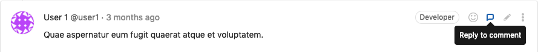
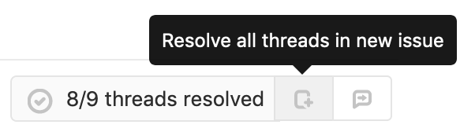
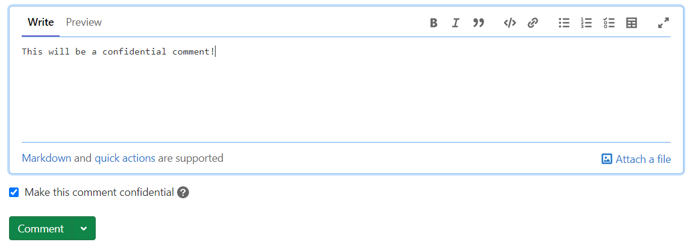
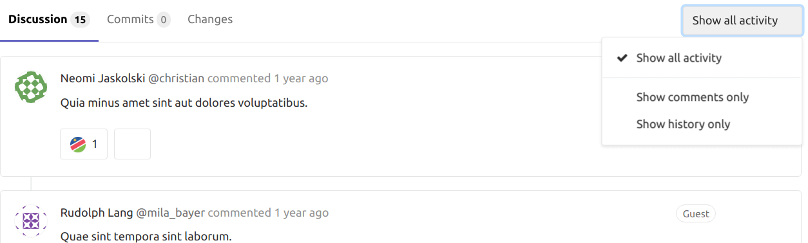
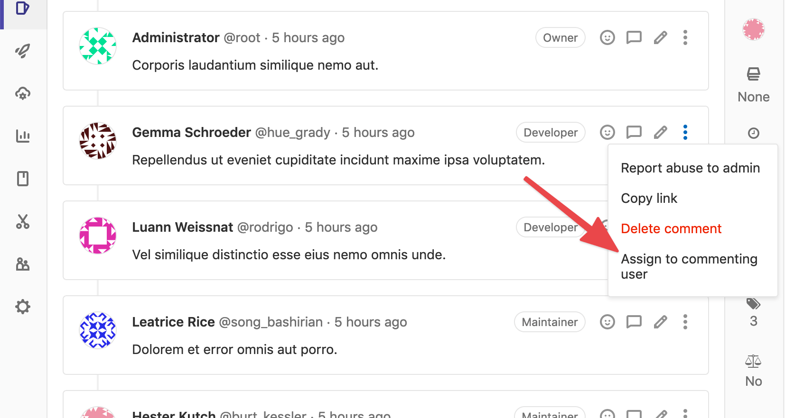

# Comments and threads **(FREE)**

GitLab encourages communication through comments, threads, and
[code suggestions](../project/merge_requests/reviews/suggestions.md).

There are two types of comments:

- A standard comment.
- A comment in a thread, which has to be resolved.

In a comment, you can enter [Markdown](../markdown.md) and use [quick actions](../project/quick_actions.md).

You can [suggest code changes](../project/merge_requests/reviews/suggestions.md) in your commit diff comment,
which the user can accept through the user interface.

## Where you can create comments

You can create comments in places like:

- Commit diffs
- Commits
- Designs
- Epics
- Issues
- Merge requests
- Snippets

Each object can have as many as 5,000 comments.

## Create a thread by replying to a standard comment

> [Introduced](https://gitlab.com/gitlab-org/gitlab-foss/-/issues/30299) in GitLab 11.9.

When you reply to a standard comment, you create a thread.

Prerequisites:

- You must have at least the [Guest role](../permissions.md#project-members-permissions).
- You must be in an issue, merge request, or epic. Commits and snippets threads are not supported.

To create a thread by replying to a comment:

1. On the top right of the comment, select **{comment}** (**Reply to comment**).

   

   The reply area is displayed.

1. Type your reply.
1. Select **Comment** or **Add comment now** (depending on where in the UI you are replying).

The top comment is converted to a thread.

## Create a thread without replying to a comment

You can create a thread without replying to a standard comment.

Prerequisites:

- You must have at least the [Guest role](../permissions.md#project-members-permissions).
- You must be in an issue, merge request, commit, or snippet.

To create a thread:

1. Type a comment.
1. Below the comment, to the right of the **Comment** button, select the down arrow (**{chevron-down}**).
1. From the list, select **Start thread**.
1. Select **Start thread** again.

A threaded comment is created.


## Reply to a comment by sending email

If you have ["reply by email"](../../administration/reply_by_email.md) configured,
you can reply to comments by sending an email.

- When you reply to a standard comment, another standard comment is created.
- When you reply to a threaded comment, it creates a reply in the thread.

You can use [Markdown](../markdown.md) and [quick actions](../project/quick_actions.md) in your email replies.

## Who can edit comments

You can edit your own comment at any time.

Anyone with the [Maintainer role](../permissions.md) or
higher can also edit a comment made by someone else.

## Resolve a thread

> - [Introduced](https://gitlab.com/gitlab-org/gitlab-foss/-/merge_requests/5022) in GitLab 8.11.
> - Resolvable threads can be added only to merge request diffs.
> - Resolving comments individually was [removed](https://gitlab.com/gitlab-org/gitlab/-/issues/28750) in GitLab 13.6.

You can resolve a thread when you want to finish a conversation.

Prerequisites:

- You must have at least the [Developer role](../permissions.md#project-members-permissions)
  or be the author of the change being reviewed.
- You must be in an issue, merge request, commit, or snippet.

To resolve a thread:

1. Go to the thread.
1. Do one of the following:
   - In the top right of the original comment, select the **Resolve thread** (**{check-circle}**) icon.
   - Below the last reply, in the **Reply** field, select **Resolve thread**.
   - Below the last reply, in the **Reply** field, enter text, select the **Resolve thread** checkbox, and select **Add comment now**.

At the top of the page, the number of unresolved threads is updated.


### Move all unresolved threads in a merge request to an issue

If you have multiple unresolved threads in a merge request, you can
create an issue to resolve them separately.

- In the merge request, at the top of the page, select **Resolve all threads in new issue**.

  

All threads are marked as resolved and a link is added from the merge request to
the newly created issue.

### Move one unresolved thread in a merge request to an issue

If you have one specific unresolved thread in a merge request, you can
create an issue to resolve it separately.

- In the merge request, under the last reply to the thread, next to the
  **Resolve thread** button, select **Resolve this thread in a new issue**.

  

The thread is marked as resolved and a link is added from the merge request to
the newly created issue.

### Prevent merge unless all threads are resolved

You can prevent merge requests from being merged until all threads are
resolved.

1. On the top bar, select **Menu > Projects** and find your project.
1. On the left sidebar, select **Settings > General**.
1. Expand **Merge requests**.
1. Under **Merge checks**, select the **All discussions must be resolved** checkbox.
1. Select **Save changes**.

### Automatically resolve threads in a merge request when they become outdated

You can set merge requests to automatically resolve threads when lines are modified
with a new push.

1. On the top bar, select **Menu > Projects** and find your project.
1. On the left sidebar, select **Settings > General**.
1. Expand **Merge requests**.
1. Under **Merge options**, select the
   **Automatically resolve merge request diff discussions when they become outdated** checkbox.
1. Select **Save changes**.

Threads are now resolved if a push makes a diff section outdated.
Threads on lines that don't change and top-level resolvable threads are not resolved.

## Commit threads in the context of a merge request

For reviewers with commit-based workflow, it may be useful to add threads to
specific commit diffs in the context of a merge request. These threads
persist through a commit ID change when:

- force-pushing after a rebase
- amending a commit

To create a commit diff thread:

1. Navigate to the merge request **Commits** tab. A list of commits that
   constitute the merge request are shown.

   

1. Navigate to a specific commit, select the **Changes** tab (where you
   are only be presented diffs from the selected commit), and leave a comment.

   

1. Any threads created this way are shown in the merge request's
   **Discussions** tab and are resolvable.

   

Threads created this way only appear in the original merge request
and not when navigating to that commit under your project's
**Repository > Commits** page.

NOTE:
When a link of a commit reference is found in a thread inside a merge
request, it is automatically converted to a link in the context of the
current merge request.

## Add a comment to a commit

You can add comments and threads to a particular commit.

1. On the top bar, select **Menu > Projects** and find your project.
1. On the left sidebar, select **Repository > Commits**.
1. Below the commits, in the **Comment** field, enter a comment.
1. Select **Comment** or select the down arrow (**{chevron-down}**) to select **Start thread**.

WARNING:
Threads created this way are lost if the commit ID changes after a
force push.

## Add a comment to an image

In merge requests and commit detail views, you can add a comment to an image.
This comment can also be a thread.

1. Hover your mouse over the image.
1. Select the location where you want to comment.

An icon is displayed on the image and a comment field is displayed.


## Prevent comments by locking an issue

You can prevent public comments in an issue or merge request.
When you do, only project members can add and edit comments.

Prerequisite:

- In merge requests, you must have at least the Developer role.
- In issues, you must have at least the Reporter role.

1. On the right sidebar, next to **Lock issue** or **Lock merge request**, select **Edit**.
1. On the confirmation dialog, select **Lock**.

Notes are added to the page details.

If an issue or merge request is locked and closed, you cannot reopen it.

## Mark a comment as confidential

> - [Introduced](https://gitlab.com/gitlab-org/gitlab/-/issues/207473) in GitLab 13.9.
> - [Deployed behind a feature flag](../feature_flags.md), disabled by default.
> - Disabled on GitLab.com.
> - Not recommended for production use.
> - To use in GitLab self-managed instances, ask a GitLab administrator to enable it. **(FREE SELF)**

WARNING:
This feature might not be available to you. Check the **version history** note above for details.

You can make a comment confidential, so that it is visible only to project members
who have at least the Reporter role.

1. Below the comment, select the **Make this comment confidential** checkbox.
1. Select **Comment**.



## Show only comments

> - [Introduced](https://gitlab.com/gitlab-org/gitlab-foss/-/issues/26723) in GitLab 11.5.

For issues and merge requests with many comments, you can filter the page to show comments only.

1. Open a merge request's **Discussion** tab, or epic or issue's **Overview** tab.
1. On the right side of the page, select from the filter:
   - **Show all activity**: Display all user comments and system notes
     (issue updates, mentions from other issues, changes to the description, and so on).
   - **Show comments only**: Display only user comments.
   - **Show history only**: Display only activity notes.



GitLab saves your preference, so it persists when you visit the same page again
from any device you're logged into.

## Assign an issue to the commenting user

> - [Introduced](https://gitlab.com/gitlab-org/gitlab/-/issues/191455) in GitLab 13.1.

You can assign an issue to a user who made a comment.

1. In the comment, select the **More Actions** menu.
1. Select **Assign to commenting user**.



Select the button again to unassign the commenter.

## Enable or disable confidential comments **(FREE SELF)**

Confidential comments are under development and not ready for production use. The feature is
deployed behind a feature flag that is **disabled by default**.
[GitLab administrators with access to the GitLab Rails console](../../administration/feature_flags.md)
can enable it.

To enable it:

```ruby
Feature.enable(:confidential_notes)
```

To disable it:

```ruby
Feature.disable(:confidential_notes)
```
