# Discussions

The ability to contribute conversationally is offered throughout GitLab.

You can leave a comment in the following places:

- issues
- epics **[ULTIMATE]**
- merge requests
- snippets
- commits
- commit diffs

There are standard comments, and you also have the option to create a comment
in the form of a threaded discussion. A comment can also be [turned into a discussion](#start-a-discussion-by-replying-to-a-standard-comment)
when it receives a reply.

The comment area supports [Markdown] and [quick actions]. You can edit your own
comment at any time, and anyone with [Maintainer access level][permissions] or
higher can also edit a comment made by someone else.

You can also reply to a comment notification email to reply to the comment if
[Reply by email] is configured for your GitLab instance. Replying to a standard comment
creates another standard comment. Replying to a discussion comment creates a reply in the
discussion thread. Email replies support [Markdown] and [quick actions], just as if you replied from the web.

## Resolvable comments and discussions

> **Notes:**
>
> - The main feature was [introduced][ce-5022] in GitLab 8.11.
> - Resolvable discussions can be added only to merge request diffs.

Discussion resolution helps keep track of progress during planning or code review.

Every standard comment or discussion thread in merge requests, commits, commit diffs, and
snippets is initially displayed as unresolved. They can then be individually resolved by anyone
with at least Developer access to the project or by the author of the change being reviewed.

The need to resolve all standard comments or discussions prevents you from forgetting
to address feedback and lets you hide discussions that are no longer relevant.

!["A discussion between two people on a piece of code"][discussion-view]

### Commit discussions in the context of a merge request

> [Introduced][ce-31847] in GitLab 10.3.

For reviewers with commit-based workflow, it may be useful to add discussions to
specific commit diffs in the context of a merge request. These discussions will
persist through a commit ID change when:

- force-pushing after a rebase
- amending a commit

To create a commit diff discussion:

1. Navigate to the merge request **Commits** tab. A list of commits that
   constitute the merge request will be shown.

    

1. Navigate to a specific commit, click on the **Changes** tab (where you
   will only be presented diffs from the selected commit), and leave a comment.

    

1. Any discussions created this way will be shown in the merge request's
   **Discussions** tab and are resolvable.

    

Discussions created this way will only appear in the original merge request
and not when navigating to that commit under your project's
**Repository > Commits** page.

TIP: **Tip:**
When a link of a commit reference is found in a discussion inside a merge
request, it will be automatically converted to a link in the context of the
current merge request.

### Jumping between unresolved discussions

When a merge request has a large number of comments it can be difficult to track
what remains unresolved. You can jump between unresolved discussions with the
Jump button next to the Reply field on a discussion.

You can also jump to the first unresolved discussion from the button next to the
resolved discussions tracker.

!["3/4 discussions resolved"][discussions-resolved]

### Marking a comment or discussion as resolved

You can mark a discussion as resolved by clicking the **Resolve discussion**
button at the bottom of the discussion.

!["Resolve discussion" button][resolve-discussion-button]

Alternatively, you can mark each comment as resolved individually.

!["Resolve comment" button][resolve-comment-button]

### Move all unresolved discussions in a merge request to an issue

> [Introduced][ce-8266] in GitLab 9.1

To continue all open discussions from a merge request in a new issue, click the
**Resolve all discussions in new issue** button.

Alternatively, when your project only accepts merge requests [when all discussions
are resolved](#only-allow-merge-requests-to-be-merged-if-all-discussions-are-resolved),
there will be an **open an issue to resolve them later** link in the merge
request widget.

This will prepare an issue with its content referring to the merge request and
the unresolved discussions.

Hitting **Submit issue** will cause all discussions to be marked as resolved and
add a note referring to the newly created issue.

You can now proceed to merge the merge request from the UI.

### Moving a single discussion to a new issue

> [Introduced][ce-8266] in GitLab 9.1

To create a new issue for a single discussion, you can use the **Resolve this
discussion in a new issue** button.

This will direct you to a new issue prefilled with the content of the
discussion, similar to the issues created for delegating multiple
discussions at once. Saving the issue will mark the discussion as resolved and
add a note to the merge request discussion referencing the new issue.

### Only allow merge requests to be merged if all discussions are resolved

> [Introduced][ce-7125] in GitLab 8.14.

You can prevent merge requests from being merged until all discussions are
resolved.

Navigate to your project's settings page, select the
**Only allow merge requests to be merged if all discussions are resolved** check
box and hit **Save** for the changes to take effect.

From now on, you will not be able to merge from the UI until all discussions
are resolved.

### Automatically resolve merge request diff discussions when they become outdated

> [Introduced][ce-14053] in GitLab 10.0.

You can automatically resolve merge request diff discussions on lines modified
with a new push.

Navigate to your project's settings page, select the **Automatically resolve
merge request diffs discussions on lines changed with a push** check box and hit
**Save** for the changes to take effect.

From now on, any discussions on a diff will be resolved by default if a push
makes that diff section outdated. Discussions on lines that don't change and
top-level resolvable discussions are not automatically resolved.

## Commit discussions

You can add comments and discussion threads to a particular commit under your
project's **Repository > Commits**.

CAUTION: **Attention:**
Discussions created this way will be lost if the commit ID changes after a
force push.

## Threaded discussions

> [Introduced][ce-7527] in GitLab 9.1.

While resolvable discussions are only available to merge request diffs,
discussions can also be added without a diff. You can start a specific
discussion which will look like a thread, on issues, commits, snippets, and
merge requests.

To start a threaded discussion, click on the **Comment** button toggle dropdown,
select **Start discussion** and click **Start discussion** when you're ready to
post the comment.

This will post a comment with a single thread to allow you to discuss specific
comments in greater detail.

## Image discussions

> [Introduced][ce-14061] in GitLab 10.1.

Sometimes a discussion is revolved around an image. With image discussions,
you can easily target a specific coordinate of an image and start a discussion
around it. Image discussions are available in merge requests and commit detail views.

To start an image discussion, hover your mouse over the image. Your mouse pointer
should convert into an icon, indicating that the image is available for commenting.
Simply click anywhere on the image to create a new discussion.

After you click on the image, a comment form will be displayed that would be the start
of your discussion. Once you save your comment, you will see a new badge displayed on
top of your image. This badge represents your discussion.

>**Note:**
This discussion badge is typically associated with a number that is only used as a visual
reference for each discussion. In the merge request discussion tab,
this badge will be indicated with a comment icon since each discussion will render a new
image section.

Image discussions also work on diffs that replace an existing image. In this diff view
mode, you can toggle the different view modes and still see the discussion point badges.

| 2-up | Swipe | Onion Skin |
| :-----------: | :----------: | :----------: |
|  |  |  |

Image discussions also work well with resolvable discussions. Resolved discussions
on diffs (not on the merge request discussion tab) will appear collapsed on page
load and will have a corresponding badge counter to match the counter on the image.

## Lock discussions

> [Introduced][ce-14531] in GitLab 10.1.

For large projects with many contributors, it may be useful to stop discussions
in issues or merge requests in these scenarios:

- The project maintainer has already resolved the discussion and it is not helpful
  for continued feedback. The project maintainer has already directed new conversation
  to newer issues or merge requests.
- The people participating in the discussion are trolling, abusive, or otherwise
  being unproductive.

In these cases, a user with Developer permissions or higher in the project can lock (and unlock)
an issue or a merge request, using the "Lock" section in the sidebar. For issues,
a user with Reporter permissions can lock (and unlock).

| Unlock | Lock |
| :-----------: | :----------: |
|  |  |

System notes indicate locking and unlocking.

In a locked issue or merge request, only team members can add new comments and
edit existing comments. Non-team members are restricted from adding or editing comments.

| Team member | Non-team member |
| :-----------: | :----------: |
|  |  |

Additionally, locked issues and merge requests can not be reopened.

## Merge Request Reviews **[PREMIUM]**

> [Introduced](https://gitlab.com/gitlab-org/gitlab-ee/merge_requests/4213) in GitLab 11.4.

When looking at a Merge Request diff, you are able to start a review.
This allows you to create comments inside a Merge Request that are **only visible to you** until published,
in order to allow you to submit them all as a single action.

### Starting a review

In order to start a review, simply write a comment on a diff as normal under the **Changes** tab
in an MR and click on the **Start a review** button.

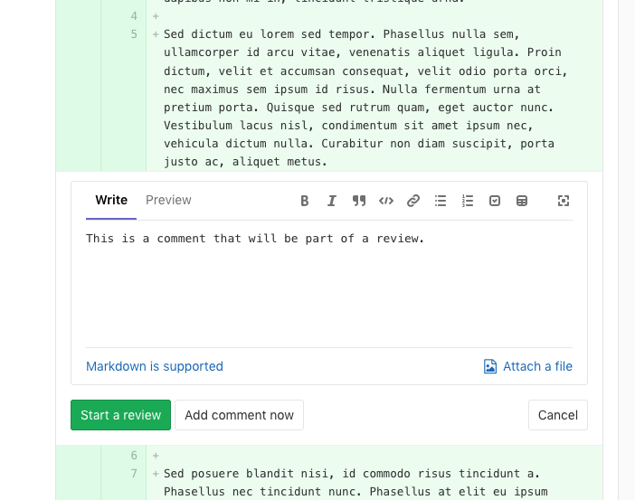

Once a review is started, you will see any comments that are part of this review marked `Pending`.
All comments that are part of a review show two buttons:

- **Submit review**: Submits all comments that are part of the review, making them visible to other users.
- **Add comment now**: Submits the specific comment as a regular comment instead of as part of the review.

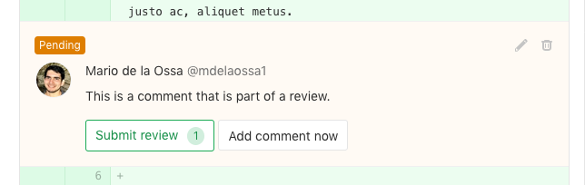

You can use [quick actions] inside review comments. The comment will show the actions that will be performed once published.

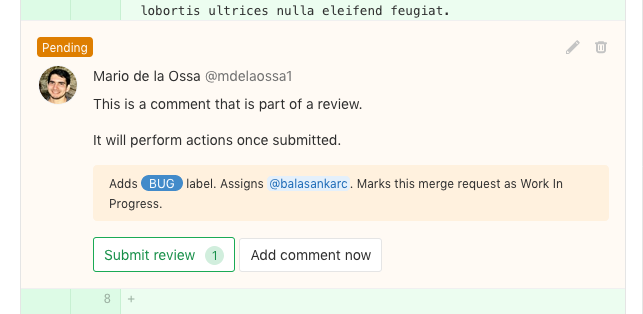

To add more comments to a review, start writing a comment as normal and click the **Add to review** button.

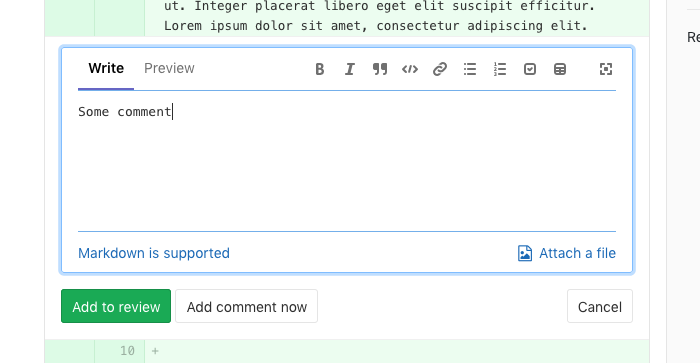

This will add the comment to the review.

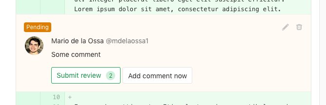

### Resolving/Unresolving discussions

Review comments can also resolve/unresolve [resolvable discussions](#resolvable-comments-and-discussions).
When replying to a comment, you will see a checkbox that you can click in order to resolve or unresolve
the discussion once published.

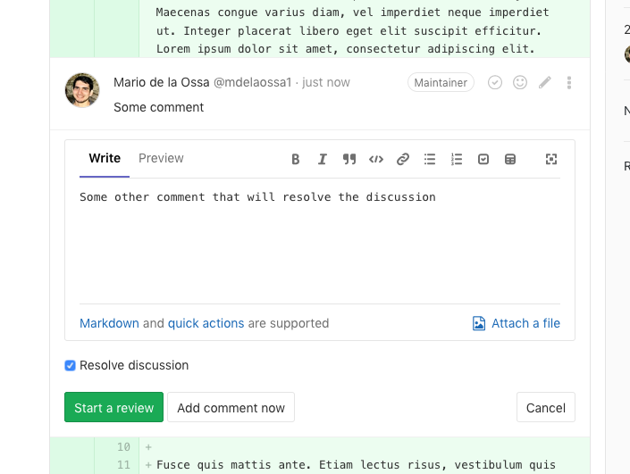
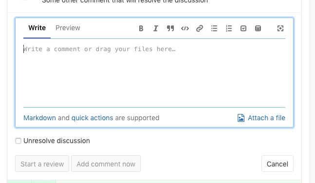

If a particular pending comment will resolve or unresolve the discussion, this will be shown on the pending
comment itself.

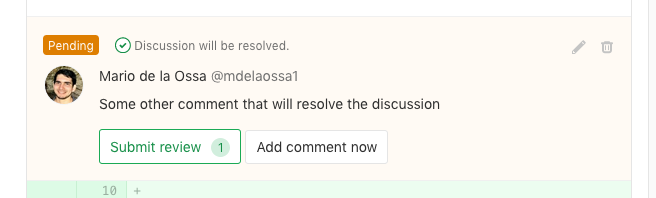
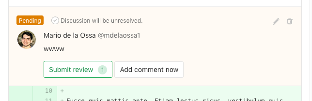

### Submitting a review

If you have any comments that have not been submitted, you will see a bar at the
bottom of the screen with two buttons:

- **Discard**: Discards all comments that have not been submitted.
- **Finish review**: Opens a list of comments ready to be submitted for review.
   Clicking **Submit review** will publish all comments. Any quick actions
   submitted are performed at this time.

Alternatively, every pending comment has a button to finish the entire review.

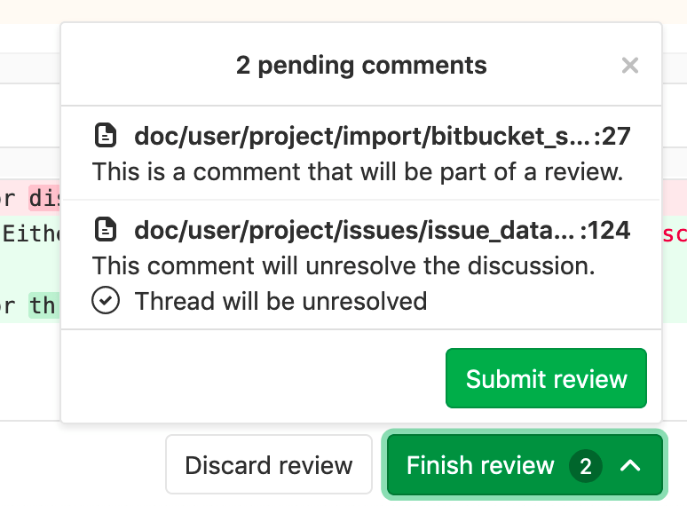

Submitting the review will send a single email to every notifiable user of the
merge request with all the comments associated to it.

Replying to this email will, consequentially, create a new comment on the associated merge request.

## Filtering notes

> [Introduced](https://gitlab.com/gitlab-org/gitlab-ce/issues/26723) in GitLab 11.5.

For issues with many comments like activity notes and user comments, sometimes
finding useful information can be hard. There is a way to filter comments from single notes and discussions for merge requests and issues.

From a merge request's **Discussion** tab, or from an epic/issue overview, find the filter's dropdown menu on the right side of the page, from which you can choose one of the following options:

- **Show all activity**: displays all user comments and system notes
  (issue updates, mentions from other issues, changes to the description, etc).
- **Show comments only**: only displays user comments in the list.
- **Show history only**: only displays activity notes.

Once you select one of the filters in a given issue or MR, GitLab will save
your preference, so that it will persist when you visit the same page again
from any device you're logged into.

## Suggest Changes

> [Introduced](https://gitlab.com/gitlab-org/gitlab-ce/issues/18008) in GitLab 11.6.

As a reviewer, you're able to suggest code changes with a simple
markdown syntax in Merge Request Diff discussions. Then, the
Merge Request author (or other users with appropriate
[permission](../permissions.md)) is able to apply these
suggestions with a click, which will generate a commit in
the Merge Request authored by the user that applied them.

1. Choose a line of code to be changed, add a new comment, then click
   on the **Insert suggestion** icon in the toolbar:

    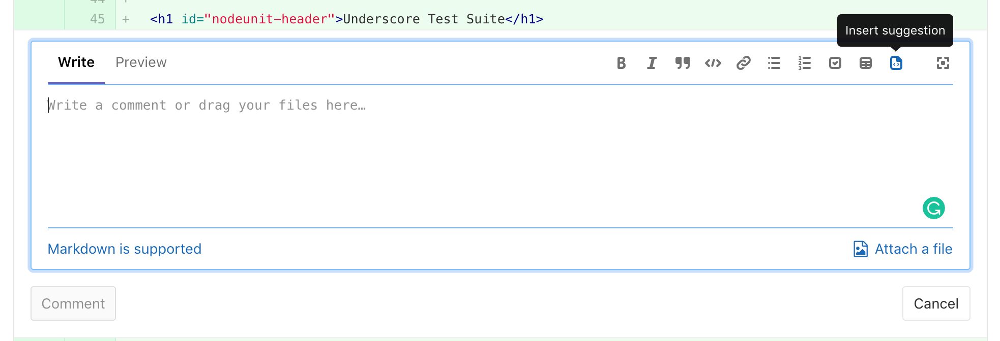

1. In the comment, add your suggestion to the pre-populated code block:

    

1. Click **Comment**.

    The suggestions in the comment can be applied by the merge request author
    directly from the merge request:

    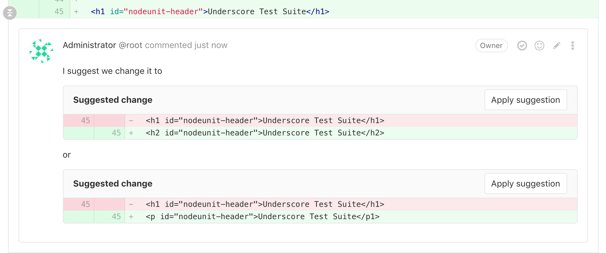

Once the author applies a suggestion, it will be marked with the **Applied** label,
the discussion will be automatically resolved, and GitLab will create a new commit
with the message `Apply suggestion to <file-name>` and push the suggested change
directly into the codebase in the merge request's branch.
[Developer permission](../permissions.md) is required to do so.

> **Note:**
Custom commit messages will be introduced by
[#54404](https://gitlab.com/gitlab-org/gitlab-ce/issues/54404).

### Multi-line suggestions

> [Introduced](https://gitlab.com/gitlab-org/gitlab-ce/issues/53310) in GitLab 11.10.

Reviewers can also suggest changes to multiple lines with a single suggestion
within Merge Request diff discussions by adjusting the range offsets. The
offsets are relative to the position of the diff discussion, and specify the
range to be replaced by the suggestion when it is applied.

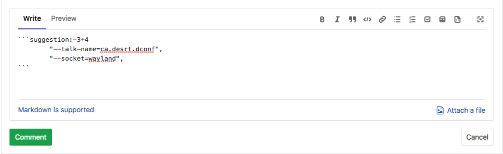

In the example above, the suggestion covers three lines above and four lines
below the commented line. When applied, it would replace from 3 lines _above_
to 4 lines _below_ the commented line, with the suggested change.

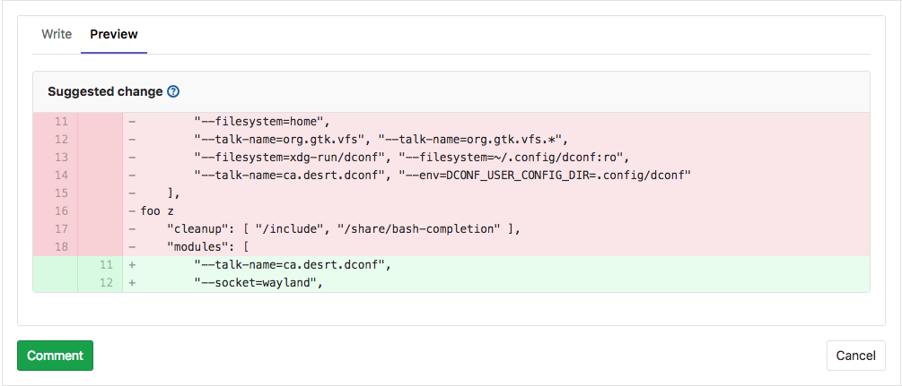

NOTE: **Note:**
Suggestions covering multiple lines are limited to 100 lines _above_ and 100
lines _below_ the commented diff line, allowing up to 200 changed lines per
suggestion.

## Start a discussion by replying to a standard comment

> [Introduced](https://gitlab.com/gitlab-org/gitlab-ce/issues/30299) in GitLab 11.9

To reply to a standard (non-discussion) comment, you can use the **Reply to comment** button.

The **Reply to comment** button is only displayed if you have permissions to reply to an existing discussion, or start a discussion from a standard comment.

Clicking on the **Reply to comment** button will bring the reply area into focus and you can type your reply.

Relying to a non-discussion comment will convert the non-discussion comment to a
threaded discussion once the reply is submitted. This conversion is considered an edit
to the original comment, so a note about when it was last edited will appear underneath it.

This feature only exists for Issues, Merge requests, and Epics. Commits, Snippets and Merge request diff discussions are not supported yet.

[ce-5022]: https://gitlab.com/gitlab-org/gitlab-ce/merge_requests/5022
[ce-7125]: https://gitlab.com/gitlab-org/gitlab-ce/merge_requests/7125
[ce-7527]: https://gitlab.com/gitlab-org/gitlab-ce/merge_requests/7527
[ce-7180]: https://gitlab.com/gitlab-org/gitlab-ce/merge_requests/7180
[ce-8266]: https://gitlab.com/gitlab-org/gitlab-ce/merge_requests/8266
[ce-14053]: https://gitlab.com/gitlab-org/gitlab-ce/merge_requests/14053
[ce-14061]: https://gitlab.com/gitlab-org/gitlab-ce/merge_requests/14061
[ce-14531]: https://gitlab.com/gitlab-org/gitlab-ce/merge_requests/14531
[ce-31847]: https://gitlab.com/gitlab-org/gitlab-ce/issues/31847
[resolve-discussion-button]: img/resolve_discussion_button.png
[resolve-comment-button]: img/resolve_comment_button.png
[discussion-view]: img/discussion_view.png
[discussions-resolved]: img/discussions_resolved.png
[markdown]: ../markdown.md
[quick actions]: ../project/quick_actions.md
[permissions]: ../permissions.md
[Reply by email]: ../../administration/reply_by_email.md
