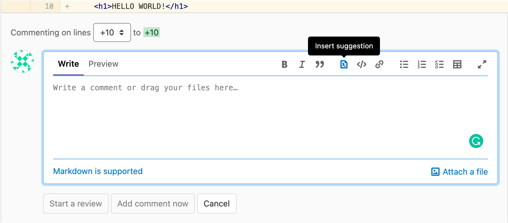
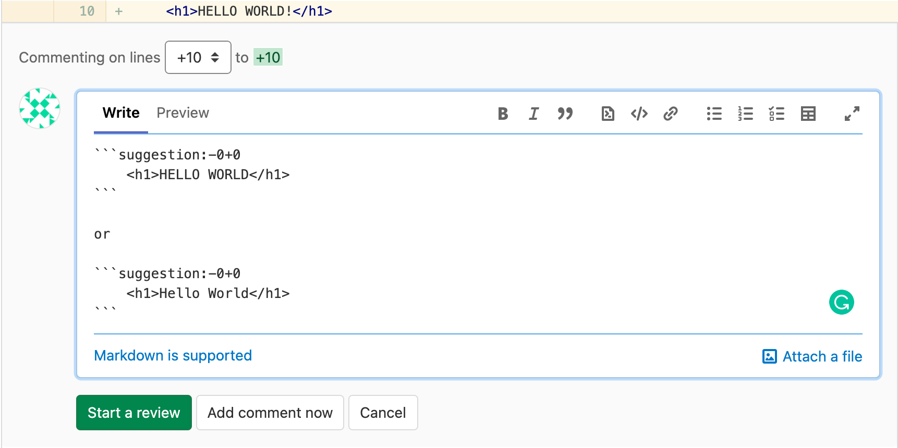
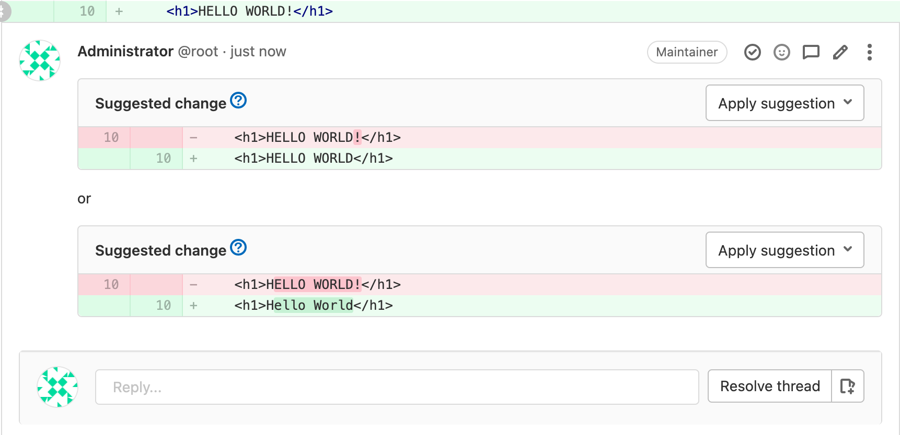
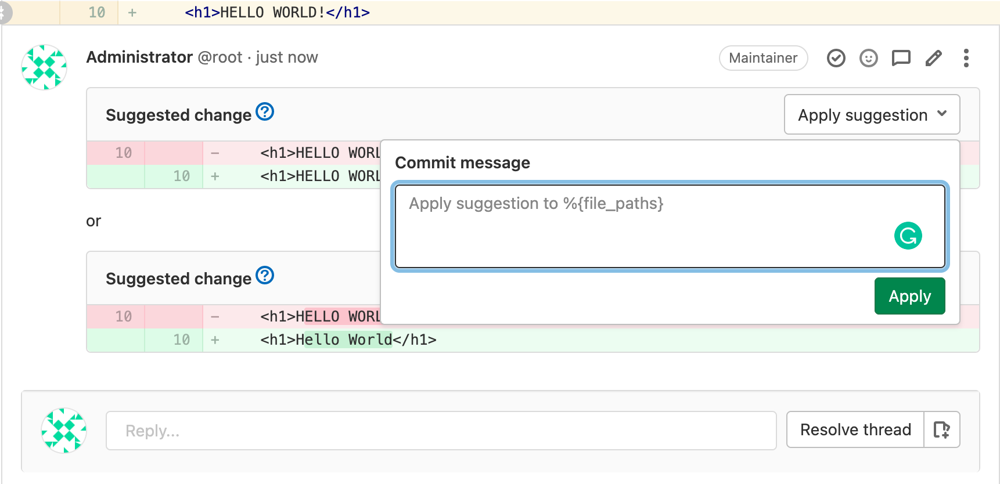
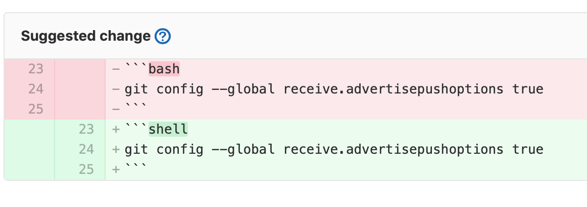
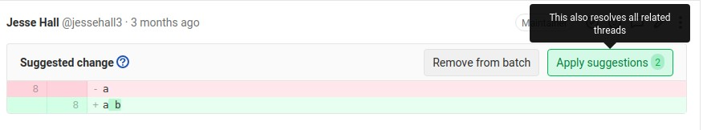

# Threads **(FREE)**

GitLab encourages communication through comments, threads, and suggestions.

For example, you can create a comment in the following places:

- Issues
- Epics
- Merge requests
- Snippets
- Commits
- Commit diffs

There are standard comments, and you also have the option to create a comment
in the form of a thread. A comment can also be [turned into a thread](#start-a-thread-by-replying-to-a-standard-comment)
when it receives a reply.

The comment area supports [Markdown](../markdown.md) and [quick actions](../project/quick_actions.md). You can edit your own
comment at any time, and anyone with [Maintainer access level](../permissions.md) or
higher can also edit a comment made by someone else.

You can also reply to a comment notification email to reply to the comment if
[Reply by email](../../administration/reply_by_email.md) is configured for your GitLab instance. Replying to a standard comment
creates another standard comment. Replying to a threaded comment creates a reply in the thread. Email replies support
[Markdown](../markdown.md) and [quick actions](../project/quick_actions.md), just as if you replied from the web.

NOTE:
There is a limit of 5,000 comments for every object, for example: issue, epic, and merge request.

## Resolvable comments and threads

> - [Introduced](https://gitlab.com/gitlab-org/gitlab-foss/-/merge_requests/5022) in GitLab 8.11.
> - Resolvable threads can be added only to merge request diffs.
> - Resolving comments individually was [removed](https://gitlab.com/gitlab-org/gitlab/-/issues/28750) in GitLab 13.6.

Thread resolution helps keep track of progress during planning or code review.

Every thread in merge requests, commits, commit diffs, and
snippets is initially displayed as unresolved. They can then be individually resolved by anyone
with at least Developer access to the project or by the author of the change being reviewed.
If the thread has been resolved and a non-member un-resolves their own response,
this also unresolves the discussion thread.
If the non-member then resolves this same response, this resolves the discussion thread.

The need to resolve threads prevents you from forgetting to address feedback and lets you
hide threads that are no longer relevant.


### Commit threads in the context of a merge request

For reviewers with commit-based workflow, it may be useful to add threads to
specific commit diffs in the context of a merge request. These threads
persist through a commit ID change when:

- force-pushing after a rebase
- amending a commit

To create a commit diff thread:

1. Navigate to the merge request **Commits** tab. A list of commits that
   constitute the merge request are shown.

   

1. Navigate to a specific commit, select the **Changes** tab (where you
   are only be presented diffs from the selected commit), and leave a comment.

   

1. Any threads created this way are shown in the merge request's
   **Discussions** tab and are resolvable.

   

Threads created this way only appear in the original merge request
and not when navigating to that commit under your project's
**Repository > Commits** page.

NOTE:
When a link of a commit reference is found in a thread inside a merge
request, it is automatically converted to a link in the context of the
current merge request.

### Marking a comment or thread as resolved

You can mark a thread as resolved by clicking the **Resolve thread**
button at the bottom of the thread.


Alternatively, you can mark each comment as resolved individually.


### Move all unresolved threads in a merge request to an issue

To continue all open threads from a merge request in a new issue, click the
**Resolve all threads in new issue** button.


Alternatively, when your project only accepts merge requests [when all threads
are resolved](#only-allow-merge-requests-to-be-merged-if-all-threads-are-resolved),
an **open an issue to resolve them later** link displays in the merge
request widget.


This prepares an issue with its content referring to the merge request and
the unresolved threads.


Hitting **Submit issue** causes all threads to be marked as resolved and
add a note referring to the newly created issue.


You can now proceed to merge the merge request from the UI.

### Moving a single thread to a new issue

To create a new issue for a single thread, you can use the **Resolve this
thread in a new issue** button.


This directs you to a new issue prefilled with the content of the
thread, similar to the issues created for delegating multiple
threads at once. Saving the issue marks the thread as resolved and
add a note to the merge request thread referencing the new issue.


### Only allow merge requests to be merged if all threads are resolved

You can prevent merge requests from being merged until all threads are
resolved.

Navigate to your project's settings page, select the
**Only allow merge requests to be merged if all threads are resolved** check
box and hit **Save** for the changes to take effect.


From now on, you can't merge from the UI until all threads
are resolved.


### Automatically resolve merge request diff threads when they become outdated

You can automatically resolve merge request diff threads on lines modified
with a new push.

Navigate to your project's settings page, select the **Automatically resolve
merge request diffs threads on lines changed with a push** check box and hit
**Save** for the changes to take effect.


From now on, any threads on a diff are resolved by default if a push
makes that diff section outdated. Threads on lines that don't change and
top-level resolvable threads are not automatically resolved.

## Commit threads

You can add comments and threads to a particular commit under your
project's **Repository > Commits**.

WARNING:
Threads created this way are lost if the commit ID changes after a
force push.

## Threaded discussions

While resolvable threads are only available to merge request diffs,
threads can also be added without a diff. You can start a specific
thread which looks like a thread, on issues, commits, snippets, and
merge requests.

To start a threaded discussion, select the **Comment** button toggle dropdown,
select **Start thread**, and then select **Start thread** when you're ready to
post the comment.


This posts a comment with a single thread to allow you to discuss specific
comments in greater detail.


## Image threads

Sometimes a thread is revolved around an image. With image threads,
you can easily target a specific coordinate of an image and start a thread
around it. Image threads are available in merge requests and commit detail views.

To start an image thread, hover your mouse over the image. Your mouse pointer
should convert into an icon, indicating that the image is available for commenting.
Simply click anywhere on the image to create a new thread.


After you select the image, a comment form is displayed that would be the start
of your thread. After you save your comment, a new badge is displayed on
top of your image. This badge represents your thread.

NOTE:
This thread badge is typically associated with a number that is only used as a visual
reference for each thread. In the merge request thread tab,
this badge is indicated with a comment icon, because each thread renders a new
image section.

Image threads also work on diffs that replace an existing image. In this diff view
mode, you can toggle the different view modes and still see the thread point badges.

| 2-up        | Swipe      | Onion Skin |
|:-----------:|:----------:|:----------:|
|  |  |  |

Image threads also work well with resolvable threads. Resolved threads
on diffs (not on the merge request discussion tab) appear collapsed on page
load and have a corresponding badge counter to match the counter on the image.


## Lock discussions

For large projects with many contributors, it may be useful to stop threads
in issues or merge requests in these scenarios:

- The project maintainer has already resolved the thread and it is not helpful
  for continued feedback.
- The project maintainer has already directed new conversation
  to newer issues or merge requests.
- The people participating in the thread are trolling, abusive, or otherwise
  being unproductive.

In these cases, a user with Developer permissions or higher in the project can lock (and unlock)
an issue or a merge request, using the "Lock" section in the sidebar. For issues,
a user with Reporter permissions can lock (and unlock).

| Unlock | Lock |
| :-----------: | :----------: |
|  |  |

System notes indicate locking and unlocking.


In a locked issue or merge request, only team members can add new comments and
edit existing comments. Non-team members are restricted from adding or editing comments.

| Team member | Non-team member |
| :-----------: | :----------: |
|  |  |

Additionally, locked issues and merge requests can't be reopened.

## Confidential Comments

> - [Introduced](https://gitlab.com/gitlab-org/gitlab/-/issues/207473) in GitLab 13.9.
> - [Deployed behind a feature flag](../feature_flags.md), disabled by default.
> - Disabled on GitLab.com.
> - Not recommended for production use.
> - To use in GitLab self-managed instances, ask a GitLab administrator to enable it. **(FREE SELF)**

WARNING:
This feature might not be available to you. Check the **version history** note above for details.

When creating a comment, you can make it visible only to the project members (users with Reporter and higher permissions).

To create a confidential comment, select the **Make this comment confidential** check box before you submit it.


## Merge request reviews

> - [Introduced](https://gitlab.com/gitlab-org/gitlab/-/merge_requests/4213) in GitLab Premium 11.4.
> - [Moved](https://gitlab.com/gitlab-org/gitlab/-/issues/28154) to GitLab Free in 13.1.

When looking at a merge request diff, you are able to start a review.
This allows you to create comments inside a merge request that are **only visible to you** until published,
in order to allow you to submit them all as a single action.

### Starting a review

To start a review, write a comment on a diff as normal under the **Changes** tab
in a merge request, and then select **Start a review**.


After a review is started, any comments that are part of this review are marked `Pending`.
All comments that are part of a review show two buttons:

- **Finish review**: Submits all comments that are part of the review, making them visible to other users.
- **Add comment now**: Submits the specific comment as a regular comment instead of as part of the review.


You can use [quick actions](../project/quick_actions.md) inside review comments. The comment shows the actions to perform after publication.


To add more comments to a review, start writing a comment as normal and click the **Add to review** button.


This adds the comment to the review.


### Resolving/Unresolving threads

Review comments can also resolve/unresolve [resolvable threads](#resolvable-comments-and-threads).
When replying to a comment, a checkbox is displayed that you can click to resolve or unresolve
the thread after publication.


If a particular pending comment resolves or unresolves the thread, this is shown on the pending
comment itself.


### Submitting a review

If you have any comments that have not been submitted, a bar displays at the
bottom of the screen with two buttons:

- **Discard**: Discards all comments that have not been submitted.
- **Finish review**: Opens a list of comments ready to be submitted for review.
  Clicking **Submit review** publishes all comments. Any quick actions
  submitted are performed at this time.

Alternatively, to finish the entire review from a pending comment:

- Click the **Finish review** button on the comment.
- Use the `/submit_review` [quick action](../project/quick_actions.md) in the text of non-review comment.


Submitting the review sends a single email to every notifiable user of the
merge request with all the comments associated to it.

Replying to this email will, consequentially, create a new comment on the associated merge request.

## Filtering notes

> - [Introduced](https://gitlab.com/gitlab-org/gitlab-foss/-/issues/26723) in GitLab 11.5.

For issues with many comments like activity notes and user comments, sometimes
finding useful information can be hard. There is a way to filter comments from single notes and threads for merge requests and issues.

From a merge request's **Discussion** tab, or from an epic/issue overview, find the filter's dropdown menu on the right side of the page, from which you can choose one of the following options:

- **Show all activity**: displays all user comments and system notes
  (issue updates, mentions from other issues, changes to the description, etc).
- **Show comments only**: only displays user comments in the list.
- **Show history only**: only displays activity notes.


After you select one of the filters in a given issue or merge request, GitLab saves
your preference, so that it persists when you visit the same page again
from any device you're logged into.

## Suggest Changes

> - [Introduced](https://gitlab.com/gitlab-org/gitlab-foss/-/issues/18008) in GitLab 11.6.
> - Custom commit messages for suggestions was [introduced](https://gitlab.com/gitlab-org/gitlab/-/issues/25381) in GitLab 13.9 behind a [feature flag](../feature_flags.md), disabled by default.
> - [Feature flag removed](https://gitlab.com/gitlab-org/gitlab/-/issues/297404) in GitLab 13.10.

As a reviewer, you're able to suggest code changes with a
Markdown syntax in merge request diff threads. Then, the
merge request author (or other users with appropriate
[permission](../permissions.md)) is able to apply these
Suggestions with a click, which generates a commit in
the merge request authored by the user that applied them.

1. Choose a line of code to be changed, add a new comment, then click
   on the **Insert suggestion** icon in the toolbar:

   

1. In the comment, add your suggestion to the pre-populated code block:

   

1. Click either **Start a review** or **Add to review** to add your comment to a [review](#merge-request-reviews), or **Add comment now** to add the comment to the thread immediately.

   The Suggestion in the comment can be applied by the merge request author
   directly from the merge request:

   

1. [Introduced](https://gitlab.com/gitlab-org/gitlab/-/issues/25381) in GitLab 13.9,
   you can opt to add a custom commit message to describe your change. If you don't
   specify it, the default commit message is used. It is not supported for [batch suggestions](#batch-suggestions).

   

After the author applies a Suggestion, it is marked with the **Applied** label,
the thread is automatically resolved, and GitLab creates a new commit
and push the suggested change directly into the codebase in the merge request's
branch. [Developer permission](../permissions.md) is required to do so.

### Multi-line Suggestions

> - [Introduced](https://gitlab.com/gitlab-org/gitlab-foss/-/issues/53310) in GitLab 11.10.

Reviewers can also suggest changes to multiple lines with a single Suggestion
within merge request diff threads by adjusting the range offsets. The
offsets are relative to the position of the diff thread, and specify the
range to be replaced by the suggestion when it is applied.


In the example above, the Suggestion covers three lines above and four lines
below the commented line. When applied, it would replace from 3 lines _above_
to 4 lines _below_ the commented line, with the suggested change.


NOTE:
Suggestions covering multiple lines are limited to 100 lines _above_ and 100
lines _below_ the commented diff line, allowing up to 200 changed lines per
suggestion.

### Code block nested in Suggestions

If you need to make a suggestion that involves a
[fenced code block](../markdown.md#code-spans-and-blocks), wrap your suggestion in four backticks
instead of the usual three.




### Configure the commit message for applied Suggestions

> - [Introduced](https://gitlab.com/gitlab-org/gitlab/-/issues/13086) in GitLab 12.7.

GitLab uses a default commit message
when applying Suggestions: `Apply %{suggestions_count} suggestion(s) to %{files_count} file(s)`

For example, consider that a user applied 3 suggestions to 2 different files, the default commit message is: **Apply 3 suggestion(s) to 2 file(s)**

These commit messages can be customized to follow any guidelines you might have. To do so, expand the **Merge requests**
tab within your project's **General** settings and change the
**Merge suggestions** text:


You can also use following variables besides static text:

| Variable               | Description | Output example |
|------------------------|-------------|----------------|
| `%{branch_name}`       | The name of the branch the Suggestion(s) was(were) applied to. | `my-feature-branch` |
| `%{files_count}`       | The number of file(s) to which Suggestion(s) was(were) applied.| **2** |
| `%{file_paths}`        | The path(s) of the file(s) Suggestion(s) was(were) applied to. Paths are separated by commas.| `docs/index.md, docs/about.md` |
| `%{project_path}`      | The project path. | `my-group/my-project` |
| `%{project_name}`      | The human-readable name of the project. | **My Project** |
| `%{suggestions_count}` | The number of Suggestions applied.| **3** |
| `%{username}`          | The username of the user applying Suggestion(s). | `user_1` |
| `%{user_full_name}`    | The full name of the user applying Suggestion(s). | **User 1** |

For example, to customize the commit message to output
**Addresses user_1's review**, set the custom text to
`Addresses %{username}'s review`.

NOTE:
Custom commit messages for each applied Suggestion is
introduced by [#25381](https://gitlab.com/gitlab-org/gitlab/-/issues/25381).

### Batch Suggestions

> - [Introduced](https://gitlab.com/gitlab-org/gitlab/-/issues/25486) in GitLab 13.1 as an [alpha feature](https://about.gitlab.com/handbook/product/gitlab-the-product/#alpha) behind a feature flag, disabled by default.
> - [Enabled by default](https://gitlab.com/gitlab-org/gitlab/-/issues/227799) in GitLab 13.2.
> - [Feature flag removed](https://gitlab.com/gitlab-org/gitlab/-/issues/320755) in GitLab 13.11.

You can apply multiple suggestions at once to reduce the number of commits added
to your branch to address your reviewers' requests.

1. To start a batch of suggestions to apply with a single commit, click **Add suggestion to batch**:

   

1. Add as many additional suggestions to the batch as you wish:

   

1. To remove suggestions, click **Remove from batch**:

   

1. Having added all the suggestions to your liking, when ready, click **Apply suggestions**:

   

## Start a thread by replying to a standard comment

> - [Introduced](https://gitlab.com/gitlab-org/gitlab-foss/-/issues/30299) in GitLab 11.9

To reply to a standard (non-thread) comment, you can use the **Reply to comment** button.


The **Reply to comment** button is only displayed if you have permissions to reply to an existing thread, or start a thread from a standard comment.

Clicking on the **Reply to comment** button brings the reply area into focus and you can type your reply.


Replying to a non-thread comment converts the non-thread comment to a
thread after the reply is submitted. This conversion is considered an edit
to the original comment, so a note about when it was last edited appears underneath it.

This feature exists only for issues, merge requests, and epics. Commits, snippets, and merge request diff threads are
not supported yet.

## Assign an issue to the commenting user

> - [Introduced](https://gitlab.com/gitlab-org/gitlab/-/issues/191455) in GitLab 13.1.

You can assign an issue to a user who made a comment.

In the comment, click the **More Actions** menu and click **Assign to commenting user**.

  Click the button again to unassign the commenter.


## Enable or disable Confidential Comments **(FREE SELF)**

Confidential Comments is under development and not ready for production use. It is
deployed behind a feature flag that is **disabled by default**.
[GitLab administrators with access to the GitLab Rails console](../../administration/feature_flags.md)
can enable it.

To enable it:

```ruby
Feature.enable(:confidential_notes)
```

To disable it:

```ruby
Feature.disable(:confidential_notes)
```
