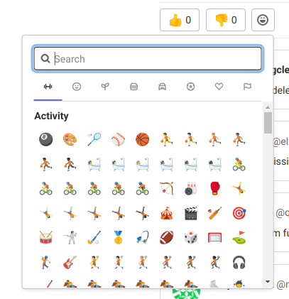
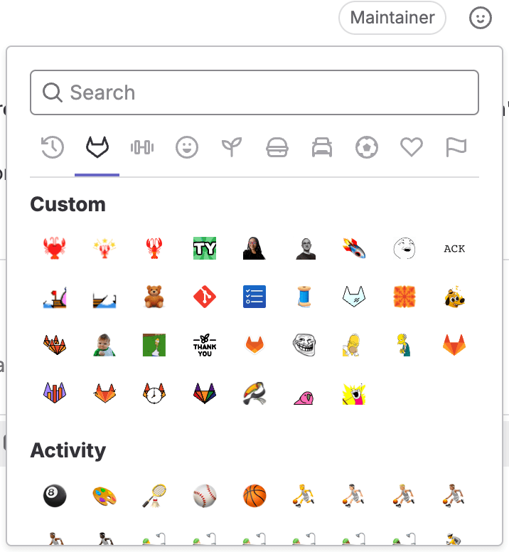

DETAILS:
**Tier:** Free, Premium, Ultimate
**Offering:** GitLab.com, GitLab Self-Managed, GitLab Dedicated

> - [Renamed](https://gitlab.com/gitlab-org/gitlab/-/issues/409884) from "award emoji" to "emoji reactions" in GitLab 16.0.
> - Reacting with emoji on work items (such as tasks, objectives, and key results) [introduced](https://gitlab.com/gitlab-org/gitlab/-/issues/393599) in GitLab 16.0.
> - Reacting with emoji on design discussion comments [introduced](https://gitlab.com/gitlab-org/gitlab/-/issues/29756) in GitLab 16.2.

When you're collaborating online, you get fewer opportunities for high-fives
and thumbs-ups. React with emoji on:

- [Issues](project/issues/_index.md).
- [Tasks](tasks.md).
- [Merge requests](project/merge_requests/_index.md), [snippets](snippets.md).
- [Epics](group/epics/_index.md).
- [Objectives and key results](okrs.md).
- Anywhere else you can have a comment thread.

Emoji reactions make it much easier to give and receive feedback without a long
comment thread.

"Thumbs up" and "thumbs down" emoji are used to calculate an issue or merge request's position when
[sorting by popularity](project/issues/sorting_issue_lists.md#sorting-by-popularity).

For information on the relevant API, see [Emoji reactions API](../api/emoji_reactions.md).

## Emoji reactions for comments

Emoji reactions can also be applied to individual comments when you want to
celebrate an accomplishment or agree with an opinion.

To add an emoji reaction:

1. In the upper-right corner of the comment, select the smile (**{slight-smile}**).
1. Select an emoji from the emoji picker.

To remove an emoji reaction, select the emoji again.

## Custom emoji

> - [Introduced for GraphQL API](https://gitlab.com/gitlab-org/gitlab/-/merge_requests/37911) in GitLab 13.6 [with a flag](../administration/feature_flags.md) named `custom_emoji`. Disabled by default.
> - Enabled on GitLab.com in GitLab 14.0.
> - UI to add emoji [introduced](https://gitlab.com/gitlab-org/gitlab/-/issues/333095) in GitLab 16.2.
> - [Enabled on GitLab Self-Managed](https://gitlab.com/gitlab-org/gitlab/-/merge_requests/138969) in GitLab 16.7.
> - [Generally available](https://gitlab.com/gitlab-org/gitlab/-/merge_requests/) in GitLab 16.9. Feature flag `custom_emoji` removed.

Custom emoji show in the emoji picker everywhere you can react with emoji.

To add an emoji reaction to a comment or description:

1. Select **Add reaction** (**{slight-smile}**).
1. Select the GitLab logo (**{tanuki}**) or scroll down to the **Custom** section.
1. Select an emoji from the emoji picker.

To use them in a text box, type the filename between two colons.
For example, `:thank-you:`.

You can upload custom emoji to a GitLab instance with the GraphQL API.
For more information, see [Use custom emoji with GraphQL](../api/graphql/custom_emoji.md).

For a list of custom emoji available for GitLab.com, see
[the `custom_emoji` project](https://gitlab.com/custom_emoji/custom_emoji/-/tree/main/img).

### Upload custom emoji to a group

> - [Introduced](https://gitlab.com/gitlab-org/gitlab/-/merge_requests/128355) in GitLab 16.5.

Upload your custom emoji to a group to use them in all its subgroups and projects.

Prerequisites:

- You must at least have the developer role for the group.

To upload custom emoji:

1. On a description or a comment, select **Add reaction** (**{slight-smile}**).
1. At the bottom of the emoji picker, select **Create new emoji**.
1. Enter a name and URL for the custom emoji.
1. Select **Save**.

You can also upload custom emoji to a GitLab instance with the GraphQL API.
For more information, see [Use custom emoji with GraphQL](../api/graphql/custom_emoji.md).
