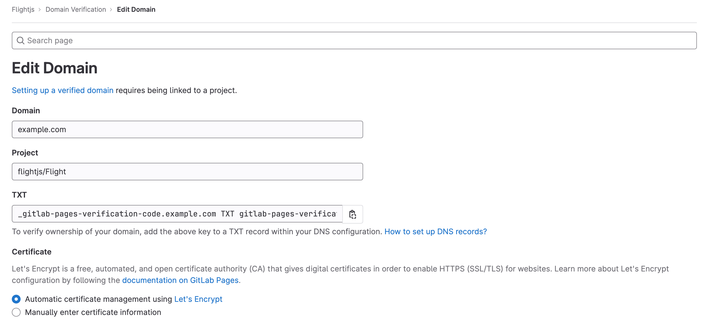
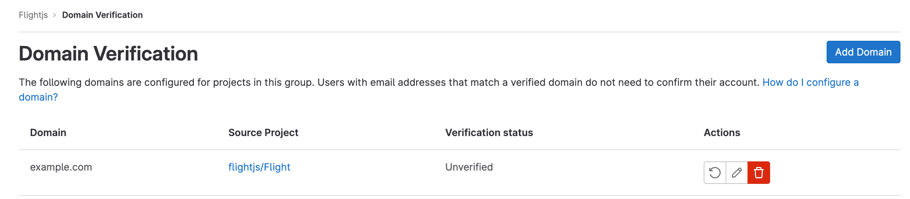

DETAILS:
**Tier:** Premium, Ultimate
**Offering:** GitLab.com

Enterprise users have user accounts that are administered by an organization that
has [verified their email domain](#verified-domains-for-groups) and purchased a [GitLab subscription](../../subscriptions/_index.md).

Enterprise users are identified by the **Enterprise** badge
next to their names on the [Members list](../group/_index.md#filter-and-sort-members-in-a-group).

## Automatic claims of enterprise users

A user is automatically claimed as an enterprise user of a group when **both** of the following conditions are met:

1. The user's primary email has a domain that has been [verified](#verified-domains-for-groups) by the paid group.
1. The user account meets at least **one** of the following conditions:
   - It was created February 1, 2021 or later.
   - It has a SAML or SCIM identity tied to the organization's group.
   - It has a `provisioned_by_group_id` value that is the same as the organization's group's ID.
   - It is a member of the organization's group, where the subscription was purchased or renewed February 1, 2021 or later.

After the user is claimed as an enterprise user:

- Their `enterprise_group_id` attribute is set to the organization's group's ID.
- The user receives a [welcome email](https://gitlab.com/gitlab-org/gitlab/-/blob/master/ee/app/views/notify/user_associated_with_enterprise_group_email.html.haml).

If a group's purchased subscription expires or is canceled:

- Users claimed as enterprise users remain enterprise users of that group.
- The group is not able to [manage their enterprise users](#manage-enterprise-users-in-a-namespace).
- [Enterprise user restrictions](#enterprise-user-restrictions) apply to those user accounts.
- No new users can be [automatically associated with the group](#automatic-claims-of-enterprise-users) until the paid subscription is renewed.

If a group's verified domains are removed:

- Users claimed as enterprise users remain enterprise users of that group.
- [Enterprise user restrictions](#enterprise-user-restrictions) apply to those user accounts.
- No new users can be [automatically associated with the group](#automatic-claims-of-enterprise-users) until domains are verified.

If the organization moves its verified domains to another paid group, its enterprise users are [automatically claimed](#automatic-claims-of-enterprise-users) as enterprise users of that group.

## Enterprise user restrictions

### Primary email change

An enterprise user can only change their primary email to an email their organization owns as per its verified domains.
If an organization removes all its verified domains, its enterprise users are not able to change their primary email address.

Only GitLab administrators can change enterprise users' primary email address to an email with a non-verified domain.

Providing the ability to group Owners to change their enterprise users' primary email to an email with a non-verified domain is proposed in [issue 412966](https://gitlab.com/gitlab-org/gitlab/-/issues/412966).

## Verified domains for groups

The following automated processes use verified domains to run:

- [Automatic claims of enterprise users](#automatic-claims-of-enterprise-users).
- [Bypass email confirmation for provisioned users](#bypass-email-confirmation-for-provisioned-users).

### Set up a verified domain

Prerequisites:

- A custom domain name `example.com` or subdomain `subdomain.example.com`.
- Access to your domain's server control panel to set up a DNS `TXT` record to verify your domain's ownership.
- A project in the group. This project will be linked to the verified domains, and should not be deleted. This project also needs to have the pages component enabled in its settings (**General** -> **Visibility, project features, permissions** -> **Pages**). If the pages component is disabled in its settings, a `500` error will be generated during domain verification.
- Ensure that [GitLab Pages](../project/pages/_index.md) is enabled for the project. If GitLab Pages is disabled, adding the domain might result in an error.
- You must have the Owner role for the top-level group.

Domain verification applies at the top-level group and to all subgroups and projects
nested under that top-level parent group.

You cannot verify a domain for more than one group. For example, if a group named
'group1' has a verified domain named 'domain1', you cannot also verify 'domain1'
for a different group named 'group2'.

Setting up a verified domain is similar to [setting up a custom domain on GitLab Pages](../project/pages/custom_domains_ssl_tls_certification/_index.md). However, you:

- Do not need to have a GitLab Pages website.
- Must link the domain to a single project, despite domain verification applying
  at the top-level group and to all nested subgroups and projects, because domain
  verification:
  - Is tied to the project you choose. If the project is deleted, the domain verification is removed.
  - Reuses the GitLab Pages custom domain verification feature, which requires a project.
- Must configure the `TXT` only in the DNS record to verify the domain's ownership.

In addition to appearing in the top-level group Domain Verification list, the
domain will also appear in the chosen project. A member in this project with
[at least the Maintainer role](../permissions.md#project-members-permissions)
can modify or remove the domain verification.

If needed, you can create a new project to set up domain verification directly
under your top-level group. This limits the ability to modify the domain verification
to members with at least the Maintainer role, because these users are able to set up a domain and therefore allow the group's enterprise users to update their email to match that domain.

For more information on group-level domain verification, see [epic 5299](https://gitlab.com/groups/gitlab-org/-/epics/5299).

#### 1. Add a custom domain for the matching email domain

The custom domain must match the email domain exactly. For example, if your email is `username@example.com`, verify the `example.com` domain.

1. On the left sidebar, select **Search or go to** and find your group.
   This group must be at the top level.
1. Select **Settings > Domain Verification**.
1. In the upper-right corner, select **Add Domain**.
1. In **Domain**, enter the domain name.
1. In **Project**, link to a project.
1. In **Certificate**:
   - If you do not have or do not want to use an SSL certificate, leave **Automatic certificate management using Let's
     Encrypt** selected.
   - Optional. Turn on the **Manually enter certificate information** toggle to add an SSL/TLS certificate. You can also
     add the certificate and key later.
1. Select **Add Domain**.

NOTE:
A valid certificate is not required for domain verification. You can ignore error messages regarding the certificate if you are not using GitLab Pages.

#### 2. Get a verification code

After you create a new domain, the verification code prompts you. Copy the values from GitLab
and paste them in your domain's control panel as a `TXT` record.

#### 3. Verify the domain's ownership

After you have added all the DNS records:

1. On the left sidebar, select **Search or go to** and find your group.
1. Select **Settings > Domain Verification**.
1. On the domain table row, Select **Retry verification** (**{retry}**).

WARNING:
For GitLab instances with domain verification enabled, if the domain cannot be verified for 7 days, that domain is removed from the GitLab project.

> **Notes:**
>
> - Domain verification is **required for GitLab.com users** to be marked as enterprise users.
> - [DNS propagation can take up to 24 hours](https://www.inmotionhosting.com/support/domain-names/dns-nameserver-changes/complete-guide-to-dns-records/), although it's usually a couple of minutes to complete. Until it completes, the domain shows as unverified.
> - Once your domain has been verified, leave the verification record in place. Your domain is periodically reverified, and may be disabled if the record is removed.
> - A valid certificate is not required for domain verification.

### View domains in group

To view all configured domains in your group:

1. On the left sidebar, select **Search or go to** and find your group.
   This group must be at the top level.
1. Select **Settings > Domain Verification**.

You then see:

- A list of added domains.
- The domains' status of **Verified** or **Unverified**.
- The project where the domain has been configured.

### Manage domains in group

To edit or remove a domain:

1. On the left sidebar, select **Search or go to** and find your group.
   This group must be at the top level.
1. Select **Settings > Domain Verification**.
1. When viewing **Domain Verification**, select the project listed next to the relevant domain.
1. Edit or remove a domain following the relevant [GitLab Pages custom domains](../project/pages/custom_domains_ssl_tls_certification/_index.md) instructions.

## Manage enterprise users in a namespace

A top-level Owner of a namespace on a paid plan can retrieve information about and
manage enterprise user accounts in that namespace.

These enterprise user-specific actions are in addition to the standard
[group member permissions](../permissions.md#group-members-permissions).

### Disable two-factor authentication

> - [Introduced](https://gitlab.com/groups/gitlab-org/-/epics/9484) in GitLab 15.8.

Top-level group Owners can disable two-factor authentication (2FA) for enterprise users.

To disable 2FA:

1. On the left sidebar, select **Search or go to** and find your group.
1. Select **Manage > Members**.
1. Find a user with the **Enterprise** and **2FA** badges.
1. Select **More actions** (**{ellipsis_v}**) and select **Disable two-factor authentication**.

### Enable the extension marketplace for the Web IDE and workspaces

DETAILS:
**Status:** Beta

> - [Introduced](https://gitlab.com/gitlab-org/gitlab/-/merge_requests/161819) as a [beta](../../policy/development_stages_support.md#beta) in GitLab 17.0 [with flags](../../administration/feature_flags.md) named `web_ide_oauth` and `web_ide_extensions_marketplace`. Disabled by default.
> - Feature flag `web_ide_oauth` [enabled on GitLab.com, GitLab Self-Managed, and GitLab Dedicated](https://gitlab.com/gitlab-org/gitlab/-/merge_requests/163181) in GitLab 17.4.
> - Feature flag `web_ide_extensions_marketplace` [enabled on GitLab.com](https://gitlab.com/gitlab-org/gitlab/-/issues/459028) in GitLab 17.4.
> - Feature flag `web_ide_oauth` [removed](https://gitlab.com/gitlab-org/gitlab/-/merge_requests/167464) in GitLab 17.5.

FLAG:
The availability of this feature is controlled by a feature flag.
For more information, see the history.

If you have the Owner role for a top-level group, you can enable the
[extension marketplace](../project/web_ide/_index.md#extension-marketplace) for enterprise users.

To enable the extension marketplace for the
[Web IDE](../project/web_ide/_index.md) and [workspaces](../workspace/_index.md):

1. On the left sidebar, select **Search or go to** and find your group.
1. Select **Settings > General**.
1. Expand the **Permissions and group features** section.
1. Under **Web IDE and workspaces**, select the **Enable extension marketplace** checkbox.
1. Select **Save changes**.

### Prevent enterprise users from creating groups and projects outside the corporate group

A SAML identity administrator can configure the SAML response to set:

- Whether enterprise users can create new top-level groups.
- The maximum number of personal projects enterprise users can create.

For more information, see how to [configure enterprise user settings from the SAML response](../group/saml_sso/_index.md#configure-enterprise-user-settings-from-saml-response).

### Bypass email confirmation for provisioned users

A top-level group Owner can [set up verified domains to bypass confirmation emails](../group/saml_sso/_index.md#bypass-user-email-confirmation-with-verified-domains).

### Get users' email addresses

A top-level group Owner can use the UI to access enterprise users' email addresses:

1. On the left sidebar, select **Search or go to** and find your project or group.
1. Select **Manage > Members**.
1. In the group or project members page, hover over the enterprise user's name to
   see their email address.

A group Owner can also use the [group and project members API](../../api/members.md)
to access users' information. For enterprise users of the group, this information
includes users' email addresses.

### Remove enterprise management features from an account

Changing an enterprise user's primary email to an email from a non-verified domain automatically removes the enterprise badge from the account. This does not alter any account roles or permissions for the user, but does limit the group Owner's ability to manage this account.

### Disable password authentication for enterprise users

A top-level group Owner can [disable password authentication for enterprise users](../group/saml_sso/_index.md#disable-password-authentication-for-enterprise-users).

## Related topics

- [Group enterprise users API](../../api/group_enterprise_users.md)

## Troubleshooting

### Cannot disable two-factor authentication for an enterprise user

If an enterprise user does not have an **Enterprise** badge, a top-level group Owner cannot [disable or reset 2FA](#disable-two-factor-authentication) for that user. Instead, the Owner should tell the enterprise user to consider available [recovery options](../profile/account/two_factor_authentication_troubleshooting.md#recovery-options-and-2fa-reset).
