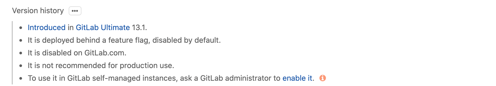

# GitLab functionality may be limited by feature flags

> Feature flag documentation warnings were [introduced](https://gitlab.com/gitlab-org/gitlab/-/issues/227806) in GitLab 13.4.

GitLab releases some features in a disabled state using [feature flags](../development/feature_flags/index.md),
allowing them to be tested by specific groups of users and strategically
rolled out until they become enabled for everyone.

As a GitLab user, this means that some features included in a GitLab release
may be unavailable to you.

In this case, you'll see a warning like this in the feature documentation:

This in-development feature might not be available for your use. There can be
[risks when enabling features still in development](#risks-when-enabling-features-still-in-development).
Refer to this feature's version history for more details.

In the version history note, you'll find information on the state of the
feature flag, including whether the feature is on ("enabled by default") or
off ("disabled by default") for self-managed GitLab instances and for users of
GitLab.com. To see the full notes:

1. Click the three-dots icon (ellipsis) to expand version history notes:

   

1. Read the version history information:

   

If you're a user of a GitLab self-managed instance and you want to try to use a
disabled feature, you can ask a [GitLab administrator to enable it](../administration/feature_flags.md),
although changing a feature's default state isn't recommended.

If you're a GitLab.com user and the feature is disabled, be aware that GitLab may
be working on the feature for potential release in the future.

## Risks when enabling features still in development

Features that are disabled by default may change or be removed without notice in a future version of GitLab.

Data corruption, stability degradation, or performance degradation might occur if
you enable a feature that's disabled by default. Problems caused by using a default
disabled feature aren't covered by GitLab support, unless you were directed by GitLab
to enable the feature.

## Risks when disabling released features

In most cases, the feature flag code is removed in a future version of GitLab.
If and when that occurs, from that point onward you can't keep the feature in a disabled state.
