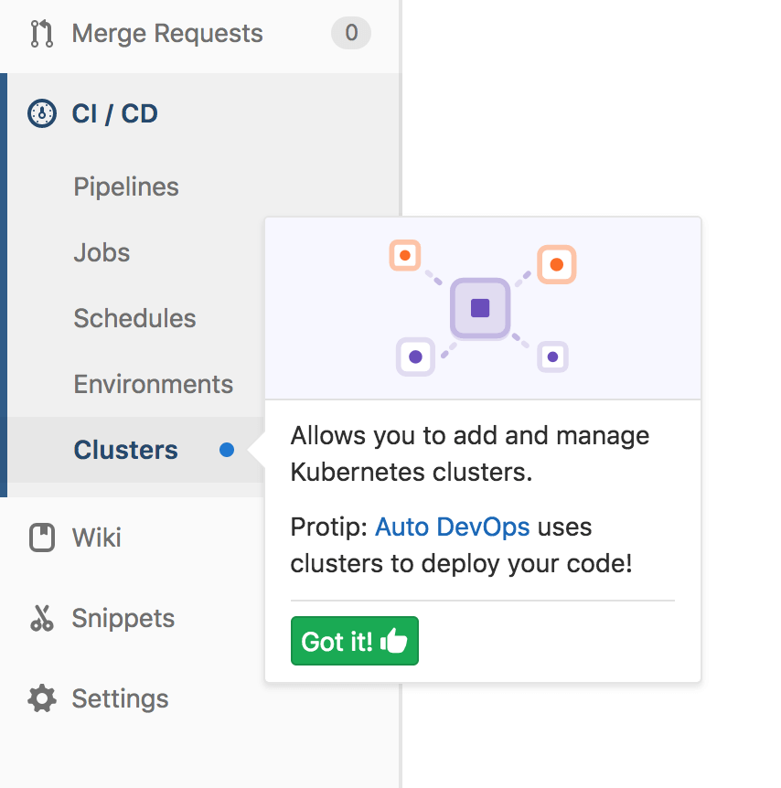

# Feature highlight

> [Introduced][ce-16379] in GitLab 10.5

Feature highlights are represented by a pulsing blue dot. Hovering over the dot
will open up callout with more information.
They are used to emphasize a certain feature and make something more visible to the user.

You can dismiss any feature highlight permanently by clicking the "Got it" link
at the bottom of the callout. There isn't a way to restore the feature highlight
after it has been dismissed.

[ce-16379]: https://gitlab.com/gitlab-org/gitlab-ce/merge_requests/16379
